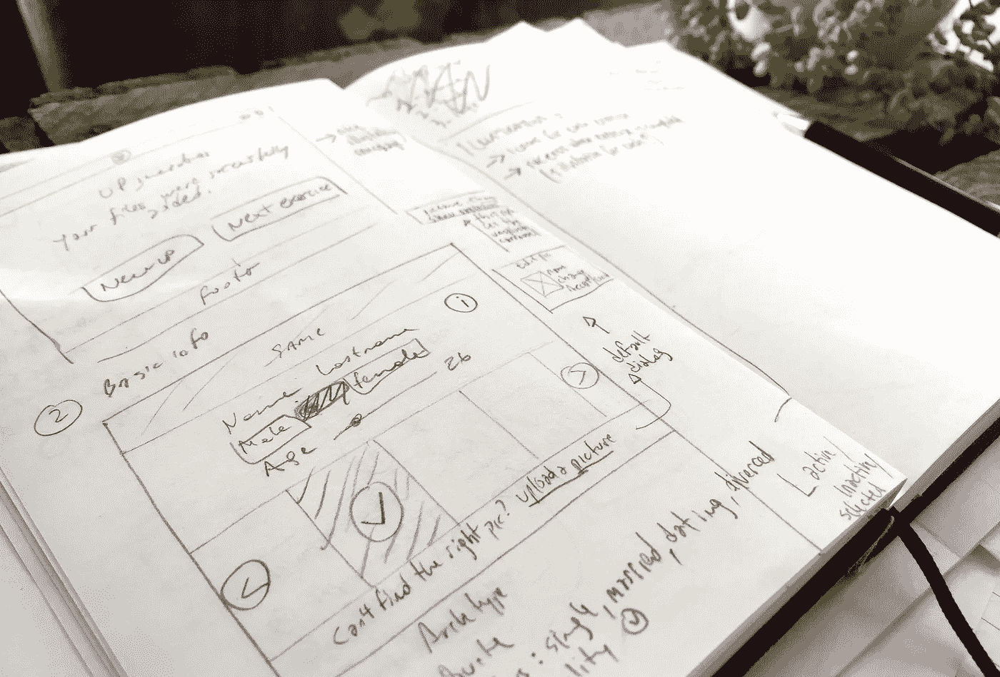
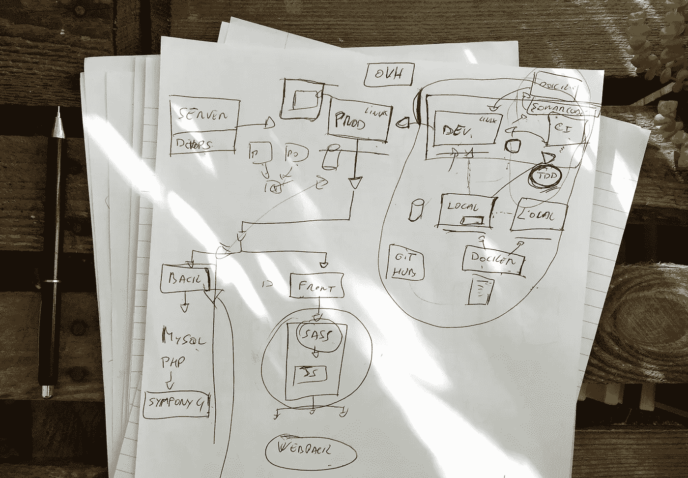
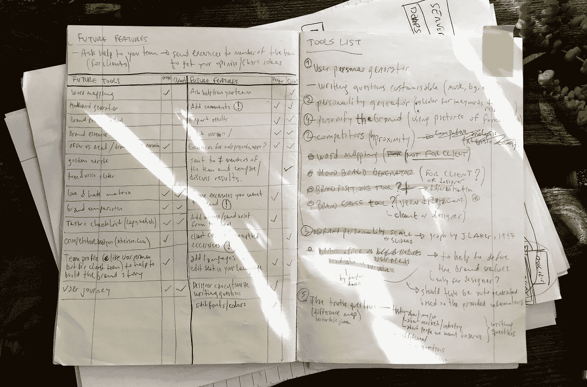

# 进入 HolaBrief 的第一年:产品开发的硬道理

> 原文：<https://medium.com/swlh/first-year-into-holabrief-hard-truths-about-product-development-edf840964b1e>

## 自从我们决定开始这个疯狂的发现之旅并推出一个在线工具，而没有考虑事情会变得多么复杂，已经过去一年了。这些是我们到目前为止学到的一些经验…

回到 2017 年夏天，我们意识到我们的设计过程有一些严重的缺陷。这需要时间、勇气和大量的自我反省来认识到我们是问题而不是客户。

这里有一些我们从艰难的道路中学到的东西，如果你也打算建立你自己的东西，这可能会对你有帮助。

# 这个想法只是 10%

或者 5%或者 20%，我不知道。但这绝对只是整个馅饼中的一小块。当我们想出 HolaBrief 的创意时，我们认为最困难的部分已经完成了。当然，我们完全错了。

显然，当你开始工作时，有许多重要的事情要记住，从法律检查到晋升，我们很快就会谈到这些。但最重要的是要记住，不要爱上你的想法。永远不会。

同样的事情也发生在我们设计师身上，当我们向客户提交 2 或 3 个方案时。通常你会把你的客户想看的想法和你爱的人一起展示出来，有时可能是中间的东西。然后你巧妙地试图让你的客户相信你的想法是最好的。这是一个错误，因为根据简报，你应该去寻找最有效的想法，而爱上你对产品的想法同样是一个错误。

> *产品在不断发展，你在一个项目上工作得越多，越了解你的受众，你就越意识到你需要改变和调整你的战略、你的特色、你的优先事项、你的……嗯，一切。*

所以好吧，爱上你产品的概念。但是**从来不会爱上小细节**。我知道这个小动画对你来说很重要，但相信我，在这一点上它完全无关紧要。

# 草图而不是线框

我们花了大约 3 个月的时间想出一些初始的线框，然后当开发人员加入项目时就被扔掉了。

我们专注于使线框变得漂亮和干净(毕竟，我们是设计师)，而此时你所需要的只是一支笔一大堆纸来快速迭代和抛弃愚蠢的想法，直到最终你得到开始有意义的东西。

线框是非常有用的，尤其是在这个初始阶段。他们帮助定义项目的范围，在纸上讨论想法，并让每个人都在同一页上，减少了*“哦，我以为你是指……”*的效果。此外，通过线框，您可以开始看到一些可用性问题和需要考虑的模式。

线框图也是如此，尽你所能做所有的线框图，但是不要把太多的精力放在视觉方面，这意味着不漂亮或不完美，但是快速和有效。如果你是一个设计产品的设计师，在这一点上忘记美学吧。很痛但很值得。

Learning weird stuff from our developers.

# 合法化吧

这是另一个经典的设计师错误。当你有了一个绝妙的产品创意，并为它取了一个绝妙的名字时，你就开始关注最不重要的事情:设计商标。

当然，我们做到了。我强烈建议您不要这么做，至少有三个理由:

1.  在这一点上，你的产品还没有一个身份，所以标志实际上只是一个占位符。对我们设计师自我的又一次现实检验。
2.  你应该花时间和精力去定义产品的灵魂。专注本质。
3.  如果你没有先进行法律检查，你可能不得不寻找另一个名字，这意味着设计另一个标志。合法化吧。

最后一点是我想在本节中强调的。我们没有先进行法律检查，猜猜发生了什么？我们有一个超级酷的名字和一个聪明的标志，都非常适合我们的项目，在我们闪亮的线框中看起来很棒。的。甚至可以使用。这个标志和我们一起生活了整整五六个月，直到我们最终进行了一次适当的法律检查——通过律师和一切手段——发现我们不能使用它。所以我们必须杀了它。

好的一面是，在花了大量的时间头脑风暴名字后，我们想出了一个我们和几乎所有我们认识的人都更喜欢的名字。

# 你并不像你认为的那样了解你的观众

等式很简单:
你是一个在工作流程中使用不同在线工具的设计师
+你正在为设计师建立一个在线工具
=你自己就是观众。

问题是，你只是观众中的一小部分。有其他的设计者和其他的过程一起工作，他们和你有不同的需求、偏好和优先权。

为自己的问题建立解决方案肯定是优势，但是不要假设别人都和你想的一样。我们的研究帮助我们更好地了解我们的同事。**我们发现了一些有趣的事实:**

> **— 91%通过推荐获得客户。这反映了与客户建立长期合作伙伴关系和良好关系的重要性。**
> 
> **— 66%的受访者为每位客户定制简报。因此他们需要某种模板，但它必须是灵活的。**
> 
> **— 11%的人通过电话讨论简报。把所有的东西都写下来会让设计师和客户都相信大家都在同一页上。**

这不是非常深入的研究，但它仍然给了我们一些以前没有的有趣的见解。，这些在塑造产品和创造不仅对我们有用，而且对许多其他人有用的东西方面变得极其重要，包括设计师、代理商和有趣的客户(这是我们学到的最有趣的事情之一)。

# 不是你看起来怎么样，而是你说话的方式

我们设计师倾向于关注品牌的视觉方面，认为这是唯一能让项目成功的东西。我们花费数小时寻找合适的字体，创建充满视觉参考的无休止的 moodboards 或应用黄金比例……所有这些都很棒，但在现阶段并不重要。一点也不。

> 你的声音才是真正重要的。你需要了解作为一家公司，更重要的是作为一个人，你是谁。你需要定义你的核心价值观，并坚持下去。

接下来就是将这些价值观转化为语言和日常行动，这将有助于你以更自然的方式与观众互动。做你自己会帮助你定义你的品牌声音，然后更容易创造出反映你内心真实的视觉语言。

# 让多任务处理更上一层楼

我已经模糊地记得那些曾经花一整天去设计，看教程去学习新技能，或者整理我的设计书签的日子……那些都是美好的时光。

不要天真地认为你会在保持常规设计的同时开始打造自己的产品。你的生活，不管是好是坏，都将彻底改变。

你将学会逆来顺受。项目管理、文案撰写、社交媒体管理、商业战略、营销战略、簿记……你将不得不做所有这些事情，甚至更多，直到你能够把人带到你的团队来帮助你。对我们来说，这一切都很有压力，而且与我们的设计背景无关，但至少我们发展了我们无法想象我们能够快速学会的技能。

此外，对我们来说最痛苦的事情之一(尤其是对我来说)是，我们必须走出舒适区，开始更多地建立关系网。很痛，但很有必要。

这种程度的多任务处理很难，尤其是如果你像我们一样——我们决定同时推出[两个品牌](https://thegreenconspiracy.com/)，同时继续与我们的一些现有客户合作！保持专注和精神上的强大来克服即将到来的起伏是一个巨大的挑战。但是，谁说这很容易呢？

# 即将推出(er)

屈服于完美主义是我们犯的另一个错误。我们花了太多时间润色用户界面和动画的细节，以至于我们失去了对主要目标的关注:发现所有这些是否值得。

我们读到了[构建、学习、测量循环](http://theleanstartup.com/book)，我们了解到我们需要[船来学习](https://basecamp.com/books/getting-real)和摆脱功能和[更早推出](https://www.intercom.com/books/starting-up)，而不是等到你的待办事项列表完成。

Trying to get rid of features. But they are all so important!

**那么，我们为什么不早点推出呢？**

我想我们怯场了。我们害怕把我们的工作公之于众。我们害怕人们会说什么。所有的批评，所有的*“一年，真的吗？”*。

事实是，这些都没有发生。当然，可能有人不喜欢我们做的事情。但是我们听到的大多是关于我们产品的好的方面，甚至是批评结果都是建设性的而不是破坏性的。我们一发布就确认了。

# 将来的

在我们迈出这一步并追求那个*绝妙的*想法一年后，我们还在这里，这就是了不起的事情。我们不知道接下来的几个月会发生什么，我们尽量不去想它；长期规划很少奏效。

现在我们专注于两件事:

1.  **为公开发布做准备:**这意味着完善产品，找出适合所有人的公平定价策略，传播信息，并对一切进行三重测试。以及所有我忘记的事情。
2.  **给予团队他们应得的关注:**现在基础已经建立，我们将专注于为团队开发合适的功能，包括代理、工作室和客户。我们知道他们在使用这个工具，现在是我们保护他们的时候了。

这并不容易，我们也不知道如何做好每一件事，但正如挂在我们墙上的那张小纸条所说:*运动中的物体保持运动*。

## 这篇文章发表在 [The Startup](https://medium.com/swlh) 上，这是 Medium 最大的创业刊物，拥有+393，714 名读者。

## 在这里订阅接收[我们的头条新闻](http://growthsupply.com/the-startup-newsletter/)。

