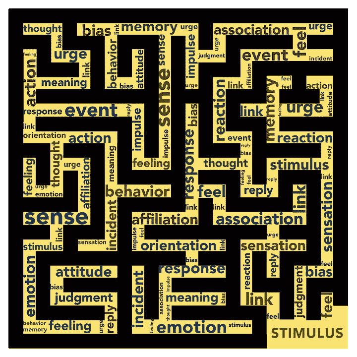
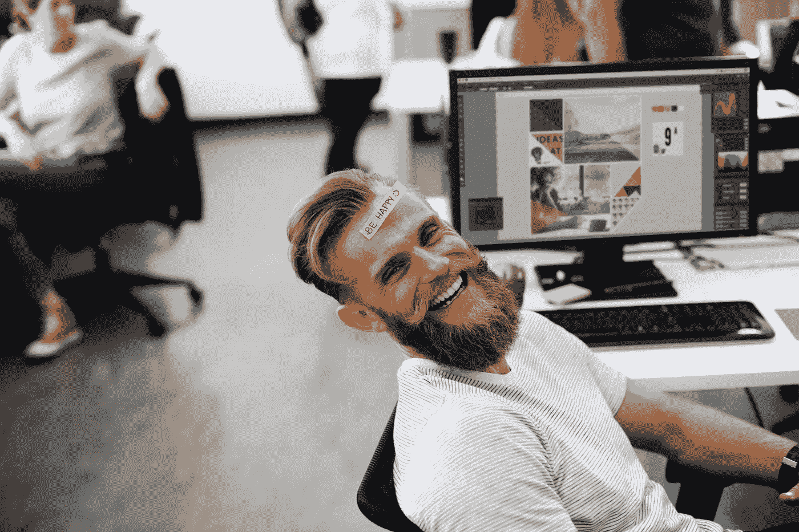
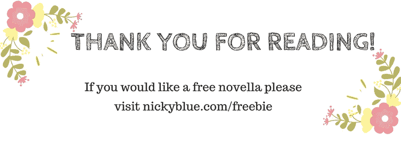

# 关于创造力的五个误解

> 原文：<https://medium.com/swlh/five-misconceptions-about-creativity-26fb661efb86>

我不是一个有创造力的人:这可能是所有人中最常见的。有一种假设认为创造力是我们与生俱来的天赋。这根本不是真的，这仅仅是我们必须睁开眼睛看到的东西。每个人都有创造性生活的天赋，每个人表达的方式都不一样。问题是你愿意发展到什么程度？天空是极限。

”*艺术家不是一种特殊的人；相反，每个人都是一种特殊的艺术家*。—阿南达·库马拉斯瓦米

**我已经长大了:**虽然这可能有部分真实性，但这通常意味着创造力已经从我们的生活中完全消失了。小时候，我们都有丰富的想象力。在某种程度上，它从我们心中消失了，我们开始相信那些宣传，我们被说服了。还记得被告知该长大了吗？我们慢慢地但肯定地适应了社会，成为有生产力的工人。20 世纪 60 年代进行的研究表明“**非创造性行为是后天习得的。”①**

我们可能已经学会不再注意或参与我们的创造力，但它的能力是我们与生俱来的权利。在重新唤醒我们的创造力时，我们必须重新挖掘我们的惊奇感、兴趣感和游戏感。敢于冒险，乐于接受新的体验。你内心有一个创意的无底洞，只是尖叫着要出来！

想象力比知识更重要。——阿尔伯特·爱因斯坦

**创意不能让我谋生:**我们可能曾经有过这种信念，但不会再有了。在当今竞争激烈的工作场所，拥有强大的创造性应用能力变得至关重要。在经济困难时期，底线变成了“我们如何用更少的资源获得更多的东西”。任何参与企业重组的人都会告诉你，创造力的需求有多重要。甚至早在 1956 年，IBM 管理学院就围绕创造性原则建立了它的全部课程。首席执行官小汤姆·沃森雇佣了路易斯·r·莫布里，他有先见之明，认为高管们需要学习如何创造性地思考，而不是迷失在财务预测中。一个没有有效的创造性解决问题技能的经理或企业主处于非常不利的地位。

*“在过去的几十年里，创新和创造力已经成为发达经济体取得成功的关键技能。随着越来越多的管理问题需要创造性的见解以找到合适的解决方案，创造性解决问题的需求已经出现。创造力与创新密不可分”——Siyana(Belichovska)Sokolova*

**我没时间:**真的吗？我们能不能每天抽出 10 分钟写日记，画画？规划一个你正在做的项目？反思我们如何看待创造力是很有趣的。它不一定是一个产生孤立作品的行为，而是一种我们如何面对我们正在做的事情的心态。我们越是用创造性的方式观察和接触这个世界，它就越是系统化。我们慢慢地从反应性思维转向创造性思维。

*创造力是发明、实验、成长、冒险、打破规则、犯错和享受乐趣*—玛丽·卢·库克

**我的生活不需要创意:**这当然是个人选择。然而，在你把这一点牢记在心之前，让我给你几个理由，为什么你可能想要把创造力融入你的生活。有越来越多的研究围绕着创造性生活的健康益处。可以减少焦虑，激发更好的心理健康。(2)它可以改善身体健康(3)它促进更容易的学习和个人成长。我们可以训练我们的创造力，让它融入我们所做的每一件事。它可能不会让你成为百万富翁，但它肯定会让你快乐，给你的生活带来更多的意义。在我看来，这是无价的。

**阅读我的相关文章'** [**如何开发你的创造性思维'**](/@nickyblue/how-to-develop-your-creative-thinking-3c2b03e74ca2)

(1 —资料来源:乔治·兰德和贝丝·贾曼，*《断裂点与超越》。旧金山:哈珀商务出版社，1993 年)*

(2-来源:基于艺术的干预措施，以降低大学生的焦虑水平，拉冈·艾伦，金伯利·l·莱因哈特和娜塔莉·安·塞瓦洛斯)

(3 —资料来源:艺术、治疗和公共健康之间的联系:当前文献综述希瑟·l·斯塔基和杰里米·诺贝尔)

## 这个故事发表在 [The Startup](https://medium.com/swlh) 上，这里有 263，100+人聚集在一起阅读 Medium 关于创业的主要故事。

## 在这里订阅接收[我们的头条新闻](http://growthsupply.com/the-startup-newsletter/)。

