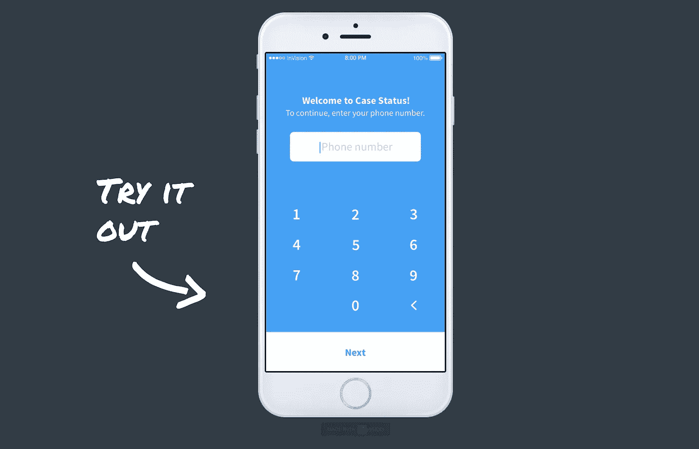
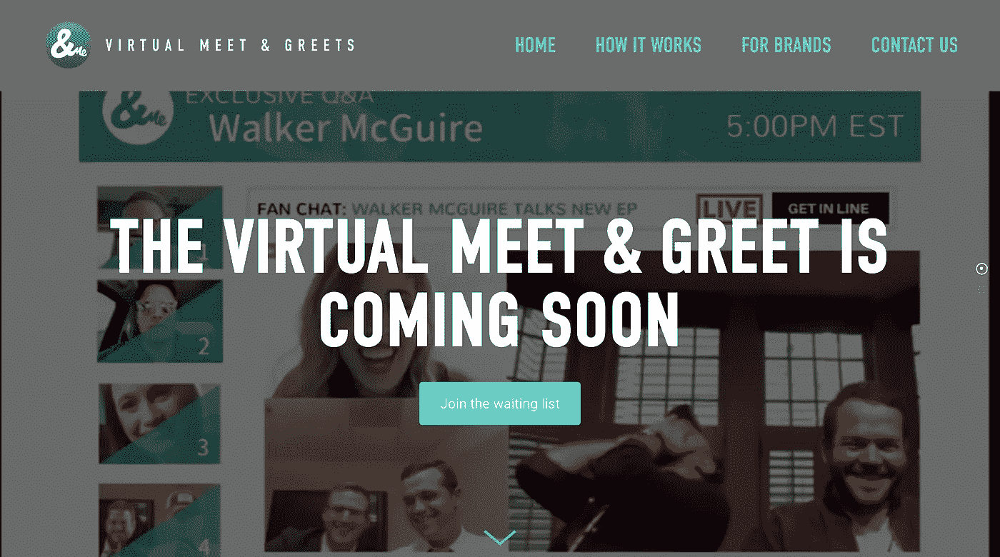
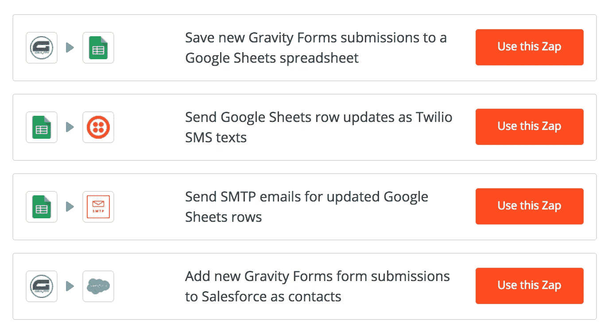

# 五个无代码 MVP 创始人的真实故事

> 原文：<https://medium.com/swlh/five-real-stories-of-founders-with-no-code-mvps-d030ba25515b>

在完成她的广告硕士课程时， [**柯里·班扬**](https://twitter.com/coribanyon) **遇到了一位将改变她一生的教授。**

他鼓励她根据自己最喜欢的爱好之一为课堂出主意。柯里碰巧是一个超级乡村音乐迷，在想到她有过多少次令人失望的贵宾会见和问候经历后，她意识到必须有一种方法来改善这种体验。

目前的体验对艺术家(在一个被疯狂粉丝包围的房间里可能会很尴尬，有时甚至很危险)或粉丝(演出结束后排队几个小时，只为了得到两秒钟的互动和强迫拍照)来说并不太好。

她决定利用技术开发一种音乐人与粉丝视频聊天的方式——有点像虚拟会面和问候。下一步，或者说她是这样认为的，是绘制一些线框，并试图找到一位开发人员来帮助她构建这个想法。

这是很多创始人走的路线。他们想出一个主意，并立即想要建立它。如果你不知道如何编码，这意味着找到一个开发者，说服他们按照你的想法工作。

问题是，开发商贵。因此，从逻辑上讲，非技术型创始人会试图说服一名开发人员成为他们的技术型联合创始人，通常会用现在的薪酬换取公司的股权。

但是优秀的开发人员需求量非常大。他们不断受到(通常是可怕的)关于未来收入和火箭般增长的想法和承诺的轰炸。这导致许多开发人员感到厌倦和愤世嫉俗。这意味着，除非你真的花时间与技术合作伙伴建立关系，否则你很难说服别人来实现你的想法。

整个世界似乎都在反对她。但是后来她发现了改变她整个观点的东西:一种不用写一行代码就能拼凑出一个 MVP(最小可行产品)的方法！

事实证明，有很多方法可以在不接触任何代码的情况下构建 MVP。下面，我们收集了五个例子，供你从中汲取灵感:

# 1.建立一个虚拟见面和问候的空间

在经历了几次开发人员的错误引导和感觉浪费了很多时间之后，柯里决定利用她已经拥有的技能创造一个 MVP。

她找到了一个现有的 livestream 平台，并整合了一些工具和手动流程来创建第一个虚拟会面和问候，使用了一个 [SquareSpace](http://squarespace.com/) 登录页面，在网站上嵌入了一个交互式网络研讨会平台，手动为艺术家设置了日期/时间，然后为艺术家创建了图形以在社交媒体上共享。

&Me 不用写任何代码就创建了他们的视频平台的原型

她的第一次会议是为了测试艺术家是否有兴趣与他们的粉丝视频聊天，以及这对这些粉丝来说是否是一种真实的体验。艺术家和粉丝都喜欢第一次会议，所以她用她学到的东西改进了下一次会议，并继续举办活动，在这样做的同时从每个人那里学习。

一旦她觉得自己找到了合适的问题/解决方案，她就开始探索如何构建自己的 MVP，现在正处于引导模式，雇佣一名自由开发者来构建[和 Me。Tv](http://andme.tv/) 第二版，同时仍然与艺术家和其他有影响力的人合作，与他们的粉丝进行视频聊天。

想听更多吗？在《小牛计划》的这一集里，你可以听听柯里讲述她的故事。

**使用的工具:**

*   [方形空间](https://www.squarespace.com/)
*   网络研讨会工具
*   [Canva](https://www.canva.com/) (用于社交媒体图片)

**如果:**有一个鲜为人知的软件工具，您可以手动使用它来解决客户的问题。

# 2.在 Excel 中构建 MVP

我们在 Krit 的一个客户 Steve Shulman 经营一家咨询公司已经有十多年了。史蒂夫与顶级研究型大学(比如达特茅斯大学、耶鲁大学和布朗大学等)合作，帮助他们了解和创建关于如何获得更多资助的智能预测。

这些大学都有大量的数据，关于他们写了哪些提案，谁写的，多少钱，哪些已经关闭/失败，等等。但是他们没有对这些数据做任何事情。

史蒂夫帮助他们理解这些数据，这样他们就可以做出明智的决定，比如何时建造新建筑、给某人加薪、帮助制定收入预测等。一段时间后，他意识到他可以创建一个工具来帮助他和他的客户，于是 [B3i Analytics](https://b3ianalytics.com/) 诞生了。

它最初是两个巨大的 Excel 工作簿，带有各种数据的输入字段。其中一个练习册实际上采用了关于当前经济和政治气候的数据，并运行了关于这些因素如何影响您的底线的不同场景。另一个练习册稍微简单一些，只关注大学数据。

最终，他有了足够的样本数据来建立一个全面的电子表格，他开始向客户展示，并获得他们是否有兴趣使用类似产品的反馈。一旦他们开始要求使用这种新工具，他就联系 Krit，谈论将它变成 SaaS 的产品。

Steve Shulman 用于构建 B3i 分析平台原型的电子表格。

电子表格超级复杂，但是因为他花时间把他的概念放到电子表格中，所以我们有了一个很好的开端。如果他没有东西给我们看，我们可能要花几周或几个月的时间才能弄清楚他想要什么。但是因为他已经设计好了，这使得向开发的过渡变得容易多了。

**他也有已经承诺购买的客户，并给他反馈哪些计算对他们有价值。**

在我们的[路线图会议](https://builtbykrit.com/roadmapping-sessions)之后，我们创建了一个 Vision 原型，然后他用它做了另一轮用户访谈。在那一轮客户反馈之后，他准备投资建设它，它将于 2018 年 5 月推出。

**使用的工具:**

*   Excel(你可以换成 Google Sheets 或者 [Airtable](https://airtable.com/) ，这取决于复杂程度)
*   视觉

**如果:**您的产品涉及数据可视化或复杂计算，这是一个不错的选择。

# 3.硅谷最热门的电子邮件列表

产品搜索是一个 Reddit 风格的网站，人们可以在这里提交并投票支持应用产品，现在已经成为成千上万创始人和风险投资家日常工作的一部分。但它始于瑞安·胡佛在 20 分钟内建立的一个不起眼的电子邮件列表。Ryan 使用了一个应用程序，可以让你创建一个群组，让群组中的人提交帖子，然后在一天结束时通过电子邮件向每个人发送摘要。

在获得了对该版本的巨大反馈后，他继续使用 Telescope(一种用于构建类似于 HackerNews 和 Reddit 的网站的开源工具)构建了第 1 版，剩下的就是历史了。([你可以在这里阅读更多关于建造它的旅程](/on-startups/planting-seeds-1af9a290c318)。)

这种方法也被其他人使用过——[Scott 的廉价航班从一个简单的 MailChimp 邮件列表开始，收集他在为自己寻找廉价航班时注意到的交易。他已经在寻找航班，为什么不分享他的发现呢？在外界媒体的一些惊讶之后，他的订户在一夜之间从 400 人增加到了几千人，这让他开始思考如何将它变成一个产品。付费订阅就这样诞生了。](https://www.indiehackers.com/podcast/020-scott-keyes-of-scotts-cheap-flights)

**使用的工具:**

*   Linky Dink(不再向上，但类似于 [Revue](https://www.getrevue.co/)
*   [望远镜](http://www.telescopeapp.org/)
*   [MailChimp](https://mailchimp.com/)

**如果:**你的产品涉及分享或管理内容/信息/工具，这是个不错的选择。

# 4.使用 Zapier 将应用程序连接在一起

使用 Zapier，您可以相对快速、轻松地构建自己的后端。例如， [GreenSocks](https://greensocks.com.au/) 的创始人 Richard Eastes，**在有想法的 24 小时内，使用 Zapier** **建立了** [**以下工作流程:**](https://zapier.com/blog/prototype-app-zapier/#greensocks)

理查德·伊斯特斯用来制作绿袜子原型的工作流程

他首先使用 WordPress 和 Gravity Forms 建立了一个网站。当潜在客户通过 Gravity 表单提交他们的信息时，这些信息会被复制到 Google Sheets 电子表格中。

Richard(后来，他的团队)会检查这些条目，然后在有人被分配给客户时更新它们。该更新将触发给客户的自定义电子邮件，以及给被分配给该客户的人的文本消息。最后但并非最不重要的一点是，客户的信息会保存到 Salesforce 中，以用于未来的营销工作。

Zapier 可以以这种方式与其他应用程序一起使用，构建从[艺术推荐应用程序](https://leanstartup.co/how-i-built-my-startup-kollecto-with-no-code-a-story-of-a-non-technical-founder/)到[赠书倡议](/greenroom/building-backstage-capital-cover-36de0374ba14)的一切——所有这些都不需要接触一行代码。

**使用的工具:**

*   [Zapier](https://zapier.com/) 和其他应用在它的[集成数据库](https://zapier.com/apps)

**如果:**你没有编码知识，但是相当精通技术，并且熟悉这些应用程序(Wordpress 或其他网站建设者，Google Sheets，Typeform 等)。).

# 5.用 vision 原型结束朋友和家人的聚会

另一位 Krit 客户 Lauren Sturdivant 在 2017 年找到我们，提出了一个她想开发的应用程序的想法。作为一名人身伤害律师，劳伦在查尔斯顿的一家顶级律所工作，同时要应付多达 170-200 名客户。

最大的麻烦是不断接听客户电话，告知他们案件的最新进展。最终，她想，“如果他们有办法不用打电话给我就能知道箱子在哪里，那会怎么样？”

这是[案件状态](https://thecasestatus.com/)背后的最初想法，这是一个移动应用程序，她的客户可以在任何时候打开它，一眼就能看到他们的案件进展如何。想想达美乐的披萨追踪器，但对于你的法律案件。

在得到一些最初的客户反馈后，她做了一个[路线图会议](https://www.builtbykrit.com/roadmapping-sessions)，然后我们设计了一个面向客户端的应用程序原型。该应用程序的律师版本更像是一个管理门户，面向客户的一面才是人们真正感兴趣的。我们开始使用[vision](https://www.invisionapp.com/)并设计实体模型。

You can play with a real working version of [the prototype here](https://builtbykrit.com/work/closing-your-first-customer-4-days-into-beta).

Lauren Sturdivant 用来筹集资金建立第一个版本的 Case Status。使用 InVision，感觉就像一个真正的应用程序，尽管它背后没有代码。

如果您不熟悉 InVision，它可以让您将静态模型缝合在一起，并在电脑或手机上显示出来。这感觉非常像一个真正的应用程序，对于获得用户反馈非常有用。在劳伦的例子中，她和我们一起设计模型，但是如果你没有代理机构，很容易在像 Crew 这样的网站上找到有视觉经验的设计师。

利用最初的愿景 MVP，她能够向朋友和家人募集资金。你可以在这里阅读更多关于[抚养朋友和家人的故事，](https://builtbykrit.com/blog/how-to-raise-a-friends-and-family-round-with-lauren-sturdivant-ceo-of-case-status)阅读我们的案例状态[案例分析](https://builtbykrit.com/work/closing-your-first-customer-4-days-into-beta)。

**使用的工具:**

*   [视觉](https://www.invisionapp.com/)(如果你想要更简单的东西，或者想要创建可以带给设计师的线框，你可以使用 [Balsamiq](https://balsamiq.com/) )

**如果你有与设计师合作的预算，或者有自己制作原型的技术诀窍，这对你有好处。此外，如果你想创建一个一级 MVP 来获得小规模的资金或用户反馈以完善你的产品想法，这也很好。**

# 外卖食品

如果你有一个新产品的想法，你的目标应该是建立一个最小可行的产品，并尽早开始收集反馈(最好是以收入的形式)。

如果你是一个非技术型的创始人，却没有一个开发人员最好的朋友来帮助你，你就没有借口了。有比以前更多的方法来构建你的 MVP，而不需要写一行代码。这里有 5 个例子，你可以用来建立你的 MVP:

1.  建立一个 Squarespace 网站，找到一个可以代表客户手动使用的现有软件工具
2.  使用 excel 电子表格可视化数据并运行计算
3.  建立一个受众群体，并开始通过电子邮件列表分享您的策划内容
4.  使用 Zapier 以创新的方式连接现有应用
5.  设计一个原型，看起来和感觉上都像一个真实的应用程序

*这篇文章最初发表在南方的*[*Start*](https://builtbykrit.com/blog/five-examples-of-no-code-prototypes)*上，这是一个关于在通常的中心之外建立创业公司的博客。*

安德鲁是 Krit *的创始合伙人，他帮助 B2B 初创公司的非技术型创始人将他们的大胆想法转化为令人难以置信的技术产品。*

## 这篇文章发表在 [The Startup](https://medium.com/swlh) 上，这是 Medium 最大的创业刊物，有 317，238+人关注。

## 在这里订阅接收[我们的头条新闻](http://growthsupply.com/the-startup-newsletter/)。

