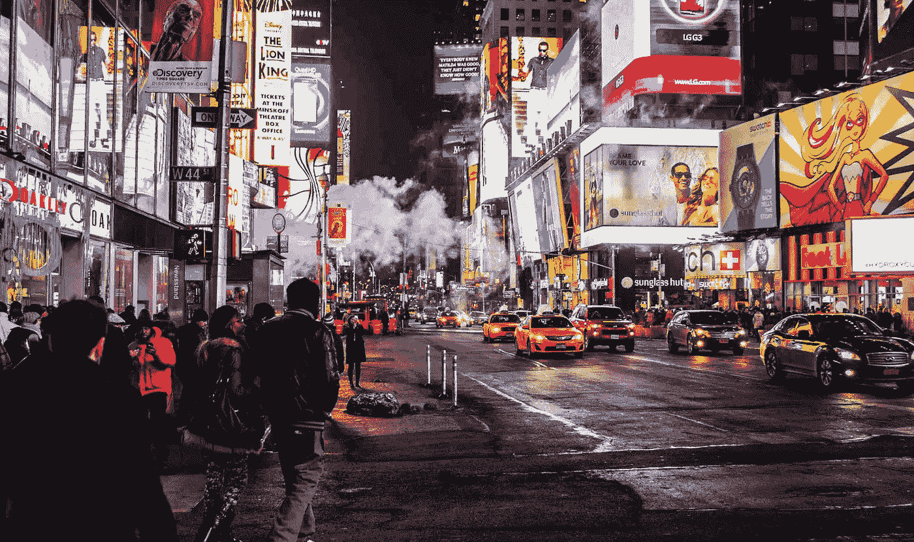

# 人们讨厌广告的五个原因

> 原文：<https://medium.com/swlh/five-reasons-people-hate-advertising-4f20a5bc4ed4>

*一些广告担忧是合理的*

Photo by [Nicolai Berntsen](https://unsplash.com/photos/F3uyey6ours?utm_source=unsplash&utm_medium=referral&utm_content=creditCopyText) on [Unsplash](https://unsplash.com/search/photos/advertising?utm_source=unsplash&utm_medium=referral&utm_content=creditCopyText)

我喜欢广告。我喜欢吸引人的广告牌，杂志广告中清晰的广告文案，聪明或构思巧妙的电视广告。事实上，我甚至向一位朋友提议，我们需要一个新的有线电视频道，包括电视广告和有关电视广告的节目。他回答说:“拿出黄油爆米花！我会看的。”