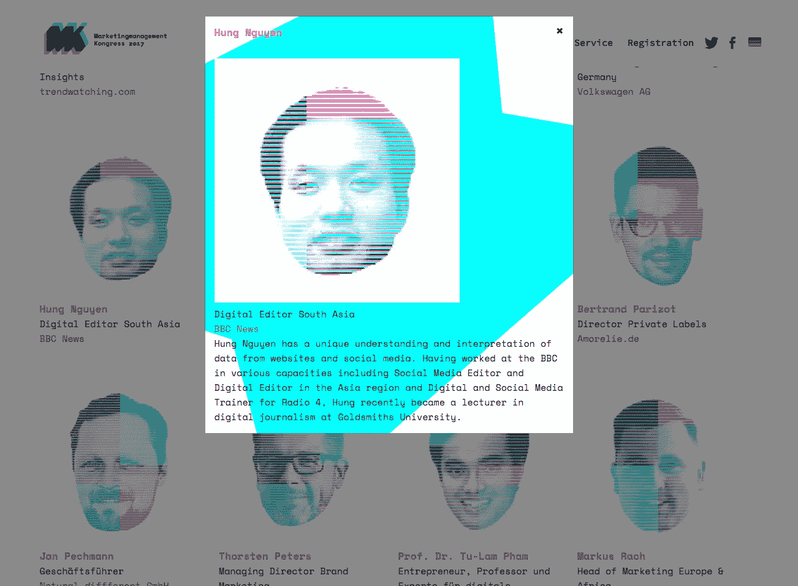

# 你应该为你的企业拥抱众筹角度的五个理由

> 原文：<https://medium.com/swlh/five-reasons-you-should-embrace-crowdtangle-for-your-business-960517f5330e>

如果你还没有使用 CrowdTangle，你已经错过了太多。

去年 12 月，我在柏林的一次数字营销会议上谈到了跟踪视频在社交媒体上的表现的工具。“这里有人已经用过 CrowdTangle 了，”我问房间里的大约 50 个人。没有人举手。这很好，因为如果人们被告知一些他们已经知道的事情，他们会感到厌烦。

但是如果你没有使用过 CrowdTangle，这对你的生意并没有什么好处。这是一个如此强大的工具，可以帮助你在脸书、Twitter、Instagram 和 Reddit 上监控你和你的竞争对手的表现。

以下是你可以用它做的五件事。

1.  *寻'* [*过誉*](http://www.crowdtangle.com/resources/glossary) *'内容横跨脸书数十页。*

Toyota Oman’s photo posted after [Oman won the Gulf Cup](https://en.as.com/en/2018/01/05/football/1515147284_248853.html) went viral

当我在柏林演讲时，我完全随机地选择了丰田来说明像它这样的公司可以用 CrowdTangle 做什么，在这个故事中我将坚持丰田(如果你来自丰田，请联系:)。我在过去 30 天里，从丰田在许多国家发行的大约 40 页报纸中，搜索表现最佳的《脸书邮报》。[丰田阿曼的帖子](https://www.facebook.com/ToyotaOman/posts/1729198873805869)以 1300 多条分享和近 690 条评论高居榜首。当越南 U23 队[击败伊拉克](http://www.the-afc.com/competitions/afc-u-23-championship/latest/news/vietnam-squeeze-into-semi-finals-after-thriller-against-iraq)和卡塔尔[进入亚洲 U23 锦标赛决赛时，丰田越南本可以以类似的方式发布公告。](http://www.goal.com/en-qa/news/gritty-vietnam-u23-seal-place-2018-afc-u-23-championship/14tt4b4tt0lyk17dteiq1lilqw)

*2。查找过去一个月的顶级脸书 Live。*

哪支丰田车队赢得了拥有最多互动(包括喜欢、分享和评论)的脸书直播的奖杯？这是丰田秘鲁公司的[脸书现场直播](https://www.facebook.com/ToyotaPeru/videos/vb.123538507674613/1910329538995492/?type=2&theater)关于 2017 年在秘鲁、阿根延和波利维亚举行的拉力赛。由于某种原因，这场直播也吸引了许多观众的“愤怒”反应，值得找出原因。如果他们监测观众的反应，他们可以现场询问观众。

Toyota Peru’s Facebook Live could have been improved with better camera angle and position

Toyota Peru’s Facebook Live also got the second highest number of ‘angry’ reactions in the past month

*3。识别最佳表演视频内容。*

鉴于制作视频内容需要更多的时间和精力，你应该确保你的视频在社交媒体上获得最大的曝光率。[过去 30 天内，所有丰田页面中排名第一的脸书视频属于丰田巴西公司。](https://www.facebook.com/ToyotaDoBrasil/videos/vb.386925448027932/1546995432020922/?type=2&theater)

The 30 second video featuring Toyota Hilux was the [overperforming](http://www.crowdtangle.com/resources/glossary) video of the month

4.*比较不同脸书页面的性能。*

目前，你可以比较多达 10 个不同的脸书网页的性能。这意味着你可以将自己的网页与竞争对手的网页进行比较。如果我只想比较上面三个丰田页面的性能，我得到的就是这个。

You can click on any point on the graph to reveal top content for that particular day. The peak in the graph was January 9 when Toyota Brasil publish the Hilux video

*5。寻找满意的客户，在你的社交媒体渠道上展示。*

通过对所表达的不同情绪进行加权，你可以很容易地定位出哪些用户是高兴的还是生气的。但现在情况越来越好了，你现在可以搜索脸书集团寻找快乐的顾客。然后，您可以请求他们允许在您的频道上使用他们的照片或视频。您甚至可以邀请他们加入您的脸书生活，以帮助推广您的产品或服务。

利用 CrowdTangle，你还可以做很多事情，比如监控媒体对你公司的报道，但我现在就说到这里。你可以通过我在脸书 *上的* [*禅数码页面来了解更多。感谢您的阅读。*](https://www.facebook.com/ZenDigitalCo/)

## 这个故事发表在 [The Startup](https://medium.com/swlh) 上，这是 Medium 最大的企业家出版物，拥有 293，189+人。

## 在这里订阅接收[我们的头条新闻](http://growthsupply.com/the-startup-newsletter/)。

