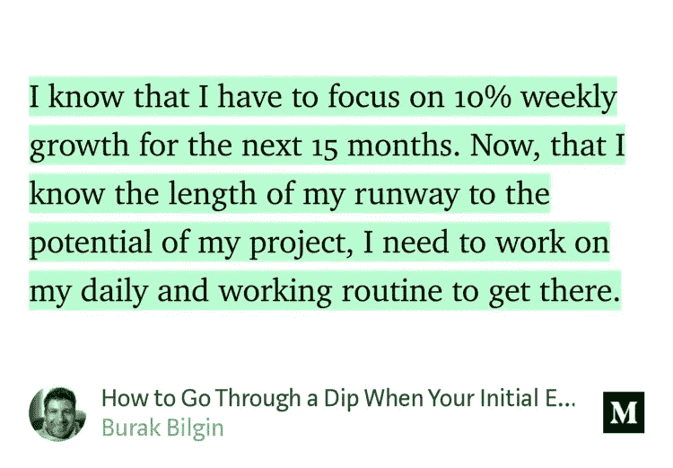

# 营销自动化工具的五个要求

> 原文：<https://medium.com/swlh/five-requirements-for-a-marketing-automation-tool-a8695bf26cb7>

[rawpixel/pixabay](https://pixabay.com/en/business-paper-aerial-america-3324394/)

昨天发表了一篇关于 [CoSchedule 头条分析器](https://ideavisionaction.com/blogging/how-accurate-is-coschedule-headline-analyzer/)的帖子。CoSchedule 是一个付费的在线营销管理平台。他们提供标题分析器作为免费工具来推广他们的主要业务。

**对营销管理系统的需求**

即使我只有一个作者博客，我也可以利用营销管理系统。今天，我想写下我对这样一个系统的要求，这样我就可以将我的要求与他们所提供的进行比较。

最终，我可以决定是否要开始使用他们的系统。或者我可以找另一个系统。

**一个创业点子**

如果你正在寻找一个开始科技业务的想法，你也可以使用这篇文章中的要求来开始你自己的在线营销管理工具。如果你这样做了，让我知道，这样我可以给你的系统一个尝试。

**我每天和每周的博客日程**

目前，我每天和每周的博客日程还没有明确的定义。我在脑海中模糊地定义了它，并遵循一定的模式。

我可以从定义每日和每周工作流程中受益。这将消除在给定时间做什么的猜测工作。

**日常事务**

*   创建内容。
*   在我的博客上发表一篇文章。
*   将我的博客文章导入媒体。
*   回答博客评论。
*   回答中等反应。
*   回答推特回复。
*   在 Twitter 上推广以前的博客和媒体文章。

**要求#1。**我希望自动化工具能够根据我上面写的优先级列表，为我日常工作的每一步创建日常任务。

**内容创作。**这比日常事务中的一个步骤更复杂。但此刻我想让事情变得简单。我将在另一篇文章中回到这个话题。

**在我的博客里发表一篇文章。**我看不出这一步对自动化工具有任何要求。

**将我的博客文章导入媒体。现在，我按照下面的步骤将我的博客文章从我的 WordPress 博客导入到 Medium。尽管导入博客文章的能力很强，但仍有改进的空间。**

*   将博客文章链接复制并粘贴到媒体导入页面。点击导入按钮。
*   把图片加到中帖。
*   更正引号的格式。
*   删除末尾的相关文章部分。
*   加上我用的中号签名。
*   添加文章的标签。
*   将帖子提交给[启动发布](https://medium.com/swlh)。

**要求 2。**显然，上述所有步骤都可以自动化。我希望自动化工具在我在博客上发布一篇文章后就能执行上述所有步骤，而不会干扰我。我希望收到一封确认电子邮件，其中包含导入帖子的链接。

上述步骤最终可以通过介质来实现。或者我可以雇一个虚拟助理来代表他们。

**要求三。**我希望自动化工具为我的**博客文章、媒体和 Twitter 评论和回复**创建三个单独的列表。

应该为每个人创建一个带有相关评论和回复链接的任务。除非我将任务标记为完成，否则它应该保持打开状态。X 天后自动删除已完成任务的选项。

**在 Twitter 上推广之前的博客和媒体文章。这一步很有价值。**

目前，我大约每天登录一次 Twitter。我同时做所有的推特工作。有时，我会在同一个会话中发布多条推文。我不认为这是最优的。

我知道有工具可以安排推文。我十年前用过它们。过去，Twitter 屏蔽了我由第三方安排的推文。因此，我不愿意使用它们。这可能是改变的时候了。

Fig. 1\. Medium highlight card

**要求 4。** Medium 有漂亮的高亮卡片(图 1)。我希望能够将这些卡片发送到自动化工具，而不是立即在推特上发布。

当我将这些卡片发送到自动化工具时，它为我创建了一个新任务来安排它。然后，我希望能够安排这些卡片在不同的平台上发布，比如 Twitter、脸书、Pinterest、Instagram 等等。

**每周例行公事**

*   发布每周[电子邮件简讯](https://ideavisionaction.com/email-newsletter/)。
*   撰写并发布每周[在线策划小组](https://ideavisionaction.com/entrepreneurship/this-simple-practice-will-multiply-your-knowledge-and-creative-ideas/)报告。
*   处理想法，为下周制定一个内容计划。
*   检查媒体上的新关注者、亮点和掌声。

我可能在每日和每周的例行程序中遗漏了一些步骤，但无论如何这是第一个版本。那么，让我们继续讨论最后一个要求。

**要求 5。**为每周例行工作的每一步创建任务。将每周任务整合到主任务列表中。

每天和每周的任务必须根据每个任务的优先级进行合并和排序。例如，每周的电子邮件简讯比回复每天的评论具有更高的优先级。

**结论**

我的博客常规有两种改进。

*   自动化现有步骤，例如将帖子导入媒体和在社交媒体上推广现有帖子。
*   根据我的日常工作和从不同渠道收到的信号，创建工作流程和待办事项列表。

**未来工作**

我的日常工作中有两项任务需要单独的、详细的工作流程。这些任务是每周报告的内容创建和处理统计数据。我将在单独的博客文章中讨论它们。

**轮到你了**

*   你知道可以满足上述要求的营销自动化工具吗？至少有一部分？
*   你有使用营销自动化工具的经验吗？
*   你有没有受到启发去开发一个？

***如果你觉得这篇文章很有价值，注册*** [***每周简讯***](https://ideavisionaction.com/email-newsletter/) ***就能收到我关于创业、企业家精神、领导力和自我提升的文章综述。***

## 这篇文章发表在 [The Startup](https://medium.com/swlh) 上，这是 Medium 最大的创业刊物，拥有 318，120 多名读者。

## 在这里订阅接收[我们的头条新闻](http://growthsupply.com/the-startup-newsletter/)。

