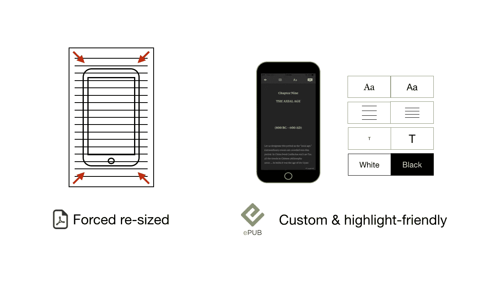
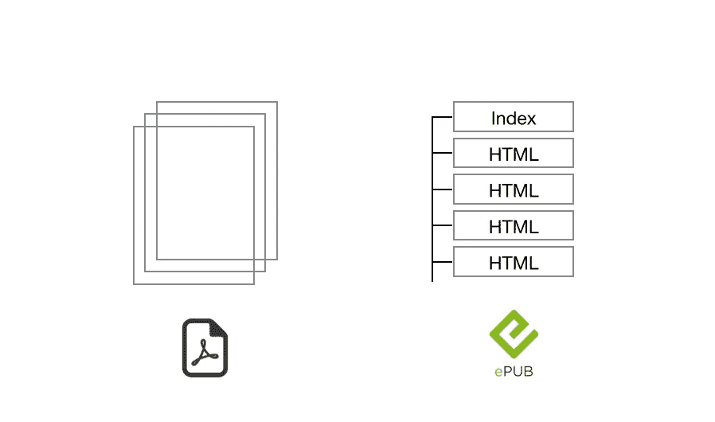
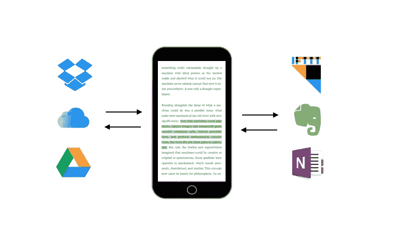

# 移动阅读五论

> 原文：<https://medium.com/swlh/five-theses-on-mobile-reading-5d9f376ca1c4>

# **1。移动阅读是新的主流**

在*阅读*，我们制作了一个阅读工具。我们不会破坏一个行业。我们尝试改善一个很普通的东西的体验:移动阅读。阅读是一种日常习惯，而不是 T4 产业。就像发邮件，或者写待办事项一样。书籍、博客、文章、文档、课堂笔记、新闻提要、研究论文、技术文档。人在阅读，不断，阅读永远不会停止。

将出版业与其他文化产业进行比较时，应该谨慎。(参见 [*牡蛎*的误会](http://techcrunch.com/2015/09/21/oyster-shuts-down/)超过了一本*网飞的书*。)阅读的体验随着电子设备而改变。对于音乐来说就不是这样了:当音乐传到你耳朵里的时候，听 MP3 或者一张旧的黑胶唱片并不会改变什么。媒体对接收没有显著影响。电子阅读则不同，因为媒介(如 Kindle、iPad、纸质书)会直接影响我们的体验。

今天的世界让我们想起了十六世纪的威尼斯，那时印刷书籍刚刚开始成为一种商业模式。与此同时，3 万名职业“手稿抄写者”在伦敦工作。手稿文化和专业印刷这两个对立的行业，在其中一个最终消失之前，曾经有过一小段共同的历史。

Disruption at work

# **2。阅读应用要么管理流量，要么管理存量。不是两者都有**

博客和书籍的融合并不适用于短篇文章，从 Buzzfeed 到 TechCrunch。在我们的框架中，我们只将长文和书籍视为“文档”。文档通常是自给自足的。(文档包括研究论文、咨询白皮书、技术文档等。)

流量和存量的区别就在这里。用户管理(短)文章和(长)文档的方式非常不同。像 *Feedly* 和 *Pocket* 这样的应用专注于轻松地浏览内容。 *Feedly* 和 *Pocket* 用户希望尽可能快地浏览他们每天保存的文章。媒介是一个不同的挑战，因为它是一个人们写作和阅读文章的平台。像这样一个基于社区的新闻源比口袋新闻源和 Feedly 新闻源定制化程度更低——在口袋新闻源和 Feedly 新闻源中，用户实际上建立了自己的新闻源。

一款读书 app，专注于用户组织内容的方式。iBooks 等公司希望专注于书架，以便坚持用户与其文档建立的“长期”关系。 *Dropbox 的*工作是管理库存，而不是流量。一份远离*口袋*的工作(也就是说，一些文件可以读入 Dropbox 本身，问题是:Dropbox 何时会在其原生应用中实现 ePub 阅读器？)我们认为，从长远来看，未来的文档阅读应用将专注于如何组织内容。

# **3。可读的东西比便携的多**

PDF 是指*可移植文档格式*。这是旧印刷世界在说话。当适应性设计无关紧要的时候。PDF 是适用于所有设备的统一文件，可以轻松打印——因为当时在屏幕上阅读确实很痛苦。

还记得旧的“福特制”经济吗？为了快速扩展，福特的解决方案是复制/粘贴标准体验。谷歌比任何人都向我们展示了软件能够通过提供以用户为中心的体验来扩展。我们现在习惯于个性化我们与内容的关系。大众消费已经改变了。和 PDF 以前的优势。

PDF 来自一个以台式电脑为参考的世界。职员在办公室里有打印机，共同工作空间甚至不存在。pdf 可以跨所有操作系统打开。美好的旧时光。莫比尔吃掉了这个世界。现在，我们在 4.7 英寸的设备上艰难地阅读 pdf 文件。我们一整天都在滚动，调整我们的窗口大小，改变我们的颜色主题，以便在工作时更加舒适(在*崇高*、*尤利西斯*、*口袋*等上)。)然而我们的 *Dropbox、Drive* 和 *Box* 都是 pdf。

# 4.EPub 将接管 PDF

首先， *ePub* 不仅仅是关于*电子书*。越来越多的机构发布每份文件的 ePub 和 PDF 版本。欧盟的*和微软自己的*文档在 ePub 中被转换。请记住，PDF 是 A4 打印页面的数字副本。对于 90 年代的图形设计师来说，这是一个真正的创新。相同的图形布局在任何类型的操作系统上都可以以相同的方式呈现。从那以后，pdf 被用于许多用例。出于某种原因，PDF 成为了数字文档的标准，例如移动阅读。EPub 出现在 2009 年:一种可回流和移动友好的格式。

ePubs 的主要优势在于自适应格式化。读者可以个性化字体、边距、颜色等。EPubs 是亮点友好的。

当你打开一个 ePub 文件时会发生以下情况:首先，文件夹被解压缩，我们访问一个包含每个页面的本地地址的根文件。从这里开始，ePub 引擎的工作方式就像一个在 HTML 页面之间浏览的浏览器——本质上就是节(或章)。由于 ePub 是基于 CSS 的，读者可以根据需要调整每个细节。

*IDPF* (国际数字出版论坛——由*谷歌*和除了 *Adobe* 之外的所有主要参与者支持)最初发明了 ePub，并聚集了一群定期实现功能的程序员。最后一个版本，ePub 3，传送声音和视频。

还记得丰富网页的两种“比较”技术之间的冲突吗:HTML5 和 Flash。与 Flash 不同，所有 web 浏览器都支持原生 HTML5。最后，闪存 CPU 的消耗受到了许多人的批评。我们只指出 DRMs 是如何没有帮助 Flash 发展成功的。我们觉得 EPub / PDF 与这场辩论非常接近。

# **5。第三方集成最终胜出**

分享已经是 2010 年的事了。作为用户，我们认为同步是下一步。以及 *IFTTT* ，新的“分享小工具”。对读者来说，它告诉了我们什么？API 突然显示了互联网是怎么回事。连接点。网络效应。这不是关于关键字丢弃。连接两个服务创建了一个全新的资产，比这两个单独使用的服务更有价值。从字面上来看，API 通过连接点来创造价值。在这种情况下:整体大于其部分的总和。

阅读的未来将受到 API 架构的影响，因为它有助于读者提高效率和生产力。请注意，pdf 的固定布局使得无法提取数据，因此无法将数据从一个服务移动到另一个服务。这是读者超越理性看重的东西。障碍在于开始将不同的服务整合在一起的相对复杂性。但是在过去的二十年里，我们已经看到更复杂的任务成为主流。

*

*Read 在*[*App Store*](https://itunes.apple.com/us/app/read-ultimate-epub-reader/id996572662?mt=8)*上免费提供。了解更多关于*[*www . read . CX*](http://www.read.cx)*。*

发表于*[**【SWLH】**](https://medium.com/swlh)***(****《创业》、《流浪癖》、《人生黑客》* ***)****

******

*-*