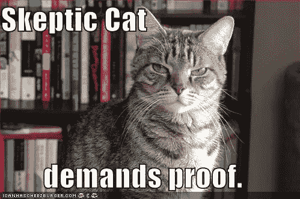

# 检查内容真实性的五个技巧！

> 原文：<https://medium.com/swlh/five-tips-for-fact-checking-your-content-17a0ae1d1bff>

[作者:梅根·科塞](http://www.goodstoryeditorial.com)

Don’t mess with Skeptic Cat.

希望我已经让你[对我的第一篇关于为什么你应该检查事实的帖子](/@megancossey/three-reasons-to-fact-check-your-content-700f9ea9b43d#.qojrd29gq)(因为名声、名声、名声加上一些其他原因)感到敬畏。接下来，我将分享一些关于如何尽可能快速有效地进行事实核查的技巧。

因为，让我们面对现实吧，无论你是记者、博客写手、你所在领域的专业人士、研究人员还是学者(或者我不知道，是推特上的连续推特用户，谁这么做是为了好玩？顺便问一下，你们这些人*是谁？！)，通常你的工作日/编辑周期中没有时间来做这件事。曾几何时，对我们某些出版物的人来说，事实核查是理所当然的，甚至是必须的，但现在不再是了。动力是键入内容，然后点击发送，继续下一件事。*

太可惜了，好难过，你还是要做。或者，你最终会花 100 美元买一张名片，上面印着爱因斯坦从未说过的话(我最近差点就这么做了)，或者，更糟糕的是，发布一些极其错误或欺诈性的信息，让你、你的品牌或你的公司看起来有点——或极其——愚蠢。别忘了，就像我们从互联网的万维网上获取信息一样快捷和容易，我们的读者再次检查这些信息也一样快捷和容易。

因此，正如我所承诺的，我在此向你展示我的**非常全面但值得庆幸的事实核查提示的简短列表:**

**提示 1**

**仔细检查一切。**万物人。回到过去，在打字机出现之前，Instagram 出现之前，主流媒体的事实审查员被训练打印出一篇文章，并用彩色铅笔攻击它，在故事中出现的每一个事实下画线以供核实，无论多么荒谬。例如，以这句话为例:“*他开着他那辆 1995 年的红色敞篷玛莎拉蒂敞篷车，穿着他那双意大利制造的精致靴子，走进股东大会，准备在美国历史上最大的一次公用事业收购案中不留活口。*

在这一句话中，至少有 10 个事实需要我这个卑微但坚持不懈的事实审查员来核实。(作家讨厌事实审查员，采访对象要么崇拜他们，要么认为他们是怪胎，事实审查员通常相信他们在做上帝的杰作。我曾经是作家、事实核查者和采访对象，所以没有必要对那句笼统的话进行事实核查。)

不管怎样，你能在那句话里数出 10 个事实吗？如果是，那么你开始明白我在说什么了。因为在最好的情况下，弄错其中一个事实会导致对你的文章进行荒谬的修正:“*文章中提到的玛莎拉蒂既不是红色的，也不是敞篷车。它是蓝色的。我们对这个错误感到抱歉。*“更糟糕的是，如果采访对象在与作者的采访中从未说过他准备好进行股东接管，并且作者没有任何书面或音频记录来支持这样的声明，这可能会导致诽谤或诉讼的丑陋指控。

**提示 2**

**去源头。或者尽可能靠近源头。如果我负责核实上述句子，我会向作者索要采访对象的联系方式，然后直接去找他。就我个人而言，我一直喜欢通过电子邮件发送我的问题——因为书面记录，你好——但许多人也通过电话发送。然后你烤它们。**

亲爱的贝茨先生

我正在核实一篇即将发表的文章，你是这篇文章的主题。能否请你核实以下内容，并让我知道任何更新或更正？

你名字的拼写是威尔·贝茨。

你认为 Bad Company Industries 的前首席执行官从 Bad Company 的内幕信息中非法获利。

你相信坏公司产业的前首席运营官在坏公司的子公司，真的是坏公司产业的办公室里经营着一个卖淫集团。

你有一辆蓝色的 1995 年版玛莎拉蒂，你开着它去参加了 1 月 1 日在拉斯维加斯举行的股东大会。那不是敞篷车。那天你穿着意大利制造的靴子。

*5)当你到达股东大会时，你最初并没有打算进行股东接管。*

截至 Q2，Bad Company Industries 在美国以碳为动力的风能领域拥有最大的市场份额。

好吧，我知道这不适用于最近出版的大部分内容。通常我们会重新包装在网上搜到的东西。报告之类的东西。好吧，那就尽可能接近原始源头。查看一到两份年度报告(总是可以在上市公司的网站上找到)。找到提到威尔·贝茨的蓝色玛莎拉蒂的新闻文章，或者详细说明起诉前首席执行官剽窃公司的法庭文件。我的观点是，不要只是鹦鹉学舌互联网告诉你的，或者另一个博客发表的。有没有一个你可以指出的合法来源，意思是你不会不好意思在大学的研究论文中引用的那种来源？

**提示 3**

弄清楚在你的世界里什么是合法来源。当我根据联合国儿童基金会公布的数字为联合国儿童基金会撰写儿童死亡率报告时，这些数字显然超过了任何其他来源公布的数字。在联合国，联合国批准的数字超过了记者公布的数字。中央情报局的《世界实况》和《经济学人》信息部都是在联合国经常被引用的可靠来源。

我的观点是，你需要弄清楚在你的特定行业中你的可靠来源是什么。如果两个不同的来源提供了两条相互冲突的信息，那么你需要决定哪一个来源更重要。把它写下来，发给你所有的作者、编辑、内容提供商或其他人。如果你需要一个起点，我们可以去维基百科。别翻白眼了，我说的是支持你在维基百科上找到的文章的引用。其中许多是合法的，也会引导你找到其他潜在的来源，包括主流新闻来源的新闻文章。

**提示 4**

**如果找不到出处，那就删除！**举个例子，所有这些每天在互联网上飞来飞去的随机精彩和鼓舞人心的引语…你能从原著、文本、采访等中找到多少呢？[如果你找不到纳尔逊·曼德拉的名言“T7”的原始采访或文章，我们最深的恐惧不是我们不够好。我们最深的恐惧是我们强大到无以复加，这是因为他从来没有说过，也没有写过。](http://snopes.com/quotes/deepestfear.asp)

所以，帮你自己一个忙，当有疑问时，删除！

当听起来好得不真实，又找不到独立来源的时候，删除！

**提示#5**

没有什么是太小或不重要的，以至于不能仔细检查。你在博文中提到的那家公司的名称拼写正确吗？谷歌一下！这是你的消息来源的正确名称吗？你确定她不是地区运营总监也不是运营副总监？谷歌一下！你真的可以说这是第一次有人在你的行业里发布了一份关于反推举报人的报告吗？谷歌一下！(哦见鬼！实际上，这是你所在行业的第三份此类报告。谁知道呢？)亚伯拉罕·林肯真的支持同性婚姻吗？谷歌一下！

只是。谷歌。它。求你了。

**！！奖金！！**

**一些免费、方便的事实核查网站(不是谷歌或维基百科):**

*   [snopes.com](http://snopes.com)
*   [中情局世界实况报道](https://www.cia.gov/library/publications/the-world-factbook/)
*   联合国开发计划署的[人类发展指标](http://hdr.undp.org/en/countries)(通过各种方式对国家进行排名，如国内生产总值、性别平等或获得水的机会)
*   www.politifact.com(事实核查美国政治新闻报道的独立网站)
*   https://www.sec.gov/edgar/searchedgar/companysearch.html[(来自 10K，经审计的年度报告，可能是你在研究一家在美国上市的公司时要找的；不要忘了，世界上每一家上市公司都会在其网站上发布给股东的年度报告。)](https://www.sec.gov/edgar/searchedgar/companysearch.html)
*   如果你试图搜寻关于私人控股公司及其所有者的信息，福布斯做了很多很棒的研究，我过去在那里工作过，我绝对可以担保。
*   [www.xe.com](http://www.xe.com/)是在线货币转换器；[www.oanda.com/currency/historical-rates/](http://www.oanda.com/currency/historical-rates/)进行历史换算(记住货币汇率是不断波动的！)
*   [http://quoteinvestigator.com](http://quoteinvestigator.com/)
*   www.census.gov 极易上瘾，所以要小心。牢记你的问题，否则一个小时后你会发现自己在比较纽约和洛杉矶的互联网接入率
*   [联合国制图科](http://www.un.org/Depts/Cartographic/english/htmain.htm)满足你所有政治正确的地理事实核查需求。

> *在 www.goodstoryeditorial.com*[*了解更多我的工作，或者在 megan.cossey@gmail.com*联系我](http://www.goodstoryeditorial.com)

*原载于*[*www.linkedin.com*](https://www.linkedin.com/pulse/why-should-i-fact-check-how-part-two-megan-cossey)*。*