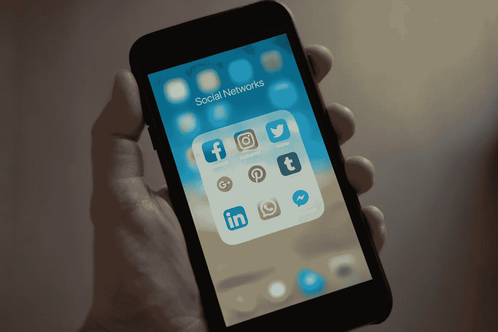

# 扁平化设计不是最好的。这是我们最好的了

> 原文：<https://medium.com/swlh/flat-design-isnt-the-best-its-just-the-best-we-have-f4b32a67e94a>

我注意到[媒体](https://uxplanet.org/typography-user-interface-nothing-else-738a7cf6a954)的[文章](/@seandexter1/flat-design-why-you-should-question-nielsen-normans-research-on-the-trendy-design-style-39a991517e02?source=search_post---------2)中有一个显著的[号](/i-m-h-o/the-era-of-flat-design-is-not-a-trend-its-another-step-forward-9a0b3bddfc8)是关于平面设计的。

这是应用程序图标和界面最受欢迎的美学。它是你通常在互联网上去的任何地方。许多人将其定义为一种精神气质，而不是一种美学。

然而，除了每个人都在这么做的事实之外，似乎没有令人信服的理由坚持扁平化设计。

我同意 Damien Madray 的观点，平面设计只不过是设计史上的一大进步。设计是一系列的测试和假设。我们目前正在经历一场关于扁平化设计实际运作的大规模测试。

很难挑战其他流行应用的外观，并期望消费者接受你的产品。当我们的生活围绕着我们的平板手机屏幕时，平板设计暂时是很棒的。

然而，随着新技术浪潮的到来，这一切都将改变。

It’s so realistic she doesn’t even notice she’s actually outside.

然而，AR 和 VR 将重新定义 UX/UI 设计领域。没有理由在 3D 空间中设计平面。Skeumorphism 是一个很酷的设计运动，我认为它将在这些新兴领域广泛应用。

特别是有了 AR，用户在物理空间中有归属感的物体将更容易导航。

或者，也许 UX 在这些新兴领域的设计会走上手机屏幕设计的老路。最初，应用程序的设计主要是为了模仿它们的物理类似物。然而，一旦我们习惯了智能手机，设计师们就开始抽象它们的形式，最终不再模仿现实世界。

AR/VR 可能会从 skeumorphism 开始，然后转化为尚未探索的交互设计领域。我们不会知道什么对这些技术是最好的，直到我们都抛弃了智能手机，转而使用新奇的耳机。

UX 的设计已经在改变以适应这些新技术。现在有各种各样的[网络资源](https://www.uxofvr.com/)可供设计师在推进新项目时考虑。

这是一个令人兴奋的技术时代，我想不出比在虚拟现实公司的设计部门更有趣的地方了。

一如既往，感谢阅读。如果你喜欢这个，请点击掌声按钮或在评论中留下你的想法，让我知道。

如果你想了解我生活中发生的事情，请在 Twitter @jeremycummings3 或 Instagram @so.tall.im.in.space 上关注我。

## 这个故事发表在 [The Startup](https://medium.com/swlh) 上，这里有 264，100 多人聚集在一起阅读 Medium 关于创业的主要故事。

## 订阅接收[我们的头条](http://growthsupply.com/the-startup-newsletter/)。

