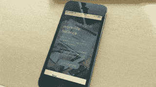

# 聚焦黑客:如何在你的电脑、手机和平板电脑上快速进入勿扰模式

> 原文：<https://medium.com/swlh/focus-hack-how-to-quickly-go-into-do-not-disturb-mode-on-your-computer-phone-and-tablet-fc5dde70cab2>

我想象一下:你刚进入一个艰难项目的状态，突然你的老板把一份关于明天会议的通知推到你面前。没什么大不了的。但是你出于习惯停下来检查了一下。

然后，当你要回去工作时，一条 Slack 消息会弹出来，告诉你 Brian 要去吃午饭。很高兴知道，我猜？

回去工作……*这是什么？*艾琳分享了一个谷歌 Doc…**Ok。我在做什么来着？？？**

**很多时候，通知的破坏性大于帮助性。即使在正常情况下你会感激他们。**

你可以做一个演示，与合作伙伴讨论一些新的设计，在 Zoom 或 GoToMeeting 上做一个演示(只是为了让每个人的注意力都被你收到的 Outlook 通知转移开)，或者只是想让[专注于](https://blog.rescuetime.com/finding-focus/)一些事情而不被[打断](https://blog.rescuetime.com/interruptions-at-work/)。

幸运的是，所有主要的操作系统都想到了这一点，并有办法摆脱所有这些噪音。一旦你知道它是多么的快速和简单，你就会有一个新的策略来在你最需要的时候保护你的注意力。

免打扰模式是一个很棒的功能，几乎每个设备都有，但有点不为人知。许多人知道它的存在，但是没有意识到当你最需要它的时候它是多么容易打开。

如果你想快速关闭令人分心的通知，这里有一个“请勿打扰”的地方，也是在所有主要平台上启用它的最简单的方法:

# Windows“聚焦辅助”

在 Windows 上，请勿打扰模式称为“对焦辅助”，可以在以下情况下激活:

*   右键单击任务栏上的通知图标。
*   选择**聚焦辅助**并将其设置为“仅警报”

**总工作量:2 次点击**

请注意，在最新版本的 Windows 10 之前,“对焦辅助”一直被称为“安静时间”。

# 马科斯

这是一堆中最快的。只需按住“option”键并点击通知中心图标。您将看到图标变灰，然后您处于请勿打扰模式。

**总工作量:一次点击(加上按住 option 键)**

***需要更多帮助你专注？RescueTime 会阻止令人分心的网站，并让你对如何度过数字时间有切实可行的见解。*** [***在这里免费报名***](https://www.rescuetime.com/) ***。***

# 机器人

要在 Android 上启用请勿打扰，只需向下滑动即可显示您的通知。您应该会在顶部的一行中看到一个图标，如下所示:

轻按此按钮将打开“请勿打扰”模式。

**总工作量:一次滑动+一次点击**

值得注意的是，如果您使用的是 [RescueTime Premium](https://www.rescuetime.com/) ，无论何时您启动 [FocusTime 会话](https://www.rescuetime.com/focustime)，都可以在您的 Android 设备上自动触发免打扰模式。

# ios

在 Apple 设备上，当您执行以下操作时，可以找到“请勿打扰”:

*   从屏幕底部向上滑动以启动控制中心。
*   轻按“请勿打扰”按钮(它看起来像一弯新月)

**总工作量:一次滑动+一次点击**

# Chromebook

最后，如果你使用的是 Chromebook，打开“勿扰模式”需要做的就是:

*   点按通知托盘以显示您最近的通知
*   单击“通知”面板底部的“请勿打扰”图标

**总工作量:两次点击**

就是这样！你刚刚把自己从没完没了的通知中解放出来。

# 我错过的所有通知呢？

要重新打开通知，只需运行上述相同的步骤。在“请勿打扰”模式下收到的任何通知都将在通知中心等待您。

如果你有时间，做一个完整的[通知审计](https://blog.rescuetime.com/why-addicted-to-notifications/)从长远来看确实是一个好主意。但是当你遇到麻烦，需要立即禁用通知时，知道如何打开勿扰模式是非常有用的。

# 嘿，我是乔里！

我帮助公司和有趣的人通过巧妙而集中的写作讲述他们的故事。想一起工作吗？ ***在 hello@jorymackay.com 给我发邮件***

*这篇文章的一个版本最初发表在* [*改版博客*](https://blog.rescuetime.com/do-not-disturb/) *上。查看更多关于生产力、专注和动力的文章。*

## 这篇文章发表在 [The Startup](https://medium.com/swlh) 上，这是 Medium 最大的创业刊物，有 332，253+人关注。

## 在这里订阅接收[我们的头条新闻](http://growthsupply.com/the-startup-newsletter/)。

