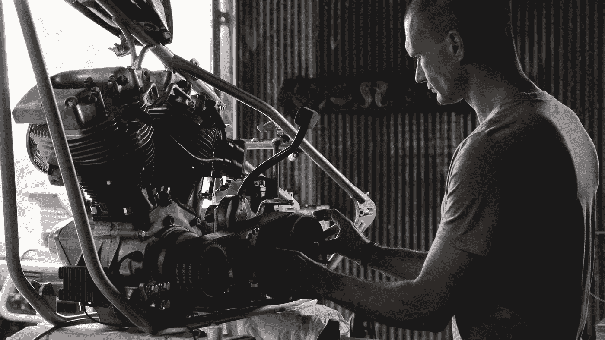

# 关注生产力，而不是效率

> 原文：<https://medium.com/swlh/focus-on-productivity-not-efficiency-4ed4fe9a454f>

## 事半功倍与事半功倍

Originally published on [**JOTFORM.COM**](http://jotform.com)

> 12 个小时。

那是【1913 年前造一辆车用了多长时间。

在接下来的几年里，亨利·福特将耗时的流程缩短到了令人印象深刻的 2.5 小时(T3)。