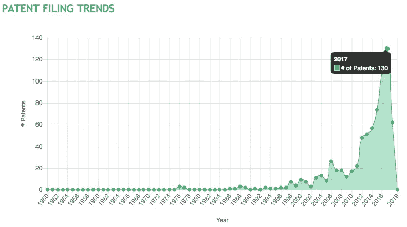
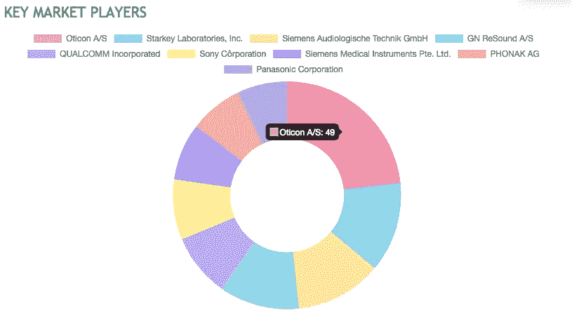
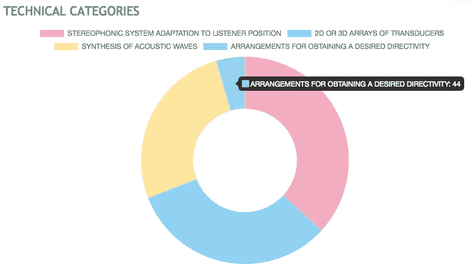

# 专注的音频技术。

> 原文：<https://medium.com/swlh/focused-audio-technology-7dd415815e0b>

聚焦音频、定向声音或音频聚光灯指的是创建一个狭窄的声音束，聚焦在特定的区域，如您的耳朵。

Noveto 是一家总部位于以色列的公司，生产专注的音频解决方案。他们的技术名为 Sowlo，能够精确地检测和跟踪运动，从而增强个人的声音体验。无需任何耳机，直接将声音传送到您的耳朵。是的，直接传到“你”的耳朵里！

这项革命性的技术将改变我们迄今为止与声音互动的方式，无论是在个人层面还是在行业层面。这项技术将对教育、音乐、广告、健康和安全等行业产生影响。

> 通过控制声音的方向性，手机、个人电脑、电视、汽车、自动取款机、自动售货机、智能可穿戴设备、AR/VR 耳机、无人机和游戏机等设备的功能将得到极大增强。

Noveto 在 Incubig 平台上的创新概况揭示了美国在立体声系统、2d 或 3d 换能器阵列、声波合成和获得方向性领域的研究活动中的创新见解。

Granted patent activity

根据少量研究数据，可以观察到研究活动从 2010 年开始持续上升，2017 年观察到的活动最高，有 130 项专利。近年来这一活动的持续增长表明了研究人员和创新者对这一技术的兴趣。

近年来，在听力辅助系统中，特别是在双耳听力系统中，观察到大量的研究活动。研究人员和创新者正致力于在使用 3D 声音定位的系统中提供技术进步。

3D 声音可直接用于增强和虚拟现实场景。空间音频信号正被用于产生更加身临其境的音频体验。下一个时代将由增强和虚拟现实应用主导，并将改变我们互动和消费音频和视频内容的方式。最近的研究活动表明，人们一直在努力改进为增强现实(AR)、虚拟现实(VR)或 360 度视频产生空间音频信号的传统方法。

Key Players

像 Oticon、Starkey Laboratories、Siemens 和高通这样的公司是技术领域的积极参与者。

Oticon 的一些重点领域是具有定向响应的麦克风系统、点对点听觉系统和使用无线流的信号增强。他们最近的研究活动是在助听器系统和双耳助听器设备下进行的。

Starkey 还致力于通过整合定向麦克风定制和 HRTF 个性化，为助听设备提供改进。

高通从事音频信号处理方面的研究活动，特别是增强声学成像。他们最近的研究是三维声音捕捉和再现，将虚拟声音插入环境和带有压电，金属和介电膜的微型扬声器。

Key Technologies

在立体声系统适应听众位置、二维或三维传感器阵列和声波合成等技术中，可以观察到中等水平的活动，分别有 362 项、317 项和 260 项获得专利。然而，用于获得期望方向性的技术下的活动较低，这在进行研究、申请发明和推动创新的技术中给出了空白空间。

人们探索了多种技术，旨在使声音在空间的特定区域被听到，而在其他区域完全关闭。然而，向消费者提供商业设备的技术还不成熟。

随着像 Noveto 和 Holosonics 这样的创新者努力将这项技术商业化，我们看到这项技术在我们生活中的使用只是时间问题。

> 欲了解更多知识，请访问 Incubig 平台上的 [Noveto 的创新简介](https://www.incubig.com/company/noveto.biz/)。

***如果你正在做一些创新和疯狂的事情，与 Incubig 联系，使用来自最值得信赖的数据的定制创新见解来加速你的创新。***[https://www.incubig.com/contactus](https://www.incubig.com/contactus)

谢谢你。

不断创新。

安基特·莱克拉

Incubig -专利和研究情报公司。

连接、促进和加速创新|[www.incubig.com](http://www.incubig.com/)

关注 Incubig 获取创新更新。

[领英](https://www.linkedin.com/company/incubig)。[推特](https://twitter.com/IncubigAI)。[脸书](https://www.facebook.com/incubig)

## 这篇文章发表在 [The Startup](https://medium.com/swlh) 上，这是 Medium 最大的创业刊物，拥有+ 380，266 名读者。

## 在这里订阅接收[我们的头条新闻](http://growthsupply.com/the-startup-newsletter/)。

