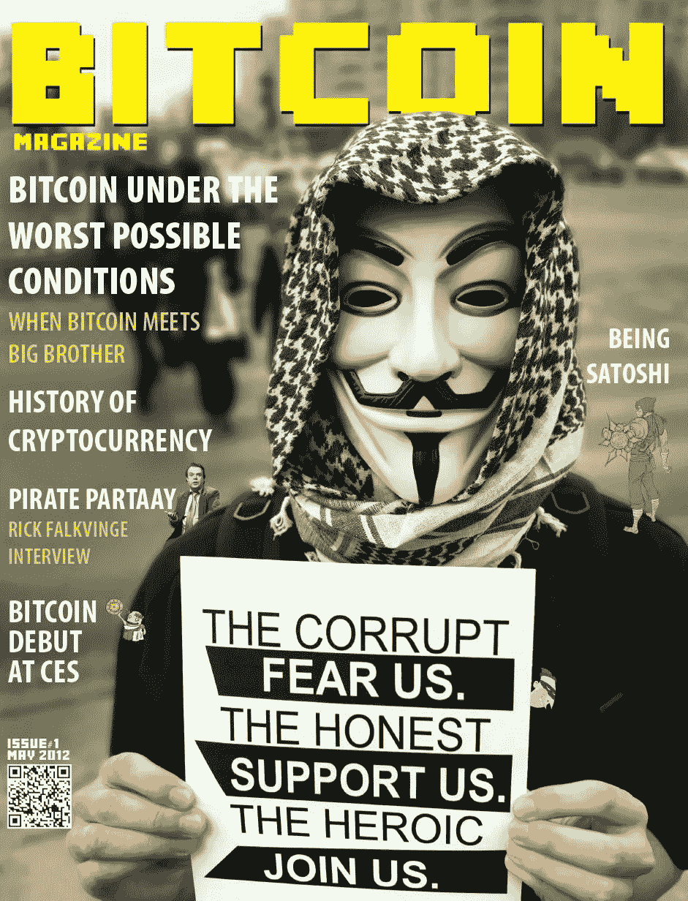
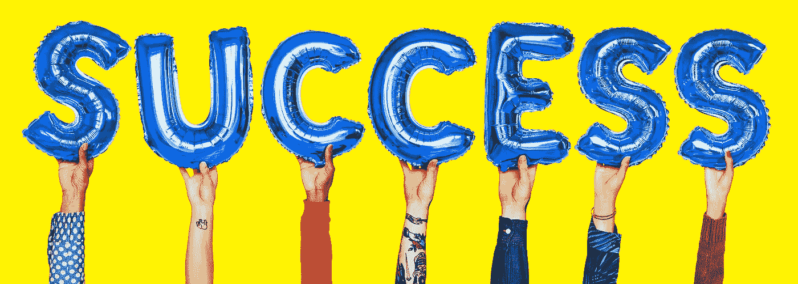

# 被理性主义愚弄

> 原文：<https://medium.com/swlh/fooled-by-rationalism-8f5fc64b7e20>

## 笛卡尔如何毫不费力地扼杀了你的新生梦想

Image by [rawpixel on pexels](https://www.pexels.com/photo/gray-dream-freestanding-letters-958173/)

> 当你开始过你梦想的生活时，一路上总会有障碍、怀疑者、错误和挫折。但是通过努力工作、坚持不懈和自信，你可以取得无限的成就。
> 
> ——罗伊·T·贝内特

在法国，人们以所谓的笛卡尔方法为荣，这种方法是以法国 17 世纪著名的自然科学家和哲学家[勒内·笛卡尔](https://en.wikipedia.org/wiki/Ren%C3%A9_Descartes)的名字命名的，他是典型的*卫理公会派*(在这个词的 [Chisholmian](https://en.wikipedia.org/wiki/Roderick_Chisholm) 意义上)。他开发了一种基于怀疑原则的解决问题的方法:你从直觉开始，事情可能不像看起来那么简单，这有助于你识别问题，你拒绝接受任何事情是真实的，直到你毫无疑问地知道它是真实的。然后你把它分成几个部分，优先考虑你的解决方案的步骤，从最简单到最复杂，系统地前进，注意不要忽略整体的任何部分。这种清晰而独特的方法使笛卡尔在解析几何、[现代代数符号](https://www.economist.com/books-and-arts/2007/05/10/an-equation-for-eternity)、[光学](https://en.wikipedia.org/wiki/Dioptrique)和哲学方面有了重大发现。

> 我怀疑，所以我存在。
> 
> ~勒内·笛卡尔

笛卡尔的怀疑是普遍的——他通过攻击信仰的基础来同时攻击他的信仰——并且是夸张的，极端到荒谬的地步，例如，一个邪恶的魔鬼的全部目的就是欺骗你的可能性。笛卡尔所理解的确定性不是一种感觉；它包含了一种理性的洞察力。

然而，如果信念在某种程度上是绝对可靠的，如果你只追求你确信的信念，许多想法就不会实现。你听过多少次成功人士谈论他们一开始根本不知道自己能成功的故事？

Image by [rawpixel on pexels](https://www.pexels.com/photo/person-drawing-on-paper-1374361/)

# Airbnb 是如何起步的

在 Airbnb 颠覆酒店业的几年前，许多顶级投资者怀疑这个想法及其潜力，有些人甚至对此感到震惊。弗雷德·威尔逊(Fred Wilson)和联合广场风险投资公司(Union Square Ventures)臭名昭著地拒绝了这家初创公司。克里斯·萨卡也是，后来哀叹道:

> “Airbnb，几十亿美元的生意，对吧？我是第一批看到 Airbnb 页面的人之一。我把他们拉到一边说，伙计们，这太危险了。你在别人的房子里租了一个房间，而他们还在那里？有人会被强奸或谋杀，你的双手会沾满鲜血。这不可能成功。如今这是一个价值 100 亿美元的行业，但我不是其中的投资者。”

就连 Airbnb 的第一位投资者保罗·格拉厄姆也承认最初有一些疑虑:

> “我认为这个想法很疯狂。人们真的会这么做吗？我绝不会这么做。”

当时，几乎所有关于 Airbnb 的事情都充满了疑问。令人担忧的不仅仅是 Airbnb 的商业模式。当乔·格比亚和布莱恩·切斯基——两人都是罗德岛设计学院的毕业生——最初为他们的创业公司寻求资金时，投资者发现他们的背景令人难以置信，而且令人不快。如果创始人也同样怀疑自己或自己的想法，并放弃了，Airbnb 永远不会成功。

许多创新开始于想法，建立在怀疑的基础上，比如比特币和随后的加密货币运动。许多投资决策也是在怀疑的基础上做出的，因为投资者通常不了解所有的事实和/或不能完全排除他们的偏见。

[Bitcoin Magazine, Issue 1](https://store.btcmedia.org/products/pdf-digital-edition-bitcoin-magazine-issue-1)

# 还没开始就失败了

任何人都可以有一个想法，但是大多数人会自动应用笛卡尔方法，并怀疑他们的想法是否可行，或者他们是否能够将他们的梦想变成现实。如果你把你的想法分成许多部分，从每个可能的角度无情地攻击每个部分，寻找它们所有的弱点和漏洞，并试图解释为什么它们不起作用的每一个可能的原因，你最初的热情就会屈服于强烈的怀疑——你可能最终陷入自我怀疑的深渊，所有的注意力都被它消耗掉了。你*创造了你头脑中的大象*，你甚至没有开始就放弃了。在你开发或执行想法之前，它们是没有价值的。克服自我怀疑并推进你的想法至关重要——你迈出的每一步都会增加你成功的几率。

这并不是说你应该喝自己的苦艾酒，盲目地爱上你的想法。你可能会发现，经过基础研究，你的一些想法是不可行的。不要专注于消极方面——把挑战变成机遇。寻找解决困难的方法，并不断推动解决方案。固执和信念之间只有一线之隔。如果你很固执，你就在你自己的岛上，你对所有其他的可能性都关闭了你的头脑，因为你不可能是错的。另一方面，如果你有强烈的信念，你会接受新的信息，并能够拥抱其他可能性。

Image by [Airam Vargas](https://www.pexels.com/@airam-vargas-15182) on [pexels](https://www.pexels.com/photo/black-and-white-road-landscape-travelling-68272/)

> 怀疑比失败更能扼杀梦想。
> 
> —苏西·卡西姆

寻求建议和验证可能是危险的，尤其是当你询问某个领域的专家时。专家们对他们的行业今天是如何运行的了如指掌，所以他们可能会认为你的想法不可能行得通，因为以前从未有人这么做过。但是，很多新人有时候能看到老手看不到的机会。当你试图做一些颠覆性或开创性的事情时，总会有人反对。你只需要足够的信息来知道你的想法是可能的，并快速前进。

对新概念或未经证实的想法采取行动从未如此简单。你可以今天对一个公司或者一个产品有一个想法，明天给用户看一个东西。不断迭代，不断学习，不断调整。许多想法在最终成功之前，几乎肯定需要根据市场的反应进行多次改变、修改和调整。因此，没有必要花费过多的时间和金钱来开发你的概念的每一个细节，并添加所有的华而不实的东西。

# 信念是你对抗 FUD 的最佳防御

一旦你测试了你的想法和市场，最难的——也是最难控制的——就是人的部分。它是关于拥有自己的信念，并通过热情和乐观将这种信念传递给他人，以达到共同的目标。它是关于说服人们走到一起，努力实现非凡和不可能的事情。

信念是短缺的，因为我们的大脑天生对怀疑和恐惧的不确定性反应过度。随着不确定性的增加，大脑将控制权转移到边缘系统，在那里产生焦虑和恐慌等情绪。这种大脑机制在亿万年前运转良好，当时穴居人进入未知的荒野，不知道灌木丛后面可能潜伏着什么样的危险。压倒性的谨慎和恐惧确保了生存，但今天不再是这种情况，不确定性规则和重要决定必须每天在最少的信息下做出。

本质上，企业家是有远见的。他们总是沉浸在不可能的事情中。创建创业公司不是一亿美元的融资或“独角兽”这往往是一个充满焦虑、孤独、沮丧的过程，充满了不确定性、不可能性**、**严重的自我怀疑，以及对你所有其他关系的个人影响。你不断地陷入一场精神角力比赛，脑海中有一个小小的声音在削弱你的信心，增加你的疑虑:

> *如果我搞砸了怎么办？*
> 
> 如果我出丑了怎么办？
> 
> *别人会怎么说？*
> 
> *我就是不够优秀，不够聪明，不够有才华，不够有能力，不够有经验？*
> 
> *我没有超能力让我和其他人分庭抗礼？*

你会遇到让你震惊的场景，比如当你发现竞争对手有惊人的增长时，当顾问怀疑你的想法或告诉你这条路有多难或多长时，或者当人们告诉你创业和风险投资已经见顶时。那么，对你来说最简单的事情就是过度分析形势，然后开始偏离正题。

我见过初创公司犹豫不决，做出“优柔寡断的决定”。我见过创始人通过从团队或董事会获得太多信息来为艰难的决策寻求“空中掩护”。我见过领导团队通过构建多种产品和过于分散资源来对冲风险，而不是对他们的核心理念有坚定的信念。

让 FUD 破坏你的成功机会，削弱你的领导能力，这太容易了。一个软弱的企业家会很快用他/她的不确定性和自我怀疑感染整个团队，这可能会对一个年轻公司的健康产生滚雪球般的后果。每个人都可以看到企业家的悲观情绪。当你在创建一家公司时，有如此多的机会进行调整，有如此多的方式来实现你的愿景——但前提是关键人物坚信这一愿景。