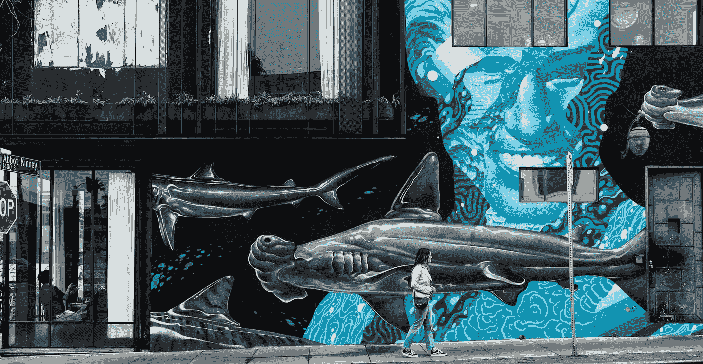
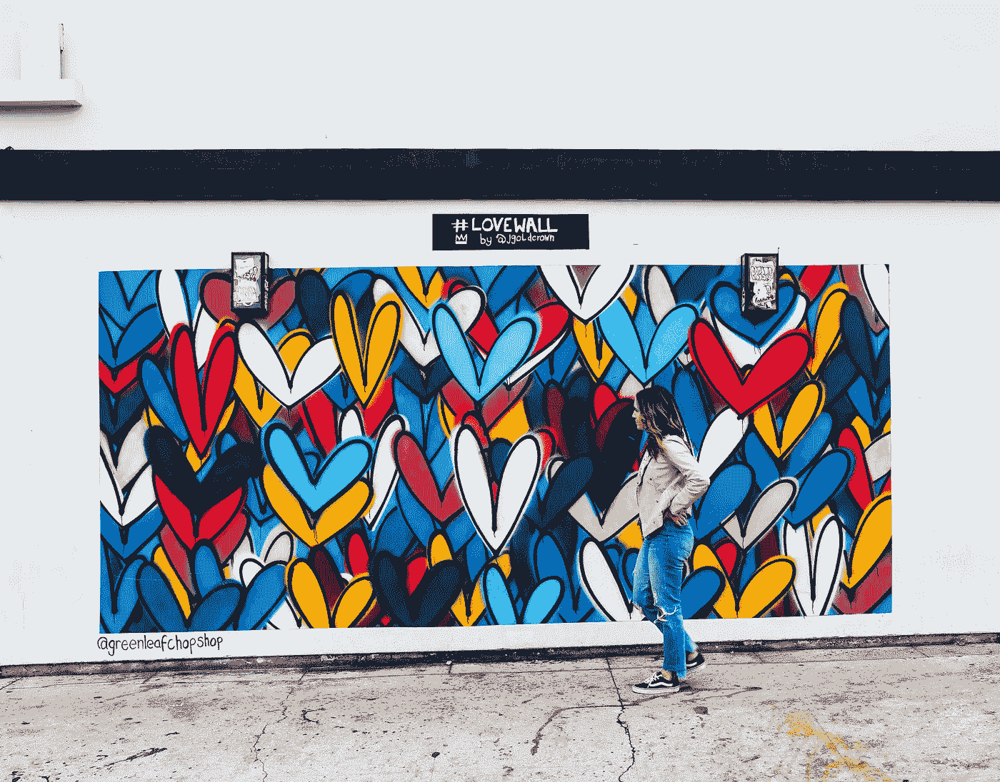
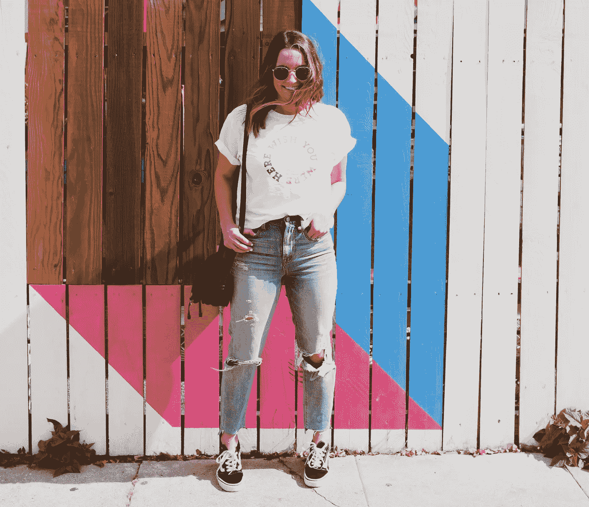
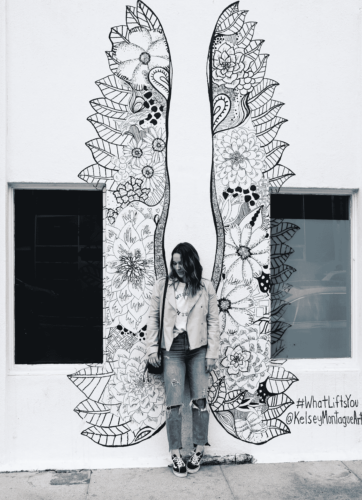
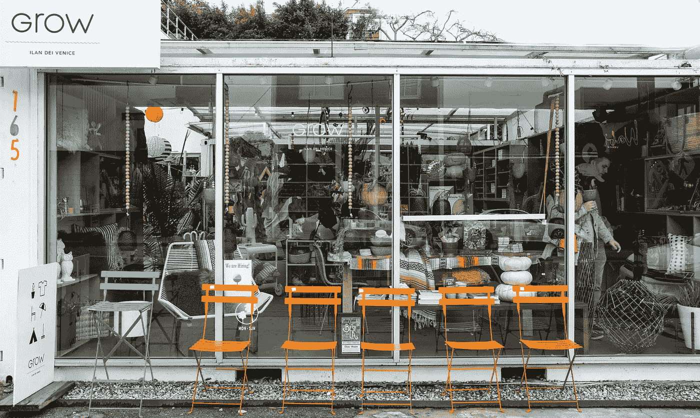

# 为了更好的用户体验，只需添加壁画

> 原文：<https://medium.com/swlh/for-a-better-user-experience-just-add-murals-f018a14426e8>

Written by: Dan Salcius

加州威尼斯的街道就是一个很好的例子。

只需要去一趟金内修道院；我们引发了对壁画的热爱。

当然，观看人群是值得的，但壁画抢了这个小镇的风头，吸引了行人、骑自行车的人、开车的人，甚至“骑摩托车上下班的人”(是的，他们也是人)。色彩、创意和潜意识信息足以阻止双向的交通流量。但是，话说回来，我们谈论的是洛杉矶。

这个*威尼斯的氛围*提升了人们在游览时的用户体验，成为其他城市复制的基准，这是怎么回事？这些壁画，一种免费公共艺术的展示，真的对人们如何与具体环境互动有重大影响吗？我们认为是的。当然，我们是一群有偏见的设计师，对任何事情都有太多的看法。呃…我们是*所以*洛杉矶。

# ***壁画:多看一眼***

北方工作室[设计团队](http://www.designingnorth.com/)对所有类型的壁画都有真正的鉴赏力。**注:**我们对壁画的定义是，在建筑物内部或外部向公众开放的大型壁画。

从写一篇讨论 [*UX、积极变化和团结:壁画是社会最好的表达工具*](https://medium.muz.li/ux-positive-change-and-togetherness-murals-are-societies-best-tool-for-expression-c41c14d93a0c) 到发起一项为期一年的运动，鼓励人们分享感动灵魂的艺术视觉效果，城市艺术是我们日常生活中的一个重要细节。我们知道其他人也有同感。

这就是为什么更多的人需要接触修道院院长金内的世界，这也是为什么我们要求你把你的下一个城市约会作为一种体验，一种可以通过支持艺术家、设计师和创意人员等——那些美化混凝土画布的人——来设计得更好的体验。理想情况下，我们希望看到更多的城市和企业投资壁画创作，为我们周围的空间带来色彩和欢乐。

简而言之，美国各地的城市都迫切需要更多的公共艺术——一些发人深省、感人肺腑、能引起共鸣或者只是简单有趣的东西。传达积极的氛围和包容性，而不是消极和恐惧。壁画能解决问题吗？为我们所有人刷新用户体验？绝对的。

Abbot Kinney — Dan Salcius

# **用户的体验，解释**

顾名思义，[**us er ex experience**](https://www.nngroup.com/articles/definition-user-experience/)**指的是与互动有关的某样东西的使用有多令人愉快。虽然我们通常根据网站和计算机应用程序的质量来衡量这一点，但壁画的困惑回避了这样一个问题，“艺术家是否有意创作这件作品，以便用户(顾客)能够体验他们想要的东西？”**

**嗯，这是一个只有艺术家才能回答的问题。从传统意义上来说(因为它与工作室工作相关)，UX 是一门学科，设计师在其中*设计*他们希望某人拥有的期望交互——这是有意的。然而，对于美术来说，你会问艺术家 UX 是否运用了这种思维，以便确切地知道。换句话说，对于一种产品或服务，我们假设它是有意以某种方式设计的。有了艺术(包括壁画)，我们要么做出这种假设，要么寻求艺术家的灵感，以求清晰。**

**执行董事丽莎·皮科克的话很好地总结了公共壁画的模糊性:“没有什么是公正的艺术——但我知道很多艺术家不这么认为。”**

**澄清一下，我们有 UX 设计的原则——然后是用户的体验。用户总是会有一种体验，不管这个规程是否被用来创造一些东西。壁画提供了证据。不管有没有实践者的接触，这些作品对一个人如何与一个城市环境互动有着深远的影响——比如洛杉矶。**

****

**Abbot Kinney — Dan Salcius**

**你可能会问，为什么我们需要更多的壁画来增强一个人对城市环境的体验。简单的答案是，我们活着是为了废除所有媒介中的无生命体验，甚至是城墙。无论是在洛杉矶、纽约、旧金山、芝加哥还是波特兰，城市艺术都让我们思考，提供停顿，增添色彩，激发想象力。**

# ****从一个地方到目的地****

**壁画对于公众来说就像绘画对于画廊的参与者一样:一种只需要注意力和兴趣的大脑体验，提供纯粹的享受。同样，世界各地的人们将画廊和博物馆视为目的地，要求对细节给予特别关注。为什么不为公共艺术做同样的事情呢？**

**这样做可以将一个*地点*转变成一个令人难忘的*目的地*(即人们会专程去参观的地方)。**

**现在，我们认识到壁画不是一种设计体验——除非艺术家这么说。然而，可以说这在未来可能会改变，因为公共艺术正在成为主流，并塑造着社区的商业发展——DTLA，我们看见你了。**

**所以，为了发现，为什么不把顾客旅程过程应用到目的地体验中。今年早些时候发表在 [UX 集体](https://uxdesign.cc/ux-is-all-about-the-journey-not-the-destination-c1286fc8d63f)上的一篇探索性文章正是这样做的，并作为我们比较的有用例子，模拟了一个旅行者的旅程。具体来说，它将旅程定义为:**

****准备>决定>经历>记住****

****

**如果你思考一下我们所谈论的关于壁画帮助社区发展的话题，从一个地方到一个目的地，你会发现某人在旅行经历中的“思想、感觉和行动”非常相似。**

**这个过程从计划开始，发展到旅行预订，开始旅行，最后，调查记忆或经验教训。事实上，随着时间的推移，随着越来越多的人开始“旅行”，这些关键因素进一步增加了目的地的受欢迎程度**

**有趣的是，随着当地壁画热点在洛杉矶越来越受欢迎，人们在亲身体验之前会花更多的时间做准备和决策。只要看看阿博特·金内大道的 Instagram 照片的评论部分，就有一个与艺术“语法化”相关的真实用户体验**

**人们成群结队地寻找这些地方，因为他们知道，无论如何，他们都会看到一些有价值的东西，带着书中一次难忘的旅行回家，甚至可能会有一种新发现的创作灵感。当然，这增加了体验，创造了可以与他人分享的持久记忆，并激励他们也创造一种体验。我们在开始的时候说过，我们会再说一遍:为了更好的用户体验，只需添加壁画。**

## ****壁画是 UX 的演变****

**与产品环境类似，零售体验的演变也得益于壁画的加入。不，[零售没有死](https://news.nike.com/news/nike-retail-new-york-flagship)；它需要重新设计。这种重新设计需要更好的用户体验，包括壁画。**

**还是那个例子，住持金内和 [DTLA](https://www.tripsavvy.com/los-angeles-arts-district-1587001) 散发着科技产品的特质。以时尚的户外空间而闻名，持续的演变是强制性的(就像苹果的 iPhone 一样)，以保持人们的兴趣和参与。曾经有一段时间，这些熙熙攘攘的购物和餐饮中心对一群总是期待新鲜刺激事物的人来说相当平凡。壁画是解决办法。**

****

**Abbot Kinney — Dan Salcius**

**现在，金内修道院院长的壁画支撑着一个由店主、零售品牌和该地区一些最好的咖啡店组成的紧密社区(咳咳……[知识界](https://www.intelligentsiacoffee.com/venice-coffeebar)，有人吗？).随着[不断刷新零售体验](https://medium.muz.li/user-experience-and-retail-strategy-together-again-45ace1598ad3)，辅助体验产生影响的机会增加(如壁画)。顾客的旅程在不断发展，我们都从当地的旅游体验中受益。**

**无论这种体验是有意的还是无意的(无论是否受到 UX 的影响)，壁画都有能力刺激一种特定的行为，并激发重游。换句话说，他们把一个地方发展成一个目的地。作为设计参与式社区的答案，它们有助于一个人在公共空间的体验，并在超出一个人的预期时加强连续的用户旅程。**

**所以，作为 UXers，我们说:让我们创作更多的壁画吧。让我们迎来一个时代，在这个时代里，每个人都有机会至少见证城市环境中的创造力——这是一种用大型艺术设计的体验。行动的呼唤——拥抱创造性的表达——为什么不让壁画成为我们的缪斯，并把它们展示给所有人看呢？如果我们以一种发人深省的方式在繁忙的户外空间向人们展示这些信息，我们可以巩固他们作为真正目的地的存在。**

**这提升了更大的用户体验，这是最好的 UX。**

****

## **这篇文章发表在 [The Startup](https://medium.com/swlh) 上，这是 Medium 最大的创业刊物，有+389，305 人关注。**

## **在这里订阅接收[我们的头条新闻](http://growthsupply.com/the-startup-newsletter/)。**

****