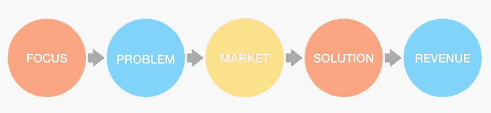
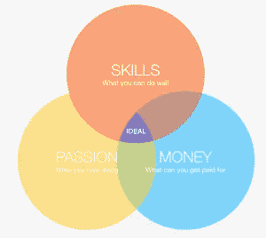
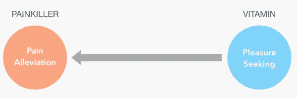
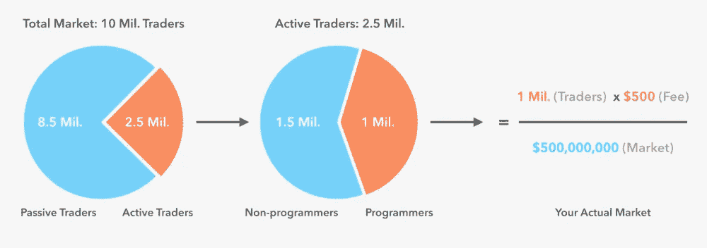
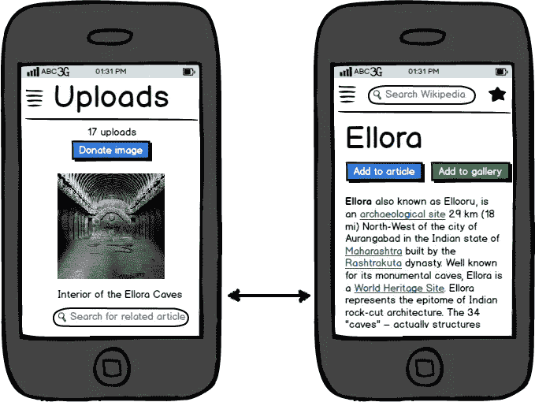
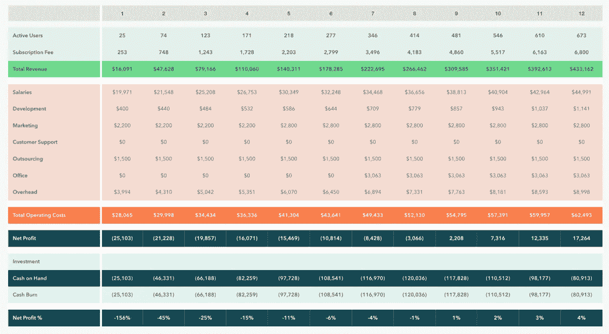

# 早期创业者:启动盈利创业的 5 步迷你指南

> 原文：<https://medium.com/swlh/for-early-stage-entrepreneurs-a-5-step-mini-guide-to-launch-a-profitable-startup-def60d1c0402>

Originally published on [http://www.appsterhq.com](http://www.appsterhq.com/?utm_source=CP&utm_medium=Medium)

N obody ever *计划*创办一家失败的初创公司，将自己生命中的几个月、几年甚至几十年奉献给一家最终倒闭的公司，这家公司无法创造、营销和销售一种有利可图的产品。

事实:90%以上的初创企业都会失败(证据: [1](http://www.forbes.com/sites/neilpatel/2015/01/16/90-of-startups-will-fail-heres-what-you-need-to-know-about-the-10/) 、 [2](http://www.forbes.com/sites/brentgleeson/2016/11/02/7-reasons-why-90-of-start-ups-fail-and-how-to-be-the-10/) 和 [3](http://fortune.com/2014/09/25/why-startups-fail-according-to-their-founders/) )。

出现这种情况有各种原因，但在大多数情况下，可以归结为:

*   公司为不存在的市场(即需求不足)生产产品，
*   未能正确管理其现金流(通常利用根本不起作用的收入模式)，
*   不能有效适应市场变化，
*   增长不够快，
*   和/或由最终筋疲力尽的创始人领导。

那么，经验丰富的企业家——那些拥有创办超成功公司记录的人——知道哪些失败的初创企业的创始人不知道的事情呢？

在许多潜在的答案中，有一个似乎被许多人低估了:*你创建初创企业的第一步将最终决定它是成功还是失败。*

你在创业初期所做的事情，可能会决定你是创办下一家百万美元甚至十亿美元的公司，还是成为又一家失败的创业公司，其他 90%的公司都被历史遗忘了。

在与无数初创公司合作后，我们发现，成功创业的核心由五个关键步骤组成。

你公司的具体**焦点**，你试图解决的确切**问题**，你将要进入的特定**市场**，你打算打造的作为问题**解决方案**的产品，以及你的**商业模式**的经济性，都必须在你开始建立你的公司之前*决定并弄清楚。*

我们成功启动盈利创业的五步流程如下:

# 1.焦点

你的公司的根本是什么？

“我应该做些什么？”这是最重要的，也是你在考虑创办一家初创企业的可能性时，应该真诚自问的第一个问题。

你公司的关注点类似于建筑的地基:无论你建造什么样的后续层，都将在很大程度上依赖于支撑它们的基础结构。

只有坚实的结构/重点才能支撑强大的建设/创业。

请考虑下图:

创建一个成功的初创企业最重要的一个方面是确定你的*能力*(技能)、你的*兴趣*(激情)和*你做什么能得到报酬*(金钱)之间的理想交集。

一次又一次，创建繁荣的初创企业的创始人将这张图的基础视为代表他们成功的核心。几乎每个顶级企业家都在兴趣、技能和货币化能力之间找到了有效的中间地带。

以史蒂夫·乔布斯为例:他热爱设计(激情)，是一个伟大的营销人员和产品经理(技能)，并且总是成功地将他的能力和兴趣与当时市场上超级热门的东西(货币化)结合起来，无论是个人计算、MP3 播放器形式的个人音频、3D 电影还是移动革命。

那么，如何将这些信息付诸行动呢？

现在拿出一支笔和一些纸，开始回答以下问题，直到你彻底解决了三个关键要素中的每一个:

**激情:**你想为你未来的公司做些什么？你最喜欢做什么？什么让你兴奋不已，并让你连续几个小时保持兴趣？

让我们明确激情的重要性:激情对于建立一个成功的企业绝对至关重要，但它不是一切的全部。

事实上，激情本身经常被高估，它的重要性也被高估。在大多数情况下，真正的激情会随着你开始积累成功而产生。因此，当考虑公司的重点时，不要完全集中在你此刻最感兴趣的事情上，而是包括那些随着时间的推移有可能给你带来满足感和成就感的领域。

尽可能多地列出你的爱好，然后进入下一个领域。

**技能:**你真正擅长的是什么？你有什么独特的天赋或能力？你能比别人做得更好的是什么？你是一个熟练的设计师，程序员，销售人员，全能骗子吗？还有别的吗？

你可能目前在一件或多件你突然想到的事情上不是最擅长的，但不可否认的是，你拥有一些特殊的技能、天赋和知识，你有潜力在创业世界和更广泛的商业领域脱颖而出。

同样，尽可能多地写出你的能力。

**金钱:**确定了你的主要爱好，列出了你的才能，现在你需要问自己两个进一步的问题？第一，你能把这些兴趣和这些技能联系起来，从而潜在地创造一个成功的企业，一个解决可识别问题的企业吗？如果是这样，那么，第二，是否有足够的市场需求最终产生利润？换句话说，市场够大吗？

回答这些关于市场需求和收入的问题将迫使你区分商业和非商业技能和激情，从而让你专注于具有赚钱潜力的特定兴趣-能力配对。

# 2.问题是

**消费者现有的痛苦/需求是什么？**

风险投资家、亿万富翁维诺德·科斯拉[说得好](https://www.youtube.com/watch?v=K6Jrt6A_Bzw&feature=youtu.be):“任何大问题都是大机会……如果没有问题，就没有解决方案，公司也就没有存在的理由……没有人会付钱给你去解决一个无关紧要的问题。”

在你推出任何种类的产品或服务之前，你必须确定你的客户遇到的具体问题，你的公司将寻求解决这些问题。

**止痛药还是维生素？**

维生素慢慢地、逐渐地促进身体健康:它们可以通过首先防止你变得不舒服来帮助你随着时间的推移感觉更好。

止痛药**立即停止不想要的和不舒服的症状:它们可以通过停止疼痛来帮助你感觉更好，从而立即解决问题。最好的公司是止痛药，不是维生素。**

止痛药是快速有效地解决严重问题的初创公司:顾客现在就想要止痛药，因为他或她有需要治疗的疼痛；他或她并不关心止痛药是否好看，是否有吸引人的标志，或者是否在两三个月后的某个时候有效。

谷歌是一种止痛药:如果没有谷歌的 24/7 可用性及其在几分之一秒内返回搜索结果的能力，在网上快速找到某样东西将是一种真正的痛苦。

你的公司必须发挥止痛药的作用，提供解决当前市场问题的产品或服务，而不是在未来某个时候可能有所帮助的维生素。

客户的痛苦可以货币化吗？

可货币化的客户难题如此重要，以至于足够多的客户认识到它们的存在，并愿意为解决方案付费。在 1-5 的痛苦等级中，可货币化的痛苦是 4 或 5，即*现在就需要解决*。

除非你能发现并应对一个具体的货币化难题，否则企业家的其他活动(从设计和开发到营销和测试)真的无关紧要:不管你最终建立了什么，除非它解决了一个或多个难题，否则人们不会为此买单。

**如何验证你的痛苦？**

对你打算启动的具体市场和业务领域有一个概念，下一步是定义你的问题假设，即设计和测试你认为你的业务将会应对的核心问题。

为了测试你的货币化疼痛假说，你需要:

*   **寻找客户样本**
*   **亲自调查(最好)或通过电子邮件调查(不太好)**；和
*   **评估结果。**

为了获得尽可能多的有效见解，你需要从你的焦点小组那里获得残酷的诚实。这意味着，你不是热情地向参与者推销你的想法，并试图向他们推销你具体的疼痛假设，而是问一些开放式的问题，旨在让受访者畅所欲言，没有压力。您可能会问这样的问题:

*   **关于 *x* 【即某给定问题】最难的是什么？**
*   **多说说 *x* 。上次 *x* 发生了什么？**
*   为什么那次经历如此艰难？
*   为了解决这个问题，你做了什么(如果有的话)？
*   您目前正在使用什么解决方案(如果有)？你对他们有什么不满意的地方？它们需要如何改变？

**去哪里找客户反馈？**

最后，对于这种焦点小组反馈，你从哪里找到这样的潜在客户？利用一切可以利用的资源！试试你现有的电子邮件列表、在线论坛/留言板、社交网络和微型网站、Reddit、Linkedin、Quora、Meetup.com；或者甚至去星巴克，提供一杯免费的咖啡来换取你的意见。

一定要避开你的朋友和家人，因为你几乎肯定会从你已经熟悉的人那里得到有偏见的反馈。

# 3.市场

你能建立一个真正的企业吗？

除了确定你的公司的重点并集中在它将解决的具体问题上，你打算创造的解决方案的市场确实存在也是很重要的。

企业家、投资者和软件工程师马克·安德森坚持认为:

“市场是创业公司成败的最重要因素。为什么？在一个伟大的市场，一个有很多真正的潜在客户的市场，市场把产品从创业中拉出来。市场需要被满足，并且市场将被满足，通过第一个可行的产品出现。产品不需要很棒；它只需要基本上工作。并且，市场不在乎团队有多好，只要团队能生产出那个可行的产品”([来源](http://web.stanford.edu/class/ee204/ProductMarketFit.html))。

(我们有一整篇博文致力于 Marc 上面提到的创造最小“可行产品”的重要性——点击[此处](http://appsterhq.com/blog/mvp-app)阅读文章)。

那么，你如何确定一个市场是否真的存在于你的公司和你想要解决的问题上呢？

**计算你的市场规模**

为了确认你的产品市场的存在，你需要计算你的*年市场规模* (AMS)。AMS 指的是:

*每年购买您产品的总人数*

乘以:

*你产品的价位*

这个公式揭示了为了产生高的年收入(例如，10 亿美元的销售额)，你需要大量的客户，高的价位，或者两者兼而有之。

要了解市场规模，请遵循以下步骤:

*   **研究媒体对市场的报道**:尽量寻找引用 Gartner 或 IBIS 等权威市场研究机构的文章；阅读 [SEC 文件](http://www.sec.gov/edgar.shtml)和维基百科(确保验证所用来源的真实性)；谷歌图书也很有帮助。
*   **创建市场规模的基本估算**，必要时收集相关统计数据和数字(例如，通过谷歌搜索)。
*   **使用现代分析工具**进一步验证估算，包括谷歌趋势、谷歌的[关键词规划器](https://adwords.google.com/KeywordPlanner)和脸书的[广告工具](https://www.facebook.com/ads/create)。利用这些应用程序，您将能够确定对您提议的解决方案的需求有多强烈。

到正确计算你的特定市场的规模，确保你避免不合理地概括你的统计数据。例如，如果你开了一家女装网店，而美国有 1.5 亿女性，那么很明显你的潜在市场规模肯定不是 1.5 亿！相反，你需要确定有多少女性(你感兴趣的特定年龄)在网上购物，有多少女性购买你出售的特定款式的服装，等等。你需要深入挖掘，努力确定目标人群的确切偏好和购买习惯。

**再比如:**

*   假设你正在为股票期货交易者开发一个工具，允许他们编写自己的交易算法。
*   总共有 1000 万交易者，但是，正如我们刚才看到的，这并没有准确地代表你的目标市场。仔细观察会发现，在这 1000 万交易者中，只有 250 万是活跃的交易者，其余 750 万每月交易不到一次。
*   所以，你的交易工具有 250 万潜在用户。另一项调查显示，这些潜在用户中只有 100 万人有足够的编程技能来使用你的产品。当然，为了确定这个数字，你需要在交易者中进行调查(例如，尝试[谷歌调查](https://www.google.com/insights/consumersurveys/home))。
*   看看这个领域的类似产品，你会对这个市场的典型定价有所了解。假设使用该程序的年费是 500 美元:500 x 100 万用户= 5 亿美元。如果你想赢得 100%的市场份额，这是你能赚的最多的钱了(当然，这是一个雄心勃勃的目标)。
*   为了获得更多的洞察力，你可以进行一个类似上面讨论的焦点小组调查(在**问题**下),努力确定有多少交易者认识到并对你的工具所关注的特定问题/难题的解决方案感兴趣。

# 4.解决方案

**您的最小功能集是什么？**

完成第二和第三阶段后，你现在应该掌握一些关于你关注的货币化难题的关键事实，以及一些关于你的产品应该如何外观和功能的初步想法。下一步是通过创建一个最小特征集(MFS)假设来更具体地了解你的产品。MFS 代表了一两个核心功能，您的客户将为此付费。重要的是，你要避免浪费时间、精力和金钱来“完善产品”,增加一些有用但不必要的功能。在这个阶段，你需要关注底线，并为未来一轮的设计和开发保留功能增强(同样，参见我们的文章[这里](http://appsterhq.com/blog/mvp-app)关于最小可行产品)。

正如法国作家安托万·圣埃克苏佩里的名言:

*完美的实现，不是当没有什么可以添加的时候，而是当没有什么可以拿走的时候*

发现最小功能集带来了增加灵活性的不可思议的力量:通过更少的功能变化，你的产品将吸引你的客户对简单性的渴望，同时向你揭示你的用户想要的真正核心。

以下是定义最小功能集的五个步骤:

*   **开发一个最小特征集假设。**通过考虑迄今为止您与潜在用户的对话中出现的主要主题，明确要求您的客户确定他们需要解决的关键问题(包括每个功能将解决的问题)，并简化所有这些信息，以生成一个简单、直接的功能列表，从而创建您的假设。
*   建立一个购买面板。确定在前面的步骤中回复你邮件的人，选择那些最有可能成为你未来客户的人，并开始编制一份名单。
*   **给你的初始产品一个视觉形式。**画出一些给产品良好感觉的起始线框图。您可以免费使用 [Balsamiq 模型](http://balsamiq.com/)和 [Lucidcharts](https://www.lucidchart.com/) 等工具。

使用线框工具创建的实体模型示例:

*   做 100 美元测试。向客户展示您的原型，如果您收到的反馈不一致，不知道他们是否愿意使用它，他们喜欢/不喜欢哪些功能，以及为什么要尝试 100 美元测试:列出您正在考虑在最终产品中实现的所有功能，并询问您的客户，“如果您只有 100 美元投资于该产品的一个或多个功能，您会如何投资？你会投资哪些功能？”自然，顾客会选择他们最关心的产品。
*   **提炼并测试对你的产品的需求。**使用“突破性问题”测试产品的需求和价位，例如:“该产品的合理价格是多少？”，“您愿意预订这款产品吗？”，以及“您对一次性付款还是定期付款使用该产品更感兴趣？”

# 5.收入

**你的商业模式是什么？你能测量它吗？**

找到了关注点、问题和产品，并确定了解决方案的市场存在后，下一步就是计算你的商业模式是否能够将你的产品推向市场、盈利并扩大规模。

“规模经济”指的是这样一个事实，你的客户群越大，生产一个单位的产品就越便宜。例如，如果你开发一个应用程序，你的开发成本是 250，000 美元，那么 10，000 个客户的客户群将使你的一个单元的成本为 25 美元。

一个更小的市场，假设在这种情况下有 4000 个客户群，为了产生相同的收入，你必须收取更高的价格。然而，这样做的问题是，如果你的竞争对手提供更便宜的产品，那么你很幸运在发展你的初创企业时面临困难。

一家企业必须扩大规模——否则，它最终会倒闭。你需要确保你的商业模式有潜力随着时间的推移发展你的公司。

开发销售软件的一大优势是单位复制成本基本不存在。例如，你可以开发一个应用程序，然后以最小的额外成本出售你想要的产品的“拷贝”。

相反，如果你销售实物产品，如笔记本电脑、笔记本电脑或窗框，你必须按成本生产每一件产品，无论你向客户销售多少件。

**创建一个简单的现金流计算**

为了估计你的规模经济，一个简单的现金流预测可以工作，如下图所示:

像这样的图表也可以让你确定你需要多少启动资金来启动你的业务。在这里，你可以看到初创公司有效地烧钱(括号中的数字是负值)，直到它最终在第 9 个月开始收支平衡。

最初的负现金流增长到 120，036 美元，如果你经营这家初创企业，这是你生存下去所需的最低金额。

有了这五个基本步骤，接下来的行动包括筹集金融资本(除非你打算启动你的公司)，构建你的产品，实现成功的产品/市场匹配，以及建立一个可重复和可扩展的商业模式。

我们将在未来提供关于这些和相关主题的深入博客帖子，因此请务必在 Appster 上关注我们的旅程[！](http://www.appsterhq.com/?utm_source=CP&utm_medium=Medium)

来源参考:巴德·卡德尔的[图](http://budcaddell.com/)，b·斯里尼瓦桑的[创业工程](https://www.coursera.org/course/startup)，[钉钉然后规模化](http://www.nailthenscale.com/)n·富尔和 p·阿赫斯特罗姆。

> 最初发表于[http://www.appsterhq.com/](http://www.appsterhq.com/?utm_source=CP&utm_medium=Medium)

