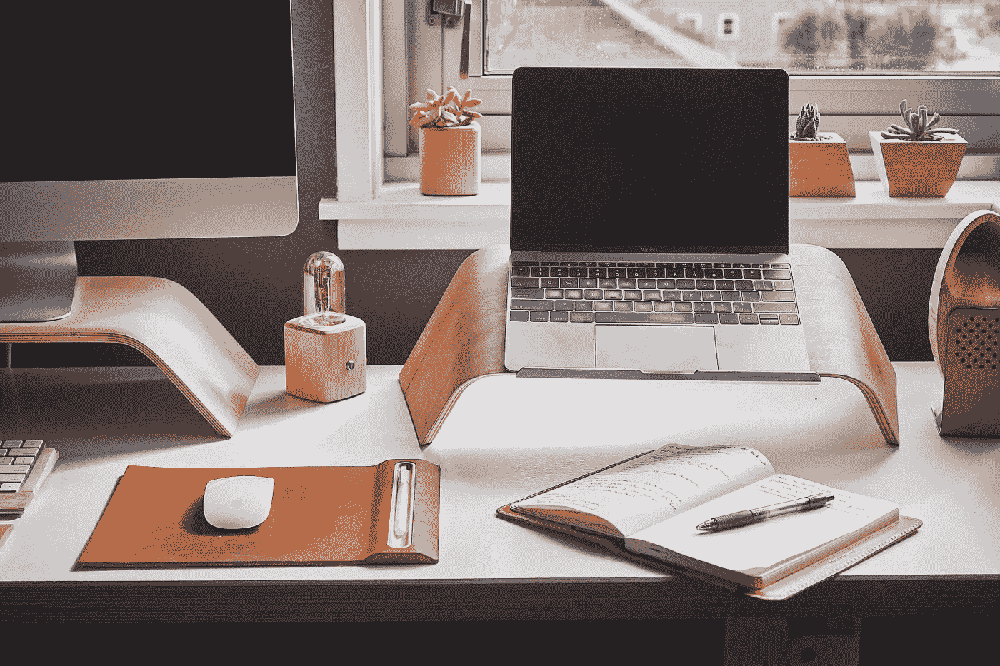
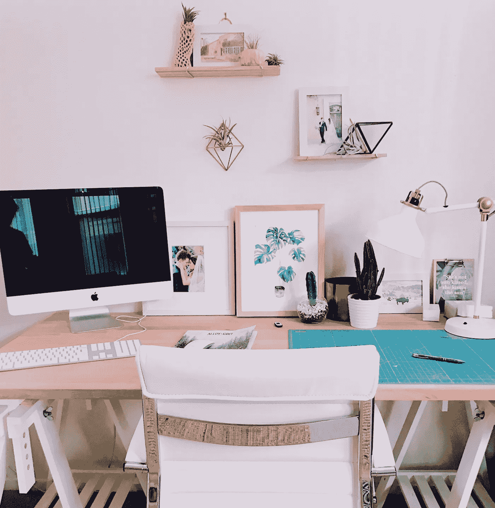

# 对于一个远程工作者的长期成功，寻求快乐

> 原文：<https://medium.com/swlh/for-long-term-success-as-a-remote-worker-seek-joy-d2b55f296312>

Written by: Daniel Salcius | Image: Grover

远程工作；你要么喜欢它，要么讨厌它，要么不知道该怎么想，因为目前它不是一个选项。如果你陷入后者，请耐心等待——你的大限将至。至少数据是这么告诉我们的。

你知道吗，根据 [Buffer 关于远程工作的最新报告](https://open.buffer.com/state-remote-work-2018/#earn)，今天 43%的员工至少花一些时间在远程工作上？如果你渴望分享这种自主的生活方式，请放心，在不久的将来，这将是司空见惯的。

一个拥有遍布全球的设计和开发团队的虚拟工作室，我们已经了解了作为远程工作者取得成功所需要的一切。事实上，我们认为这种向虚拟团队的转变是提升人类体验的一部分，是周一至周日美好生活的一部分，而不仅仅是周五和周六。但老实说，这种体验的大部分取决于公司文化本身。远程不是目的地，而是一种心态。

远程团队在包含沟通、协作，当然还有远程学习的公司文化中运作得最好。此外，无论你认同哪一个群体(喜欢它，讨厌它，也许在将来)，在远程工作时，有一个非常重要的细节需要考虑，一个我们一次又一次忽视的细节。

也就是说，你是你所处环境的产物。这就是为什么我们鼓励你冷静、认真地审视你的工作空间(现在或未来),并把它设计成你理想的工作环境。更好的是，把它打造成为一个愉悦你的感官、让你一整天都充满快乐的空间。因为正是这些小细节对远程工作者的日常快乐产生了重大影响。

无论你是设计师、作家、社交媒体战略家、营销顾问等。，成为一名高效的远程工作人员取决于此刻的良好感觉，而要做到这一点，就要从控制环境开始。作为一个远程团队，成功应对了与远程办公和自由职业相关的挑战(孤独感、缺乏沟通、脱离等。)，我们认为远程工作的一个普遍因素值得特别关注。

它叫做*欢乐*。要找到它，优化你的物理环境，激发心智认知。通过个人实例分享，让我们来看看作为一名远程工作者，如何通过特别关注环境和快乐的感觉来增加自己的快乐。

# **掌控你的空间**

在讨论“[找到你的心流](/swlh/finding-your-flow-like-a-designer-with-advice-from-an-executive-creative-director-97617d0bbf9b)的概念时，总经理丽莎·皮科克提到了在工作环境中让*控制*的重要性。具体来说，她分享了，

> “我需要首先控制我的环境，这意味着我周围的一切都是视觉上令人愉悦的——这带来了一种平静的效果(也包括噪音和运动)，以创建一个内部的思维组织。感受平静让我能够跳入心流的风暴中，在那里，我沉浸在我正在做的任何事情中，直到我完成我的工作，都不会被注意到。”

就心理学而言,“心流”是一种精神状态，在这种状态下，我们的行动和认知思维以无缝过渡的方式前进，为我们正在做的事情提供难以置信的满足和享受。根据心理学家[米哈里·契克森米哈](https://www.wired.com/1996/09/czik/)的说法，“心流是一种节奏感、参与感和期待感的微调。”心流的重要性及其对远程员工成功的贡献怎么强调都不为过。它直接将设计环境与控制个人选择联系起来。

*要获得控制权*，确定你的理想环境——你在哪里工作最好？你身边需要什么才能安心？(对我们来说，理想的环境意味着宠物在附近，或者是一个可以实现“加州梦”的窗户环境:充足的自然光，户外的景色，以及视觉上令人愉悦的元素，这些元素用颜色和形状来平衡物理空间。)

为了实现这种平衡，首先要设计一个能反映你的选择的空间。随着你的愿景的展开，像一个用户界面设计师一样思考——关注你的工作空间的外观和感觉。如果可能，从一张白纸开始；清除杂物或彻底清理房间。接下来，选择墙壁颜色(如果你不知道从哪里开始，从白色开始——你可以用物体和艺术引入颜色)。从那里，选择对象，混合颜色与纹理，甚至气味。

试着用一个有创意的墙廊，在整个房间和桌子上添加小植物。最后，添加您的技术工具，并确保您有空间移动和保持有序。这些小细节最终形成了一个“健康”的环境，在这个环境中，营养以颜色、形状、气味和感觉的形式出现。

在她的书 *Joyful* : *中，平凡事物创造非凡快乐的惊人力量，* [Ingrid Fetell Lee](https://www.ted.com/talks/ingrid_fetell_lee_where_joy_hides_and_how_to_find_it#t-310054) 谈到了创造一个“永远不会真正悲伤或愤怒”的空间她进一步解释道，“……设计师让我意识到真正重要的是丰富，不是物质的积累，而是感官的丰富。”将这种心态应用到你的偏远环境中，理想的美感可以通过颜色、纹理和图案的分层来创造，你不需要太多的东西来实现这一点。

作为“100%分布式文化”的先驱， [Dribbble 社区](https://dribbble.com/stories/2018/11/15/designer-thorsten-beeck-on-favorite-workspaces-and-expanding-his-skills)经常分享他们作为远程自由职业者在全球各地工作的经历。在最近的一篇博客文章中，一位多学科设计师描述了他与“选择”环境和强迫环境的关系:

> 比较我的办公空间和我在家工作的空间，我发现当我可以选择我的工作空间时，我的工作效率更高。希望在未来，德国越来越多的公司会意识到远程工作空间是一件好事。

# **变得有条理，保持条理**

请记住，在远程环境中创造成功意味着要特别注意小细节，拥抱那些带来快乐的喜悦和心流的时刻。幸运的是，有一些众所周知的“窍门”可以放在你的后口袋里。

尤其是其中之一，需要组织你的空间，甚至尽可能增加它的功能。无论是每天、每周还是每月，养成重新整理办公室物品的习惯，调整座位安排、电脑位置或你朝向窗户的方向。将组织者添加到桌面；交换植物，恢复你的工具周围的“空白”。例如，这里有一个重新布置的工作空间，以容纳额外的配件，同时创造更多的功能空间，你猜对了，组织。

正如 Buffer 的 2018 年工作报告得出的结论，绝大多数远程工作的人都是在他们的家庭办公室(78%)进行的，而不是在共同工作的空间和咖啡馆。因此，尽管社交媒体描绘了由“WeWork 帝国”主导的远程劳动力，但人们实际上在家中获得了最大的成功。个人组织是一个促成因素。

当然，保持整洁不仅仅是指桌面和项目文件夹。您——远程员工——就像您的计算机一样，是工作空间的一部分，必须理清思路才能高效工作。无论如何，每天都要这样做——让它成为常规。

> 作家兼主题专家陈伶俐·威斯特给出的建议是:“以记笔记开始和结束一天；把你的想法(和感觉)写在纸上，回顾你的情绪——以及它们是如何影响一天的。

这可以培养你的意识，训练你在最有效率的时候“积极向上”，创造一个有利于良好工作和良好氛围的环境。

变得(并保持)有条理需要对自己做出承诺，接受起起落落，知道什么时候工作，或者什么时候休息。因此，除了待办事项清单，尽可能经常地概述你的一天，并特别关注你的需求(即休息、外部交流、专注、灵感和寻找心流)。理想情况下，变得有条理会促进可持续的工作流程，有助于长期的快乐和对工作的满意。此外，保持组织和控制感觉和情绪是在为未来做准备的同时，从清单上划掉当前目标的关键。

# **保持活跃，过度沟通**

办公室聊天……对于那些呆在办公室的员工来说，这是理所当然的。但是，作为一名远程员工，找到快乐部分取决于经常与团队成员交谈。猫是伟大的，但它们无法全天提供健康的对话。(是的，我们看过脸书的录像，和你一样印象深刻。尽管如此，你需要的不仅仅是会说话。)

[的梯子博客](https://www.theladders.com/career-advice/successfully-work-remotely)很好地阐述了一个观点:成功的远程工作者建立了活跃的上午、下午和晚上的日常工作，富有团队沟通。

这包括定期的电话和视频通话，即使是为了任务的清晰。此外，用关于昨晚的游戏或“这就是我们”的荒谬的情感插曲的简短对话来结束项目通话不要担心，这样做你不会失去注意力；你和同事的联系方式和办公室职员一样。

多亏了我们的新 iPhones，我们已经成为了虚拟人物。为了快乐，让我们在远程环境中工作时保持人与人之间的对话。由于独处，你在工作中的笑容和笑声会减少，和同事相处的时间也会减少。做些让自己开心的事。

“你交流得太多了，”没有一个远程团队成员说过。不管是否有严格的会议政策，对于那些没有中央办公室的人来说，持续的沟通是一份礼物。它的价值超越了团队绩效或项目成功的界限。从更深的层面来说，日常沟通复制了员工保持参与和高效所需的高质量互动。事实上，通过建立一对一通话、团队视频聊天和项目绩效圆桌会议的时间表，远程员工可以获得更多的快乐，对自己的职位感觉更好。

持续沟通的副产品是生产力的提高和注意力的集中。工作室[执行总监](https://www.linkedin.com/in/lisapeacock/)分享的话，

> “这是关于分享发现的好内容，具有包容性，突出人们的成就，鼓励他们相互分享，要有趣，要平易近人，在你可以的地方放手，在你看到挣扎的地方给予帮助。”

这可能需要更多的工作，但有效的沟通会让你在远程环境中感受到更多的快乐。

美国作家恰克·帕拉尼克说得好…

> “在你选择做的每件事情中找到快乐。每一份工作、每一段感情、每一个家……你有责任热爱它，或者改变它。”

当你过滤掉人们选择远程工作的许多表面原因(全部有效)时，这个决定几乎总是归结为对幸福和快乐的追求。幸运的是，接受与远程工作相关的责任可以让你控制实际的工作环境，从而享受工作带来的乐趣。

作为一个创意遍布全国的设计工作室，Designing North Studios 相信积极的空间会影响优秀的作品。因此，如果这是你正在寻找的乐趣(以及酷的团队成员和引人入胜的项目)，我们认为你应该[来看看我们](http://www.designingnorth.com/)。

## 这篇文章发表在[的《创业](https://medium.com/swlh)，这是 Medium 最大的创业刊物，拥有+393，714 人关注。

## 在这里订阅接收[我们的头条新闻](http://growthsupply.com/the-startup-newsletter/)。

