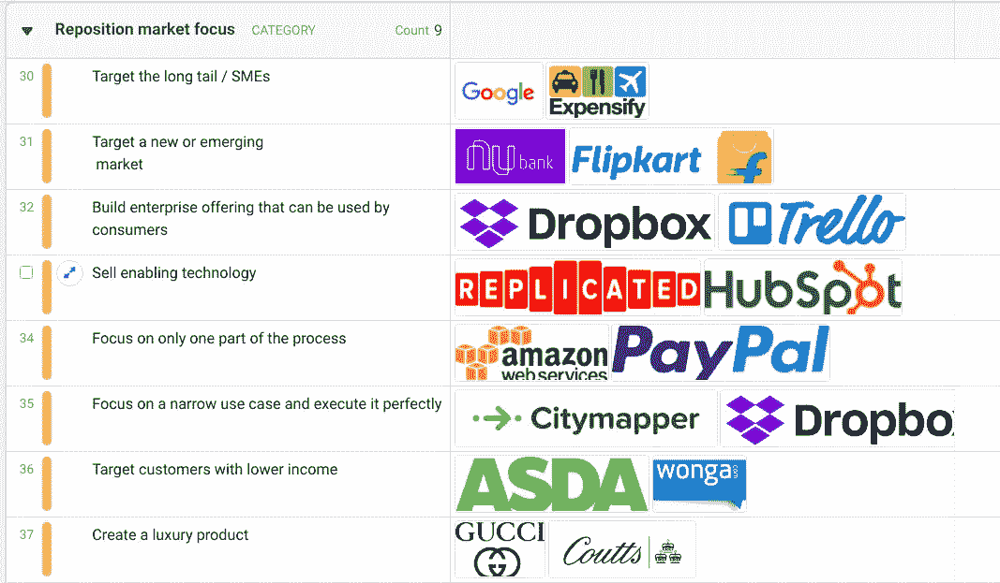
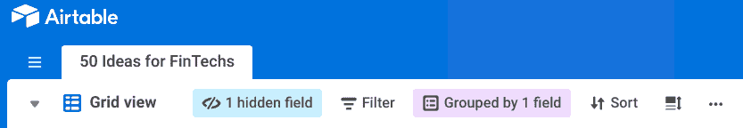

# 强迫自己从结构上创新

> 原文：<https://medium.com/swlh/force-yourself-to-innovate-structurally-13f8e057fb8b>

Photo by [ian dooley](https://unsplash.com/@nativemello?utm_source=medium&utm_medium=referral) on [Unsplash](https://unsplash.com?utm_source=medium&utm_medium=referral)

## 学习其他行业 50 个新创意的工具

我发现创新通常是一个非常流畅的过程，感觉就像在黑暗中摸索，直到你发现一些有前途的东西。为了使这个过程更容易，我们可以使用其他行业的创新想法的例子来帮助我们的思考过程。

考虑到这一点，我创造了一个工具，通过概括一项创新并使其更适用于您的行业，迫使您更系统地考虑想法。

> [**点击此处查看工具**](https://airtable.com/shrL3roLrRAcBVg0N)

Snapshot of the innovation tool

这个工具的灵感来自于埃里克·斯特罗姆贝里创建的一个极好的[创业点子矩阵](/the-mission/the-startup-idea-matrix-182bf2e6a53a)。

# 是给谁的？

希望提出新商业想法的企业家或现有企业中需要灵感来创新其产品或商业模式的创新者。

# 怎么用？

我在构思研讨会上使用过它，我们会仔细检查列表上的每个想法，并讨论它是否适用于我们的行业。结果并不总是全新的提议，但可能是对现有产品的调整(例如，如何定价或分销)。

最好是试着忘记此刻你所在的行业是如何做事的，试着发挥想象力，看看事情可以如何做。

# 这是什么奇怪的格式？

我已经在一个叫做 [Airtable](https://airtable.com/) 的新工具中创建了它，它有点像电子表格，但更加用户友好，并且有一些很酷的类似数据库的功能，它看起来很棒，但我仍在尝试，所以让我知道你的想法。

您可以在不同的视图之间切换(点击“网格视图”)，过滤(点击“过滤器”)，您可以打印(或打印到 pdf)或下载数据(点击“…”)。它是只读的，所以你可以点击右上角的“复制基础”来获得你自己的副本，并根据你的意愿进行编辑。

## 这篇文章发表在 [The Startup](https://medium.com/swlh) 上，这是 Medium 最大的创业刊物，有 310，538+人关注。

## 在此订阅接收[我们的头条新闻](http://growthsupply.com/the-startup-newsletter/)。

