# 预测比特币、莱特币和以太坊

> 原文：<https://medium.com/swlh/forecasting-bitcoin-litecoin-and-ethereum-bca15cb9a615>

最近几个月，数百万人进入加密领域，通过投资不同的硬币来分散投资组合。只有一小部分人获得了可观的利润，而大多数人却损失了大部分投资。有些人甚至卖掉了他们的家庭用品、汽车，或者贷款投资于 crypto。这些都是有些鲁莽的决定，除非这个人已经计划好了一切——但 99%的人都没有。

Source ([Steemit](https://steemit.com/crypto/@sujitsawant/crypto-trader-real-life-funny-movement))

如果这些人有更多的知识，他们就会做出更好的决定。他们不会损失超过 30%的投资，而是可以轻松获得超过 40%的收益。不幸的是，没有人能预见未来，除非市场受到内幕交易的操纵和/或影响。

然而，技术确实让我们能够**对价格可能走向做出短期预测。如果没有机器学习算法和人工智能系统的最新技术和创新，这是不可能的。因此，对比特币、莱特币和以太坊进行短期预测是今天的菜单，但首先是一些发展新闻。**

# 我们一直在做什么

大约三周前，我们决定将主要精力放在开发一款全新的移动应用上。我们目前的应用程序(你可以在 Google Play 商店找到)仅限于 Android 设备，因此为了应对跨平台的思想，我们将开发一个基于网络的应用程序，只要有最新的网络浏览器，例如 Firefox、Chrome 等，它就可以在任何平台上工作。

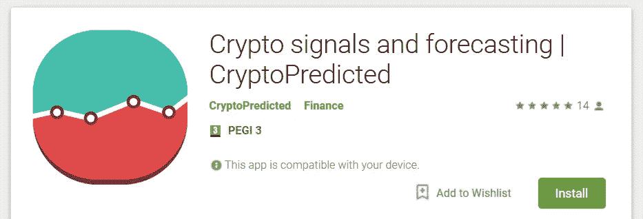

在一两周内，我们将发布我们计划集成的所有特性的路线图/时间表。这些新功能将远远超出价格预测。但我们将忠于我们的核心，即只为加密投资者和交易者提供最必要的工具和功能。无论你的技能水平如何，初学者还是专家，我们都将确保你拥有获得更大成功所需的所有工具。

## 提高应用内预测

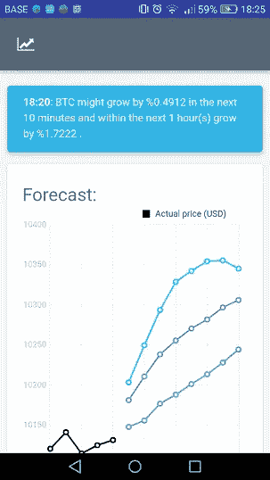

如果你一直在使用我们目前的应用程序，那么你会知道预测每 10 分钟生成一次(或者每小时 60 分钟)。这是因为技术原因。但是我们已经取得了新的进展，并且想出了如何改进我们的系统来每分钟产生一组新的预测。然而，我们并不打算在短期内将时间缩短到一分钟以下，除非背后有特定的目的和原因。

另一件困扰我的事情是图表并不总是自动刷新。我们希望我们的数据和预测像在交易所一样实时显示。但由于我们本身不是一个交易所，我们不想通过每秒左右推送更新来引发大量不必要的开销和网络流量。相反，我们选择了每十秒推送一次价格和预测更新，并能够禁用/启用实时更新。

## 异常检测

我们的一些用户抱怨他们收到推送通知太频繁了。这是我们目前正在解决的问题，我们希望确保您只收到最重要的通知，而不会错过重要事件。整个广告系统将有一个完整的返工。

# 预测

除了开发应用程序本身，我们在加密预测系统上取得了一些很好的进展。接下来，我将评估我们的系统在三个市场上的表现:BTC、瑞士联邦理工学院和 LTC。如果你想知道的话，这些数据来自币安交易所。但是具体是哪些数据，以及这些数据是如何被用来产生这些预测的，仍然是一个秘密。

注意:在接下来的内容中，我们将根据实际数据评估生成的预测。为此，我们必须查看过去的时间间隔。使用的所有数据和日期都是在过去 48 小时内捕获的。

## 以太坊

在我们之前几乎所有的博客文章中，我们都在评估比特币(BTC)，所以今天我们也将把以太坊和莱特币加入进来。让我们从下面的以太网图表开始，它来自 10 分钟烛台:

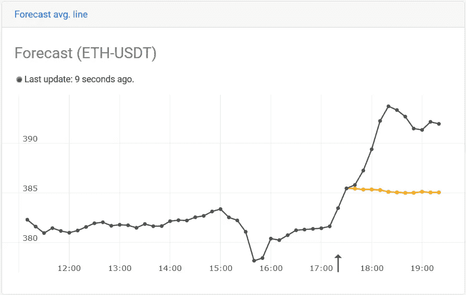

黑线是实际价格(开盘价/最低价/最高价/收盘价的平均值)—橙色(或绿色)线代表预测值。箭头指示该预测是在什么特定时间/间隔生成的。因此，直到箭头出现之前，预测都是完全基于数据生成的(因此，用机器学习的术语来说，它不是“过拟合”)。在这种情况下，预测一点也不准确。说明快速涨价后价格会趋于稳定。这背后有一些逻辑——系统可能已经知道在这样的事件之后通常会有一段时间的稳定，所以这就是为什么它会显示这一点。

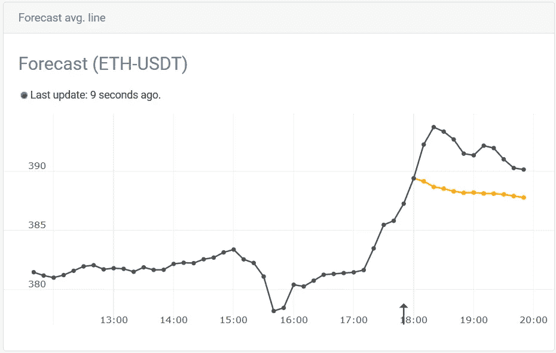

现在让我们前进几个间隔，但我们仍然看到它显示一段时间的稳定。这可能看起来很奇怪，但我仍然坚持我以前的说法——预计价格将很快开始稳定。通过与实际发生的情况进行比较，价格不但没有稳定下来，反而涨得更多。

乍一看，这些预测似乎是不准确的，除非我们用绝对的术语来解释它们。然而，当你将它们视为“预测”时，它们确实变得更加明显和有意义——这意味着很有可能“一些”事件即将发生，但我们不知道“何时”。我们的预测系统无法预测某事“何时”会发生，但它在告诉我们“某个事件”可能是什么方面做得非常好。有几个很好的原因可以解释这一点——无需解释每一个原因，就是市场受到外部因素(即人/交易者)的推动/影响，由于人的决定非常不可预测，所以“何时”因素也是不可预测的。

让我们向前走到图表的最高点，看看预测告诉我们什么:

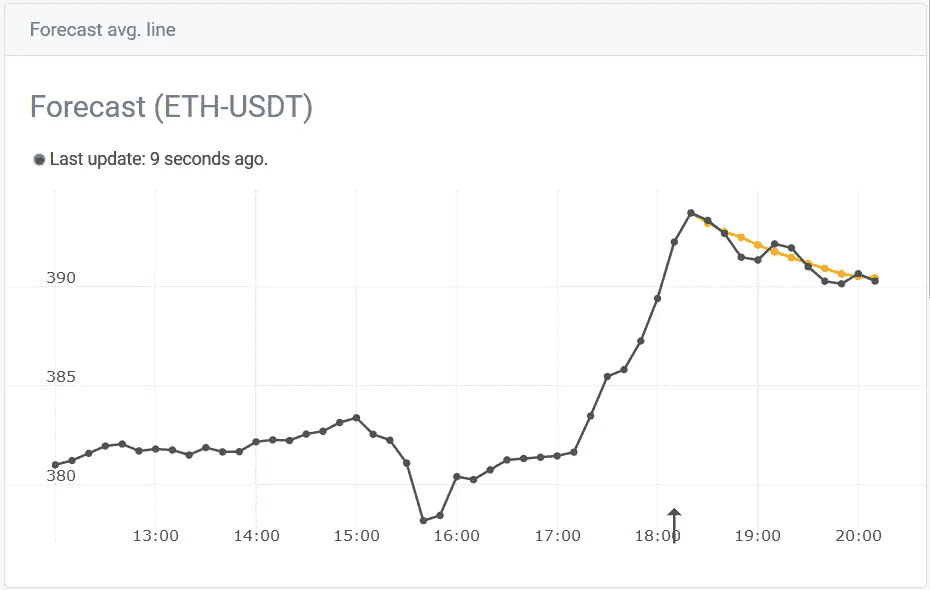

从上面我们清楚地看到，预测最终与我们的现实相一致。他们最终达到了他们的最佳状态，因此“一些预测的事件”已经开始显现。

往前走 50 分钟(5 个间隔)，我们会看到一些新的有趣的模式:

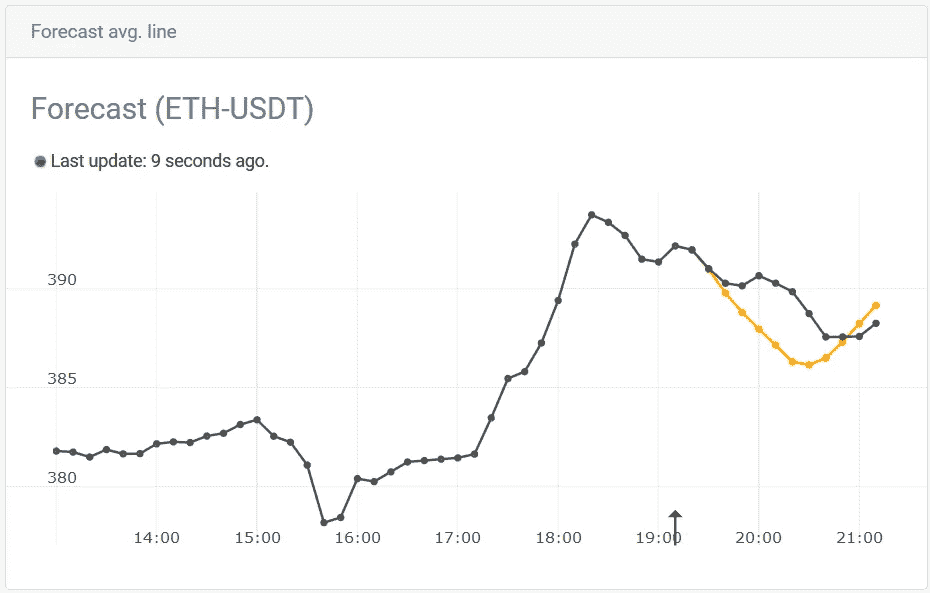

在上面的例子中，系统预测价格会以线性方式下降，直到到达某个点，然后再次上升。现实并没有那么遥远，但它以稍微不同的方式做到了。

在我的整个实验和分析中，我总是对系统适应微小变化的能力感到震惊。我的意思是……看看下面的图表:

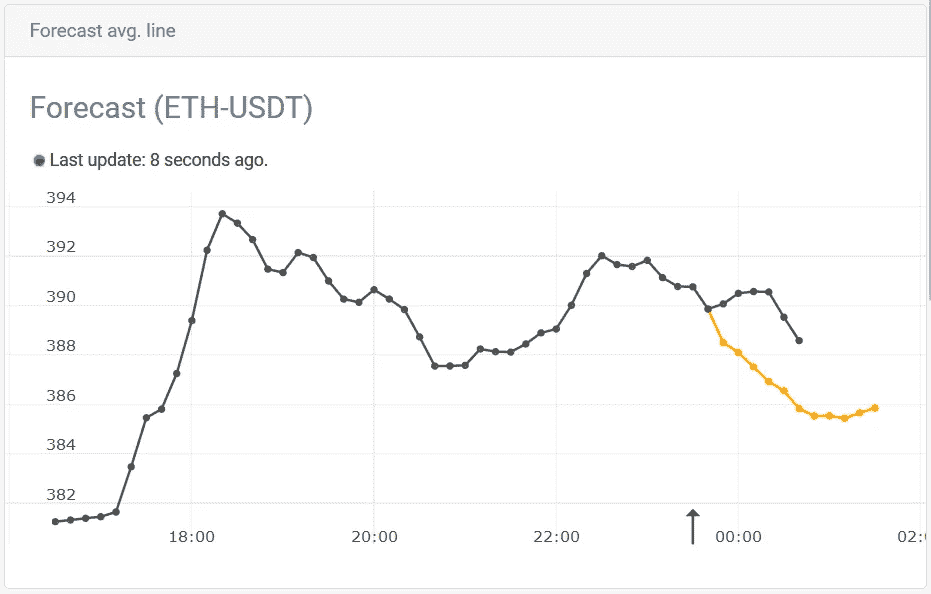

在这个区间，预测显示了严格的下降。现在让我们进入下一个区间，系统已经自我修正并生成新的预测:

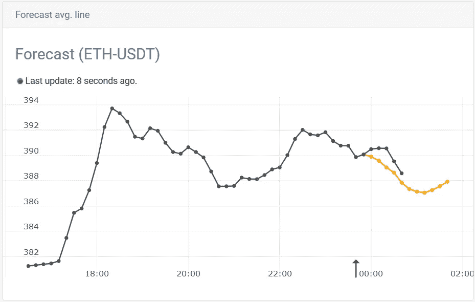

上面现在看起来好多了，不是吗？它了解到价格并没有像最初预测的那样进一步下跌，所以它以一种聪明的方式重新调整/适应了自己。

## 莱特币

在以太坊的例子中，我已经展示了该系统能够很好地预测不久的将来的事件，并使自己适应新的事件。但结果并不总是那么好。在某些情况下，它预测乌托邦事件:

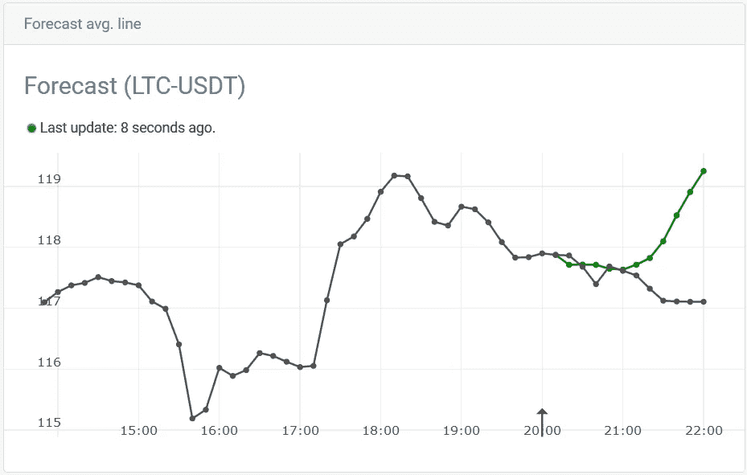

在上面的例子中，它显示了价格将或多或少地保持稳定，直到 21:00，然后飙升——这在现实中并没有发生，但绝对是一个不错的尝试。

当我在这些区间中不断前进时，系统仍然非常稳定，它不断预测价格将在 21:00 后上涨——你可以在这张图表中清楚地看到它无情的勇气:

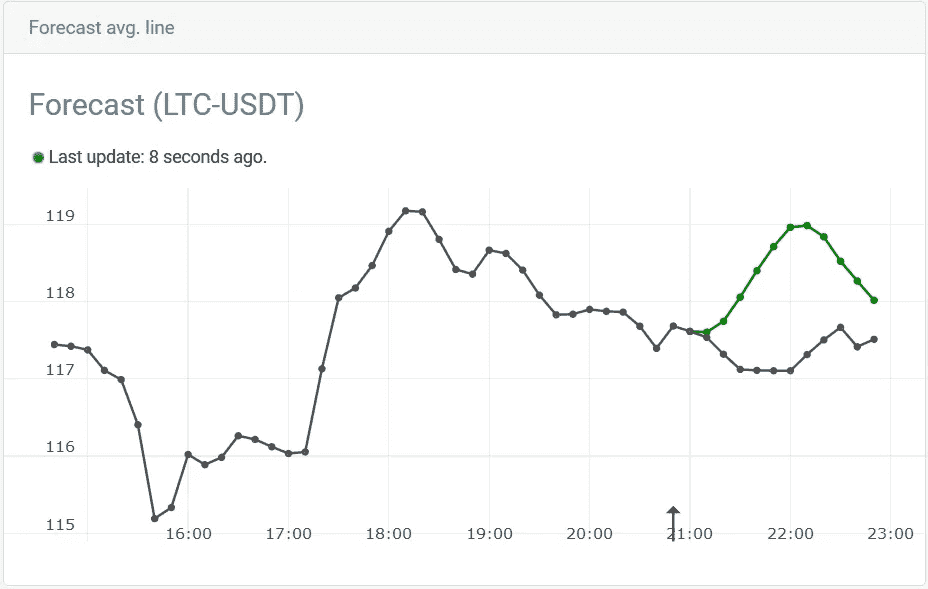

这些预测显示，ETH 的价格没有上涨，至少在 22:30 之前没有上涨，如下图所示。但即便如此，这一增幅也远低于上图中的预测。然而，我们再次看到了人工智能系统的力量，它已经学习/适应并最终做出了更加准确的预测:

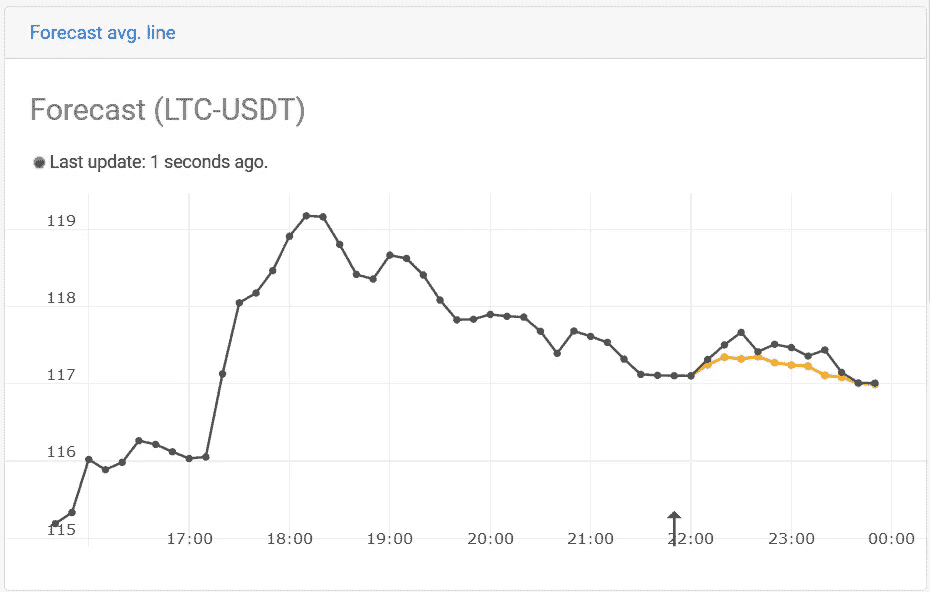

## 比特币

在预测方面，以太坊和莱特币似乎与比特币没有什么不同。同样的逻辑和推理也适用。然而，我确实相信，与其他硬币相比，一些硬币的预测会更准确——比特币肯定不是最容易的一种。看看下一张图表和预测:

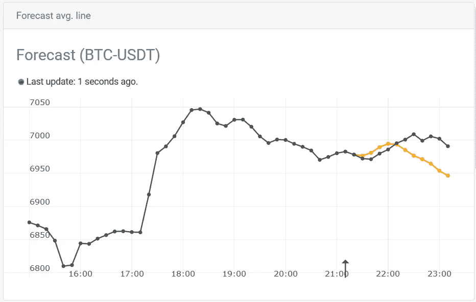

上面有一个相当准确的价格上涨五个区间的预测，然后预测 22:00 下跌。在现实中，这种下降确实发生了，但它需要几个间隔时间——这个系统再次不擅长预测某事“何时”会发生，但它在告诉我们“什么”可能会发生方面做得很好。

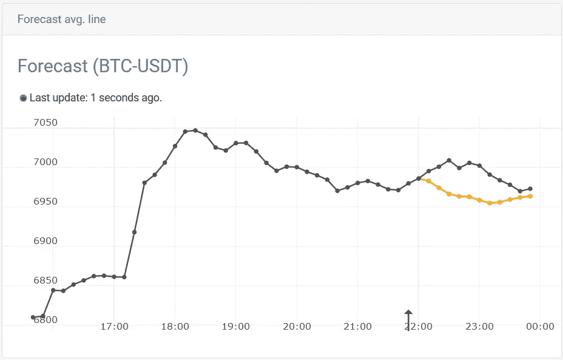

往前走几个区间，我注意到系统仍然持续，因为它仍然预测价格在 22:00 下跌；但下降直到 23:00 才出现。然而，一旦市场达到局部最高点，如下图所示，预测变得相当准确。

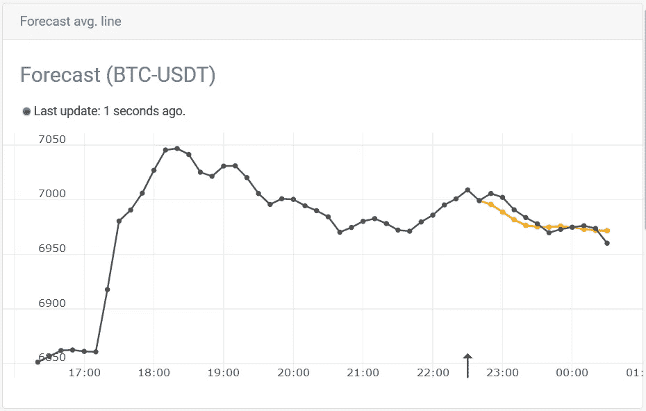

## 摘要

阅读博客文章的同时试图理解图表并不是获取好内容的最简单方式。综上所述，我已经生成了动画 gif，显示了上面讨论的每一步/间隔的预测。

**莱特币:**

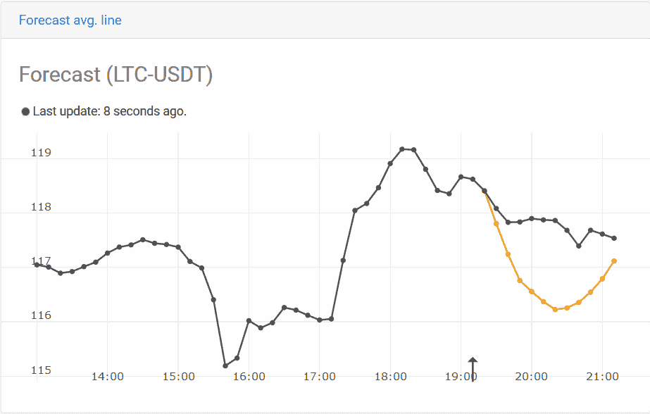

**以太坊:**

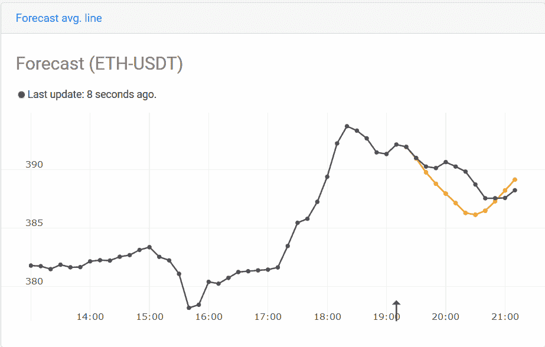

**比特币:**

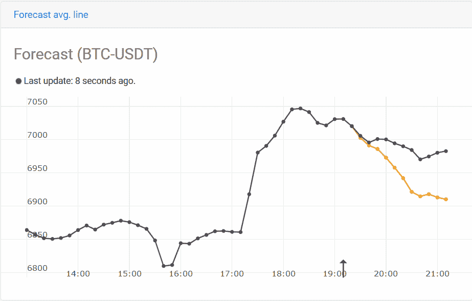

在上面所有的例子中，我们使用了 10 分钟的间隔，另外，我还用 60 分钟的蜡烛图生成了动画 gif:

**莱特币:**

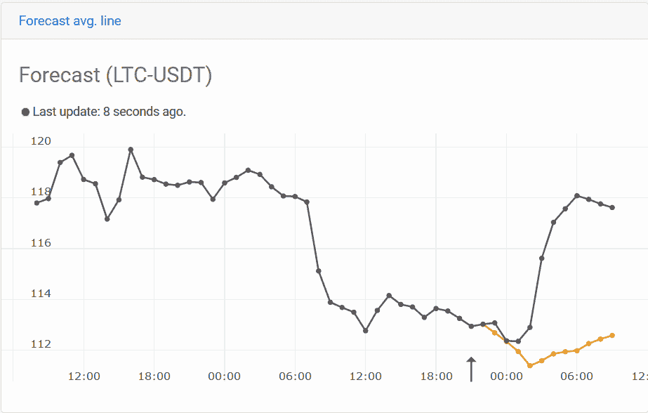

**以太坊:**

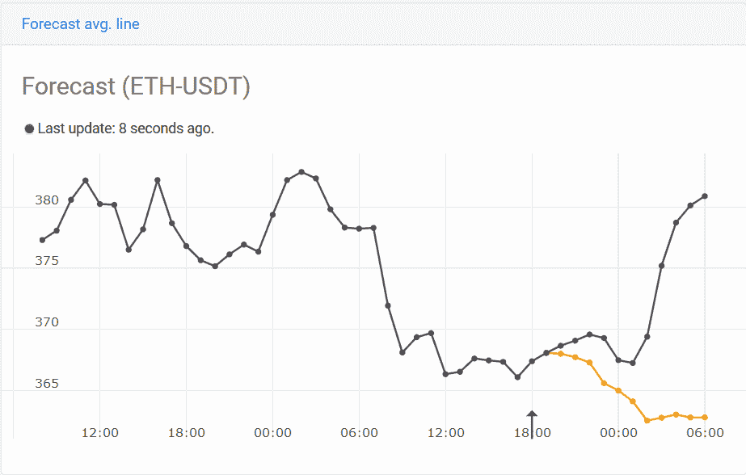

**比特币:**

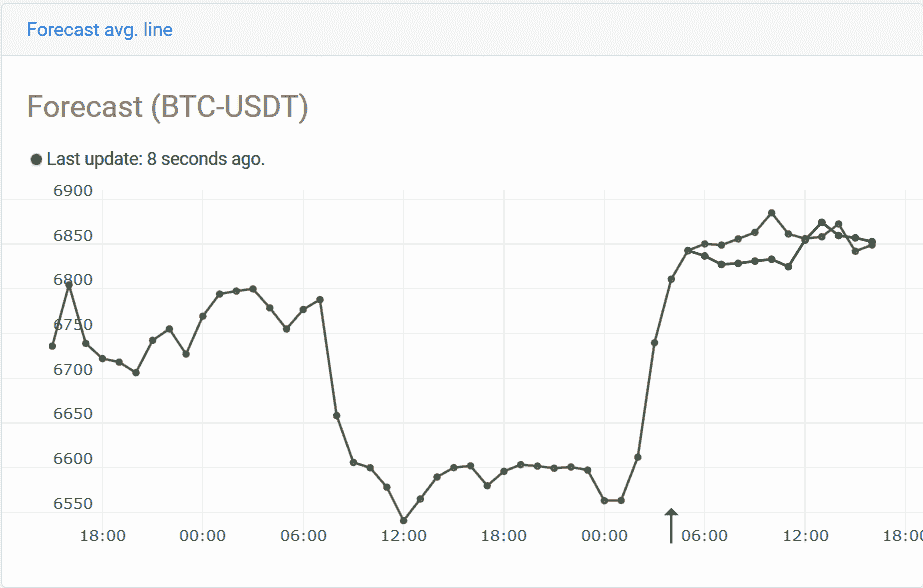

你注意到一些莱特币和以太币的预测有多准确了吗？然后试着将它们与比特币的预测进行比较。在我看来，ETH 和 LTC 预测(以 1 小时为间隔)比 BTC 预测要准确得多。然而，这并不是一个经过统计证明/验证的陈述，我们只是分析了一个大型数据集的一小部分。

# 最后的话

这些经过数据训练的人工智能系统相当复杂。它们就像一个黑匣子，我们向里面输入数据，然后它吐出“一些东西”。在某些情况下，输出是惊人的准确，而在其他情况下，它是远远偏离。但最重要的因素是，系统在不断学习，它也能够非常快速地适应/调整自己——即，在它“改变主意”之前，它不需要多次迭代。

最棘手的部分是，我们如何将这些预测应用到实际交易中？这是一个我们正在不断努力并取得可观进展的课题。敬请期待下一集。

感谢您的阅读，祝您有美好的一天！:)
——伊利亚·内沃林

## 这个故事发表在 [The Startup](https://medium.com/swlh) 上，这是 Medium 最大的创业刊物，拥有 314，551+人关注。

## 在这里订阅接收[我们的头条新闻](http://growthsupply.com/the-startup-newsletter/)。

