# 预测比特币的短期价格

> 原文：<https://medium.com/swlh/forecasting-bitcoin-prices-in-the-short-term-f52deec61b97>

在这篇文章中，我将揭示我们如何使用人工智能的一些秘密，通过机器学习的方式，非常准确地预测比特币的短期价格。因为我们把短期指的是两个小时以内，所以我们能够做出相当准确的趋势预测。然而，我们对未来的预测越深入，我们得到的结果就越不准确。由于加密空间非常不稳定且高度不可预测，短期预测仍然是我们最现实的方法。

在我之前的帖子中，我已经解释并解决了我们的一些缺点。从今天起，我将不再使用不同交易所的综合平均价格，而是使用一个特定交易所的真实价格数据，如果进行任何回溯测试，那么它将始终包含交易费用，除非另有明确说明。

## 目标

我们知道一个事实，一些投资公司在研发上投入巨资来开发**基于人工智能的交易算法**和模型。我们也知道他们通过这样做来获利，否则他们不会这样做。这也意味着更小的组织(像我们这样的)也可以这样做，但是规模更小，更可控。

几个月来，我们一直在开发机器学习系统来预测加密货币的价格和趋势。正如你在以前的帖子中看到的，我们努力的结果已经令人大开眼界。但是最近以来，我们更进一步，改进了我们的系统，你将在下面读到。

## 比特币的短期预测

下面是两张截图，展示了我们当前的预测结果。在这些图表上，深黑线是历史价格；灰线是实际的未来价格，我们知道这个未来价格，因为我正在看两个小时前生成的结果。红色/绿色/橙色线是预测的总结。由于我们生成了大量的预测，我们只想看到其中的一小部分，所以我们只显示最乐观的、悲观的和平均的预测。

这两个图表描绘了未来 8 个区间的价格预测，每个区间为 10 分钟。这是未来的 1 小时 20 分钟(80 分钟):

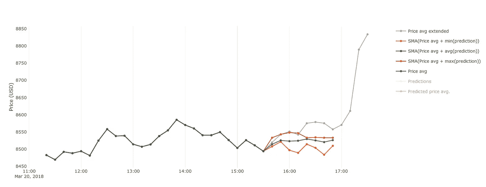

Prediction results 1

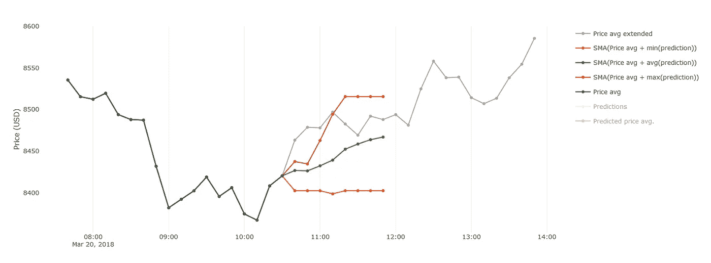

Prediction results 2

重要的是要记住，这些预测的绝对值没有它们的总体趋势重要。这些预测是由复杂的数学模型生成的，因此其绝对值可能会偏离现实。然而，我们用这些作为工具来预测价格是上涨、下跌还是保持不变。回到我们最初的评论，预测的绝对值更不重要的原因是，价格是所有主要交易所的汇总平均值，预测并不针对某个特定的交易所。

> 顺便说一句——我经常被读者问及这些预测是否过度拟合，答案是没有。我们的神经网络系统最初在大型数据集上训练，从那时起，它使用来自先前间隔(例如，过去 10 分钟)的数据来重新训练神经网络，并对接下来的 8 个间隔进行这些预测。因此，我们从不在已经用于训练的日期范围内生成预测，否则这将不再被视为“预测”。

从上面的两张截图来看，预测似乎相当准确，而且在很多情况下确实如此。但在某些情况下并非如此。看看下一张图，那里的预测偏差很大。乐观的预测显示价格呈指数上升，平均价格看起来更接近正弦曲线，悲观的预测显示价格会大幅下跌，之后会强劲反弹。对我们人类来说，这些预测看起来非常反常，但对系统来说，它们没有什么不同，所以为了改进或过滤它们，我们需要更好地理解人工智能是如何工作的。除非我们完全理解它为什么做出这样的预测，否则我们无法改进它们——学习人工智能如何做决定需要另一个人工智能组件来完成这一任务，这仍然是一项正在进行的工作。

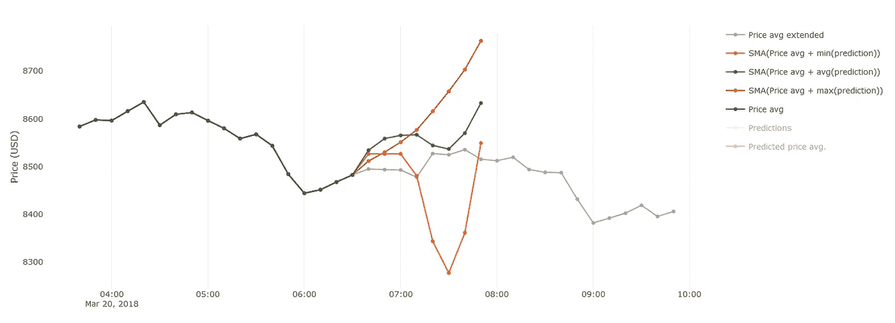

Prediction results 3

## 现实的比特币预测

正如前面简单提到的，我们不再使用综合平均价格数据。相反，我们将关注一个(或多个)密码交换。在这个阶段，我们只是出于我们的目的使用币安交易所，我们与该公司没有任何关系。

大约一周前，我开始使用一分钟烛台作为我们神经网络的输入数据。最初，它没有产生任何有意义的结果，在努力了整整两天试图调整一大堆参数后，我只是把它放在一边，专注于我们项目的不同部分。

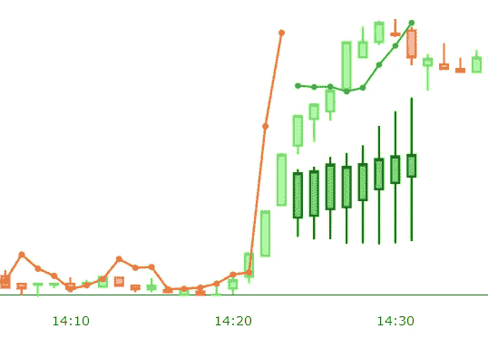

Initial candlestick predictions of 8 steps (1min intervals)

但后来我意识到，我是在试图用旧的思维方式解决问题。旧的思维模式是进行八次预测，这在聚合价格数据上产生了相当“好”的结果，但在使用 1 分钟蜡烛图的币安数据上不一定如此。所以我不得不重新设计这个小细节，我让它只预测一个，而不是 8 个。然后我也意识到，只有一个预测将是一场视觉灾难，它告诉我们的很少(从视觉角度来看)，因为我们只会看到一个点。为了应对这一点，我还确保系统包括以前做出的预测，现在我们实际上可以有一个图表(一条实线，有多个点)；这是我们可以分析并以实际价格为基准的东西。这种可视化预测的新方法如下图所示。

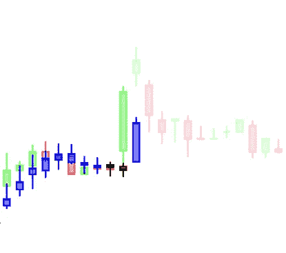

New predictions representation

在图像上有两个实际价格，实心的绿色/红色烛台是历史价格(这些被用作神经网络的输入)，而稍微褪色(不透明度降低)的绿色/红色烛台是未来价格-此屏幕截图是在未来价格已知的某个历史时间拍摄的，因此这些烛台是存在的(不透明度降低)。蓝/黑蜡烛图是对其各自的时间间隔所做的预测，仅给出该时间间隔之前的数据。因此，在本例中，最后一个大的“蓝色”烛台是前一个大的绿色“烛台”的结果。人工智能系统已经了解到前一个区间的价格大幅上涨，因此它预测下一个区间也将上涨(与之前的预测相比)。

这实际上取决于我们如何看待和表述它，一些人可能会说，如果我们使用绝对值，价格将会下降，而如果我们将预测作为趋势，那么它会告诉我们价格将会上涨。这两种观点/理论哪个更正确还有待检验(即回测)，这个问题实际上没有简单的答案。因此，目前来看，它将是趋势和绝对值两者的结合。这是上面的一个更完整的图像:

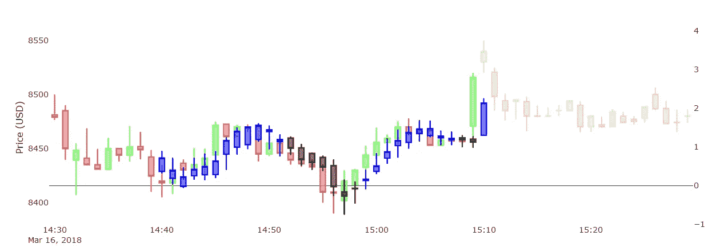

1-min interval predictions (1)

我们清楚地看到，与价格趋势相比，预测趋势是多么准确。这让我大开眼界，并让我继续深入研究。下面是以相同方式生成的另一个屏幕截图，相同的数据，但是参数和神经网络结构有很大不同:

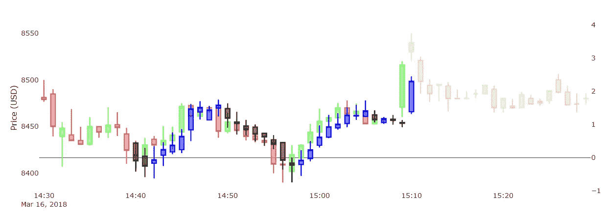

1-min interval predictions (2)

我们看到它的结果/预测与第一个非常相似。实际上，我更喜欢这个(乍一看)，因为它有更多的“黑色”烛台(即收盘价低于开盘价)。这一个看起来也稍微有点过拟合，因为它的绝对值似乎更接近。但是如前所述，这些预测区域没有被用作训练神经网络的输入，因此它们没有直接偏差，它们只是绝对意义上更准确的预测——考虑到这一点，系统进行这些单区间预测的效果令人惊讶。

你可能也注意到了，系统无法预测价格的大幅上涨/下跌，比如那个大的“绿色”烛台，系统无法预测。这些上涨通常是由于市场操纵(如内幕交易)或一群人决定在此期间购买大量 BTC——除非我们能够接触到这些群体，否则我们无法开发出预测这些情景的系统。但是我们确实看到我们的系统从这些异常中学习和适应，它学习在一个巨大的增加(或减少)之后要么是稳定，甚至更多的增长或突然下降。

这样做了之后，我进入了下一个层次，增加了间隔的大小。因此，让我们使用 5 分钟间隔蜡烛图来预测提前 5 分钟(在这种情况下仍然是单个间隔预测)，而不是预测提前 1 分钟。下面是两个截屏，包含不同神经网络在同一时期生成的预测:

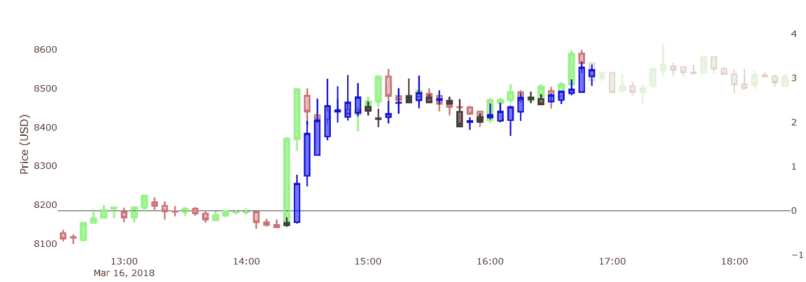

5-min interval predictions (1)

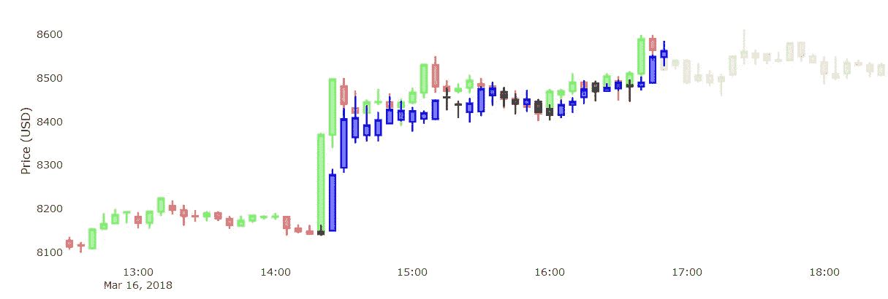

5-min interval predictions (2)

从上面的两个预测中，我们看到第一个看起来更平滑，但也不太准确。第二个更接近现实。然后，再次注意它对于检测异常是多么不准确，如前所述:

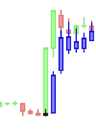

First prediction fails to predict the price spike

给定历史数据，没有指标，即系统无法知道价格会以极快的速度/极高的速度上涨(相对于之前的值)，如上所示。因此，对较大的“绿色”烛台的预测是一个微小的“黑色”烛台，表明价格将相对稳定，但它反而上升了(很多)。这再次证明了我们的观点，根据我们的数据，实际上不可能预测这种情况，但幸运的是，系统正在“学习”，并可以指示价格上涨后会发生什么，然后我们可以使用这些预测来决定是否买入/卖出/持有。

下面是另一个 5 分钟间隔预测的例子，这次我使用了另一组参数和数据集大小。请注意这些预测的形状/趋势与之前的预测有何不同。

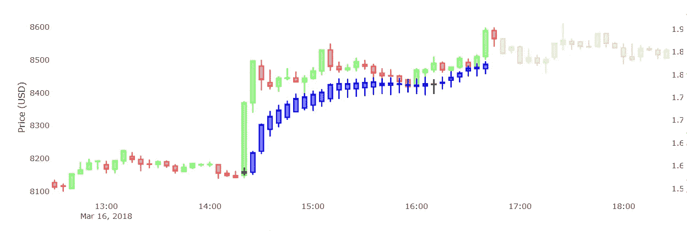

5-min interval predictions (3)

如果我们能用 5 分钟的蜡烛图做出相当“好”的预测，为什么不能用 10 分钟的蜡烛图呢？这就是为什么我做了下一步，看看这些会有多准确，这是其中一个结果:

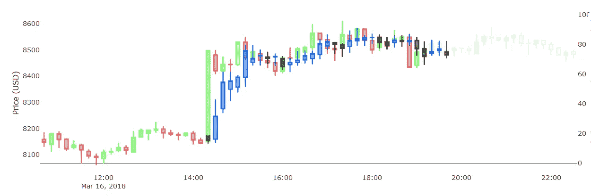

10-min interval predictions (1)

我们清楚地看到，与 5 分钟预测相比，10 分钟预测的准确性略低，主要趋势仍在，但仍无法预测大幅上涨/下跌，如前所述。我没有进一步预测 20、30、60……分钟的间隔，只是因为我把注意力转移到了下一件重要的事情上。

还记得我在本章一开始解释了我是如何从 8 步预测发展到单步预测的吗？这个决定并不支持我的实验，事实上，如果我们只看第一个预测，八步预测并不比一步预测更准确。但令人困惑的部分是其他 7 个预测，因为这些预测通常与实际的未来相差很大，这使得结果显得非常不准确。问题是，每一个新的预测都比前一个预测更不精确。当我从单步预测转向三步预测时，我意识到了这一点:

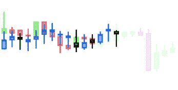

Predicting 3 steps ahead (1)

我意识到提前 3 步预测看起来相当准确，至少比 8 步预测更准确。但话说回来，情况并不总是这样:

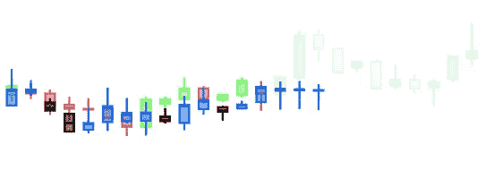

Predicting 3 steps ahead (2)

至少在我们的系统中，通过使用先前做出的预测作为新的输入来进行多步预测。如果上一个预测不准确，那么下一个也不会准确(在大多数情况下)。这背后的原因是，每个预测都有一个误差百分比%，这个误差值在每个新的预测步骤中呈指数增长。

## 更深层次的神经网络

通常来说，神经网络的深度/大小可以改善(或降低)结果。到目前为止，我一直在使用非常浅的神经网络，只有一两个隐藏层，每层只有少量的神经元。但是，如果我使用更深层次的神经网络，比如三到六个隐藏层，结果会是什么样的呢？我不打算深入到更深层次的神经网络(DNNs)中去，只是因为结果太“深”了，在这一点上无法理解。然而，我想分享一些很酷的发现。在接下来的几个例子中，我训练了 DNNs，让它预测 16 步区间，希望能发现一些有趣的东西。

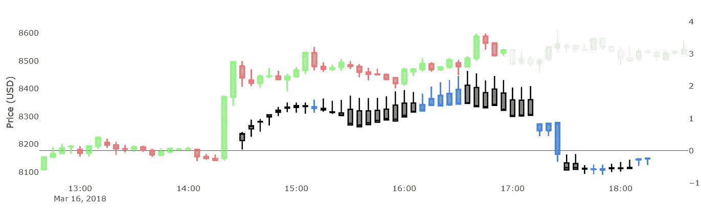

Predictions from a deeper neural network (1)

从我们的 DNNs 得到的大多数结果看起来比从浅层 NNs 得到的要平滑得多。但我也注意到，有时这些 DNNs 会产生非常令人惊讶和意想不到的结果。在上面的图表中，我们可以看到系统是如何预测价格在 17:00 中段下跌的。即使这样的事情没有发生现实，它仍然是一个迷人的异常现象。

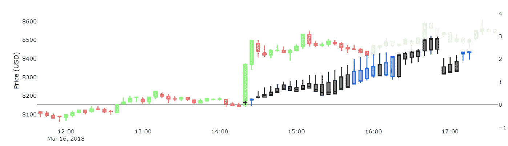

Predictions from a deeper neural network (2)

这是另一组预测，在某个时刻，系统预测价格以线性方式稳步上升，但在 17:00 之前不久，它显示价格下降。如果我们将此与价格在现实中的演变进行比较，我们会看到一些非常相似的事情发生。价格确实稳步上升，直到 16:40，然后下降到 17:15，然后再次短暂上涨。在某种程度上，这可以在预测中看到，但这是否是这些预测的真实含义还有待讨论。

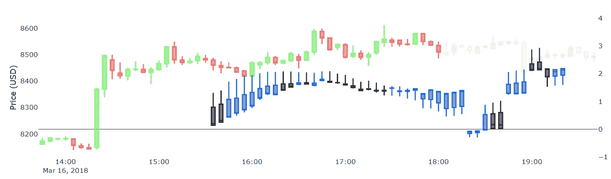

Predictions from a deeper neural network (3)

在上面的图表中，系统预计在 18:00 到 19:00 之间会有一个巨大的下跌。实际上，除了在 18:55，在这个范围内没有出现下降。

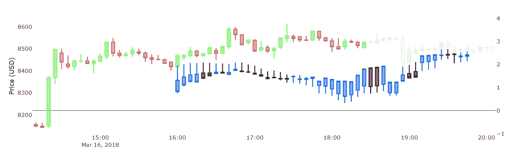

Predictions from a deeper neural network (4)

我按照先前的预测，几步后它仍然继续期待这一巨大的下降。但现在这种下降已经转移到接近 19:00。事实上，在 18:55 的时候，价格确实有所下降，随后稳步上升。因此，该系统是否真的预测到了这种下降还不清楚，但看到这一迹象绝对令人惊讶！

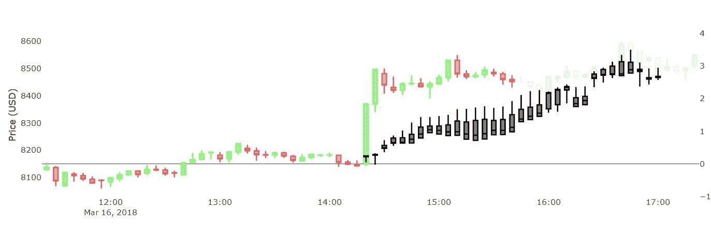

Predictions from a deeper neural network (5)

以上是另一个有趣的版本。在这种情况下，每个预测都是“黑色”(即红色烛台)。我无法解释为什么，但它似乎确实很好地预测了 16:00 到 17:00 之间的价格趋势。

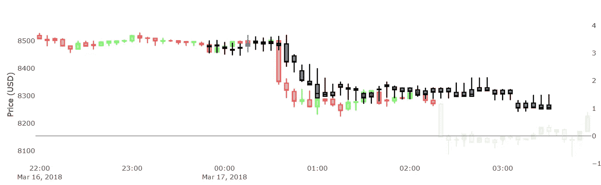

Predictions from a deeper neural network (6)

上图是一个系统没有预料到接下来(大约在 02:10)会有巨大跌幅的区域。

有时候有些 dnn 至少看起来很奇怪(如下图)。尽管它们看起来很奇怪，但它们可能包含人工智能系统试图告诉我们的有价值的信息。我们只是需要一种更好的方式来解释它的输出。

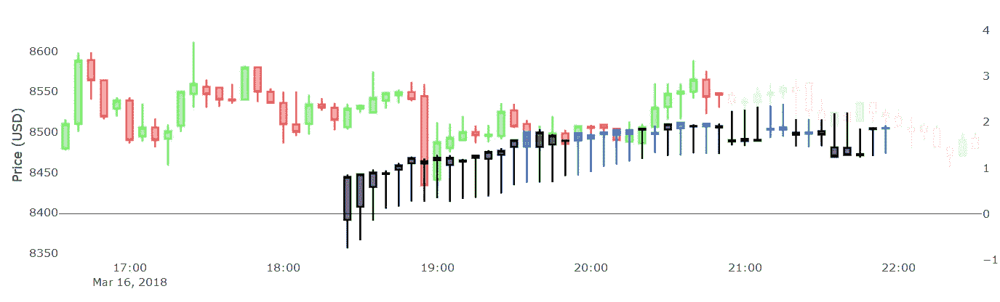

Predictions from a deeper neural network (7)

## 结论

我们已经知道有许多参数会影响预测的形状和价值。到目前为止，我们还没有弄清楚哪些参数是最好的——最终将没有一组确定的参数是“最好的”。原因是市场在不断变化，所以为了优化利润最大化，我们必须不断改变和优化所有这些参数。这就是我们当前的自动预测系统生成多幅预测图的原因之一，如简介中所述。为了验证哪些参数最适合某个时期(即某个市场状态)，我们需要一种好的方法来回测预测。

下一个重要的问题是，我们如何正确地使用这些预测作为投资模型和策略？我们如何利用预测产生交易信号(即买入/卖出/持有)？这些将一直是有待研究的问题，然而在下一篇文章中，我将会透露我们研究的一些部分。

**感谢您阅读**，敬请期待下次更新！
——伊利亚·内沃林