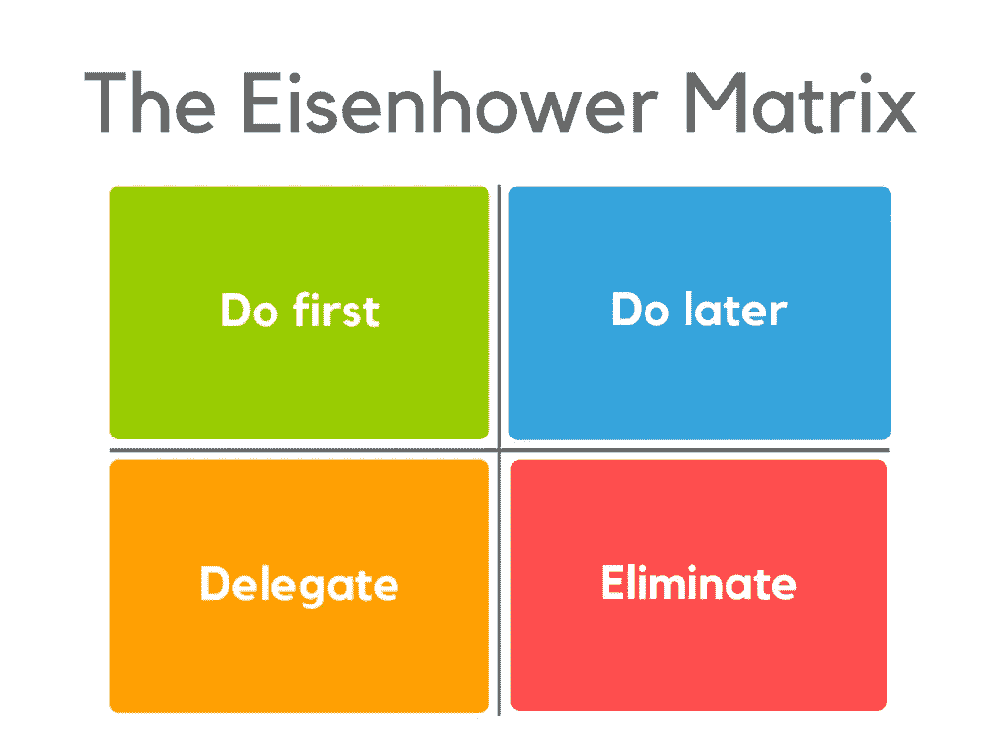

# 忘记所有其他的生产力黑客-艾森豪威尔矩阵是你所需要的！

> 原文：<https://medium.com/swlh/forget-all-other-productivity-hacks-the-eisenhower-matrix-is-all-you-need-a9e993961b08>

让我问你一个问题。

有多少次你坐下来完成一件事，问自己同一个问题:“今天我应该从哪里开始？”

无论你是学生、雇员还是企业家，我们都面临着同样的挑战。

列一张待办事项清单很容易，但知道如何以最有效的方式处理却不容易。

这就是你需要知道的唯一的生产力黑客——艾森豪威尔矩阵。

# 什么是艾森豪威尔矩阵？

艾森豪威尔矩阵的起源可以追溯到 20 世纪 60 年代。史蒂芬·柯维在他的书《高效能人士的 7 个习惯: [*中提到时间管理方法后，这种方法最近开始流行起来。*](https://www.amazon.com/gp/product/0743269519?ie=UTF8&tag=stucosuccess-20&linkCode=as2&camp=1789&creative=390957&creativeASIN=0743269519)

对于那些以前没有听说过艾森豪威尔矩阵的人，这里有一个快速概述。

## 历史

美国第 34 任总统德怀特·艾克·艾森豪威尔是黑客帝国的幕后黑手。在担任总统之前，艾森豪威尔是美国陆军的一名将军，也是二战期间盟军的最高指挥官。

他一生中所做的决定和他解决问题的方法使他以其无情的决策能力和富有成效的天性而闻名。

## 概观

艾森豪威尔的决策方法归结为两个简单的标准:紧迫性和重要性。

> "重要的事情很少是紧急的，紧急的事情也很少是重要的."

# 紧迫性与重要性

那么，这两个简单的标准如何帮助你变得更有效率呢？

通过评估每项任务的**重要性**，并将其与你完成任务的**时间**进行对比，你就可以将每项任务分为四类。

这些类别构成了艾森豪威尔矩阵的四个象限:**先做**，**后做**，**委派**和**淘汰**。

## 象限 1 —紧急和重要

第一象限中的任务帮助你实现目标。它们太重要了，不能委托出去，太紧急了，不能等到以后再忽视。

这些任务需要直接和立即的关注，你应该首先集中精力完成这些任务。

*例如，“制作销售报告”或“发送客户样品”。*

## 象限 2 —重要且不紧急

第二个象限是你以后可以做的任务。这些任务仍然重要，但不那么紧迫。一旦你完成了第一象限中的任务，你就可以继续这些了。它们也有助于你的目标，所以你应该自己完成它们。

*“最重要的一点是把你的大部分时间集中在“重要且不紧急”的象限。这是一个和平的地方，让你有能力做对你来说重要的事情，同时也给你足够的时间来完成它们。”——*[*朱莉·坎特*](http://jpkantor.com/the-eisenhower-decision-matrix-important-vs-urgent/)

*例如，“研究新的竞争对手公司”或“完成员工满意度调查”。*

## 象限 3 —不重要且紧急

你的代表象限是那些不太重要但仍然需要紧急关注的任务。在可能的情况下，你应该将这个象限中的任何任务委派出去。

朋友、家人、同学、同事、雇员……这些人都可以帮助你完成这个象限的任务。

*例如，“续保汽车保险”或“预订假日航班&酒店”。*

## 象限 4 —不重要&不紧急

第四个也是最后一个象限是消除象限。这里的任何任务都是我们所说的“浪费时间的活动”。它们对你的目标没有帮助，也不紧急。避免这些任务会帮你腾出更多的时间去做重要的事情。

*例如，“为约翰的婚礼挑选服装”或“续订杂志”。*

# 那么，为什么要使用艾森豪威尔矩阵呢？

人们很容易忽略真正重要的事情和仅仅是紧急的事情之间的区别。我们大多数人都陷入了先处理最紧急的任务的陷阱——而没有考虑它们是否重要。这经常导致我们忽视重要的任务。

这就是为什么艾森豪威尔矩阵不是传统的待办事项清单。它促使你质疑每一项任务，并决定它是否有助于你的目标。换句话说，这是一种基于价值的方法。

你投入到这项任务中的精力会让你离目标更近一步吗？

矩阵在帮助人们提高生产力方面如此成功的原因是因为它不断提醒你更大的图景。用一点眼光，你会发现你做的工作会变得更有意义。

# 如何使用矩阵

当把矩阵付诸实践时，你有两个选择。

1.  您可以手动尝试，或者
2.  你可以使用自动工具来帮助你

如果你想手动使用这个矩阵，你应该列出你花了大部分时间的任务。然后，将他们分配到矩阵中您认为合适的象限。按照上面指定的顺序完成任务。

如果你想让自己的生活轻松一点，为什么不试试像我们这样的平台呢？有了 [eisedo](http://www.eisedo.com/) ，你只需添加你的任务，我们会为你做艰苦的工作。您的任务将自动按优先顺序排列到矩阵的象限中，并在您完成任务时进行更新。

总结一下，这就是艾森豪威尔矩阵击败所有其他生产力黑客的原因！

*   它促使你质疑一项任务的价值
*   它帮助你聪明地工作，而不仅仅是努力工作
*   你的工作会更有意义，效率也会更高
*   你的生产力将会飙升！

所以你有它。一个聪明的生产力黑客将为你提供**真正的**结果。试一试，看看你变得更有效率了！

您以前用过艾森豪威尔矩阵吗？请在下面的评论区分享你的想法或问题。

*原载于 2017 年 9 月 20 日*[*www.eisedo.com*](https://www.eisedo.com/blog/forget-other-productivity-hacks-the-eisenhower-matrix-is-all-you-need/)*。*

## 这个故事发表在 [The Startup](https://medium.com/swlh) 上，这是 Medium 针对企业家和初创公司的领先出版物。

# 你可以订阅[在这里获取头条](http://growthsupply.com/the-startup-newsletter/)。

