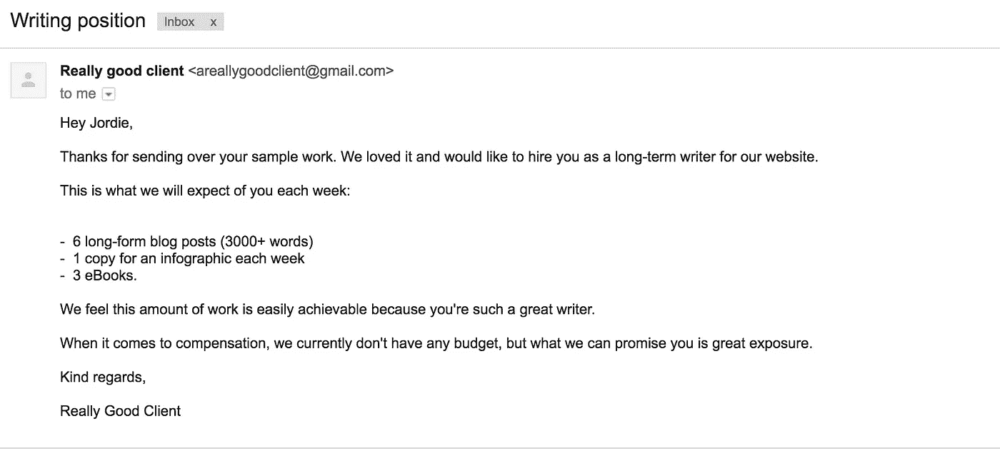
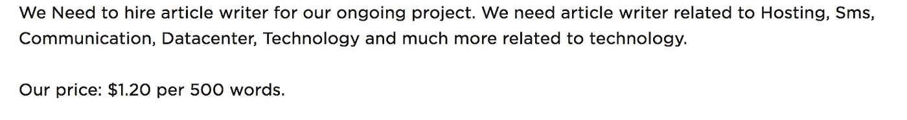

# 忘了比特币吧，我的写作收入来自曝光

> 原文：<https://medium.com/swlh/forget-bitcoin-i-make-my-writing-income-in-exposure-d8dabcca24a8>

最近，谈论加密货币的人越来越多。

Cryptocurrency

这一切都很好，实际上我自己也投资了一些加密货币，但这并不是我赚到亿万美元的地方。我选择的货币是:曝光。

今天我想给你讲一个故事。这是一个故事，详细描述了我用这种奇妙的货币获得报酬的过程，以及你如何也能获得报酬。

几年前的一个阳光明媚的日子，我申请了第一份写作工作。是为一家科技公司做的。我超级兴奋。由于之前没有任何经验，我为我为特定客户制作的内容类型创建了一个测试样本介绍和大纲。

他们很激动，然后是预算的话题。

我们有了如下的对话。

I hope by this point you realise this post is satire….

没有预算。那好吧。但是大量的曝光…那一定很好，对吗？毕竟，我是一个默默无闻的作家，除了对技术的渴望之外，没有任何其他经验。

所以我接受了这个角色。就这样，我开始了在曝光中获得报酬的人生旅程。

# 现实

我很高兴地说，以前的故事是一个谬论。并没有真的发生。但最糟糕的是，这样的故事确实存在。有些公司确实试图在不提供任何报酬的情况下利用作家的才华。

还有一些公司觉得他们通过提供费用来帮作家的忙。除了费用看起来像这样:

你的眼睛没有欺骗你。这个客户实际上提出支付每 500 字 1.20 美元。

让我们看看这是如何工作的。

假设你的平均打字速度是每分钟 50 个单词，那么写这篇文章大约需要 10 分钟。

酪

这还不包括所需的研究时间、进行关键词研究的时间、获取图片的时间或编辑图片的时间。

没有人第一次就能写出完美的博文，尤其是每 500 字 1.2 美元的价格。

# 我对寻找作家的公司的建议

你需要付钱给你的作家。不要答应他们曝光。如果你的公司做得足够好，每个月都有成千上万的读者，那么你的公司做得足够好，可以付给作者一笔合理的费用。

尤其是如果你把内容作为吸引、转化和取悦顾客的一种方式，你的作者应该得到相应的报酬。和市场价格，如果不是更高的话。

写作是一项许多人花费数年时间磨练的技能。不要轻视他们，给他们一些低劣的合同，徒劳地借口说你在给他们某种“曝光”。

# 免费工作很重要

这并不是说你应该为你写的每一篇内容获得报酬。一点也不。有一些使用案例，为你所在行业的热门博客制作客座博文可以提高你的领域权威，让你成为行业专家。

然而，这些应该是临时的客人博客，而不是长期持续的工作。

*给那些正在考虑从事长期无薪工作的作家的一条信息……*

你应该做得更好。

有更好的客户。

不要低估自己。