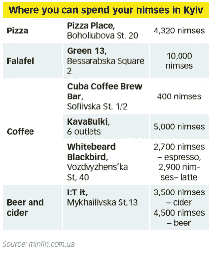
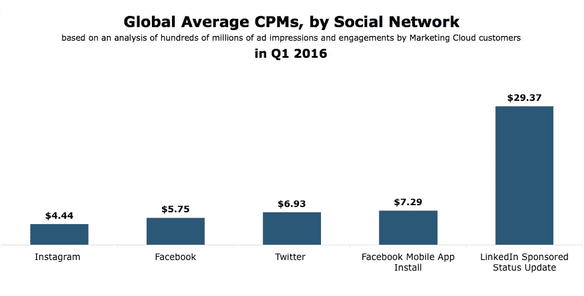

# 忘记比特币吧，我们的未来是没钱的

> 原文：<https://medium.com/swlh/forget-bitcoin-our-future-is-moneyless-b2d229accef3>

## 如果数据是新的石油，时间会是新的数据吗？

[Nimses turns your time into digital coins](https://www.facebook.com/nimses/)

2011 年上映的贾斯汀·汀布莱克的电影《时间中的*充其量是[平庸的](https://www.rottentomatoes.com/m/in_time/)。故事发生在 2169 年，描绘了一个可怕的未来，随着时间变成了金钱，富人实际上是不朽的。在科幻小说的最佳传统中，这部电影夸大了一个可能会变成明天世俗现实的想法，并使它看起来充满悬疑和启示。*

然而，《T4》杂志的前提既简单又激进:未来的交易单位不是美元或比特币。这是人类生命的一分钟。在我们对这个想法一笑置之之前，让我们首先承认金币对石器时代的部落来说是多么的荒谬，或者我们对中世纪商人的纸币的信任。

所有以前的货币都可以被聚集起来，但是人类的时间——至少现在——是有限的，而且是平均分配的。当然，有些变化是存在的，但是没有数量级的差异。

> 在数字原住民的世界里，社交排名是以关注者和“喜欢”来衡量的。

平均预期寿命为 72 岁，今天出生的每个人都被赋予了大约 3800 万分钟，我们可以随心所欲地度过我们的日常生活。我们还没有做的是用我们的时间来换取商品和服务——比如，出现在冰淇淋店，提供 175 分钟的圣代。也就是说，直到今年 6 月 1 日，一个名为 Nimses 的新社交网络[推出](https://www.kyivpost.com/technology/ukrainian-tech-startup-turns-online-time-digital-cash.html)，我们才能做到。

[Online Time as Digital Cash](https://www.kyivpost.com/technology/ukrainian-tech-startup-turns-online-time-digital-cash.html)

在 Nimses 的大本营乌克兰基辅，许多小贩会很乐意为你的 Nims——社交网络的货币——出售一杯咖啡或一片披萨。人生命中的每一分钟都变成了一个单独的 nim，一个独特的坚不可摧的数字记录单元。[nims es 网站](https://nimses.com/about)解释道。

在我们将它视为一种时尚或针对被驱逐者的小众社交网络之前，我们必须承认这家初创公司的病毒式增长，在其成立的头两个月就注册了近 400 万用户。这甚至发生在它在美国和西欧推出之前。

对我们大多数人来说，把时间作为交换单位，把时间作为实际货币的概念，要么是不可思议的，要么是令人不快的，或者两者兼而有之。但在这里，在我们喊狼来了，以道德或侵犯隐私为由要求关闭网络之前，我们必须审视今天的现实。

CPM 不是一个常用的术语，但对于营销专业人士来说，它听起来很熟悉——它代表每千次展示的*成本*我们花在社交网络上的每一分钟，花在互联网上的每一分钟都会产生印象，然后这些印象被这个世界的 Facebooks 和 Googles 货币化。在网络广告的背景下，虚拟世界和现实世界已经融为一体，变得不可分割。街角的咖啡店或花店愿意花辛苦赚来的现实世界的现金来换取网络印象。[数字存在](https://www.entrepreneur.com/article/230680)现在是大大小小企业的基本期望。

> 如果它的病毒式增长继续下去，这个开创性的社交网络将像谷歌一样颠覆脸书和美联储。

脸书在 2016 年创造了 276 亿美元，约翰·桑希尔在他为英国《金融时报》撰写的[专栏文章中非常聪明地提出，这家社交媒体巨头应该向每个人支付](https://www.ft.com/content/5103204e-7b5b-11e7-ab01-a13271d1ee9c)[基本收入](https://en.wikipedia.org/wiki/Basic_income)。他解释说，“*脸书拥有的最有价值的资产是用户在实际上卖给广告商之前免费提供的数据，而这些数据往往是用户无意中提供的。脸书从这一巨大的、有价值的、集体创造的资源中获利，并做出更大的社会贡献，这似乎是公平的桑希尔认为，其他数据驱动的企业，如谷歌、苹果和亚马逊，也可以做出贡献。*

Plainpalais square in Geneva, Switzerland | [Fabrice Coffrini/AFP via Getty Images](http://www.politico.eu/article/unconditional-basic-income-news-why-switzerlands-basic-income-idea-is-not-crazy-vote-referendum/)

尽管 Nimses 的逻辑可能看起来很奇怪，但我们已经通过中介将时间转换为美元，这家初创公司提供了一种捷径。用户可以更好地控制他们的时间，还是他们的数据？有什么不同吗？也许最重要的是供应商接受 Nims 作为合法的支付。

如果它的病毒式增长继续下去，这个开创性的社交网络将像谷歌一样颠覆脸书和美联储。这家公司是否成功无关紧要。这一概念的引入打开了后货币贸易体系——货币就是时间的人际关系体系——的潘多拉魔盒。

也许这些动态为我们提供了后经济社会组织的预览。如果人类的[未来确实是没有工作的](https://futurism.com/automation-may-lead-to-a-workless-future-for-humans-heres-how-we-can-cope/)，并且我们进入了[富足的时代](https://www.project-syndicate.org/commentary/economic-problems-age-of-abundance-by-j--bradford-delong-2016-01)，那么我们开始思考我们未来的*交换单位*将会是什么这个问题才是恰当的。

进化心理学认为，我们天生就会思考社会地位，知道自己相对于同龄人的地位。自从货币发明以来，经济上的成功一直是评估一个人地位的有用的衡量标准。然而:

> 可以想象后数据世界会准时运行吗？

当你在 Instagram 上点击“赞”时，当你在星巴克为一杯卡布奇诺付钱时，或者当你转发一个链接时，你会有什么感觉？尽管有交换的单位，我们使用我们所能支配的资源来认可和认可我们在这个世界上所重视的东西，无论是有形的还是虚拟的内容。在数字原住民的世界里，社会排名是以关注者和“喜欢”来衡量的，网络名人地位带来的金钱往往是事后才想到的。

[www.marketingcharts.com](http://www.marketingcharts.com/)

[威廉·吉布森](https://en.wikipedia.org/wiki/William_Gibson)有一句名言:“未来已经在这里了——只是分布不均匀而已”。或许，Nimses 的早期采用者已经体验到了，而我们其余的人正纠结于抵押贷款和退休储蓄。当洛克菲勒兄弟在钻探“黑金”时，他们很难预料到数据会在 21 世纪初被宣布为“新石油”。可以想象后数据世界会在*时间*运行吗？

你读过以下内容吗？

*   应对失业未来的 5 种方法
*   我们在快速前进。但是没有人知道我们要去哪里
*   二十一世纪的全球合作:是时候进行系统升级了吗？

*原载于* [*未来派*](https://futurism.com/author/andrewchakhoyan/)

## 这篇文章发表在《T8 创业》(The Startup)杂志上，这是 Medium 针对企业家和创业公司的领先出版物。

# 你可以订阅[在这里获取头条](http://growthsupply.com/the-startup-newsletter/)。

