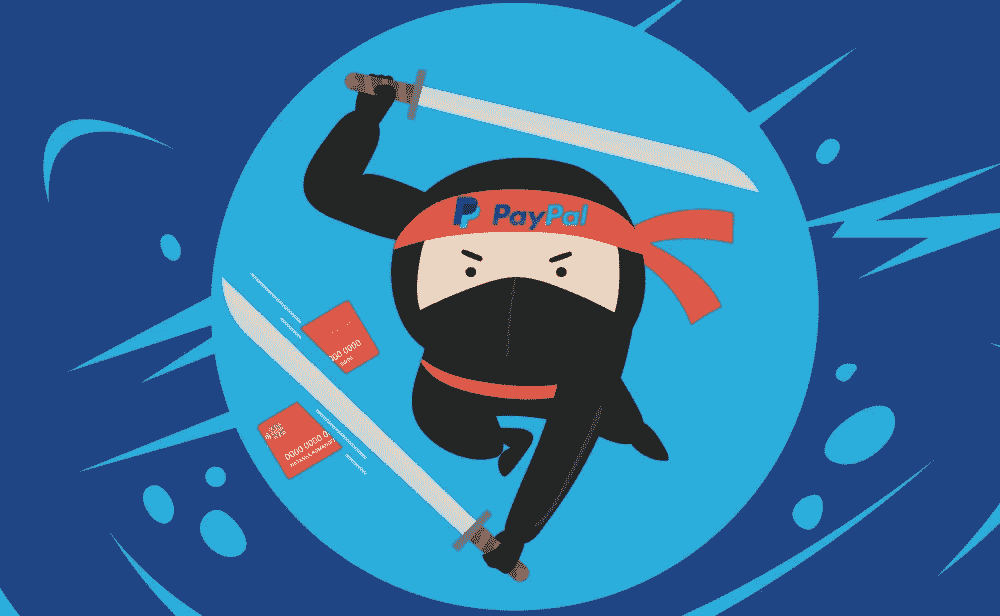

# Paypal 改变美国的规则

> 原文：<https://medium.com/swlh/forty-seven-paypal-a97ffecabf7>

美国有古老银行业遗产的绝佳范例，而在非洲，人们正在使用生物芯片卡和其他移动支付行业的最新功能，美国正顽固而缓慢地试图赶上这趟数字列车。

💰数字支付领域的世界资深人士 Paypal 宣布计划赞助三支球队:菲尼克斯太阳队、菲尼克斯水星队和西班牙足球队马洛卡皇家俱乐部。

凤凰城太阳队称之为史无前例的全球合作伙伴关系，建立的理念是通过金融创新提升球迷体验。

Paypal 的目标是彻底改造三个体育场，使所有服务的数字支付基础设施登上台面。

> “这不是改变消费者的行为；贝宝北美区总经理罗伯特·克拉克森说:“这是在他们所在的地方和他们想去的地方与他们见面。消费者已经在他们生活的某个方面经历了类似的事情，现在你让它在体育领域变得可行。"

虽然英国、加拿大和澳大利亚已经在期待非接触式支付解决方案，但在美国，尽管贝宝、谷歌和苹果做出了努力，信用卡仍然是市场的重要组成部分。

尽管移动支付在世界其他地区越来越受欢迎，但美国的增长仍然缓慢。

📊根据 eMarketer 和埃森哲的新研究，今年只有 25.3%的 14 岁及以上智能手机用户将使用移动支付进行销售点交易，比 2017 年增加了 14.5%。此外，尽管预计增长将持续到 2022 年，但不会很快。

Emarketer 进一步预测，2019 年智能手机人口将增长 12%，达到 27.4%，接下来的一年将增长 9%，达到 29.3%。(在千禧一代中，这一数字预计将从今年的 44.2%攀升至 2022 年的 56.7%。)

 [## 随着数字支付在美国的发展，银行和科技公司正在建立合作伙伴关系

### 上周，支付平台 PayPal 宣布计划赞助三支运动队——菲尼克斯太阳队、菲尼克斯…

www.adweek.com](https://www.adweek.com/digital/as-digital-payments-grow-in-the-u-s-banks-and-tech-companies-are-forging-partnerships/) 

## 这篇文章发表在[《创业](https://medium.com/swlh)》上，这是 Medium 最大的创业刊物，有+ 378，907 人关注。

## 订阅接收[我们的头条新闻](http://growthsupply.com/the-startup-newsletter/)。

