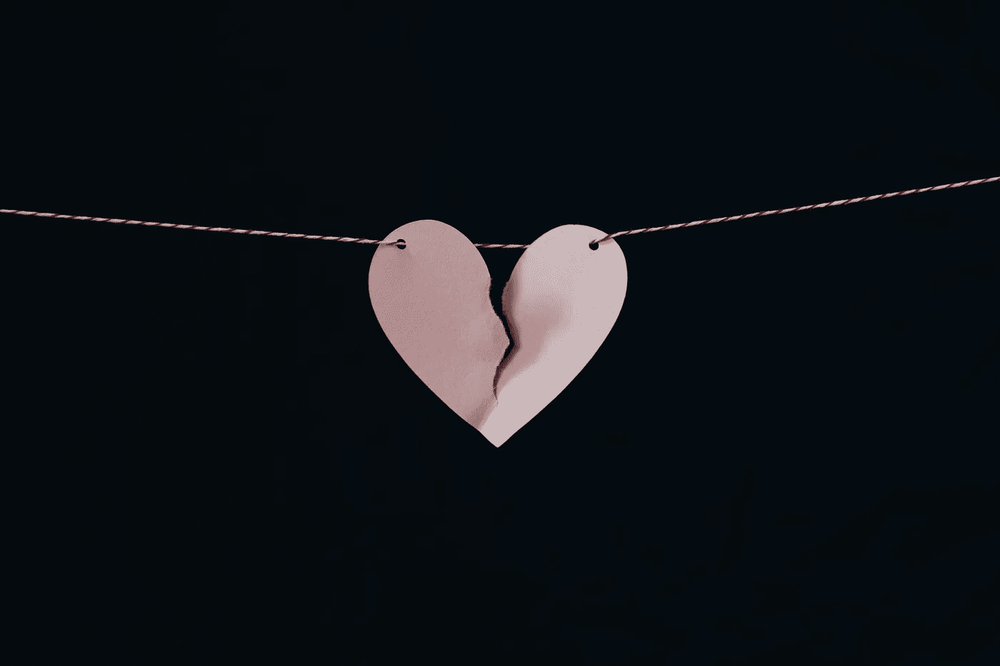
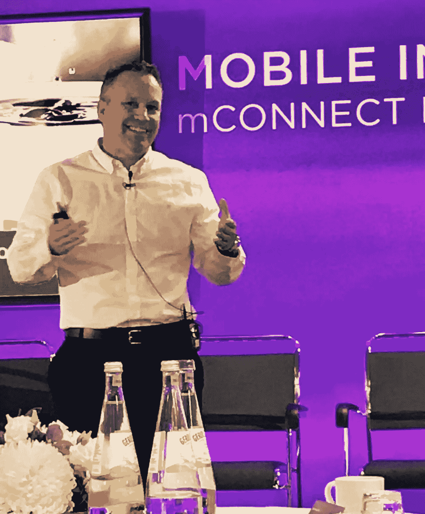

# 作为创始人如何生存

> 原文：<https://medium.com/swlh/founders-and-their-relationship-with-stress-ff141cdf6bff>

Photo by [Kelly Sikkema](https://unsplash.com/photos/E8H76nY1v6Q?utm_source=unsplash&utm_medium=referral&utm_content=creditCopyText) on [Unsplash](https://unsplash.com/search/photos/couple-with-a-broken-heart?utm_source=unsplash&utm_medium=referral&utm_content=creditCopyText)

> “对身体的负面情绪影响已被证明会导致心脏病和心脏病发作”
> 
> 《心脏:健康的历史》作者:Sandeeo Jauhar

作为一名企业家，“情绪影响”几乎每天都在发生。如果你不小心，压力会杀死你。它还会让你做一些非常奇怪的事情。你们中有多少创业者曾经听到过身边的人说，“你他妈的在想什么”？我听过的次数已经多到记不清了。

压力是生活的一部分，也是创造的一部分。我认为，大多数从外部观察的人没有意识到，在某种程度上，美国创始人实际上是在凭空制造压力。我们必须这么做。为了实现我们在这个世界上所追求的改变，我们不得不打破狗屎，激怒人们，有时制造混乱。

然而什么是压力呢？我们每个人处理压力的方式不同。我们每个人都习惯于某些规范。如果你已经无家可归，再次无家可归比第一次压力小。如果你获得了成功，然后又失去了它，同样的道理并不适用。我来解释一下；如果你一无所有，并且正在朝着某个目标努力，那么你不会得到某样东西的想法比你已经获得成功但即将失去它的想法压力要小。我基本上无家可归，但那只是开始。现在，这会让我抓狂，因为这意味着我失去了太多，对我来说，失去的想法比一开始就没有失去更可怕。这是让我永不放弃的原因。

出于几个原因，我回到了公司的融资模式。我们今年推出了如此多的客户端，我们实际上需要更多的基础架构来支持它们，这超出了我的预期。这是一个高质量的问题，但当你将许多客户发布与在其他国家开设两家新企业结合起来时，你会发现自己将资本视为真正需要的东西，而每当你“需要”某样东西时，它就变得更加难以获得。

这家公司是我第一家没有募集机构资金(VC)的公司。我独自开始，然后召集朋友。注意，我没有说“家人和朋友”。我家没有钱。我在相当贫困的中产阶级家庭中长大，我的兄弟姐妹们从未真正获得你所说的财富。就像上面那本书一样，我的兄弟姐妹们似乎走了一条压力更大的道路，最终导致他们变得不健康。一个哥哥死于毒品问题，一个姐姐中风了，还有其他问题，另一个哥哥是个十足的酒鬼。我的哥哥成功了，而且做得很好。有趣的是最大的和最小的是如何“出来”的。

回到我的公司；我们现在有 100 多个个人投资者，这是一个很大的管理问题。如果让我重来一遍，我会筹集机构资金。每季度处理一次太分散注意力了，但是，唉，我会用不同的方式做很多事情。我的目标永远是学习，不“后悔”。

所以，回到“压力”。正如我在上一篇文章中讨论的那样，筹集资金压力很大。给员工发工资，领导员工压力挺大的。众所周知，抚养孩子压力很大。经营企业虽然令人兴奋，但压力也很大。现在，你加上生活中的无形资产，压力就会不断增加。对他人负责的概念可能是压力最大的，我相信直到你对他人负责，你才完全理解压力有多大。

那么，我们如何应对压力呢？如果 Sandeeo 的结论是正确的，即基于研究，压力和情绪困扰实际上可以杀死你，然后呢？我们如何消除日常生活中的压力？我认为，在很大程度上，这是不可能的。

> “一旦这些事情平静下来，生活压力就会小一些。”

我经常听到这句话。我已经听了好几年了。它通常来自一个浪漫的伴侣，一个真正关心你每天都在做什么的人。这不是真的。大多数人不明白的是，如果你试图创造一些东西，压力是你生活的一部分，就像吃饭一样。本质上，你不能移除它，更不用说“管理它”了。

如果我们遇到这样一种情况，压力和情绪困扰是创始人生活中的一个常量，反过来，我们知道同样的困扰实际上可以杀死你，我们该怎么办？这是创始人自杀率上升的原因吗？我个人认识三个创始人，他们在过去的四年里结束了自己的生命。我告诉你，对于那些没有经历过的人来说，它会让你迷失自我。你甚至都不知道自己是谁了。你可以到达一个如此黑暗的地方，感觉你前面唯一的光就是迎面而来的火车。

Just another conference. Photo by someone.

去年，我发现自己在一天内处于三个时区，第二天醒来时却不知道自己身在何处。我确信我的工作量比某些人要轻得多，主要是因为我的业务已经成熟，但它仍然存在。

所以，回到“这段时间结束后”减轻压力的说法。今天早上，桌子对面的那个声音没有对任何人说，“我们需要想办法减轻你的压力”。我笑着说，那不可能。它可能永远不会发生，因为我一直在增加它。我们都是。创始人是被驱动的。我们继续前进，给我们的生活增加了层次，拼命想有所作为。我们不断追求“下一个”东西。

当然，这个声明是在这个人看着我的时候说的。我筋疲力尽了。我没有再睡觉，很累，出于某种疯狂的原因，我加入了她为期七天的“净化”,这在第三天似乎是一个可怕的想法，但嘿，让我们增加更多的压力。这份声明是出于关心，对此我永远感激。

> 这就是我处理压力的方式。我通过努力保持健康的生活方式来应对它，保持非常活跃和健康，努力让我的生活中有一个关心我的人。这并不容易。我来解释一下原因。

在任何时候，我通常都很疲惫。我精神疲惫，身体疲惫，因为我通常刚刚完成一次锻炼，或者我在处理日常生活中的琐事时情绪疲惫，或者业务正在拉动我的每一根弦。但是很难表现出来，所以你咽下去，带着一丝他妈的微笑向前走，试图打破更多的狗屎，帮助那些不值得的人。

事情是这样的。一直都是这样。不要同情我或者我这样的人，恰恰相反。所有这些都是一种选择。这是关键；我处理压力和情绪困扰的方式是记住我选择过这种生活。控制“压力”并让它成为我的选择这一小小的元素就是我减轻压力所需要的全部。

那么，当压力就像穿衣服一样成为你生活的一部分时，你该如何应对压力呢？很简单:

*   明白你选择了这样的生活方式。任何人都是如此。
*   我的生活中有关心我幸福的好人。你真正需要的是一个这样的人来让事情变得更好。我喜欢听到“你今天过得怎么样？”我想如果我的狗会说话，她会问我一天的所有事情，但遗憾的是，她只能用眼睛说话，我知道它们在说什么。“我能再要一份吗？”
*   记住，唯一能改变你生活的人是你自己。这是一个困难的问题。你很容易陷入困境，觉得自己是陷入困境的受害者，但你必须与之斗争。你必须改变并不断改变，直到你成为你想成为的人，你知道你是谁，并开始吸引你需要的人在这条道路上帮助你(见上文第二点)。

读桑迪欧的书强化了我已经经历过的事情；如果我不小心，那种压力会杀了我。我记得我生病时经历了几次困难时期，完全是因为压力。一次是在我的一家公司里，我参与了 CEO 的更换。我必须找到一位新的首席执行官，作为我创办的一家与收据广告相关的公司的资金承诺的一部分，因为天使集团投资的杰出智囊团认为，拥有一位更有经验的首席执行官是一个好主意。那位首席执行官不仅把公司搞垮了，而且在这个过程中，她还得罪了很多努力工作的人。然而，这并不完全是她的错，就像一个有无限食物的动物，她吃了那么多，就像餐盘留给她的一样。这是董事会的错，尤其是董事长的错。有多少次投资者进来把一个创始人换成一个“更有经验”的 CEO，结果却失败了？每次看到故事的展开，我都感到惊讶。

另一次是我和一个有虐待倾向的人发生非职业关系的时候。有趣的是，现在我遇到的那么多认识我们的人都告诉我这个人对我有多虐待。直到我病得不能从沙发上起来，我才发现。

这两种情况对我和其他人来说都是教训。创始人承受着巨大的压力，我们有时会向其他人寻求帮助，而这些人并没有考虑到我们的最佳利益。也许到那时，当压力在你内心如此之深的时候，就很难根除了。

试图发展一家初创公司时的压力会对你产生非常奇怪的影响。多年来我亲身经历了这一切，我意识到必须有一种方法来管理它。经历它也让我意识到，当你把你的心交给某人或某事时，他们或它有实际的力量来结束你的生命，如果你让它发生的话。他们或它有能力让你心碎，正如他在书中所说，这已被证明会导致最终杀死你的情况。

作为一个创始人，我是唯一一个可以支撑我，让我感觉良好，让我走在积极道路上的人。作为一个创始人，我是唯一能管理我的压力的人，也是唯一能让我开心的人。我是通过让别人的行为在我内心制造和培养痛苦来学会这一点的，如果不加以控制，这些痛苦会杀了我。这就像问一个三个月没见的人，“嘿，你觉得我看起来瘦了吗？”他们能看出来，因为他们已经有一段时间没见到你了。你不可能每天都看到自己，也很难看到渐进的变化，不管是好是坏。这就是我们在业务中做季度报告和年度报告的原因，以了解我们的进步或不足。我怀疑这也是人们去看治疗师的原因，看他们是否有进步。

> 这就是生活有趣的地方。人们可以让你悲伤，受伤，生病和生气，但你是唯一一个能让“你”真正快乐的人。

现在让我开心的都是小事。我的狗，一个我关心的人的微笑，积极地和我的公司踢屁股。今天，我飞了很远的路去做投资者报告，你知道吗？我他妈的搞定了。至少一个晚上没有压力！

## 这篇文章发表在[《创业](https://medium.com/swlh)》上，这是 Medium 最大的创业刊物，拥有+ 372，390 名读者。

## 订阅接收[我们的头条新闻](http://growthsupply.com/the-startup-newsletter/)。

