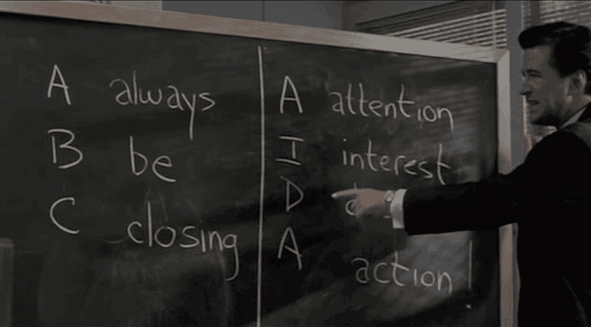

# 创始人的第一条规则:出售

> 原文：<https://medium.com/swlh/founders-first-rule-sell-e600e063b469>

Credit — Gengarry Glen Ross: We won’t go as far as being sales douches, but you need to close investors, customers, and partners.

你可能会感到惊讶——尤其是在今天以构建为中心的创业世界中——事实上，能够创造并不是一个伟大企业家的标志性品质。在你去拿干草叉和火把把我烧死在火刑柱上之前，请保持开放的心态，听我说完。

如今，对于能够快速制造出原型的工程师来说，到处都是爱，这也是理所当然的。因为没有…