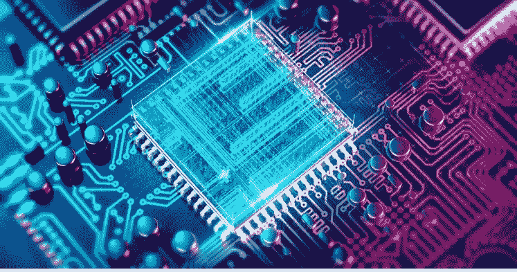
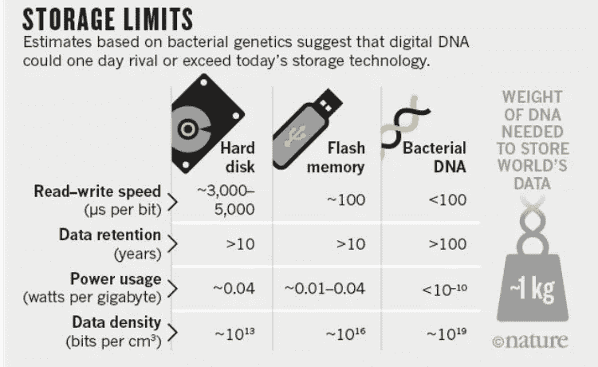
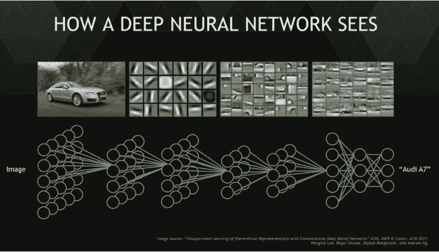
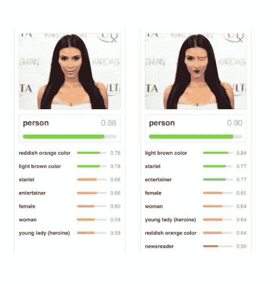

# 通用人工智能的四个组成部分

> 原文：<https://medium.com/swlh/four-building-blocks-for-a-general-ai-ced60464dbc2>

> 任何理论都是从一系列问题开始的；有没有一个问题可以帮助指导如何构建一个通用的人工智能？

他的我的假设是，这 4 个积木能一起帮助塑造人工智能的下一个阶段吗？

每一个的时间线几乎是不可能预测的…我试着为每一个展示一两个例子，你可以用它们作为数据点来做出你自己的判断。

# 四个构建模块:

1.  计算方法
2.  信息存储
3.  脑机接口
4.  数学和算法

# 计算方法

> 当前阻止我们允许计算机从二进制连接走向无限连接的限制是什么？

1)材料——硅和周期表左侧元素的结构允许自由流动的电子或特定连接形成，如盐 NaCl。

2)神经元——人类大脑的信息是通过大量的神经元传递的。随着你的学习，新的路径可以形成，连接也可以改善——数学神经网络已经从这里开始了，但是这些网络是如何增长或形成新的连接或与其他网络的互连的呢？如何在计算机界面上模拟人的水性状态

3)信息状态的类型——目前计算机以二进制(0，1)格式处理信息——量子计算中的量子位试图改善这一点；允许系统同时叠加 0/1 态和 0 或 1 态；这能应用于比金属更灵活的环境吗

# 信息存储

> 如果我们能像人脑一样计算，我们如何以有效的方式存储和访问世界上的信息呢？也许是 DNA

2017 年 3 月，哥伦比亚大学和纽约基因组中心的 Yaniv Erlich 博士和 Dina Zielinski 发表了一种称为 DNA Fountain 的方法，可以从每克 DNA 215 Pb 的密度中完美检索信息。(维基百科-https://en.m.wikipedia.org/wiki/DNA_digital_data_storage)

缺点是目前保存信息的成本为 7000 美元，检索信息的成本为 2000 美元——摩尔定律仍然适用吗？如果是这样的话，我们可以在 28.5 年内达到一个临界点，在我们的有生之年，达到每兆字节信息下载成本为 1 美分 0.01 美元的水平！

# 脑机接口

让我们想想计算机界面的发展——

20 世纪 50 年代，我们使用电路板背面的电线开关

20 世纪 60 年代有洞的卡片

20 世纪 70 年代键盘

80 年代一只老鼠

20 世纪 90 年代互联网能够在瞬间搜索信息

2000 年代的手机让我们随时随地获取信息

2010s 耳机、手表和语音界面说话更自然一点

2020 年……我们的大脑能和电脑无声交流吗？我们的想法变成了行动？这是来自麻省理工学院的一位主要研究人员的耳机——只有 20 个左右的单词，但是 QWERTY 键盘有 26 个字母，所以也许大脑接口需要的更少？

# 数学和算法

计算和我们大脑的核心是连接和数学——来自世界各地的领先研究人员都对神经网络的工作非常着迷，神经网络允许计算机以概率方法做出决定，而不是确定性的决定——这意味着计算机或系统可以决定它“认为”最好的选择应该是什么，而不是预先确定的规则。

credit: [https://www.sophos.com/lp/invincea.aspx](https://www.sophos.com/lp/invincea.aspx)

> 这里的挑战是，这些网络的大小仍然是固定的，并且是由人类设计的

数学领域的最新进展是一种叫做胶囊网络的东西——这让计算机能够更好地理解数据特征的位置，例如知道眼睛和耳朵在图像中相对于彼此的位置，而不是知道眼睛和耳朵在图像中。

[点击此处](https://hackernoon.com/what-is-a-capsnet-or-capsule-network-2bfbe48769cc?source=linkShare-2aff839e49dc-1524830509)获得更深入的解释。

Credit: [https://hackernoon.com/capsule-networks-are-shaking-up-ai-heres-how-to-use-them-c233a0971952](https://hackernoon.com/capsule-networks-are-shaking-up-ai-heres-how-to-use-them-c233a0971952)

最近的另一个进步是让网络根据定义的规则相互教学。这意味着，在人类为其设定好规则和坏规则的领域，系统可以学习和优化到杰出的水平——例如围棋(AlphaGo)或理解健康数据图像中的细微差别(AlphaZero)。

计算机正在成为我们的好助手，但是它们仍然需要我们的思想来做出好的决定。

我现在要结束的问题是:

> 一个信息网络如何在网络之间建立自己的连接，而不需要人类来决定什么应该出现，什么不应该出现？

## 这个故事发表在[的创业](https://medium.com/swlh)上，这是 Medium 最大的创业刊物，有 320，131+人关注。

## 订阅接收[我们的头条新闻](http://growthsupply.com/the-startup-newsletter/)。

