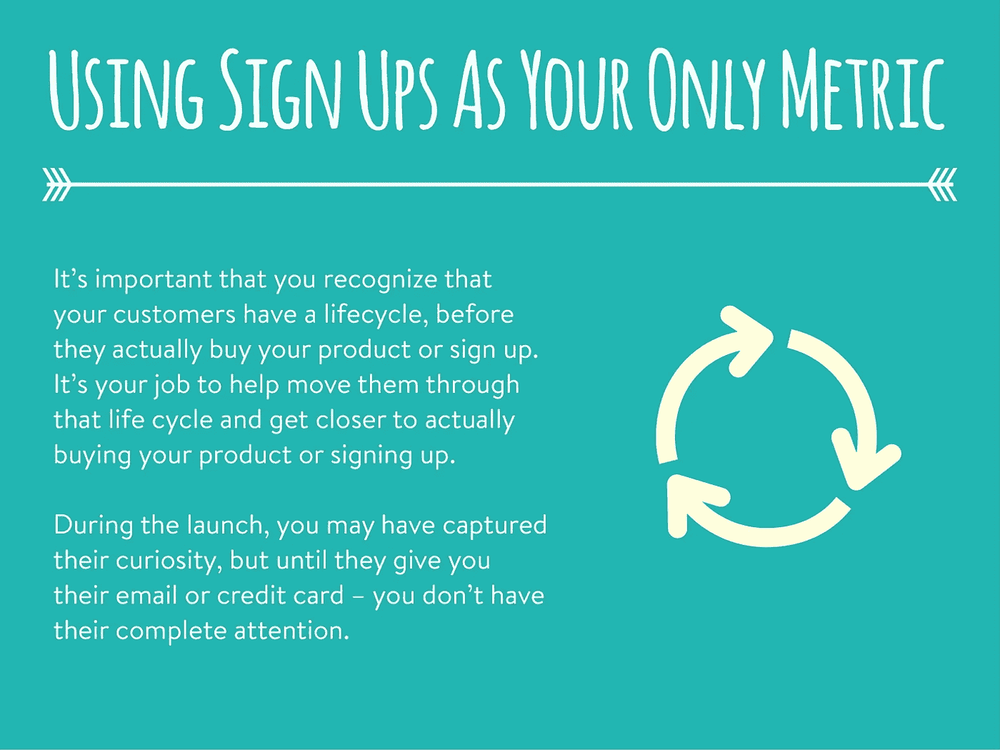
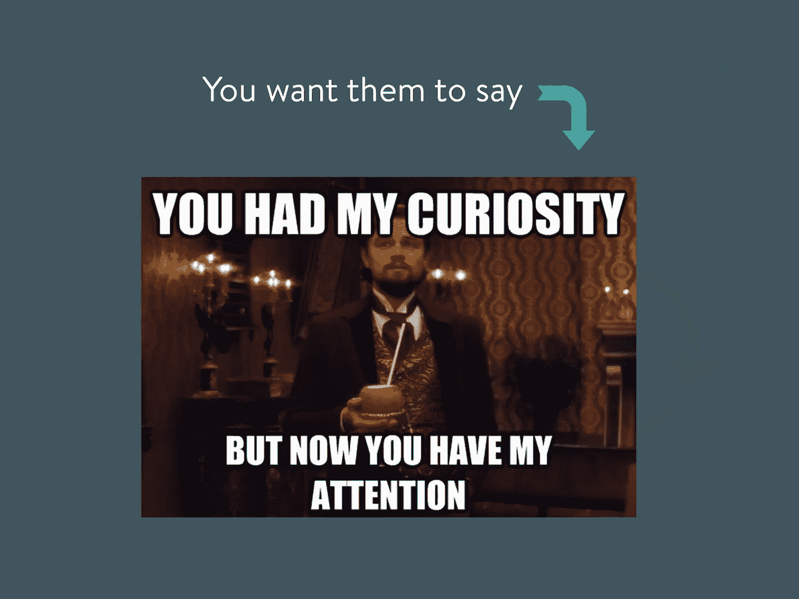
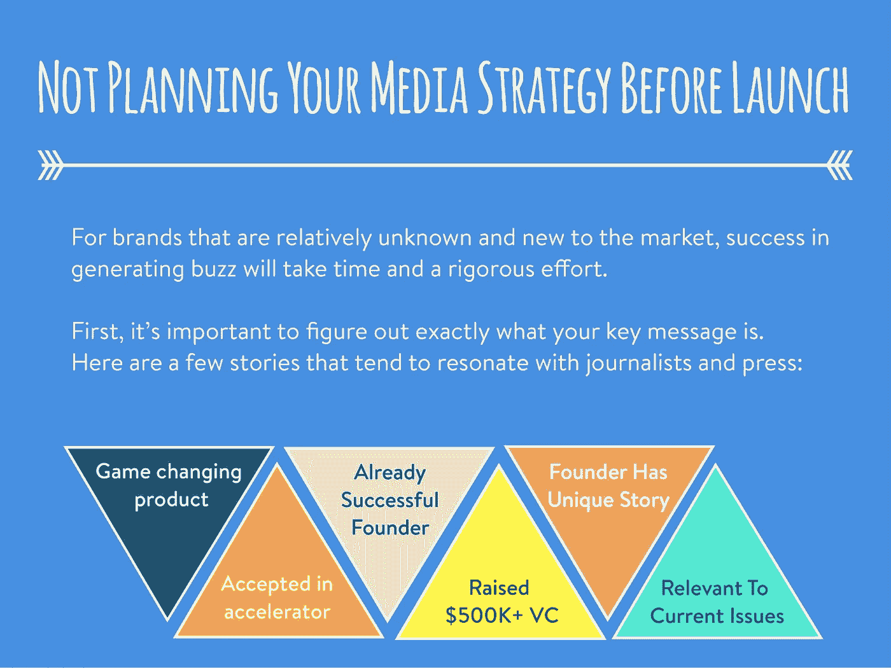

# 大多数创业公司在启动时会犯的四个致命错误

> 原文：<https://medium.com/swlh/four-deadly-mistakes-that-most-startups-make-when-they-launch-b8f557b2d9d1>

你有没有想过，为什么有些初创企业的启动是美好的，而有些却是彻底的灾难？会不会是创始人事先规划不够好的错？还是媒体没有正确定位他们的错？

事实上，四年前我也有同样的问题。

从那以后，我研究了许多创业公司的启动，也是其中的一员。有些发布会非常成功，有些则失败了。

我学到的是，并非所有的发射都是平等的。一些人比其他人得到更多的媒体..一些人比其他人获得更多的社交分享..有些人不得不从头开始。

以下是我对初创公司在尝试创业时会犯的 4 个致命错误的看法，以及一些有助于避免这些错误的想法:

想要更多这样的内容定期发布吗？

订阅我的简讯: [**更多线索+更多生活**](https://content.rosssimmonds.com/newsletter)

不确定如何使用产品搜索进行营销？

看看我在 Reddit 上分享的关于渠道的帖子[。](https://www.reddit.com/r/startups/comments/3tplnk/we_launched_on_product_hunt_heres_the_results/)

不确定如何使用 Reddit 进行营销？

查看我的 [Reddit 营销指南](https://content.rosssimmonds.com/redditguide)。

想了解更多？查看我的博客，在推特上关注我。

## 这篇文章发表在 [The Startup](https://medium.com/swlh) 上，这是 Medium 最大的创业刊物，拥有 336，210 多名读者。

## 在这里订阅接收[我们的头条新闻](http://growthsupply.com/the-startup-newsletter/)。

