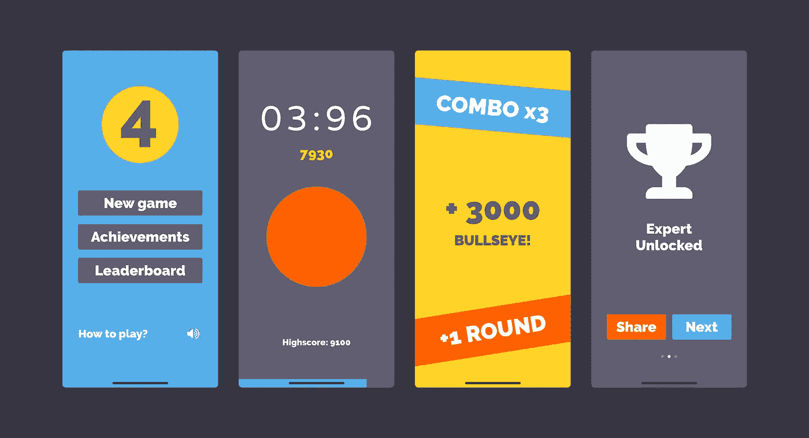
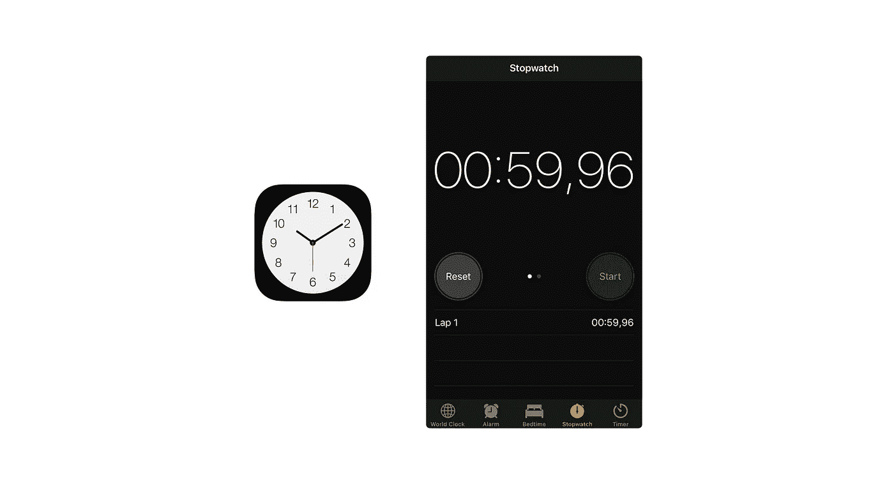
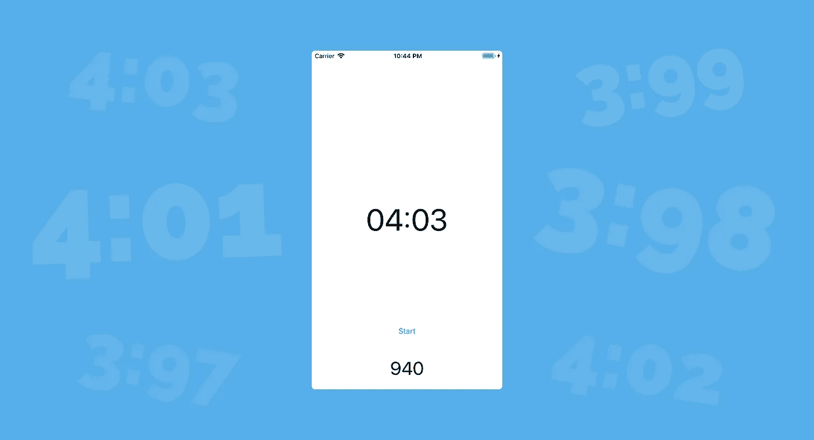
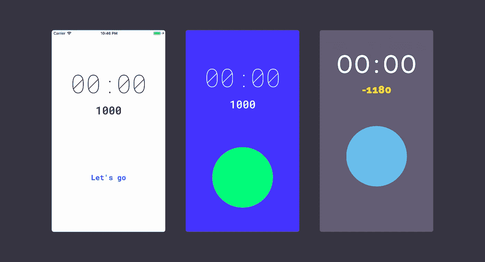
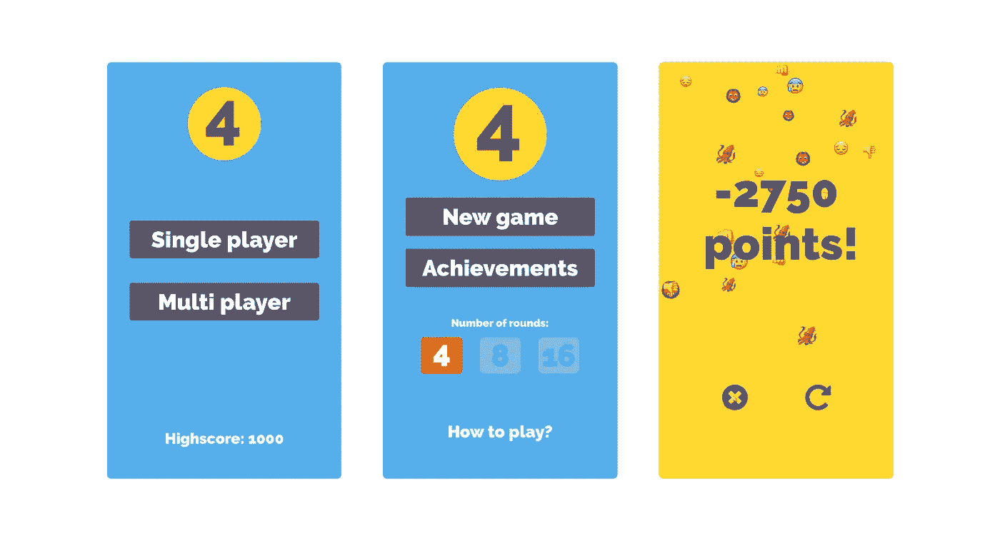

# 四秒——我如何发布第一款游戏的故事

> 原文：<https://medium.com/swlh/four-seconds-the-story-of-how-i-released-my-first-game-c0570ccf0b5e>

The first version published — some screen shots that I used for the App Store page

我有时去体育馆。不久前，在一个相当短的时间内，当我试图保持一个更严格的锻炼程序时，我用一个计时器来间隔和测量我的锻炼。我更喜欢使用 iOS 中时钟应用程序的内置秒表。一分钟是练习之间的默认间隔，我喜欢在进行下一个练习之前自己停止计时器。

The standard iOS stop watch from the Clock app

将计时器停在一个“round”值是我反复发现自己在做的一件事。例如，一分钟整，甚至不到百分之一秒的差别。有时候，即使第一个计时器用完了，我还是会启动第二个计时器，继续玩这个游戏，完全忘记了我应该做的练习。

一开始，准确的点击率是不可思议的，也是非常罕见的。我开始考虑一个基于成功和失败的分数系统，这导致了一个夏天晚上快速原型的建立。这个原型虽然光秃秃的，很粗糙，但基本上从一开始就抓住了核心机制。

The first version on a colorful background to compensate the roughness of the prototype

# 第一个原型

为了让游戏可以玩，我显然不能让人们等一分钟来停止计时器。所以我必须想出一个更容易管理的时间间隔——四秒钟！为什么是四秒？这个想法有点随意。较短的时间间隔感觉太短，较长的时间间隔感觉太长。

当你把计时器停在 4 秒钟的时候，你就赢得了分数，否则就会失去分数。另一种计分系统是总是获得分数，与你的反应速度成比例:越接近 4 秒，分数越多——但这并不令人兴奋，因为你总是“赢得”一些东西，尽管如果你不准确，分数会少一些。

至于奖励系统，当你击中目标时会得到 1000 点，因为 10 或 100 点对于这样的壮举来说太低了。我也不喜欢从 0 分开始的想法，因为你会经常冒险到 0 分以下，负的分数似乎有点令人不快。

与亲密的朋友分享它很有趣，因为我的开发者帐户在那个时候过期了，所以我不得不亲自分享我的手机给人们试用。自从我把手机给了他们 10 多分钟后，当我发现自己要求拿回手机时，我意识到这是有问题的。

# 无数次的迭代

回顾过去，这个项目的迭代过程绝对是一个有趣的案例研究。对于任何要解决的新功能或问题，最初的解决方案都是功能性的，但是非常粗糙和难看。接下来，我设法在很短的时间内完成了一个中间步骤，去掉了第一个版本的粗糙之处，并且在大多数情况下，与当前版本非常相似。

接下来是一个非常乏味的过程，需要进一步的实验，并获得正确的细节。主游戏屏幕从一开始就有大部分基本的 UI 和控件，尽管颜色和字体不是很令人愉快。

The first three design iterations for the main game screen. The third version is actually pretty similar to the current one.

你现在可能看不出来，但是在第一个版本的最终游戏界面中，我有一个表情符号喷泉试图描绘游戏的结果:😎 🙌 🙀 🏆 🥂 🍾 🥇❤️创造了一个新的最高记录，😔 😡 😰 👹 👻 👎 👊 🦑否则——是的，不知道章鱼为什么不能得到足够好的分数。

对于更多的考古趣闻，菜单屏幕上有一个多人游戏按钮，很长一段时间没有链接，最终被删除了。多人游戏功能仍然在路线图上，但它从最初的版本中被删除了，因为我取消了它的优先级，并专注于完成已经处于工作状态的内容。

有一件事我从一开始就很纠结，那就是每场比赛的回合数。这基本上可以归结为你达到四秒大关的尝试次数。我尝试了许多不同的选项，最初考虑了一个固定的圆形模式和一个无限的圆形模式。

无限游戏虽然在理论上很棒，但在实践中效果很差，因为从长远来看，玩家会倾向于相同的分数。你会错过几个回合的目标，并且偶尔击中靶心——这将使你回到你开始得分的地方。这个循环会在之后重复。

因为我不喜欢有一个单一的固定回合模式，我创造了三个固定回合模式:4 回合、8 回合和 16 回合。当你达到一定的高分阈值时，后两种模式将被解锁。这是一个典型的不先验证就构建东西的例子。整个游戏最终基本上依赖于这种机制，即使我不能保证它是功能性的或者能被人们理解。

One of the first menu variants, a version with round selection options and the infamous emoji fountain on the end game screen

果然，一旦我开始得到更多的反馈，我之前介绍的游戏回合开始攀升到投诉堆栈的顶部。人们不明白他们的目的是什么，更糟糕的是，我设置的高分门槛只适合一小部分用户。试图调整这一点，我发现几乎不可能解决一些解锁阈值，可以达到，同时保持对一个大的玩家池的挑战。

太低了，它不再具有挑战性，太高了，很大一部分玩家会因为无法解锁某个回合模式而沮丧。我找不到甜蜜的句号，所以我放弃了。我选定了五个回合，如果你打出连击，也就是说，如果你连续打出相同的成绩，就有可能赢得一个回合，这是一个朋友提出的好主意。

说到成就，我如何介绍了近四项成就的故事，以及靶心，也值得分享。我最初让计时器的滴答声根据计时器的值触发。回想起来，这并不是一个好主意，因为操作系统定时器的采样不准确，而且我得不到可靠的结果，除非我将定时器频率设置得非常低。这一点，再加上我将 3.998 秒视为 3.99 秒(我没有四舍五入到最接近的百分之一)的事实，严重影响了游戏的可玩性。

作为一项统计，一个靶心球员几乎击中四次 10 到 15 次。这产生了很多挫折，并最终导致了在 3:99 或 4:01 停止计时时也提供一些东西的建议。我后来发现了根本问题，但决定保留新增加的成就。目前，对于一个靶心，玩家在三到四次左右击中几乎四个，这是非常明智的，也不那么令人讨厌。

顺便说一下，在特定的时间间隔还有一个隐藏的复活节彩蛋成就。看谁先找到。

# 放时间

整个项目花了大约一年时间来制作。正如我之前所描述的，核心机制和基本 UI 的设置并不是很繁琐(他们花了大约一周的时间)——但是真正的困难在于细节(以及在验证想法之前假设它们)。再加上生活有时会妨碍我，我在业余时间做这个是一种爱好，整个时间跨度开始变得更加合理。

在有了一个经过测试并且令我满意的版本之后，我设法在 foursecondsgame.com 的[建立了一个非常基础的网站，并且花了四个月的时间制作了一个宣传视频(哈！)小时后的效果，这加强了我的信念，即 Adobe 产品是有目的地构建的，在 UI 和相互之间的交互方面有很大的不同。](http://foursecondsgame.com)

App Store 的审批过程对我来说是一个压力来源，但实际上非常顺利，我设法在提交后 24 小时内批准了应用程序。

# 未来计划

因为这是通常的情况，我有很多想法和可能的方向为这个项目存储。有了一些惨痛的教训，我会试着在优先化和反馈整合方面做得更彻底。

我现在的清单上有:

*   Apple Watch 版本，这样你就可以轻敲手腕上的计时器
*   多人游戏/挑战朋友
*   不同的主题。我实际上用不同的颜色选项测试了这个，它们看起来很可爱。想象一下，你可以向你的朋友吹嘘你独一无二的四秒主题。

差不多就是这样。我的第一篇媒体文章，关于我的第一个发布的应用——多好的生存时间。感谢您坚持到现在，请务必在这里查看四秒钟[，随时欢迎反馈。](https://itunes.apple.com/us/app/four-seconds/id1280965840?ls=1&mt=8)

 [## 四秒钟

### 你能击中靶心吗？有趣的 iOS 游戏，你必须停止计时器尽可能接近四秒。

foursecondsgame.com](https://foursecondsgame.com) 

## 这篇文章发表在[《创业](https://medium.com/swlh)》上，这是 Medium 最大的创业刊物，有+ 370，771 人关注。

## 订阅接收[我们的头条新闻](http://growthsupply.com/the-startup-newsletter/)。

