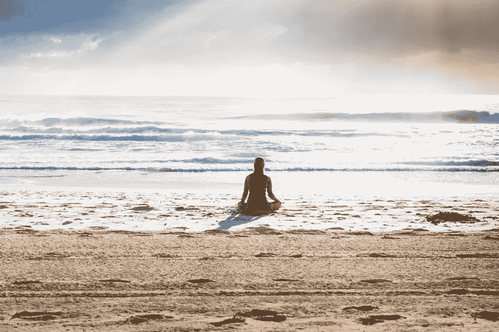

# 四句话可以改变你的整个心态

> 原文：<https://medium.com/swlh/four-sentences-that-can-shift-your-entire-mindset-d8cf8f39e6b0>

Unsplash.com

对四项协议的审查

在《四个协议》中，唐·米格尔·鲁伊斯揭示了剥夺我们快乐并制造不必要痛苦的自我限制信念的来源。这本书被吹捧为对[韦恩·戴尔](https://www.drwaynedyer.com/)、[狄巴克·乔布拉](https://www.deepakchopra.com/)甚至[汤姆·布拉迪](https://en.wikipedia.org/wiki/Tom_Brady)有益的精神资源。布雷迪说，书中的教训已经成为他人生的“咒语”如果这对汤姆来说足够好，那就很好…