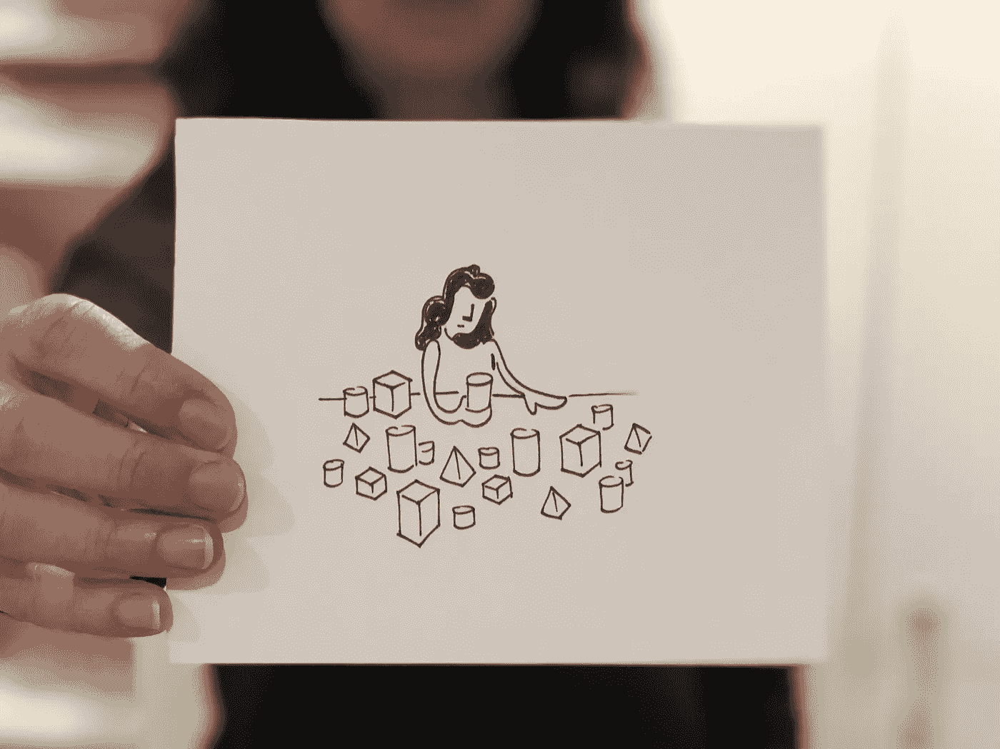
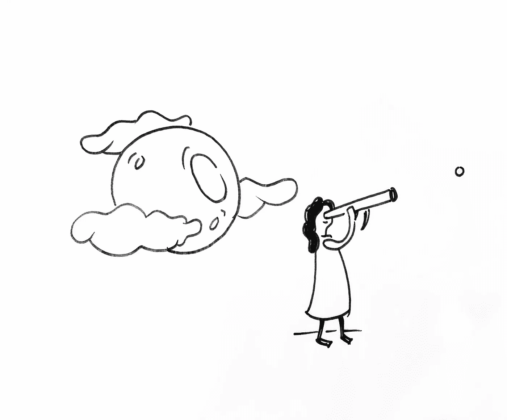
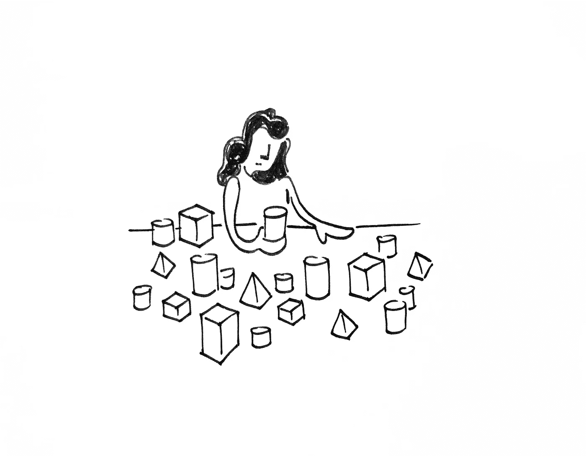
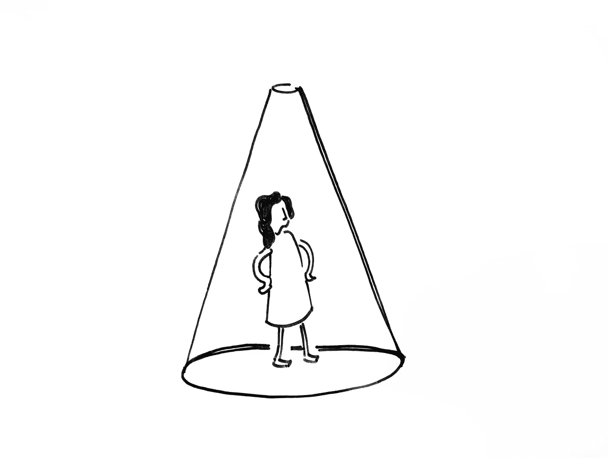

# 你可以(也应该)避免的四种失败

> 原文：<https://medium.com/swlh/four-types-of-failure-you-can-and-should-avoid-4a02faf261ea>

Four types of failure: Communication, Context, Complexity & Ego. All illustrations by Jonathan Dubin.

写失败总是让人不舒服。即使公司的标语宣称你应该“承担风险”和“快速失败”，实际上做失败的事情，而不仅仅是谈论它的优点，是完全糟糕的。

虽然失败是一位伟大的老师，但你不应该让自己失败来从错误中学习。应该有一套问题，你可以用它来最小化失败的风险。

为此，我找出了自己作为产品经理失败的地方，并把它们整齐地分为四类。在这篇文章中，我将给出一个个人失败的例子(作为一种纯粹的个人折磨)，并分享你可以问自己的问题，以避免这种类型的失败。

## #1 沟通失败

我有过几十次沟通失败的经历，但最突出的一次强调了当意想不到的事情发生时，沟通变得多么重要。这甚至适用于意料之外的事情应该相对良性的时候，比如波霸。

故事从我们将一个站点域从一个 url 迁移到另一个 URL 开始。从技术上来说，这是一个不小的问题，它要求网站停机至少 2 小时。支持团队精心制作了一封精美的电子邮件，让我们的用户确切地知道何时会收到这封邮件。我告诉我们的工程团队什么时候需要做。

但是后来，波霸发生了。更具体地说，我们的工程团队决定得到波霸，正如他们想要做的那样，而我没有说，正如我应该说的，“嘿，站点迁移计划在几分钟后开始。在我们完成这个重要的任务之后，我们去找波霸怎么样？我们已经告诉我们的用户，我们将在特定的时间做这件事。”

更糟糕的是，我没有告诉支持团队，迁移实际上可能比我们最初计划的要晚一些。结果是网站关闭的规定时间和实际时间不符，这对我们的用户来说是一次糟糕的经历。

这是非常尴尬的，很明显，你应该问自己避免这种情况的问题是:这是得到波霸的好时机吗？开玩笑的。

> 为了最大限度地减少沟通失败，问自己:我是否告诉了所有可能需要或想知道这种情况正在发生、改变或正在发生的人？

## #2 上下文失败

这要么是一个关于了解产品的完整生态系统如何改变决策矩阵的故事，要么是一个关于被新鲜事物吸引的警告。我会让你决定。

这是我在 Magoosh(一家在线备考公司)担任真正的产品经理时，做出的第一个产品决定之一。我必须做出的决定是:迭代一个新的框架或者迭代现状。

新的用户界面是在我开始之前开发的，是为了满足高中观众的需求而设计的。它看起来也很漂亮。旧的 UI 是 Magoosh 所有考试的站点结构，从研究生到本科生，它是旧的，但是稳定的。我推断，我的团队通过新的用户界面创造影响力会更成功，因为它从根本上支持一种新的思维方式，而维持现状就像将闪亮的想法嫁接到生锈的旧引擎上，效率会更低。

然而，在我兴奋地准备开始时，我错过了一个非常重要的上下文细节:新设计和内容支持的 SAT 考试在短短几个月内发生了变化，因此，对新框架的任何改进都将随着现有 SAT 考试的死亡而消失。这真是一个糟糕的时机，而且我对产品背景的理解也非常糟糕。(是的，SAT 每隔几年都会有变化，这让内容开发者、导师和学生的生活变得更具挑战性，无处不在)。

由于忽略了我做决定的环境，我最终迭代了一个很快就会被环境淘汰的框架。如果我早一点认识到这一点，我会产生稍微小一点的影响，这种影响会持续到未来，而不是更深，但只是暂时的影响。

> 为了避免上下文失败，问:这个产品或服务的未来会怎样？在接下来的 6 个月到一年内，计划进行哪些变革？现在生态系统是如何转变的？

## #3 复杂性的失败

产品和工程充斥着复杂性，所以这是一个不可避免的失败之处。以我的经验来看，当你在处理一个还没有完全开发好的技术基础设施时，复杂性会更加棘手。

不久前，我经历了复杂性的失败。在设想了一个扩大实验规模的方法后，我概述了一个多季度的计划，在我们的网站上增加 2000 多个高质量的页面，这些页面将专门针对我们拥有优秀内容的关键词。这是一个美丽的计划，但也有一些致命的缺陷:首先，它依赖于尚未完全实现的架构。用新的构建模块创造新的东西会给项目增加各种未知和复杂性。其次，该项目迭代了我们的目录，用户可以在目录中浏览、搜索和过滤内容。所有这些排列的组合必然导致令人眼花缭乱的状态变化和隐藏的边缘情况。

我的团队慢慢地被嵌入项目中的所有复杂性所麻痹，虽然我们能够启动计划的第一阶段，但它花费了我们更长的时间，并且比我们最初想象的要痛苦得多。这个项目最终耗费了我们的时间和士气。

复杂性可能很难提前看到，但是这种失败可以通过绘制流程状态图和依靠完全烘焙的而不是新鲜的架构来减轻。

> 为了减少与复杂性相关的失败，问自己:我对底层技术的了解是否足以让我对它有高度的信心？这里面有内在的复杂性吗？

## #4 自我的失败

我的自我，尽管我讨厌承认它的存在，却不顾周围人的警告，把我引上了一条危险的道路。

当时的情况是这样的:有一个我讨厌的功能，一个弹出窗口。我知道用户也讨厌它——我通过测试看到了这一点——我也知道弹出窗口对 SEO 来说很糟糕。更有甚者，92%的人对它们不屑一顾，使得它们几乎没有效果。我确信这个弹出式广告必须被删除。

唯一的问题是弹出窗口是我们如何提示用户注册我们的网站。在网站上停留 20 秒钟，或观看内容 3 分钟后，弹出窗口会占据屏幕，并要求用户创建一个帐户以继续。尽管体验并不好，但这仍然是我们获取用户邮件的最有效方式。

几个级别比我高的人非常明确地告诉我，不要触摸注册弹出窗口。然而，在我的自尊心的带领下，我决定至少在移动设备上摆脱它，在那里它是最令人讨厌的，当用户观看帮助他们决定是否购买的内容时。

6 个月后，对于现在注册的人来说，转而购买的人数确实增加了。删除攻击性弹出窗口至少是导致注册用户购买漏斗变大的因素之一。但是，这些转变并没有弥补高端注册用户的损失。我们可以发送电子邮件的客户数据库在缩小，我们的收入也在减少。重大失败。

在这种情况下，自我甚至妨碍了善意的工作。

> 为了平息渴望的自我，问自己:如果我错了，我会看到什么？

## 包装它

总的来说，在开始新的产品计划之前，你可以问自己一些问题，以最小化失败的风险。

*   我有没有告诉每一个可能需要或想要知道这是正在发生、改变或正在发生的情况的人？
*   这种产品或服务的未来会怎样？
*   在接下来的 6 个月到一年内，计划进行哪些变革？
*   现在生态系统是如何转变的？
*   我对底层技术的了解是否足以让我对它有高度的信心？
*   这其中有内在的复杂性吗？
*   如果我错了，我会看到什么？

请让我知道这些是否有帮助，如果您有其他指导问题可以帮助您规避风险，请在下面发表评论。我从失败中学到的一件事是，它可能发生在你职业生涯的任何阶段，没有人能幸免。失败作为一种学习工具总是有其作用的，但是我们谈论的越多，我们就越能帮助彼此避开那些显而易见的和可预见的失败。

******

PS。事实证明，当你离失败太近时，写关于失败的东西也完全是糟糕的。为了从失败中获得更多的视角，我结束了写这篇文章的许多休息。

PPS。非常感谢乔纳森·杜宾为这篇文章做了插图，并在我所有的成功和失败中陪在我身边。

## 这篇文章发表在《初创企业》杂志上，这是 Medium 最大的创业刊物，拥有 336，210 多名读者。

## 订阅接收[我们的头条](http://growthsupply.com/the-startup-newsletter/)。

