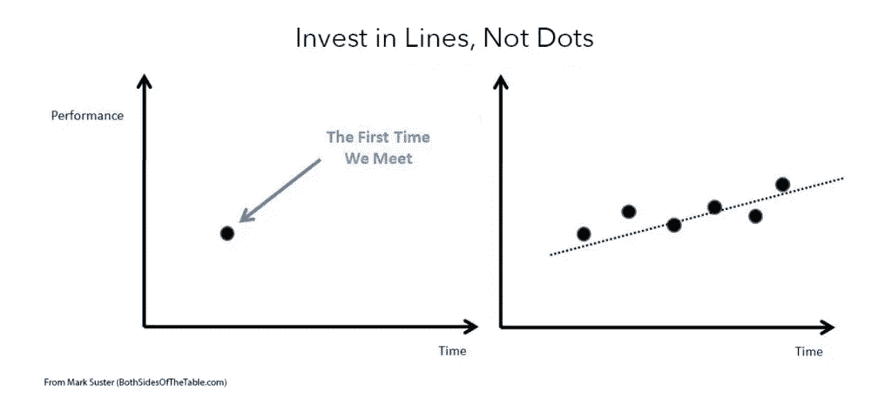
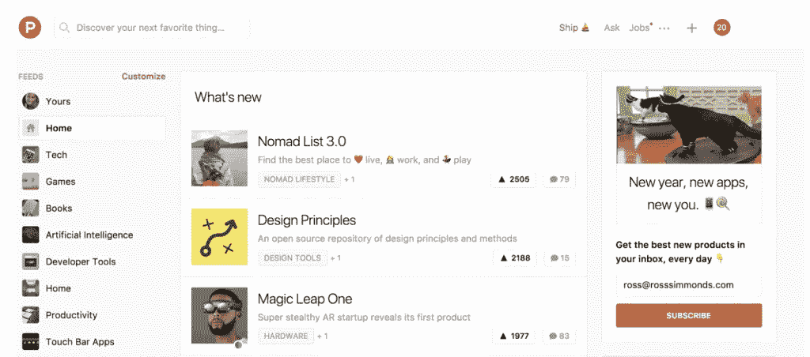

# 初创公司进入天使投资者和风投雷达的四种方式(不惹人讨厌)

> 原文：<https://medium.com/swlh/four-ways-startups-can-get-on-the-radar-of-angel-investors-vcs-without-being-annoying-c0a6147f21d8>

成功筹集资金的人会做好三件事:

1.  他们从拒绝中恢复过来
2.  他们创造了一个伟大的产品故事
3.  他们知道如何找到合适的人

坚持不懈和坚韧不拔是成功企业家的关键特质。当你筹集资金时，你可能会收到比签署的条款清单更多的拒绝。这就是为什么你必须培养自己从拒绝中反弹的能力。

你的产品故事很重要，因为这是你在推销时被评判的依据。你的故事能产生多大的兴奋将决定你离开会议时是获得新的信贷额度还是口袋空空。这就是为什么理解向投资者推销你的创业公司的最佳实践是如此重要。

但是如果你不能站在正确的人面前，所有这些都是没有意义的。

你可能有一个令人兴奋的产品故事，鼓舞人心的愿景和才华横溢的团队，但如果你没有找到合适的投资者，你只是在浪费宝贵的时间，这些时间可以用来为移动应用程序开发者设计包装或购物。

这就是为什么我们想给你一些提示，让你和那些能为你的创业提供资金的人见面。

在这篇博文中，我们将分解四种方法来引起潜在天使或风投的注意(当然，不要让人讨厌):

# 产生牵引力的早期迹象

太多的企业家在筹集资金时没有意识到，投资者寻找的不仅仅是一件漂亮的产品。他们希望看到你是一个伟大的创始人，能够执行愿景的迹象。

他们想看*牵引*。

牵引力有多种形式。可能是已经给你带来回头客的客户、注册试玩的试用用户、与其他品牌的合作伙伴、分销协议、媒体关注、其他投资者的资金，甚至是几个关键雇员。

投资者尊重其他成功投资者和企业家的意见，因此他们的支持是牵引力的一大指标。几年前，在 Quora 上，[AngelList 的首席执行官 Naval Ravikant](https://www.quora.com/What-is-good-social-proof/answer/Naval-Ravikant) 列出了一个你正在寻找的社交证明的清单，从最好的开始:

*   一个顶级投资者公开表示愿意投资该公司的这一轮投资，而这要么是他们对该公司的第一笔投资，要么是他们在这一轮中所做的超过了他们的“按比例”。他们的投资条件与你正在招揽的新投资者完全相同
*   一个不太知名的投资者正在根据上述标准进行投资
*   一位顶级企业家或顾问正在推荐你的公司，并投入他们的时间和声誉
*   一个不太知名的企业家或顾问正在推荐你的公司
*   一位投资者选择不投资你的公司，并为你做介绍

但是，即使一位备受尊敬的商人的推荐能说明很多问题，投资者最终还是会把钱投给你。

在他的博客[桌子的两边](https://bothsidesofthetable.com/)上，前创投公司的创始人和前企业家马克·苏斯特说，牵引“真的是随着时间的推移与创投公司建立关系，并向他们展示你可以向前推进。”

在另一篇题为“[投资于线，而不是点](https://bothsidesofthetable.com/invest-in-lines-not-dots-611f36491d73)”的文章中，Suster 谈到了他投资创始人的方法，并分享了这一观点:

他希望通过一些额外的检查来衡量吸引力并建立关系，而不是基于第一次见面就投资一位企业家。他解释说，随着时间的推移，每次会议或电话都有助于他了解这位企业家的表现。

对于筹集资金的创始人，他建议:

尽早见到你的潜在投资者。告诉他们你还没有筹集资金，但你会在未来 6 个月左右。告诉他们你真的喜欢他们，所以你想让他们有一个早期的观点(这是所有投资者想要的)。

我们喜欢这个建议。

在你真正开始筹集资金之前，获得潜在投资者的关注*是建立非交易关系的好方法。它也迫使你不断努力，这样你就可以在棋盘上放置朝着正确方向移动的点。*

# 寻找潜在投资者的引荐

与潜在投资者联系的一个屡试不爽的方法是通过他们的关系网。人际关系是商业的支柱，在帮助你遇到合适的人方面可以发挥巨大的作用。

但在你开始要求投资者的盲目介绍之前，你应该确定你实际上想要见哪些投资者。为了确定你的理想投资者，做一些研究，看看谁投资了你所在行业的公司(但不是你的竞争对手)。例如，如果你正在为一个减少零售盗窃的人工智能系统筹集资金，寻找那些资助了一个跟踪农场杀虫剂的人工智能系统的投资者。

互联网让发现这些理想投资者，甚至找到他们的电子邮件变得比以往任何时候都容易。首先浏览像 [CB Insights](https://www.cbinsights.com/) 、 [Mattermark](http://mattermark.com/) 和 [AngelList](https://angel.co/) 这样的网站。在这些网站上，你可以深入了解公司和投资者。

一旦你确定了投资者，像 [Hunter.io Email Finder](http://hunter.io/) 这样的工具可以让你在网上查看他们的电子邮件。电子邮件查找器立即收集各种数据，并吐出正确的联系信息。

但是请记住:

**给潜在投资者发电子邮件是最后一招。**

理想的情况是你和投资者有一个共享的连接。它可以是 LinkedIn 上的一个共享连接。或者投资者在 Twitter 上关注你认识的人。找那个人介绍一下！这里有一个**免费电子邮件模板**，你可以在寻求介绍时使用。

记住 Naval Ravikant 的社交证明清单——你的人脉越广，越受尊重，你的介绍就可能越受欢迎。

# 在网上社区引起轰动

在线社区是互联网强有力的角落。它们就在我们身边，从像 [Dribbble](https://dribbble.com/) 和 [Designer News](https://www.designernews.co/) 这样的设计师网站，到像 [Hacker News](https://news.ycombinator.com/) 这样的应用开发者聚集地，以及 [Stack Exchange](https://stackexchange.com/) 中的各种利基社区。

对于风险资本家和天使投资者来说，这些社区通常是挖掘下一个大事件的金矿。最近，投资者浏览种子期创业公司最受欢迎的社区之一是[产品搜索](https://producthunt.com/):

每天都有一些新的应用程序、网站、数字工具和实体产品直接提交到网站上。然后社区对他们最喜欢的产品进行投票，排名靠前的产品往往会有成千上万的人观看。

来自世界各地的影响者、投资者和媒体专业人士经常光顾产品搜索。在你采取措施确保产品成功上市后，将你的产品提交给 Product Hunt 是一种产生轰动并吸引可能非常适合你的初创公司的投资者注意的可靠方式。

同样，许多风投也定期浏览黑客新闻。该社区位于知名创业加速器 Y Combinator 的领域内，被认为是许多成功创业公司的诞生地，如 [Dropbox](https://news.ycombinator.com/item?id=8863) 。如果您计划在 Hacker News 上发布您的产品，我们建议您在一天中抽出时间来回答社区中其他成员的问题。

你永远不知道——你可能正在回复一位潜在的投资者。

# 参加远近各处的创业活动

尽管毫无疑问，技术让不见面培养关系变得很容易，但这些面对面的互动仍然有价值。事实上，绝大多数投资者仍然认为面对面的会议很重要。

会见潜在投资者和风投的一个好方法是参加创业活动——行业会议、推介比赛、聚会等。这些活动让你有机会与其他创业公司建立联系，向成功的创始人学习，并与投资者面对面交流。

当你审视潜在事件时，不要局限于当地发生的流行事件。走出当地市场往往是值得的(是的，即使你在硅谷这样的主要中心)。除了扩大你接触投资者的机会，走出你的本地泡沫也有利于获得视角。正如 [Patrick Keefe](http://www.atlanticbusinessmagazine.net/article/failure-to-launch/) 所言，Build Ventures 的合伙人向《大西洋商业》透露:“你必须登上飞机，花时间在你所攻击的市场上。”

# 那么接下来你该怎么做呢？

简单:你行动。

无论是简单地在 Twitter 上关注几个风投和天使投资人，还是准备在产品搜索上推出一个大项目，你都必须采取行动——你不会因为无所事事和梦想一笔大投资而引起任何人的注意。现在是时候开始把这些点放在你的图表上了。

作为一家应用程序开发公司，我们已经帮助许多新应用程序微调了它们的产品和定位。如果你正在创建一个[安卓应用](https://www.mindsea.com/android-development/)或 [iPhone 应用](https://www.mindsea.com/ios-development/)并需要一些帮助来成功发布，请联系我们！

*原载于 2018 年 1 月 31 日*[*www.mindsea.com*](https://www.mindsea.com/attract-angel-investors-vcs/)*。*

## 这个故事发表在 [The Startup](https://medium.com/swlh) 上，这是 Medium 最大的创业刊物，拥有 297，332+人关注。

## 在这里订阅接收[我们的头条新闻](http://growthsupply.com/the-startup-newsletter/)。

