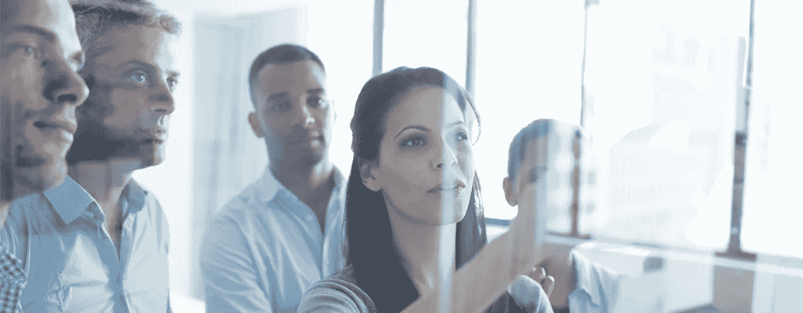

# 创建成长型团队的四种方法

> 原文：<https://medium.com/swlh/four-ways-to-create-a-growth-mindset-team-2193b13074c3>

在我领导团队和与团队合作的经历中——无论他们是初创公司、工程师团队还是全球领导者——有几件事对推动成功非常重要。

首先，领导者和团队成员必须愿意“站起来”领导或推动计划，并始终“表现”为采取行动推动进展的实干家。第二，他们必须愿意做更多的工作。这本身并不意味着更多的时间，但这确实意味着他们必须在舒适区之外工作。最后，他们必须热情地愿意学习和发展新技能。

这就是成长心态在现实生活中的表现。如果你在寻找对有成长型思维的人的明确描述，我最喜欢的是卡罗尔·德韦克的《哈佛商业评论》文章(需要免费注册):“相信自己的才能可以发展的人(通过努力工作、良好的策略和他人的投入)。”在我与同事和 RallyBright 客户合作的整个职业生涯中，我亲眼目睹了证明 Dweck 结论的证据，即当公司采用这种思维方式时，他们的员工更有权力和责任感。

**弹性关系** 我们在 [RallyBright](https://www.rallybright.com) 对团队进行的研究表明，弹性是实现持续高绩效的团队的决定性特征。我们所说的弹性是指抓住机遇、坚持挑战、从挫折中快速恢复并从这些经历中学习以更明智、更好地前进的能力。要想真正有弹性，团队需要拥有独特和独立的技能——那些推动弹性的方向、联系、协调、表现和态度的技能。

培养成长心态是高绩效和弹性的关键，因为这关乎态度。成功的态度始于对不断学习的渴望和对新思想的开放。我们看到的大多数团队更倾向于固定增长范围内的固定心态，他们会做得更好，更热情地拥抱挫折和失败，将它们视为建立更大敏捷性和更深能力所必需的经验。

团队如何到达那里？这里有四种方法可以帮助领导者从高层推动成长思维——特别是对团队而言。

**1。培养成长心态团队成员** 团队不会因为是由成长心态的个人组成而表现出成长心态。团队是他们自己的实体，成员共同创造了团队的思维模式。然而，团队通常不会移动到增长区域，除非成员首先有了那种心态。我知道这有点矛盾。

虽然有些人天生更注重成长，但我也看到许多人一开始就有更固定的思维模式，并朝着成长的方向发展。然而，这种转变是渐进的，一点也不神奇。这需要个人的自觉决定和领导的支持。每个人都必须“出现”并完成工作。

这里有三种方法可以鼓励你的团队成员:

*   要求团队成员设定个人目标，并负责努力实现这些目标。他们必须“站起来”并致力于增长。
*   为员工学习他们需要的新技能提供资源，如培训和社交机会。团队成员需要相信他们得到了支持。
*   鼓励和庆祝头脑风暴和创新思维。团队成员需要感到安全才能畅所欲言。

**2。从内部招聘** [《哈佛商业评论》](https://hbr.org/2014/11/how-companies-can-profit-from-a-growth-mindset)报道称，有固定思维文化的公司倾向于根据资历和成就招聘员工。这通常意味着雇佣那些认为自己比别人更有才华的人。这些雇员在基于团队的环境中通常不开心，因为他们不是“明星”Dweck 建议寻找那些热爱挑战、想要成长和合作的人。

通过浏览简历或花 90 分钟的时间与他们面谈来确定一个人是否具有这些特征是很有挑战性的。相反，用现有员工填补空缺职位。你了解你的团队——他们的优势、弱点和态度——你知道谁展示了成长心态所需的态度。通过提升这些类型的人，热情和激情开始向下渗透，导致整个组织的成长思维。

**3。帮助团队成为高绩效团队** 如果一个团队仅仅是一个工作组，而不是作为一个团队来工作，那么它就不可能成为一个成长型团队。(我们将工作组定义为由经理或其他领导召集起来汇报各自业务的松散的个人集合。)

以下是一些鼓励团队发展的方法:

*   让团队定期设定他们的目标。
*   允许团队灵活地学习如何最好地作为一个整体运作。
*   为团队提供时间、空间和资源，以便在工作环境内外建立关系。
*   鼓励团队庆祝胜利。

**4。允许团队失败** 在成长型团队中，有时事情不会按计划进行。但是，如果人们担心后果，他们就不会接受更多的成长思维行为。北卡罗来纳大学凯南-弗拉格勒商学院的布拉德·斯塔茨发现[过分强调成功](http://www.kenan-flagler.unc.edu/~/media/Files/documents/executive-development/unc-white-paper-growth-mindsets-in-organizations.pdf)是组织无法学习和成长的主要原因——因为专注于成功往往会导致固定的思维模式。鼓励创新和冒险，让公司的其他人看到过程，而不仅仅是结果。

创造冒险文化的一个常用策略是将产品和平台视为永久测试版。因为测试版被视为正在进行的工作，所以实验和创新被视为过程的一部分。这给了团队分阶段试验和改进想法的许可，这通常是组织看到真正大的转变的方式。

作为领导，你已经知道人是你最大的资产。当你建立的团队以创新的思维和敏捷的方式不断前进时，你的员工变得更有价值。这是最佳点——员工参与其中，公司取得最大成功的地方。它不是从尖端技术或复杂流程开始的。成功始于基础——建立一个成长型团队。

如果你喜欢这篇文章，请鼓掌，推荐或分享；我真的很感激，也很想收到你的来信！

*富有弹性的团队乐于接受机遇，因挑战而兴奋，并乐于在实践中学习。注册参加 RallyBright 的 Resilient Teams 的免费演示，了解您的团队在我们的五项弹性指标中的表现。*

## 这个故事发表在 [The Startup](https://medium.com/swlh) 上，这是 Medium 最大的企业家出版物，拥有 296，127+人。

## 在此订阅接收[我们的头条新闻](http://growthsupply.com/the-startup-newsletter/)。

