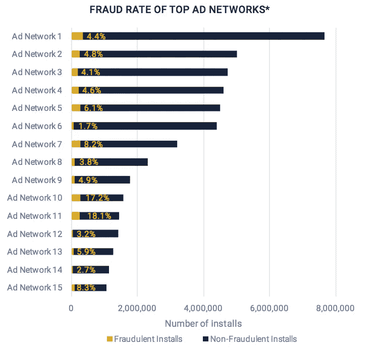
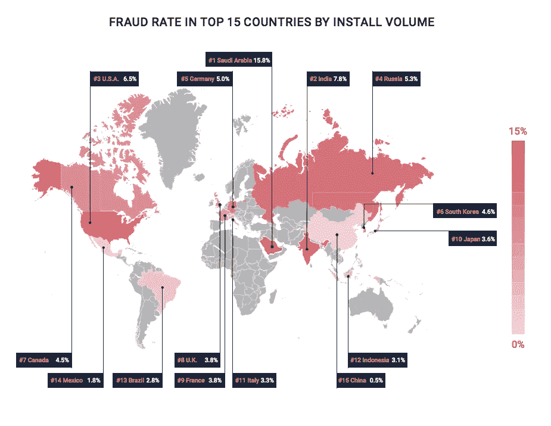
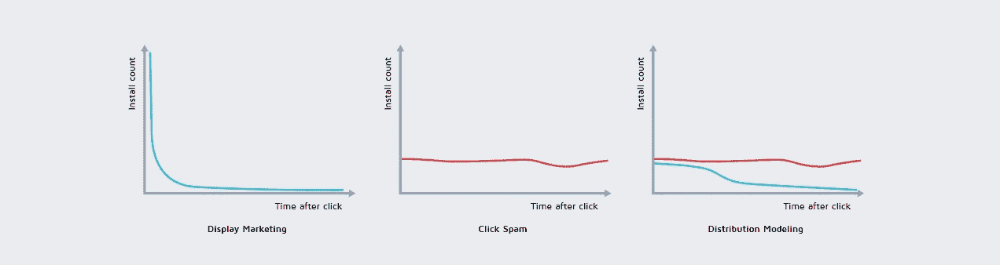
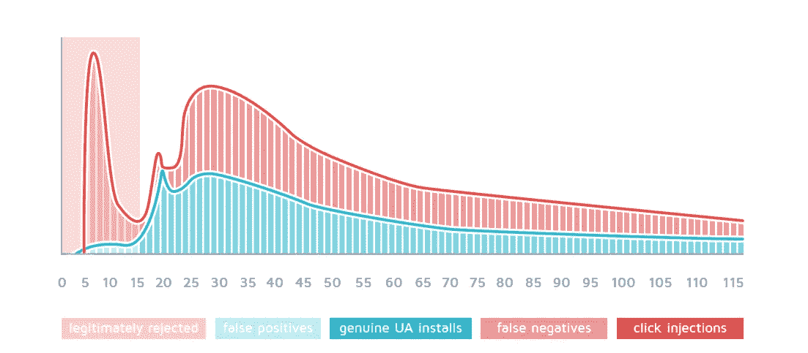

# 欺诈流量:移动数字广告的阴暗面

> 原文：<https://medium.com/swlh/fraud-traffic-the-dark-side-of-mobile-digital-advertising-ead808e054d0>

了解欺诈者如何让您在虚假的应用程序安装上浪费预算

**山寨 app 安装**是开发者和广告商日常生活的一部分。
我说的不仅仅是**奖励安装**或**机器人或点击农场**制作的欺诈下载，而是欺诈者每天都在引入的新的巧妙方法。

原因很简单:**移动广告是一个金矿**。考虑到唯一的美国，去年移动应用安装广告支出达到**57 亿美元**，并且还在持续增长。欺诈者有一个巨大的市场，他们不会错过轻松赚钱的机会。

# 超过 15%的付费安装是假的

Graphics and data by [DataVisor](https://www.datavisor.com/)

来自 [DataVisor](https://www.datavisor.com/) 的最新报告告诉我们**每 100 个安装中，至少有 15 个是欺诈**。虽然如果我们仅指优质出版商和广告网络(欺诈率约为 5%)，这个数字会更低，但我们仍然在谈论美国开发商和广告商每年浪费的**3 亿美元**。

如果这个 5-15%的欺诈率没有吓到你(尽管它应该吓到你)，那是因为你不知道欺诈率会根据许多因素持续波动。在同一个可信网络中，**您可以开展欺诈率低于 10%的活动，也可以开展欺诈率高于 90%的活动**。欺诈者很快采用新方法来伪造安装，这使得寻找可靠的广告网络更加困难。

Graphics and data by [DataVisor](https://www.datavisor.com/)

欺诈率甚至会因国家而异。你可以在北美和欧洲找到收入最高的公司，这是因为他们的薪酬更高，但你搬到印度等东方国家也会面临同样的问题。

**Android 设备被用于欺诈的次数是 iOS 设备的 5 倍**，它们的平均欺诈率为 5.8%，而 iOS 设备的平均欺诈率为 3%(这要归功于它们易于被黑客攻击)。最新型号的 Android 和 iOS 设备的欺诈率相对较低，因为它们在安装场使用时不具成本效益。

# 三大欺诈类型

欺诈是一种邪恶的艺术，依赖于许多不同的工具和方法。你可能知道最常见的，但我打赌你会对最新的感到惊讶。

**1。机器人，模拟器&点击农场**

这是一种非常常见的手机 app 安装诈骗类型。即使它看起来很容易检测(例如，VPN 流量、代理、重复的 IP、旧的操作系统版本、较低的安装后事件、较低的保留率)，它仍然有一些陷阱。欺诈者不断努力使虚假安装与真实安装越来越相似，改变 Google IDs，增加保留和安装后事件，甚至引入虚假 IAP。

**2。点击垃圾邮件**

也被称为“有机偷猎”，这种方法是最有趣的方法之一。当用户登录欺诈者正在运行的移动网页或应用程序时，单击垃圾邮件开始。从这里开始，很多事情都有可能发生。

Graphics and data by [Adjust](https://www.adjust.com/)

移动应用程序(或网页)可以在后台执行点击，而没有可见的广告，当用户在或甚至在任何时候，如果我们谈论的是一个能够在后台 24/7 运行的应用程序。此外，欺诈者可以发送点击印象，使其看起来好像一个视图已经转换为一个约定。

结果呢？用户可能会有机地安装你的应用程序，但骗子会声称他们看到了广告，你会向他支付与安装无关的转换费用。由于欺诈者正在窃取有机安装(通常是高质量的)，你会将他视为一个很好的流量来源……你会增加在这个来源上的支出，浪费越来越多的钱！

**3。点击注射**

类似于点击垃圾邮件，点击注入不同于它，因为它更复杂。

Graphics and data by [Adjust](https://www.adjust.com/)

Android 应用程序可以访问一个名为“广播意图”的功能，让他们知道其他应用程序何时安装在设备上。如果欺诈者拥有一个具有此类功能的应用程序和许多用户(比如一个常见的“手电筒”应用程序)，会发生什么？他会做很多假的安装。

如果该应用程序的用户安装了一个带有显示广告的新应用程序，则该欺诈性应用程序有可能参与了该活动，因此可以访问跟踪代码。

欺诈者将因为这一操作而获得该安装的积分，因为虚假点击将在下载之后但在应用程序打开之前发生。

# 如何避免诈骗流量？

如你所见，欺诈是一件严重的事情。为了战胜它，停止浪费你的钱，你必须变得聪明:

1.  **仅与可信网络合作**，该网络具有集成的反欺诈系统，可以为您的应用安装活动提供直接支持
2.  根据你的有机用户的行为，列出你的应用安装提供商必须满足的相关软 KPI 清单
3.  **分析结果**，特别监控转化率、保留率、购买量和投资回报率
4.  **一旦从您的跟踪系统或在您的分析之后，您有了欺诈或煽动安装的证据，请立即关闭不良流量来源**。

如果你还没有这样做，我邀请你尽快开始。

这篇文章旨在让你了解目前移动数字营销领域正在发生的事情。当然，还有很多要说的。
但不要担心:我很快会帮你写一篇关于欺诈检测和分析的深入文章，以优化你的应用安装活动并避免欺诈流量。

总之，**如果你想在这件事上得到**的直接支持**只需在 Twitter 上联系我**、通过电子邮件给我发短信[或](mailto:alessandro@myappfree.com)[在 myAppFree](http://www.myappfree.com/en/advertisers/) 上给我们写信，以发现最佳的流量来源。

你觉得这个故事有用吗？ [**媒体关注我**](/@alexlunder) **更多关于移动数字营销和 app 安装的有趣帖子。**

## 这篇文章发表在《创业》( The Startup)杂志上，这是一份面向企业家和创业公司的媒体领先刊物。

# 你可以订阅[，在这里获取头条新闻。](http://growthsupply.com/the-startup-newsletter/)

