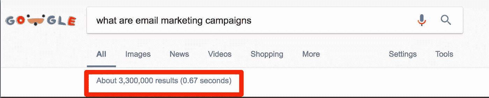
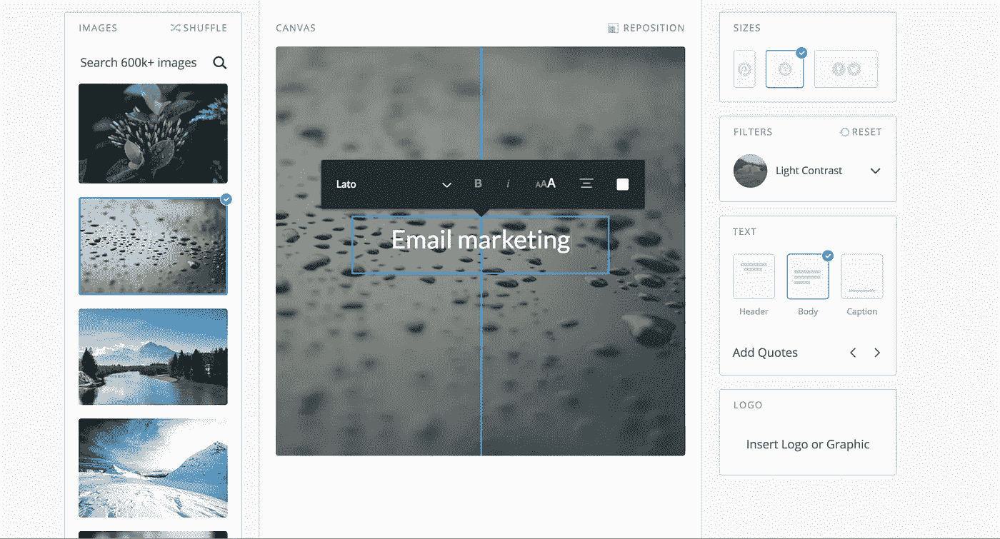
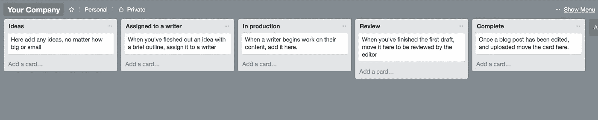
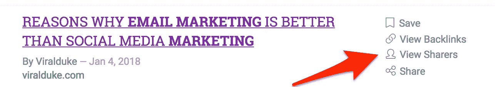

# 你的 SaaS 公司需要的免费内容营销工具

> 原文：<https://medium.com/swlh/free-content-marketing-tools-you-need-for-your-saas-company-7f23122892bb>

一个成功的内容营销策略包括许多不同的“cogs ”,所有这些 cogs 一起协同工作，帮助你制定策略，创建和推广你的内容。

最好的方法是什么？

同时使用多种不同的工具会让你有能力精简你的内容，完成你的内容目标，并且整体上变得更加高效和多产。

但是一个简单的谷歌搜索就会呈现给你许多“81 个内容营销工具”或者“你需要知道的 56 个内容营销工具”。

你真的有时间通读它们并评估你需要什么和什么最适合一起工作吗？

号码

为了创建一个运行良好的内容营销引擎，你不需要 81 个工具，甚至不需要 56 个。你只需要一组工具协同工作来帮助你产生你想要的结果。

在这篇博文中，我们想向你展示一个简单的内容营销工具栈，无论你是一个独自创作内容的创始人，还是一个三人的小型内容营销团队，甚至是一个成熟的内容机器，你都可以使用。

更伟大？这里列出的每个工具都是免费的。可以理解的是，获得内容营销的认同是困难的。它不像付费广告那样容易衡量投资回报率或转化率。

让别人来创建你的内容本身就是一项艰巨的任务，我们不想让你负担每月购买大量昂贵的工具。

不过，我们并不是轻而易举地创建了这个指南。这不仅仅是“顶级内容营销工具”的翻版。这些正是我们在[代理](http://copyandcheck.com/)使用的免费工具，用来吸引、转化和取悦我们的客户。

请记住，没有一个人能够迅速改善你的内容营销，但统一使用以下工具将有助于你调整你的内容工作，使研究，制作和推广内容变得非常容易。

让我们开始吧，

# 用于发现和构思的内容营销工具

在你动笔之前，或者用手指敲击键盘之前，你需要想出一些内容的想法。

我们坚信，不要简单地写一份内容想法的清单，然后在清单上一点一点地做下去。

这种方法的问题是它没有考虑内容背后的策略。大多数人在内容营销方面犯的错误是没有制定一个足够全面的策略来支持他们正在制作的内容。也就是说，他们知道“是什么”,但不知道内容背后的“为什么”。

首先，我们推荐关键词研究，尽管有许多付费工具可以帮助你做到这一点，如 [SEMRush](https://www.semrush.com/) 或 [Ahrefs](https://ahrefs.com/) ，但你不必花费太多(如果有的话)来了解什么术语和短语最常被搜索。

事实上，你可以用谷歌自己的搜索引擎和[谷歌关键词规划器](https://adwords.google.com/intl/en_uk/home/tools/keyword-planner/)来完成。在这篇文章中，我们将假设你有一个电子邮件营销 SaaS 工具，并用这个例子向你展示如何使用这些内容营销工具。

在创建新的内容营销活动时，我们要做的第一件事是确定你的用户将会寻找的搜索类型。为了做到这一点，我们使用了一个工具:[回答公众](https://answerthepublic.com/)。

根据内容的总体主题输入通用搜索词。然后，点击“获取问题”。

您将看到一系列类似于下图的图表:

这些对于那些希望用可视化的方式来看待用户所提问题的人来说是很有帮助的。

然而，我们发现使用“下载 CSV”功能最有用，它会将整个搜索下载到电子表格中。

为了组织这些数据，我们使用 Google Sheets(这是免费的)。当您第一次输入数据时，它看起来像这样:

然而，这在美学上并不令人愉快，并且缺少一些我们在关键字研究阶段需要的栏目。

我们删除前两列(修改量和修改量类型),并在“建议列”后添加以下各列。(谷歌搜索结果和建议出价)。

我们使用 [Google Adwords](http://adwords.google.com/) 作为一个免费的工具，来寻找伟大的内容机会和目标关键词。打开 Google Adwords(如果您还没有帐户，请创建一个帐户)。

然后，我们点击“关键字规划”，您将看到一个如下所示的页面:

我们想把重点放在“搜索量数据和趋势”部分。从您刚刚创建的电子表格列表的顶部开始，输入每个问题。

我们喜欢一次做一个。这是一个非常耗时的手动任务，但花时间关注你的关键词研究从长远来看会对你有帮助。

一旦我们点击“获取搜索量”，我们会看到一个类似下面的页面。然后，我们想输入“平均每月搜索”和“建议出价”到我们的电子表格。

对于电子表格来说，如果它显示的值是 10-100，请选择最大值。所以在这种情况下，我们会写“100”。

我们还在电子表格中添加了“谷歌搜索结果”一栏。在这里，你所需要做的就是找到你正在寻找的问题或术语，谷歌一下，看看有多少结果显示出来。

一旦你完成了你的电子表格，高亮显示并点击这个按钮。

这将允许您根据每月的搜索、结果或建议出价来排序您的结果。

对于大多数关键词研究搜索结果，你可能会发现自己必须筛选数百个，如果不是数千个不同的问题。

首先，有些问题可能与你在 SaaS 的公司无关，所以你可以删除它们。

你也可以考虑雇佣一个虚拟助理来帮你输入所有的数据。正如我们所说的，我们只选择免费的内容营销工具，所以如果你决定使用付费工具，整个过程将会加快。

# 用于内容创作的内容营销工具

说到内容创建，您有几个选择。您可以直接在 CMS 中创建内容，也可以使用 Google Docs 等工具来创建、编辑和保存您的内容。

事实上，这篇文章本身最先发表在 [Google Docs](https://www.google.co.uk/docs/about/) 上。Google Docs 最棒的地方在于它的协作能力。

例如，如果你和内部或自由设计师一起工作，你可以给他们分配特定的任务。

# 用海明威和语法编辑你的内容

没有人能马上写出一篇完美的博文。当你的任务是日复一日地写作时，有时你可能需要一些帮助来编辑你的内容。

对于基本的拼写和语法错误，我们推荐[语法](https://www.grammarly.com/)。该工具有一个免费版本，它可以很好地处理你可能会因为自己编写内容而忽略的粗心错误。

记住，如果你的内容充满拼写错误，你的用户不会信任你。读者希望感觉你花了时间整理你的内容，而不是在最后一刻匆忙完成。

然而，我们发现它有时是不可靠的，当涉及到错误时，你应该有保留地接受建议。

其次，说到句子结构，我们推荐[海明威 app](http://www.hemingwayapp.com/) 。海明威以他的短句和易读的段落而闻名。同样的道理也适用于网络内容，在这种情况下，你的读者自然会有更少的注意力。

如果你想让你的写作质量高，海明威是一个你应该考虑添加到你的军火库的应用程序。

如果你使用海明威，要特别注意可读性分数，它可以在屏幕的右边找到。你的目标是可读性分数为 X，这意味着你的博客文章易于阅读。它还能帮助你避免使用被动语态或难读的句子。

如果你还不知道，在你的博客文章中使用图片有助于摆脱阅读大量文本的单调。正如他们所说，一张图片胜过千言万语，所以在你的博客文章中包含图片是很有帮助的。

然而，对于一些作家来说，虽然他们在将文字写在纸上时很有创造力，但在创造图像时却并非如此。

尽管如此，我们在我们的机构中使用了两个核心免费工具，通过使用图像来保持我们内容营销的趣味性。

# 在 Canva 中创建图表、图像等

Canva 是一个免费的设计工具，你可以使用一系列不同的图像。

有免费版和付费版。付费版包括下载你的文件，背景透明。你也可以支付额外的费用来获得额外的功能。

各种各样的预设设计将帮助您为您的博客帖子创建定制的图像，使它们感觉独一无二。

[巴勃罗](https://pablo.buffer.com/)是 Buffer 的人创作的一个副业。如果你想突出一个特定的引用或短语来增加强调，但缺乏在 Photoshop 等工具上自己创建图像的设计技能，这是一个很好的工具。

更重要的是，他们从另一个免费的图片来源工具 Unsplash 上收集图片。

通过他们简单易用的应用程序，你可以为你的图像选择背景，你想要使用的字体，以及其他编辑功能。

保存图像也很简单。

或者，你可以雇佣一个自由设计师，或者寻求内部设计团队的帮助来帮助你创建图像，但是本指南主要关注免费工具。

# 组织的内容营销工具

# 特雷罗

对于任何内容策略来说，保持有组织性并掌握需要做的事情、当前正在做的事情和已经完成的事情是非常重要的。对于内容组织，我们发现 [Trello](http://trello.com/) 是一种很好的方式，可以确保您的内容总是准时，由合适的人员提供，并以最高的质量完成。

Trello 是一个免费的生产力或任务管理工具，易于使用，看板元素帮助您了解每项内容处于哪个阶段。

我们发现这种方法最适合小型内容团队。您可能还需要其他专栏，所以请随意尝试最适合您和您的团队的内容。

这个拖放工具最棒的一点是内置的日历功能，您可以为特定的内容指定截止日期。

如您所见，我们已经为这段内容添加了截止日期。但是，日历是一个附加功能(免费)。要使用它，请按照下列步骤操作:

单击“加电”按钮。

向下滚动屏幕，直到看到“日历”

现在，当您查看您的 Trello 业务板时，您应该会在右上角看到日历按钮。点击它，你会得到一个日历视图，在那里你可以看到所有的内容和到期时间。

这种生产力和协作工具对于让作者团队了解什么内容在管道中非常有用。

# 使用 Google Drive 组织您的内容

我们所有的工作都在云上完成。这对我们完全远程的团队尤其有效。这意味着您可以从任何地方访问您的作品。意味着你不用再处理保存文档为“博文新新新版本”。

在我们的 [Google Drive](https://drive.google.com/) 中，我们试图保持文件夹的层次结构易于使用，任何人都可以简单地访问并知道在哪里导航。

正如上面的视频所示，我们为每个客户端都准备了一个单独的文件夹，使用 Google Drive 的一个好处是，我们可以限制谁可以访问每个文件夹，因此只有相关人员才能查看每个文件夹中的文件。

# 营销和分销工具

我们之前提到过，如果你没有一个精心策划的策略来分发和推广你的内容，它不太可能走得很远。向全世界分享和分发你的内容本身是另一项任务，但是用 Buffer 这样的免费工具来自动化这个过程可以减轻一些压力。

# 缓冲器

缓冲的伟大之处在于你可以[缓冲](http://buffer.com/)几乎任何东西。下载缓冲浏览器扩展，无论何时你在一个页面上，或者想要缓冲一个图像，你都可以很容易地做到。

单击右侧的小缓冲图标，您将看到一个类似如下的屏幕:

然后你可以编辑推文，选择一个预定的时间，或者只是将它添加到你的队列中。您甚至可以预设自己的时间表，以确保您在最佳时间发布内容。

更进一步，使用电源调度程序。

[*来源*](https://faq.buffer.com/article/523-sharing-posts-multiple-times-using-the-power-scheduler%20Working%20with%20influencers)

# **通过影响者分享内容**

你应该永远记住人们都是自私的，包括你在内。但是如果你想让你的内容在你自己的网络之外得到更广泛的分享，你应该考虑使用影响者。

但是有一种方法可以增加你的行业中有影响力的人与他们广泛的关系网分享你的内容的可能性，那就是在你的帖子中提到他们。

然后，当你的帖子发布时，你可以给他们留言，让他们知道你已经收录了他们，这将增加你被分享的机会。

但是你可能想知道如何找到有影响力的人？

为此，你可以使用免费版的 Buzzsumo。Buzzsumo 是一个工具，可以让你分析哪些内容对于任何给定的搜索主题表现最佳，并找到可能分享该内容的影响者。

然后，您将看到该搜索词的热门共享内容列表。在这个例子中，我使用了短语“电子邮件营销”。

如果你点击任何一篇文章上的“查看分享者”,你将能够看到基于他们的社交排名分享内容最多的人的列表。

如果你写了一篇比 Buzzsumo 上找到的更好的内容(你应该确保你发布的每一篇内容都比网络上的其他内容好)。您将能够通过如下的电子邮件脚本进行联系。

这里的目的是让你的邮件尽可能的简洁。作为一个有影响力的人，你发邮件的人很可能会非常忙，并且总是会收到这样的请求。增加他们真正分享它的机会的最好方法是确保你的内容确实比网络上的其他内容更好，并且你不仅仅是在制造不必要的噪音。

创造内容而不再看是没有意义的。你需要不断地检查你的分析，看看你的内容表现如何，什么是有效的，什么是无效的。这样，你就能专注于什么在起作用，什么没有给你带来正的投资回报。

# **分析工具**

谷歌分析是免费的，让你可以跟踪内容营销工作的许多不同方面。你可以算出:

*   你的内容产生了多少流量
*   你的流量来自哪里(来源)
*   你的哪些内容表现最好
*   哪些关键词给你带来了最多的流量

因此，对于像你这样痴迷于数据的创始人来说，这些信息对于分析你的内容策略是非常宝贵的，尤其是如果你希望在未来扩大你的内容营销努力的话。

频道部分让你知道你的流量来自哪里。在上面的例子中，我们可以看到大部分的流量来自有机搜索。这是好的，可以让你的内容针对正确的关键词进行优化，但是，这也告诉你，你可以提高你从社交渠道或电子邮件营销中获得的流量

# 外卖食品

让我们面对它，当你把你计划用来经营你的企业的内容营销工具的样本列表放在一起，有很多。即使你用免费工具缩小范围，仍然有很多。

对于像你这样时间紧张的营销人员来说，你没有时间去研究什么工具、什么工作工具不起作用，以及哪些工具配合使用效果好。

这就是为什么我们把这个指南放在一起，一个最好的免费内容营销工具的列表，实际上帮助你产生结果。

我们已经消除了猜测与我们的尝试和测试的工具选择。这是我们在营销和客户中使用的选择。

*原载于 2018 年 2 月 19 日*[*【copyandcheck.com】*](http://copyandcheck.com/free-content-marketing-tools-saas/)*。复制和检查是一个 B2B SaaS 内容营销机构。*