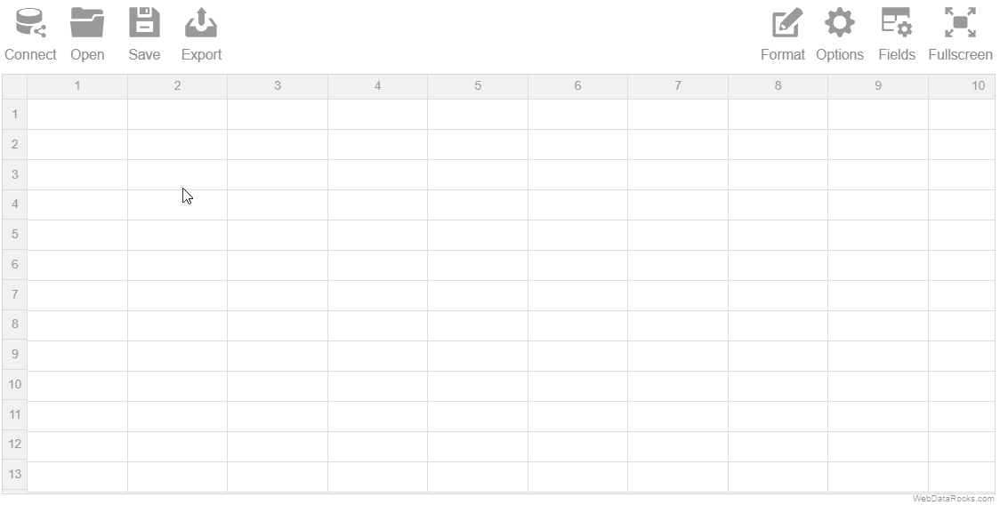
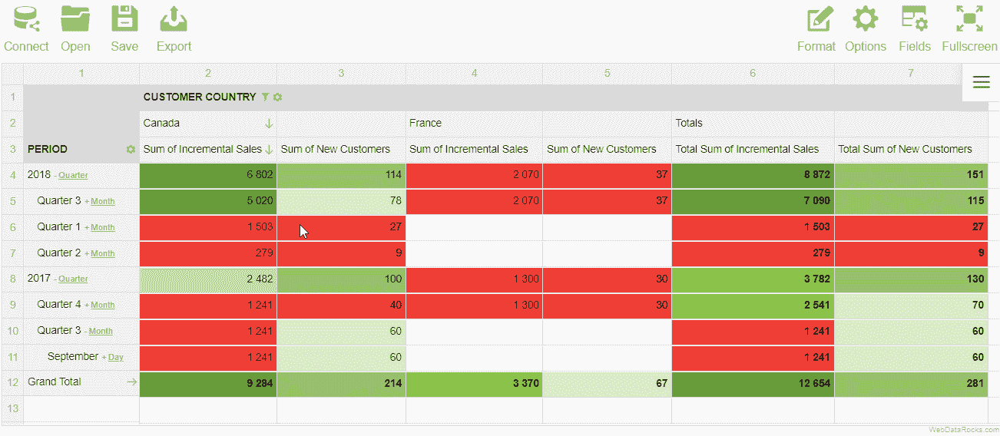
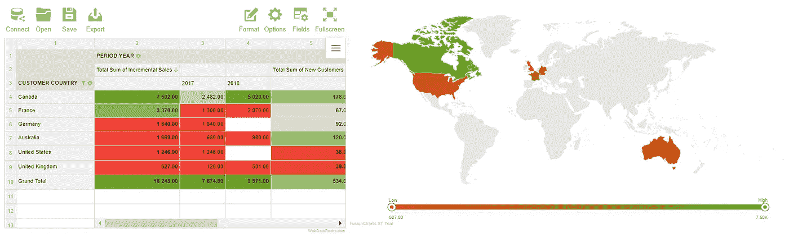
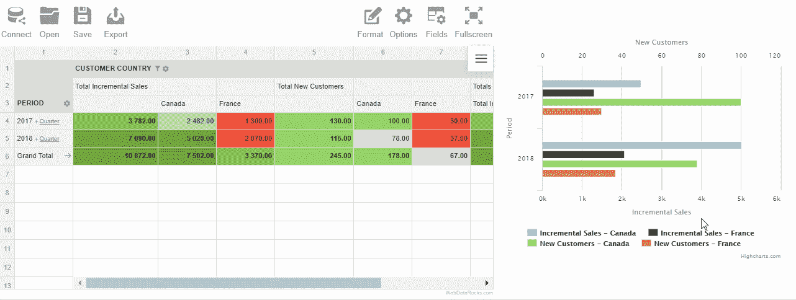

# 面向初创公司的免费数据分析和可视化工具

> 原文：<https://medium.com/swlh/free-data-analysis-visualization-tool-for-startups-aff3755b84c9>

在一个不断发展的数字时代，科技创业公司面临着*众多不同的挑战*。它们包括财务管理、在竞争环境中生存、建立合作关系、建立强大的安全系统、赢得客户和分析的信任。

企业创始人需要时间、金钱和韧性来应对他们所承担的风险。

如果说企业在生命周期的开始阶段财务状况极其有限，这并不是什么新发现。因此，创始人关注市场上的**免费工具**。

今天，我想让大家关注分析和数据可视化。它们对公司的价值不应被夸大:分析有助于监控整体情况，并持续跟踪不同的业务指标:*营销、销售、社交媒体、财务指标*等。

在衡量它们并收集了独特的见解后，你需要在*报告*和图表中向你的团队或投资者展示后者。

这就是为什么我要展示一个**免费工具**，它*至少可以解决两个挑战*:

*   执行内部分析，以跟踪所有业务领域的指标
*   为开发人员提供一个可嵌入的数据分析工具

我将使用[web data rocks](https://www.webdatarocks.com/?r=m6)——一个免费的 JavaScript 组件，旨在提供实时洞察。

**挑战 1**

作为第一个案例，让我们看一个基于来自营销部门的数据构建报告的例子。

这个 web pivot 工具允许您将数据加载到 pivot 网格中，并以最有意义的方式组织数据——将字段放入行、列中，设置必要的度量并*聚合*它们。

例如，假设您想要检查一年内的增量销售额:

您还可以:

*   **过滤**报告以关注特定数据区域(例如，受众通过营销活动带来最高收入水平的国家)。
*   根据销售额制作**热图**
*   **穿透钻取**查看组成单元格的原始数据

**结果:**

您可以使用这些数据进行统计分析，并为下一年或下一季度(或您需要为您的业务跟踪的任何其他 KPI)构建预测模型。

**挑战 2**

让我们从开发人员的角度来看这个组件。

**整合流程**

作为一名开发人员，我应该说我知道要找到一个可以与任何框架轻松集成的工具是多么的困难。

WebDataRocks 为不同的框架( **React，AngularJS** 或 **Angular 2+)** 提供现成的教程。

**网络报道功能包括**

*   连接到 **CSV & JSON** 数据源。它们可以是本地的，也可以是远程的。
*   **聚合**功能适用于所有场合
*   多种过滤选项，用于数据转换的排序和分组
*   内置**将**导出为 PDF、HTML 和 Excel

**可视化定制**

如果您需要**将组件安装到您的应用设计中**，可以通过以下方式进行定制:

*   本地化
*   单元格着色和格式化
*   更改工具栏的外观和功能
*   更改主题或创建自定义主题

**制图整合**

如果你不仅需要数据透视表，还需要另一种可视化分析，如图表，你可以将该组件与谷歌图表或其他图表库集成。因此，您可以创建这样的仪表板:

Integration with FusionCharts

Integration with Highcharts

**结果:**

您可以使用额外的分析功能来扩展您的应用程序。根据您的应用程序的外观和感觉以及业务逻辑对其进行完全定制。

**总结**

如上所示，这个免费的数据可视化工具既可以作为交付给最终用户的组件，也可以作为创业公司内部分析的工具。

虽然它是免费的，但功能很好，你不需要在任何维护服务上投资你的个人积蓄。

我真的希望你会喜欢网络报告的体验，并为你的项目提供强大的分析能力。

> 将您的想法付诸实践，让您的业务蒸蒸日上！

## 这篇文章发表在 [The Startup](https://medium.com/swlh) 上，这是 Medium 最大的创业刊物，拥有+383，719 名读者。

## 在这里订阅接收[我们的头条新闻](http://growthsupply.com/the-startup-newsletter/)。

