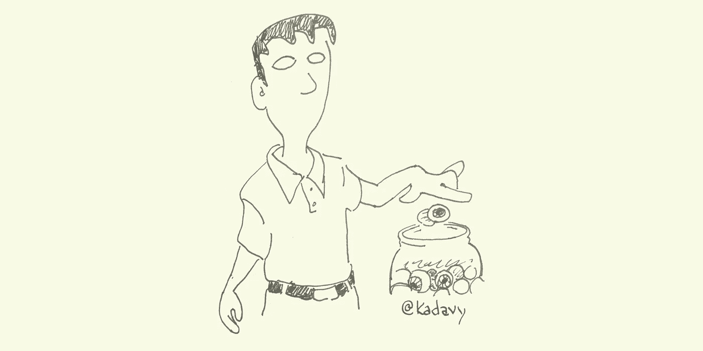

# “免费”是昂贵的

> 原文：<https://medium.com/swlh/free-is-expensive-41c0186a5182>

拿走“免费”的东西很有诱惑力。脸书就是这样一个相当不错的免费产品。但是，免费的东西其实挺贵的。

如果你不是用钱来买某样东西，那你就是用其他方式来买。你付出了时间、注意力和机会成本:如果没有这些时间和注意力，你还能做些什么？

技术带来的规模经济在今天尤其如此。“支付”的负担可以分散到更大的人群中，这反过来可以负担更复杂的产品，这反过来可以吸引更多的人。

但是，不一定是新的。将近 2000 年前，塞内卡[写道](http://www.amazon.com/Letters-Penguin-Classics-Lucius-Annaeus/dp/0140442103?tag=kadavyinc-20):

> 我们认为“购买”仅指我们用现金购买的物品，我们把我们自己花钱购买的东西视为免费礼物，这一事实清楚地证明了我们的愚蠢。我们渴望以焦虑、危险、失去荣誉、个人自由和时间为代价获得它们；每个人都认为没有什么东西比自己更便宜，这是千真万确的。

如果你不专注于生产，你正在成为一个产品。你的神经元正被广告商劫持——或风险投资家延迟所述劫持——并且神经通路正被切割以使其更容易一次又一次地进行。

你在出售自己的一部分，你的价值不止于此。

对于信息来说，这是最真实的，有一个万无一失的方法来对付它:[购买信息](/@kadavy/buy-information-34488e8541f0#.oom2zc8uh)。当你购买信息时，你翻转了经济学。不要激励人们试图用点击诱饵标题和不可靠的文章来吸引你的注意力——所有这些都是为了把你的眼球卖给广告商，或者筹集新一轮资金——你要激励他们创造你认为值得购买的东西。

这就像购买碳补偿。(好吧，所以你不买碳补偿，但还是。)当你购买你重视的信息时，你就减少了信息污染。与碳抵消不同，你马上就能得到实实在在的东西:你摄入了大脑营养，而不是大脑垃圾食品。

所以，买资料:下次朋友推荐一本书给你，*买*。下次，高质量的在线杂志告诉你，你已经用完了这个月的免费文章，那么*买下它*。下次你最喜欢的播客发起 Patreon 活动时，*购买它*。下次你最喜欢的公共电台发起认捐活动时，*买下它*。你的注意力会随着钱的去向而转移，这将形成良性循环。

这就是我所相信的。话又说回来，这个建议的价值可能不会超过你为此付出的代价。

***在我的播客上，*爱你的工作，*我正计划与***[***Nir Eyal***](https://medium.com/u/295258f6269d?source=post_page-----41c0186a5182--------------------------------)***进行一次关于数字分心状态的重要谈话。*** [***在 iTunes 上订阅***](https://itunes.apple.com/us/podcast/love-your-work-w-david-kadavy/id1067860103?mt=2) ***，或者现在就听*** [***杰森炸***](http://kadavy.net/blog/posts/jason-fried-basecamp/) ***的采访。***