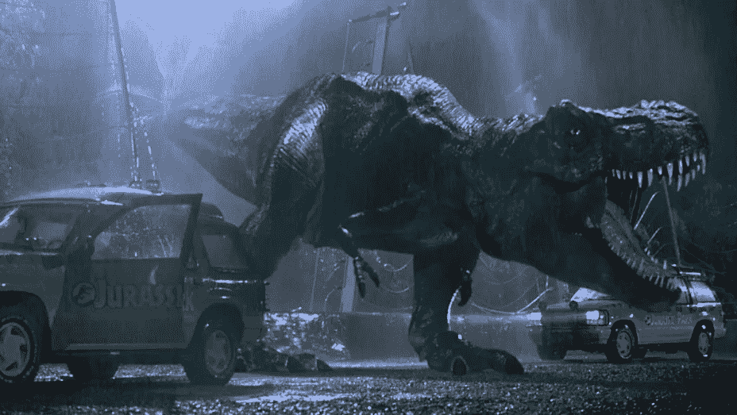
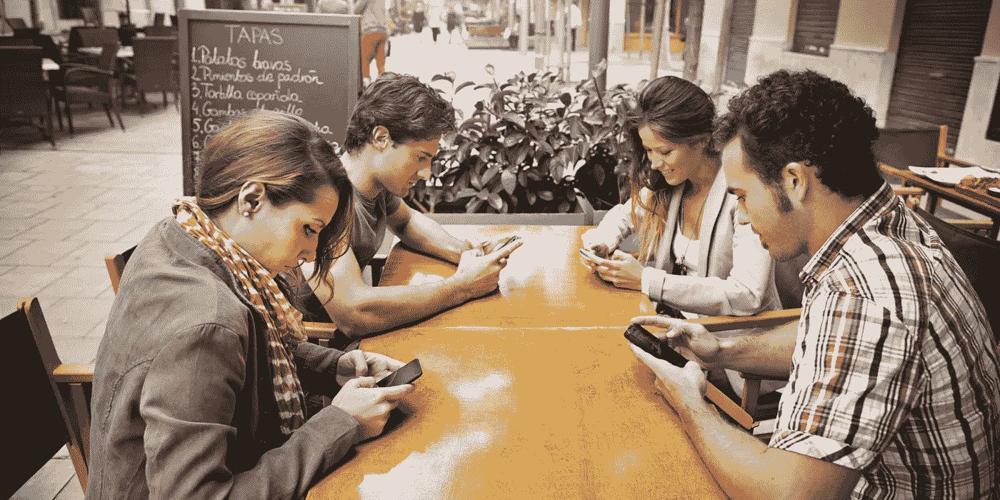
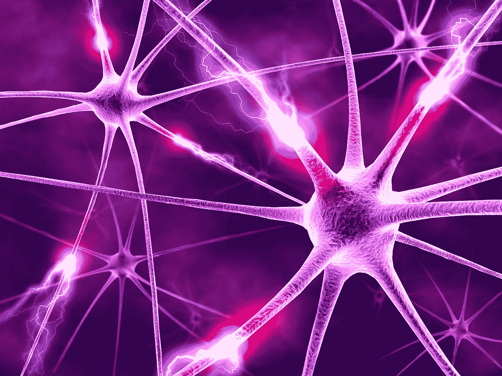

# 有技术的自由，不是没有技术的自由

> 原文：<https://medium.com/swlh/free-with-technology-not-technology-free-49159ebd7cb5>

我一直最喜欢的作家之一是迈克尔·克莱顿。当我看到电影《侏罗纪公园》的时候，我立刻就想看这本书(好样的史蒂文·斯皮尔伯格！).我记得我需要为高中生物考试学习遗传学(想想吧！)，但是我太想读那本书了。策略是:

*   阅读 30min
*   学习 20min
*   阅读 30min
*   学习 20 分钟…

…这就是我如何一瞬间读完这本书，并在生物考试中得了 19 分(满分 20 分)的原因。人们说锻炼有助于取得好的学习成绩，但在那一天，我发现了阅读。还发现了其他东西。

像克赖顿这样的作家为了写书做了很多研究，但吸引我的是他们对技术的愿景，以及如果技术落入坏人之手的伦理问题。从这个意义上说，他们的作品成为了一个警告，让我们意识到我们能做什么和我们应该做什么的极限。技术就像一面神奇的镜子，总能照出它们主人的真相。我们经常会问

-“我能用这项技术做什么？”-但真正的问题是…

——“有了这项技术，我会变成什么样？”

想知道什么是人性*变*？
看科技发达。那么…风景如何？

智能手机、智能手表、人工智能、社交网络、智能汽车，可能还有最重要的:*信息*。

我热爱技术，我经历了今天的技术能为我们做什么，但我也看到了它能为我们做什么。

你见过 5-6 个朋友围坐在咖啡桌旁，各自看着自己的智能手机吗？或者一个女孩在麦当劳给她的男朋友送冰淇淋，因为他在脸书？
一家人坐在餐厅餐桌前，一对夫妇和他们的女儿，都在看着他们的小屏幕？

有时我觉得我们从未如此紧密相连，也从未如此孤立。有时间——我的意思是——真正的时间——看着我朋友的眼睛，听他说话，好像他是世界上唯一的人。然后控制我到故意不注意口袋里的震动的地步？我一直都这样，尤其是在和别人说话的时候。自由的感觉是惊人的。

技术是我们能力的延伸，在某些情况下会超越它们。但是我们是在为技术服务而没有意识到它吗？我们相对于技术是自由的吗？

几部后启示录小说、连续剧和电影描绘了人工智能的完美成就。当它变得有自我意识的时候，它做的第一件事就是毁灭人类以保护人类不受人类伤害(奇怪…)，并保护地球。

好的。我见过很多把人类描绘成这个世界上的病毒的方式。但是如果这已经发生了呢？

如果人们如此依赖手机的事实正是人工智能控制我们的方式，而我们甚至没有意识到这一点，会怎么样？

“哦，不，那是胡说八道。我们被大型科技公司的人所控制。而不是通过某种人工智能。”

“但是，如果一个真正的人工智能不是我们想象的那样呢？”

打个比方。我们的想法暗示着微小的电荷正在触发我们的神经元。即使神经元是复杂的结构，它们也从未意识到它们以特定的方式组合会产生思想。我们说是意识。但如果我们不能断开连接，也许这意味着我们已经被这种“集体意识”及其表现形式“社交网络”所控制。

确保我们真正自由的最好方法是做以下练习:

*   抬起你的头，
*   环顾四周
*   在不拿起手机的情况下与人交谈整整一个小时。

不要关机。每次震动的时候，感受一下，但是要控制住自己想拿起来的冲动。如果你能做到。你自由了。

## 这篇文章发表在 [The Startup](https://medium.com/swlh) 上，这是 Medium 最大的创业刊物，有 277，446+人关注。

## 订阅接收[我们的头条新闻](http://growthsupply.com/the-startup-newsletter/)。

