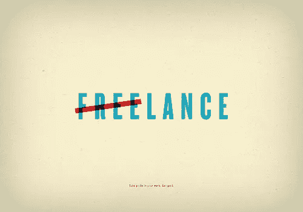

# 自由职业者:如何脱颖而出的 21 条建议

> 原文：<https://medium.com/swlh/freelance-21-tips-on-how-to-exceed-a195a7337df1>

## 如何在自由职业者中脱颖而出

对我来说，自由职业可能是最好的职业。也许这是因为我认为自己是众多**变革推动者中的一员。自由职业是这样一份工作，你可以决定如何超越并有所作为，如何脱颖而出，你将工作多少，在哪里以及如何工作。你工作是为了谋生(包括金钱因素)，但是，更重要的是，你工作是为了快乐地做你喜欢的事情。就是 [**你选择自己**](http://sethgodin.typepad.com/files/4pick-yourself.pdf) 到最充分的程度。**

**自由职业是一种生活方式，你不需要任何人的许可，只需要你自己的驱动力。那里没有人确切地告诉你该做什么和怎么做。这意味着巨大的责任，也意味着巨大的机遇。你可以决定自己投入多少时间、精力、激情和兴趣。结果取决于此。**

****

***Photo credit:* [***Steve Kodis***](https://www.flickr.com/photos/tsmk/)*.***

## **作为一名自由职业者，如何设置差异**

**这篇文章包括了许多实践，这些实践可能是你脱颖而出的燃料，调整你觉得需要改变的任何事情。毕竟，这取决于你:**

# ****1。创建你自己的个人/专业品牌****

**没有个人品牌的自由职业者就像没有气象卫星的气象员。你可以找到 [**的一些小技巧，这里有**](https://isragarcia.com/wp/40-tips-on-social-media-for-personal-branding) 。**

# ****2。问自己三个直接的问题****

**(或更多):**

1.  **选择:你为什么想开始自由职业？(提示:以下是一些有效的答案:做自己时间的主人；不是服从命令，而是领导；致力于让我快乐的事情；过着我一直想要过的生活)。**
2.  **改变:你打算做哪些和其他自由职业者不一样的事情？(提示:在为特定在线社区提供的微细分服务中寻找答案)。**
3.  **吸引注意力:我如何发现你？(提示:发挥你的创造力)。**

# ****3。通信****

**[**你做的每一件事都与你有关**](http://www.chrisbrogan.com/your-brand-is-meant-to-answer-a-question/) 。因此，你必须将你的线上和线下活动结合起来，传达一种独特的、有凝聚力的、人性化的和真实的信息。**

# ****4。选择您的客户****

**小心你的所作所为，说，分享，回应，出售或丢弃。**

# ****5。使用关联营销****

**找到你的听众(那些对你的所作所为感兴趣的人),问他们或研究你如何能增加价值并对他们有用。然后，就这么做！**

# ****6。展示你的弱点****

**做你自己，把你的所作所为与你自己的怪癖或怪癖结合起来。尽你最大的努力，公开谈论你最擅长的事情和你得到的结果，以此来反击批评。找个机会面对你最挑剔的听众，尽你所能向他们展示你自己。这不会错；恰恰相反:它能让你遇到重视你所能提供的东西的人，他们愿意和你做生意，因为你身上的某些东西能引起他们的共鸣。**

# ****7。社交媒体可以有所帮助，但并不具有创造性****

**如果你没有一个能改变你的目标市场的想法、项目、计划、产品或服务，一个真正值得冒险尝试的想法、项目、计划、产品或服务，那么我的建议是不要在社交媒体方面费心了:它不会解决任何问题。继续做一些与世界不一致的事情。社交媒体有助于向世界展示自己；然而，你的创造是你必须向世界展示的。**

# ****8。如果你产生了废物，你就会积累更多的废物****

**如果你花时间谈论别人的失败，每当有人犯错误时就指指点点，发推文抱怨你所在的行业缺乏专业化，或者八卦你的竞争对手做得不好，那么浪费就会在你家里悄悄蔓延。你自己的愤世嫉俗和消极会阻止你看到所有你可能失败的方式，以及你如何重新站起来进一步成长和脱颖而出。**

# ****9。在线声誉****

**只要你不认为一丝不挂地去见潜在客户是个好主意；只要你不在照片中赤膊上阵，“斗鸡眼”或者亲吻不是你女朋友的女生；或者只要你说的和做的没有造成伤害或痛苦，或者不能被认为是跟踪他人或以任何方式违反法律。只要不做以上任何一条，就不用担心网上口碑；只担心取得成果。**

# ****10。最佳营销****

**信守承诺。如果你说你要做某事，那么就去做，并且信守诺言。最糟糕的营销是反其道而行之。**

# ****11。你的目标才是最重要的****

**自主创业的最大缺点是所涉及的责任。做自由职业者比做雇工需要承担更高的责任。从本质上说，这是因为你从做老板或区域经理让你做什么就做什么的人，变成了有动力、敢于冒险、勇往直前并让事情发生的人。为此你需要明确的目标。**

# ****12。新国王或王后****

**重要的不是内容，而是你取得的结果。所以暂时把内容放在一边，专注于你的工作，超越市场预期，或者在 24 小时内把你的产品送到你的客户手中。如果你把这些都做好了，结果会不言自明，并带动其他一切。**

# ****13。构建您的数字帝国****

**您必须建立您的在线运营中心。攻击:流量、线索、对话、品牌和联系。防御:积极倾听、监控和社区。使用最适合你目的的平台和工具，这样你就可以把你的信息和历史发布出去，找到让人们找到你的动力。**

# ****14。工作流程****

**组织你的工作量。自由职业者是他们企业的经理、行政人员、老板、实习生和技术人员。生产力至关重要。找到提高效率的方法，并以一种能让你前进的方式优先处理你的工作。**

# **15.结构**

**定义你每周和每月需要完成的任务，这样你工作中涉及的所有领域都是完整的。考虑你所参与的不同项目的截止日期，与能在你的项目中合作的人会面，考虑他们在项目中的角色；记得给你的工作开发票，准备推销，专业再培训，让你的品牌运转起来(帖子，播客，视频或你定义的任何行为)等等。**

# **16。学习过程**

**找到学习你专业领域的最佳方法，每天至少花一个小时(如果你睡得不多，就花两个小时)了解你感兴趣的最新进展。小贴士:在地点和内容、你订阅的博客、你参加的聚会或网络研讨会方面，要小心谨慎。否则，你会不知所措，最终会花更多的时间阅读和处理这些信息，而不是工作！**

# ****17。博客****

**我的观点、经验和结果，以及许多曾经或现在是自由职业者的同事的观点、经验和结果:Juan Merodio、Carlos Bravo、Paco Viudes、Víctor Martín、Berto López、Amel Fernández 等。你应该创建一个博客来扩展你的个性、技能、态度和专长，超越你在现实生活中接触的人。**

# ****18。生产率****

**找到让你工作更轻松的工具，要么通过 [**投入同样的时间创造更多的**](https://www.robinsharma.com/blog/09/become-the-most-productive-person-you-know/) ，要么少工作多生活。**

# ****19。杠杆****

**如果你是一名自由网页设计师，工作时间足够长，积累了丰富的经验，你的个人品牌已经发展到让相当多的人对你的工作感兴趣的程度，那么你可以利用你的影响力开发项目，这些项目可以被你目前的工作所利用:例如，培训、写书或创办一家咨询公司。**

# **20。你不是为所有人工作**

**由于你必须谨慎地选择将有限的宝贵时间和有限的资源投入到什么地方(与任何组织相比)，所以这段时间只为那些你感到轻松的人工作，那些重视你的工作、你喜欢做的工作以及你觉得可以为改变做出贡献的人工作(反之亦然)。**

# ****21。控制你的自我****

**没有人能逃脱这一点。也许自我创业，靠自己，没有任何人管理你的生活，控制你的时间或监督你的结果(客户除外)会让你陷入让你相信你比任何人都好的陷阱。你可以为这种错误付出代价，但你碰壁会很有趣！**

# ****成功法则****

**你想成功吗？登顶？一切都在掌控之中？然后你必须做好准备，在接下来的 5 年里，没有休息，没有休息，没有假期，没有休息日，工作的时间比你希望的还要多，甚至超过圣诞节。做好准备并愿意经历这一切就是成功！**

**你是自由职业者，你拥有生活中最大的优势之一:掌控自己的时间。站出来并设定节奏，决定你想改变什么，找出改变的方法，然后去做。**

# **只有当你觉得值得的时候，才让这个故事震撼吧！**

*****Isra garcía =****53 位客户，42 家企业，398 次演讲，3.1221 篇帖子，23 个项目，6 本书，370 场讲座，6 家公司，9 次挑战，18 次实验，∞失败。目前为止…***

**[***有一手***](https://isragarcia.com/wp/marketer) *。顾问。扬声器。作家。教育家。经理。校长在*[***IG***](http://thisisig.com)*。博主。企业家。颠覆性创新。数字化转型。高绩效者和生活方式实验者。***

# **点击这里订阅更多类似的文章！**

****

## **这个故事发表在[的创业](https://medium.com/swlh)上，这是 Medium 最大的创业刊物，有 303，461+人关注。**

## **订阅接收[我们的头条新闻](http://growthsupply.com/the-startup-newsletter/)。**

****