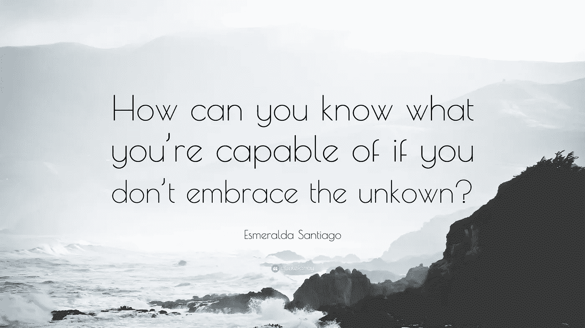

# 没有人说过这很容易，但是自由职业是艰难的

> 原文：<https://medium.com/swlh/freelancing-is-not-easy-b92bbd682c94>

## 为什么我会成为一名自由职业者，到目前为止我经历了什么

2017 年 10 月，我离开了 SaaS 一家专注于电子商务的公司的产品主管职位，去做自由职业者。

在此之前，我是一个大型分类广告应用程序的产品所有者，该应用程序主导了爱尔兰市场。我从来没有想过在过去的 5 年里我会有如此快的进步。如果有人告诉我，我会辞去这个职位去做未知的事情，我会说:*“你是个傻瓜”*。

## 原因

在过去的一年里，我经历了与我梦想中的女孩结婚的高潮，以及家庭死亡和其他不幸的低谷。在这段时间里，我一直在做我不想做的事情。我当时并没有意识到这一点，但在我父亲去世后，这一点变得清晰起来。

因此，我决定需要一段时间清醒一下头脑，我不会再回到产品主管的岗位上。相反，我要回到我喜欢做的事情:设计和帮助公司开发应用程序*(和网站)*。

你可以过着高薪、事业有成的生活，但如果这不是你想要的，那么你将永远不快乐。所以你最好做一些你喜欢的事情*(吉姆·凯瑞说的比我好很多)*。

> 你可以在你不想做的事情上失败，所以你也可以冒险做你喜欢的事情。

## 自由职业是艰难的！

我想没有人说过自由职业是容易的，但我真的没有想到会这么难。

我有过很棒的客户，但也有很多因为这样或那样的原因没有成功。我也曾有过这样的坏运气，客户在项目开始前就用完了预算，项目延期，客户从他们的公司辞职。这并不是从人们希望你每小时工作少于 8€开始的。

太艰难了！太难了，以至于我一直在和招聘人员讨论回去做全职员工。但这也有其独特的时刻。有一位招聘人员希望我改变之前的头衔，以符合他们希望我申请的职位——我没有。

但是凡事都有好的一面，我从自由职业中学到了很多。在安静的时候，我可以学习课程，目前我已经完成了 Udemy 上的三门课程，Coursera 上的一门课程，以及其他几门课程。我也开始做自己的项目。

## 我的未来

我不知道未来会发生什么。我会继续努力争取更多的客户。另外，我会留意适合我的全职工作。

*如果你喜欢这篇文章，那么如果你能* ***点击👏*** *下方按钮或分享给好友。*

*最后，了解更多关于我和我的工作@*[*Shane Doyle . io*](http://www.shanedoyle.io)

## 这个故事发表在 [The Startup](https://medium.com/swlh) 上，这是 Medium 最大的企业家出版物，拥有 282，454+人。

## 订阅接收[我们的头条](http://growthsupply.com/the-startup-newsletter/)。

