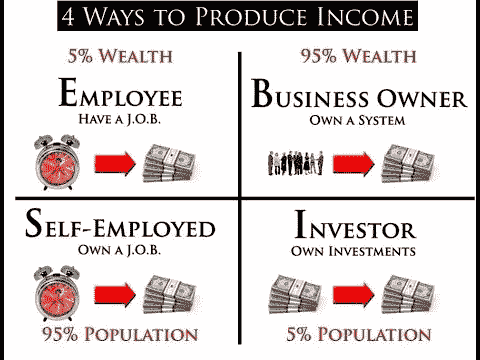

# 自由职业不是职业，而是企业家的垫脚石

> 原文：<https://medium.com/swlh/freelancing-isnt-a-career-it-s-an-entrepreneur-s-stepping-stone-2d592edd34ae>

Photo by [rawpixel.com](https://unsplash.com/photos/1OP0gh_gwlM?utm_source=unsplash&utm_medium=referral&utm_content=creditCopyText) on [Unsplash](https://unsplash.com/search/photos/stepping%20stone?utm_source=unsplash&utm_medium=referral&utm_content=creditCopyText)

孤立，没有福利，过山车收入，24/7 问责，长时间工作，没有假期，额外的压力，个体户税…

人们把自由职业和其他消极的事情联系在一起，难怪大多数人害怕迈出这一步。

现在我完全明白这有多可怕，老实说，如果不是被逼的话，我绝不会做出这样的决定…

但有一件事没人谈论:

# 自由职业并不是真正的职业，它只是通向更大事业的重要垫脚石

我开始我的自由职业生涯有一个原因，因为这是一种在我寻找另一份工作时快速创收的方式。

老实说，一开始我并不喜欢它，因为我总是习惯于每周“工作”10 个小时，然后在剩下的 30 个小时里和同事们一起闲逛…

但现在我是个体户，承担了更多的责任，就没有这个闲心了。

起初这很有压力，我想知道为什么人们会让自己经历这些，但后来随着我继续在这个新领域跋涉并获得经验，我开始认识到自己的一些不同之处。

我想我一开始并不确定这是什么，但是当我开始和朋友聊天，和老同事一起吃午饭时，他们一遍又一遍地对我说同样的话…

> “你真的成熟了，而且对你的工作有了一些热情”

这听起来总是很奇怪，我通常会用一些“是的，因为我必须支付账单”来结束它，但我越想越意识到他们是对的。

我开始变得更有效率，也更认真地对待自己，这是很难做到的，因为无论如何，你的工资都是一样的。

# 但它并没有就此停止

没过多久，我就迷上了这种偏远的生活方式，在做了几个月自由职业者的副业后(说起来很有趣，因为我的主业是找工作)…

我决定全职从事自由职业，这时事情变得非常有趣。

我最初是从簿记员做起的，因为我知道该怎么做…

但在开始工作并看到所有其他机会后，我决定转型成为一名专门从事税务的文案。

为什么我选择了文案，我不知道…

因为在我开始做自由职业之前，我甚至不知道这是什么，但我还是去做了，没多久我就爱上了这项新技能。

几个月后，当我写得相当好的时候，我开始注意到客户在登录页面设计上有问题，所以我决定参加一些课程，学习这种技能…

一些能让我在口袋里放更多钱的东西。

然后，在擅长撰写文案和创建登陆页面后，我决定我想学习电子邮件漏斗…

然后在那之后，我决定我想学习如何写销售网页…

从那以后，我决定要学习脸书广告…

我可以继续下去，但长话短说，在不到 12 个月的时间里，我学会了以前从未听说过的新技能——这给了我创业所需的一切。

# 然后是它的心理学

现在，我已经读了这么多书，上了这么多关于这个主题的课程，我甚至不知道我在哪里学到了一半，但我知道，当你试图在你的生活中做出重大改变时，你的[杏仁核](http://nba.uth.tmc.edu/neuroscience/m/s4/chapter06.html)(大脑的恐惧中心部分)变得疯狂，并尽其所能阻止你前进。

这就是大多数人所说的“极度恐惧”，作为一个在过去三年中经历过无数次的人…

我可以告诉你斗争是真实的，这就是为什么我认为自由职业是成为企业家非常重要的一步。

为什么？

这是我在看到罗伯特·清崎的现金流象限后真正确定的事情，但为了达到最想达到的商业阶段…

Robert Kiyosaki’s cash flow quadrant

然后你要经历一定的“递进”。

这一进展很重要，因为从雇员转为自由职业者对你来说并没有太大的冲击…

因为你仍然在用时间换金钱(尽管你赚得更多)，但同时，你也在学习许多商业知识，比如:

*   销售
*   个体经营
*   加强问责制

丹尼尔·迪皮亚扎所说的其他一切都是“升级”。

# 最后但同样重要的是，这是一个惊人的安全网

创业最难的部分之一就是要花费大量的时间和精力。

当然，你可以从副业做起，然后慢慢发展壮大…

但大多数工作都有一个问题，它们通常有固定的工作时间，而且不会很好地适应你的工作时间。

这是我认为自由职业是创业的重要垫脚石的另一个原因，因为你可以根据自己的喜好调整自由职业时间，最重要的是，你每小时会赚更多的钱…

让你少工作，赚足够的钱，并不断向你的梦想前进。

最重要的是，能够随时获得新的合同，并通过弹指一挥间获得必要的资金，这也非常令人欣慰(我无法告诉你这救了我多少次)…。

让你减轻大部分恐惧，继续朝着你的梦想前进。

# 我想说的是…

自由职业并不像人们说的那么糟糕，但也绝对不全是彩虹和玫瑰。

我知道迈出最初的一步并转向新的事物是多么令人伤脑筋，但是如果你放慢脚步，从自由职业开始，作为一种副业，在这个过程中学习大量的东西…

我保证你回头看的时候会很高兴你这么做了，反正我就是这样。

**附言**如果你想学习如何进一步加快这个过程，我为你创建了一个免费课程——[点击这里](https://sean-meyer.mykajabi.com/p/landing-page-freelancer)

## 这篇文章发表在[《创业](https://medium.com/swlh)》上，这是 Medium 最大的创业刊物，有 284，454+人关注。

## 在这里订阅接收[我们的头条新闻](http://growthsupply.com/the-startup-newsletter/)。

