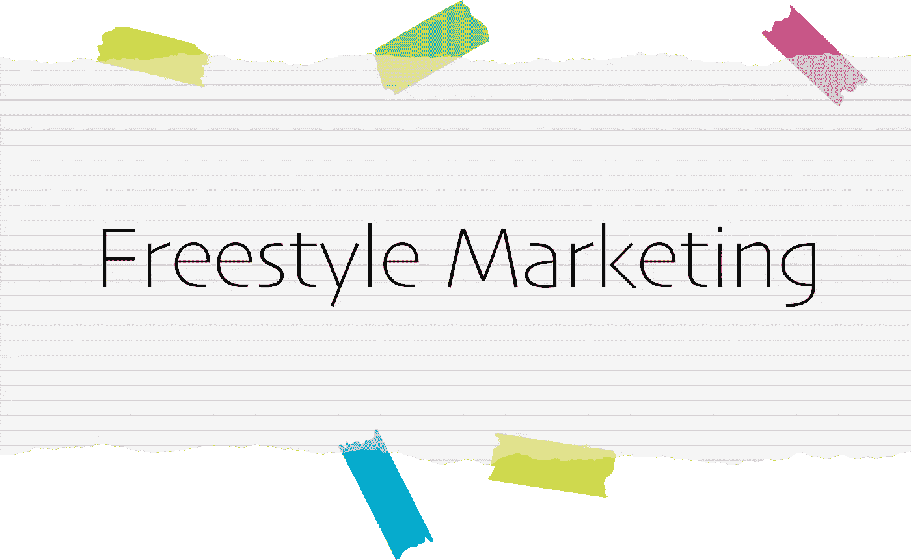

# 自由式营销:激励和建立关系的力量

> 原文：<https://medium.com/swlh/freestyle-marketing-the-power-to-inspire-and-build-relationships-ff8bc1fb570f>

作为一名有技术背景的企业家，我一直认为(部分是因为别人，部分是因为我自己)，营销远不是我的强项。当被问及“*你为营销*做了什么”时，第一直觉总是说“*没什么，我们更专注于技术部分*”。