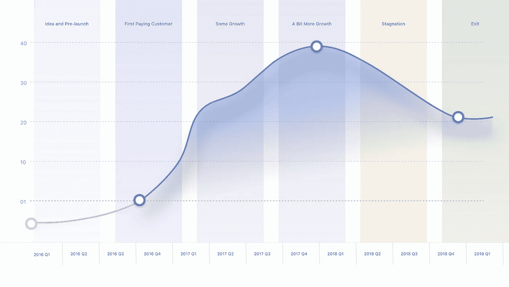

# 从一个想法到退出:我如何推出，营销和销售我的第一个 SaaS

> 原文：<https://medium.com/swlh/from-an-idea-to-exit-how-i-launched-marketed-and-sold-my-first-saas-415592e7fd2c>

这是一个关于我如何推出、营销、发展和销售我的第一台微型 SaaS——head reach 的故事。

我正在分享所有的营销框架和公式，它们帮助我在预算有限的情况下做到了这一点…

我正在为我的新公司使用同样的策略和框架。

# 摘要

早在 2016 年末，我们就推出了 HeadReach，这是一款用于挖掘销售线索的销售工具。这是一个 SaaS，它可以帮助你找到你想卖给谁的电子邮件。把它想象成 LinkedIn 加电子邮件减去高价标签。

在 3 个月的时间里，我们的产品在 MRR 的售价接近 2000 美元，拥有几千名用户。

就在我们开始增长的时候，2017 年 2 月，谷歌通过电子邮件告诉我们，他们正在关闭网站搜索 API——我们在 HeadReach 之后用来寻找线索的主要“技术”。

谷歌没有关闭我们的产品——我们设法回退到一个不同的第三方 API。然而，投下这颗炸弹对我们来说绝不是一杯清醒的冷水。

**依靠单一的第三方 API 将所有鸡蛋放在一个篮子里不是可持续的商业战略。**

谷歌爆炸后，我们试图建立自己的专有技术。我们与数据收集者进行了一场艰苦而持久的斗争，但从未找到如何在不花费太多资金的情况下索引足够大规模的数据。

在探索了无数可能的替代方案、数据库和合作伙伴之后，由于技术上的困难，我们决定将该项目置于停滞状态。

> 僵尸模式——行尸走肉项目。当产品是可操作的，但是你没有积极地工作。

大约一年后，我们找到了我们的竞争对手之一 LeadFuze，他是一位了不起的企业家，我们向他们出售了 HeadReach 用户群和营销资产。他们已经解决了技术障碍，并设法在该领域建立了可持续发展的业务，因此向他们销售是很自然的事情。

忠于我们透明的核心价值观，我将与你分享整个 HeadReach 之旅，其中有成功也有失败。

# HeadReach 时间框架

从一个想法到收购，这就是 HeadReach 旅程在时间上的样子。

Y 轴显示积极付费的客户。X 轴是以季度为单位的时间范围。

# 人头落地的数字

人力资源的一些生命周期数字和单位经济学:

*   总收入:**:18453 美元**——不包括收购 LeadFuze 的收入。
*   总费用:**:15，316 美元** —我们的营销完全是有机的，但我们有原料药的边际费用。此外，这还包括承包商的费用。
*   资金:**$ 10000**——来自我们之前创业公司的自筹资金。
*   客户总数: **230** —整个生命周期
*   注册总数: **7299** —包括试用和付费用户
*   GA 用户总数: **56，664**
*   试用 CR 访客(转化率): **12.88%**
*   试用客户 CR: **3.15%**
*   流失率:**约 12%** —由于产品的商业模式和我们吸引的低价值客户，流失率很高。
*   CAC(客户获取成本): **0** 我们还没有依赖付费获取。

Stats from GA

# 想出这个主意

HeadReach 最初的想法与最终的工具非常不同。

作为一名内容营销人员，有一天我对自己说，应该有一种工具为你的每一个内容片段创造营销机会。自动地！

第二天，我已经开始验证这个想法了。

想法是:

**HeadReach 是一款在线工具，可生成可靠的外联名单，列出有针对性的潜在客户和晋升机会。**

# 验证这个想法

我没有构建应用程序原型，而是决定关注客户交互，以此作为获取知识和验证最危险假设的最短途径。

我看了对滴滴联合创始人罗布·沃林(Rob Walling)的采访，他的一个概念真的让我印象深刻。如果要我解释的话，大概是这样的:

>一个工作软件不是一个 MVP。这是一个原型。

MVP 更像是:

**通向为您创造最多知识和为客户创造最多价值的活动的最短路线。**

在这一点上，我们想测试这个想法的最大风险:**人们会足够关心这个信息而付钱给我们吗？**

换句话说，我不得不手动创建数据列表，而不是构建自动生成数据的软件。我们去掉了 MVP 中所有不必要的东西，创建了第一个 HeadReach 版本——一个针对推广/推广列表的礼宾服务。

我的一个朋友卡尔，一个流行营销博客的创建者(最近是 MRR 媒体的联合创始人)，建议我为他的一篇文章列一个外联列表。作为交换，我会收到 HeadReach 的第一份证明。

我整理了这张清单:

另外，我为 MVP 设计了一个简单的登录页面，只有一个 CTA。

# 我们如何定义成功？

现在，我们已经有了一个示例列表和一个可用的登录页面，我们必须决定这个 MVP 的目标是什么。

对于 HeadReach MVP，我们一致认为两周内有 20 个付费客户是一个很好的验证结果。

如今我仍然尊重一条规则:

**永远要定义你的营销活动的预期结果是什么。**

它必须是可量化的和有时间限制的。

好例子:

*   两周内 20 个付费客户
*   500 次试用注册
*   培养 5%的电子邮件订户成为付费客户

不好的例子:

*   改善收购
*   培养潜在客户
*   增加 CLTV

# 如何追踪你的营销目标？

对于 HeadReach 的 MVP，我使用了一种叫做“基于量化的营销电子表格”或“假设电子表格”的东西。看起来差不多是这样

你列出所有潜在的营销渠道，你的预期结果(访客，CR 等)。)然后将您的假设与真实结果进行交叉引用，并找出您对渠道的假设是否得到了证实。

还有许多其他方法来跟踪你的营销目标。

如果你使用营销自动化软件，确保检查它是否支持某种活动目标跟踪。

我目前正在使用自动驾驶的目标。一个简洁的功能，允许您跟踪特定营销旅程的目标客户关系。

Setting up a goal in Autopilot

您可以通过使用用户段来定义转换后的用户。例如，这可能是“提交调查的用户”或“进行购买的用户”你选择你的 CR 目标和预期的时间表。然后，Autopilot 会跟踪用户在该旅程中的 CR(即漏斗),并告诉您您的情况:

如果你喜欢简单的东西，你可以去模拟和使用白板。

我们目前使用白板来跟踪我们在 [Encharge](https://encharge.io) 的上市前营销工作。在面板的左半部分，您会看到“营销”栏。周数，一周的活动，以及一周的已实现订户(我们的 KPI)。

# 营销 MVP

在营销 MVP 的前 24 小时，我们实现了:

*   登录页面上的 7% CR
*   15 个付费客户
*   20 个列表—一些客户购买了多个列表。
*   大约 400 美元的收入。我们愚蠢地低估了我们的清单，最终我们花费的钱比我们在验证过程中赚的还要多。

作为一个副作用，一个顶级的 SEO 玩家(尼克·尤班克斯)雇佣我为他创建一个外联列表，这又带来了 200 美元。

人们关心这些数据！

# **我用什么来营销 MVP？**

3 个频道:

*   我以前的电子邮件列表(500 个订户)
*   脸书集团
*   通过冷冰冰的电子邮件或 DMs 直接向有影响力的人推广营销。

长消息和个性化视频非常适合脸书群体。这是我发布给其中一个小组的视频:

对于影响者营销，我使用了一个简单的、定制的信息。没什么特别的，但它能创造奇迹:

> 嗨尼克，
> 
> 谢谢你接受我的友谊请求。我读了很多你写的关于赛尼克的文章。还没有机会看到你的电子书，但希望很快会看到。
> 
> 我只是在测试一个创造一次点击内容推广策略的工具的想法。你可以看看这里:headreach.com
> 
> 如果您有 2 分钟的时间来检查一下，我想听听您对此的看法。
> 
> 这个工具的目标是让内容推广变得极其简单。想象一下 1-click 内容推广。
> 
> 你只需输入你的网址——万岁！—你会得到数以千计的拓展机会。几个小时的辛苦建立的列表在几秒钟内转变成一个整洁的内容策略。
> 
> 目前，验证都是手工进行的。我亲自创建的名单，而不是一个自动化的工具。这里可以看到一个例子列表:
> https://docs . Google . com/spreadsheets/d/1 XP 0 xeu V6 ukhyoomn 4 ymc-xxzkk 3no 22 sxi pg 0x VH 04 u/edit # GID = 0
> 
> 让我知道？

# 做客户开发

## 2016 年 2 月

通过对 HeadReach 的一些初步验证，我们有足够的信心继续为该工具构建原型。

初创公司在这个阶段犯的一个大错误是，他们认为验证过程已经完成。他们把他们的线索列表封起来，放在一边，然后在他们电脑洞穴的阴影中消失几个月，编写他们新的超级创新产品。不对！

客户开发是一个漫长而艰难的过程。你一开始收集线索的目的不是为了列清单而列清单。而是和他们建立关系，用他们来指导你的产品创作。

问他们问题，和他们一起打电话，向他们展示你正在做的线框和原型。

这是一封我曾经发给所有从 HeadReach MVP 阶段购买列表的人的电子邮件:

> 嘿，
> 
> 我会尽最大努力在下周提供第二份名单。
> 
> 正如我提到的，我们目前正在开发一个工具来自动完成这个列表，如果你能抽出几分钟来回答我下面的问题，将会非常有帮助。我们需要 SEO 专家的意见！
> 
> 1.你现在做外联最大的痛苦是什么？
> 2。你认为列表中最有价值的是什么？
> 3。清单上有什么你想看的遗漏了吗？
> 4。请查看我们正在构建的工具的概念截图，并让我知道你的想法——上面的界面有什么不清楚的地方吗？
> 5。你会为每个列表支付 29 美元来购买一个工具吗？这个工具可以产生与我们为你制作的手动列表同样质量的结果。
> 
> 感谢您的宝贵时间！

这很简单。这样做的目的是让潜在客户参与进来，并确定对他们来说最重要的特性是什么。

A typical good response to my email

# 识别潜在买家角色

在这个阶段，你应该对你要卖给谁有一个粗略的想法。

以下是[负责](https://encharge.io)(我们的新产品)的买家角色:

下面是我用来定义角色的一些字段，以及一个名为联合创始人和 CMO·科林的角色示例:

**姓名**
联合创始人&CMO·科林

**头像**

**年龄**28 岁

**工作**个体经营

**家庭**单身

**人物**

主动、自我驱动、机会主义、努力工作

**引用**
“在按下增长按钮之前，先造出人们想用的东西。”

**动机**

有上进心，想打造一个伟大的产品，想自己当老板

**目标**

建立一个成功的 SaaS 公司，每月 5 万美元

**坎坷**

*   营销自动化掌握在开发者手中。
*   如果不询问开发人员或使用复杂、笨重的软件解决方案，就无法实现高级营销自动化。
*   需要与他的营销组合相结合，以创造有凝聚力的客户体验和更好的细分。

**生物**

在创办自己的公司之前，他从事营销工作。现在他已完全投入到自己的生意中——建立一家 SaaS 公司。

拥有 50 名付费用户和 5000 名电子邮件订户。

希望在跟踪、了解和改善顾客旅程方面变得更加成熟。

希望通过不同渠道与客户进行个性化交流。

开始考虑挽留和 LTV。

**品牌**

Slack、Trello、Gsuite、Spotify、Airtable、Chrome 扩展

**首选频道**

*   社会化媒体
*   电子邮件

**角色契合度**

和**采集策略**

随着你产品的发布和发展，人物角色会发生巨大的变化，所以把他们看作一个假设，并随着你的发展不断调整。

# 在存储库中收集您的反馈

一旦你开始从潜在客户那里获得一些见解，确保把所有东西都放在一个地方。

这是我目前用来为[费用](https://encharge.io)收集反馈的客户开发库:

这是一个 Airtable 文档，到目前为止，我认为这是收集和组织反馈的最佳方式。这是一个关于你的潜在客户、他们的反馈以及他们所处角色的数据库。

[下载文档模板](https://encharge.io/resources.html)。

我录制了一个简短的视频，向您展示如何使用该模板:

存储库有 5 个选项卡:

*   **反馈** —所有反馈会议的列表。为了方便起见，每个会话都用命名，但是您可以使用另一种约定。
*   人物——一份接受过采访的人的名单。
*   **公司** —受访者的公司。
*   **特征/抱怨** —人们的显著特征或抱怨。
*   人物角色——潜在买家的人物角色列表，这样你就可以将特定的人与人物角色联系起来。

由于 Airtable 中有一个称为链接(或关系)的特性，您可以跨存储库链接不同的记录。例如，您可以轻松跟踪所有具有特定功能或被投诉的反馈会议。或者所有你采访过的在同一家公司工作的人。或者匹配特定购买者角色的所有人。

我喜欢的另一个简洁的特性是将文件附加到特定记录的能力。(谷歌电子表格没有的东西)。我保留了所有记录的完整日志——聊天快照、录音、文件等。Airtable 与 Google Drive 和 Dropbox 无缝集成，这让它变得更加容易。

# 下水前压头延伸

## 2016 年 3 月

收集了一些验证和客户反馈后，我们开始开发产品。

我写了一本关于推广营销的大型电子书，用来为 HeadReach 收集发布前的线索。这与我目前为增加 [Encharge](https://encharge.io) 的预发布受众所做的事情非常相似。

随着 HeadReach 的收购，LeadFuze 现在拥有了这本书的版权，所以你可以[从他们的网站上下载。在这里，您还可以看到登录页面，我曾用来生成发布前销售线索。](https://www.leadfuze.com/ebook/)

这本电子书帮助我们制造了大量的轰动效应，并在发布前吸引了一些注意力:

*   3 周内有 1280 名用户
*   550 名有机推特粉丝。

不幸的是，我们从未真正利用 HeadReach 的社交媒体订户，但预发布订户是 HeadReach 的早期驱动力。

你可以把我们在发布电子书时使用的很多营销策略复制到 kickstart 的几乎所有电子邮件列表中。

我们做对了几件事:

# 优秀的登录页面

我创建了两个预发布登录页面——一个是电子书的登录页面，另一个是 HeadReach 产品本身的登录页面。

这是产品的登录页面:

电子书的那个(解剖):

# 闪电式营销活动

我们做得很好的第二件事是我称之为闪电战的营销活动。

> **闪电战营销**——短时间内非常密集的营销活动。

虽然像 SEO 这样的方法依赖于缓慢、有条不紊的增长，但闪电战营销就是要在短时间内变得强大。对于 HeadReach 预发布，这是 2-3 周。

有了闪电战营销，你也可以更自由地分享你的内容。因为你的目标是在最短的时间内获得最好的结果，所以即使没有规范的链接，在多个渠道和渠道上重新发布相同的内容也是完全可以的(这在 SEO 世界中会被认为是异端邪说)。)

我们在发布前重点打击的一些渠道包括:

*   Reddit (798 次会议)
*   脸书——主要来自团体(742 次会议)
*   ProductHunt (595 个会话)
*   测试列表(530 个会话)
*   中等(348 个会话)
*   和我的个人博客(保加利亚语)

我们执行的营销策略:

*   整合病毒共享循环
*   在外部渠道(媒体、Reddit 论坛、群组和其他社区)上重新发布内容。
*   ProductHunt(这是针对电子书的，不是真正的产品发布会，我稍后会详细介绍)
*   测试列表
*   在我的个人博客上写内容

# 整合一个病毒环

对于这本电子书，我们使用了一个叫做 Gleam 的工具。Gleam 帮助您运行赠品、奖励和其他很酷的小工具，以帮助您收集更多的电子邮件。

虽然他们的重点是赠品，但他们有一个名为“奖励”的应用程序，这是一个更先进的社交支付平台。想想“用 Tweet 支付”,但是有更多的选择和灵活性。

我最初的想法是，我们应该要求:

*   电子邮件
*   一条推特
*   Twitter 关注
*   和推荐

一个完整的 4 步注册过程，以获得电子书。我错了。只有大约 3%的用户能够到达最新一步并下载电子书。大多数人在第三步后就放弃了。

我们取消了推荐步骤，只要求一封电子邮件、一条推文和一个关注。完成所有行动的人的转化率急剧上升到 8%。

你也可以看看更强大的病毒分享工具，比如 UpViral。我会推荐 UpViral 给更高级的营销人员或定期做赠品的人。它提供了一些强大的功能，如抽奖、登录页面和电子邮件 A/b 测试、线索欺诈检测、一键式电子邮件注册(想想 UTM 链接)、高级报告等等。

# Reddit 上的回收

如果你还不知道，Redditors 讨厌你。他们对任何形式的晋升都非常敏感，并且寻找最小的机会用讽刺的话来嘲笑你的男子气概。

以下是如何把 Reddit 做得更好:

1.  写一篇优秀的内容片。
2.  发布到 Reddit 上。你必须在线发布你最好的内容，也就是说，作为一个文本帖子，而不是一个外部链接。
3.  让你的朋友投票支持你的帖子，以获得一点点初始牵引力。**重要提示:**不要将它们发送到确切的帖子 URL(深度链接)，因为你有被屏蔽的风险。把他们发送到 Subreddit，让他们找到你的帖子，并从那里投票支持。
4.  如果你遇到一个愤怒的 Redditor，不要气馁，也不要对抗。
5.  回收你的文章，并将其发布在不同的子编辑中。我有一个完全相同的帖子，在一个子栏目中得到了 0 票，在另一个栏目中得到了 124 票。注意不要做过头！我建议不要超过 3-4 次，循序渐进——每天一次。在太多的 subreddits 上重新发布你的帖子会让你被禁止(不要问我，但我知道。)

通过这些步骤，我成功地打破了我在 Reddit 上的个人记录，并获得了超过 100 次投票，50 条评论和 9.40%的电子邮件订阅率。

# 在介质上重新发布

我没有设计一个中等策略。我只知道这个帖子在 Medium 上表现会很好，因为它已经在 Reddit 上表现得很好了。

当时，我在 Medium 上有 600 名粉丝，因为我把我的 Twitter 账户和我的 Medium 账户连接起来了。

我的第一篇媒体文章获得了近 1000 次阅读，给 HeadReach 带来了数百次访问，令人兴奋的是电子邮件订阅者的 CR 达到了 24.64%

如果我不得不再次做这个练习，我会使用一个叫做 Upscribe 的免费工具。它允许你将电子邮件形式嵌入到你的媒体文章中。不幸的是，Upscribe 在这个故事发生时还不存在。

# 在 ProductHunt 上发布电子书

那时，我在 [ProductHunt](https://www.producthunt.com/posts/the-champion-s-guide-to-outreach-marketing) 上发布了我的推广营销电子书，我已经收集了大约 400-500 个电子邮件订户。

我给他们发了一封简短的电子邮件，让他们评论我关于 PH 的电子书(而不是投赞成票):

书籍在 PH 上得到的关注比产品少得多，但这也是脱颖而出并成为当天第一名的好机会。

这是一个巧妙的举动，产生了数百个预发布线索。

# 测试列表

在 BetaList 上发布 HeadReach 后，HeadReach beta 有了几百名订阅者。

这些天来，我不太喜欢 BetaList。我们在他们的网站上提交了几个其他产品，但从未真正从那里得到任何好的线索。感觉大部分线索都是没有生意的好奇的创业者。除非你的受众是刚起步的人，否则你最好去别的地方进行预发布。

# 脸谱网

在 HeadReach 网站发布前，脸书是第二大浏览量最多的频道。大多数脸书的观点来自脸书团体。

脸书也是我在筹备[冲锋](https://encharge.io)时非常依赖的一个渠道。

# 建筑顶部延伸

在我们的预发布活动——总共约 1500 封电子邮件，25%的登录页面 CR——的牵引下，我们开始开发产品。

我的联合创始人制定了一个发展路线图:

在接下来的几个月里，我们试图开发出我们承诺的工具。

## 2016 年 4 月

四月大部分时间都在找人帮助我们开发。事实证明，在我国找到合适的开发商相当困难。我们甚至尝试工作。

招人时使用 UpWork 的小贴士:确保避开中介。自由职业者通常比中介便宜，但通常很难区分他们。

最后，我们设法吸引了我的前联合创始人，他也是一个很棒的开发人员，尽管他有着丰富多彩的个性，我认为这一点都不可耻。不用深入太多的细节，我会说在这个故事发生的时候，他正生活在一个宗教派别里。

**当月错误:不够专注**

我们构建了太多的功能。即使在路线图上，您也可以看到一整套 6 个功能。我们应该只关注第一个特性。

**当月费用:**

$101

主要是营销电子书和电子邮件列表的营销费用:

*   Gleam.io
*   主动运动
*   Yumpu 电子书预览
*   主办；主持
*   MXToolBox(黑名单监控)
*   Quoo(内容推广)

## 2016 年 5 月

梅有点奇怪。我们建立 HeadReach 已经一个月了，但我的联合创始人仍然在经营我们以前的业务。

尽管我们已经节省了 1 万美元，但我们还是害怕关闭之前的业务。

在两个项目之间周旋是很困难的。如果我不得不重新再做一次，我会更快地关掉我们之前业务的灯。

**当月费用:**

$683.开发承包商的第一笔费用。

## 2016 年 6 月

我们把六月献给了风投和天使投资人。我们正在考虑寻找外部资金来帮助我们更快地发展 HeadReach。

我们被 10 个不同的加速器拒绝了。

我不会说太多细节，因为这个话题值得有自己的文章，但投资者不是我们的好对手。因为做了错误的事情，我们那个月损失惨重。

**本月费用:**

$481

# 尝试预售 HeadReach

## 2016 年 7 月

随着我们杂乱的原型的演示视频，我开始向一小部分早期采用者展示 HeadReach，他们是声音最大、最有既得利益的人。我不想毁掉整个邮件列表，因为我们不确定我们展示的内容是否相关。我们没有建立账户或计费系统，但我正竭尽全力预售产品。

以下是我用来尝试预售该工具的信息:

HeadReach 更新+外展冠军特别优惠

> 嗨伙计们，
> 
> 我是伽罗。我们一直在忙于开发我们的外联列表工具，终于准备好了第一个功能。仍处于早期发展阶段，但作为这个团队的一员，我想先向你们展示我们的成果。
> 
> 通过页面提及，我们可以显示所有与你在文章或网站中提到的网站域名/公司相关的人。
> 
> 查看“nma.vc”的示例结果—【http://headreach.info/web/site/submitkeyword/?id=5247747C 
> 
> 这只是我们正在开发的 25 个模块中的第一个，我们仍在对其进行扩展，希望能提供 3 倍以上的结果。
> 
> ———特殊交易—
> 在 1 个博客帖子或网站的 URL 下输入评论，我会通过我们的工具运行它，并通过 PM 或电子邮件将结果完全免费地发送给您。
> 
> 如果你喜欢搜索结果，你可以订购 5、10 或 15 次搜索的预付费包。
> 
> 页面提及
> 预包装# 1–5 搜索—50 美元
> 页面提及预包装# 2–10 搜索—90 美元
> 页面提及预包装# 3–15 搜索—130 美元
> 
> 这些是早期支持者的软件包，一旦我们在 9 月份公开推出该工具，就可以享受 15%的终身折扣。
> 
> 你可以马上使用搜索。只需将您希望我们通过该工具运行的 URL 发送给我们。或者保留您的搜索，以备我们构建其他功能时使用。(下一个模块是“影响者”,将于下周末完成)。
> 
> ———如何订购—
> 将钱发送到 PayPal 邮箱“电子邮件保护”,并附上关于您订购的包裹的说明以及您希望我们搜索的网址。或者通过 PM 或受保护的电子邮件与我联系
> 
> 如果你对结果不满意，我们保证 100%退款。
> 
> 通过订购一个包，您将支持我们的自举创业，并帮助我们支付我们的服务器和付费服务的费用，我们现在向您展示这些准确的结果。
> 
> 免责声明
> 此交易先到先得，数量极其有限！
> 
> 如果我们不能接受您的订单，请不要生我们的气。我们正在努力使这个工具成为最好的推广营销工具，但这是有代价的——我们正在处理繁重的服务器性能、复杂的 bug 和几乎所有来自自举软件创业的东西。让我知道你的想法？
> 
> 确保为视频选择高清！

不幸的是，我们的预售努力从未实现我们的希望。我们一个预购订单都没拿到。

随着我们预售的希望破灭，我们重新开始制造产品。

# 售前技巧:使用原型软件

如果你还没有准备好演示你的产品，你可以使用像 Adobe XD，Sketch 或者[漫威](https://marvelapp.com)这样的工具从你的静态设计中模拟一个交互软件。如果你不是网页设计师，漫威是最容易使用的。你可以创建视觉原型，比如这个——我们为自己的一个想法制作的原型。虽然这有点超出了营销人员的技能范围，但我还是强烈建议你掌握一个可视化软件的窍门，它可以帮你节省与团队设计师之间的来回奔波。

# 解决方案支点

## 2016 年 8 月

从 2016 年 3 月到 2016 年 11 月的公开发布，我们一直在打造这款产品。当我说建造的时候，我的意思是我们花了 80%的时间去想如何建造它。

创造销售线索是一个很难进入的领域。从 LinkedIn 这样的锁定来源删除大量数据，只有最精明、最受金融青睐的公司才能做到。我们都不是。

我们被迫做出一个重要的产品或“解决方案”支点——我们不得不大幅限制 HeadReach 的功能集，使其只能找到潜在客户的联系人。这是我们让这东西起飞的唯一方法。

> 支点是“旨在测试关于产品、战略和增长引擎的新基本假设的结构化过程修正。”

枢轴类型:

你可以在这里阅读更多关于创业枢纽金字塔[的信息。](https://500.co/startup-pivot-pyramid/)

# 首次产品反馈

## 2016 年 9 月

9 月份，我们为 HeadReach 进行了一次产品演示，但效果非常糟糕，甚至连核心功能都几乎不起作用。

更糟糕的是，在这一点上，我们的预发布线索变得非常冷淡。如果说我在培养潜在客户方面学到了什么，那就是你应该通过至少每周或更频繁地发送一封电子邮件来保持他们的热情。

> 3 个月内没有和你的潜在客户联系，你可以认为你的电子邮件列表已经失效。

为了找出如何定位我们未来的测试版，并更好地细分和编排测试版邀请，我们在[组织了一次调查](https://iteratehq.com/headreach/57a8f2fad197c40001000047)。Iterate 中调查的一个优点是，即使有人没有提交调查，他们也会记录答案。

该调查还有助于我在与潜在客户沟通时识别销售信息。我在登录页面的副本中使用了调查的答案。

例如:

会成为我们最终的 USP:

当你的客户可以为你写销售文案时，为什么还要考虑呢？

没有浪费太多时间，我展示了该工具的第一个演示，并向 15 位早期采用者发送了电子邮件:

我用那段视频传达的信息是:

> HeadReach 更新
> 
> 我要展示的是第一大需求功能——一个潜在客户发现工具，它将帮助你在几秒钟内通过真实的电子邮件和社交资料找到目标客户。单击“播放”观看我们新功能的 5 分钟视频。
> 
> 作为 SEO 和内容营销人员，我们知道:找到合适的人去接触是一件非常困难的事情！
> 
> 搜索相关人员花费了太多时间。
> 
> 一旦你确定了他们，就需要花更多的时间来追踪他们有效的电子邮件地址和社交资料。
> 
> 然后，你必须找到每条线索的独特之处，以增加你与那个人联系的相关性。这就是为什么我们正在创造一种最快捷的方式来找到合适的外联人员，而没有通常的麻烦。
> 
> 新功能:使用我们的人员查找工具，每次线索搜索最多可节省 20 分钟。
> 
> 只需轻轻一点，就能找到需要联系的人。直接访问任何人经过验证的电子邮件、社交资料、工作职位和个人简历。
> 
> 或者:
> 
> 浏览一篇博客文章，找到你需要的所有相关联系人，开始你的推广活动，通过接触合适的人来推广你的内容
> 
> http://fortunelords.com/start-a-blog/->[http://headreach.info/web/prospector/post/5246724G](http://headreach.info/web/prospector/post/5246724G)的示例结果
> 
> 如果你想让我们测试你的搜索给我一个名字，公司，域名或邮政网址，我会把结果发给你。
> 
> 我在寻找一些反馈。您对我们的人员查找功能有何看法？

# 第一次产品演示的结果

在我们决定开发 HeadReach 近 5 个月之后，我们终于从有兴趣购买该工具的人那里收到了一些很好的反馈和一些强烈的信号:

> 嗨，伽罗
> 
> 谢谢你。我真的很喜欢你的工具有很多深度。
> 
> 获取照片、电子邮件、位置和社交媒体资料——单个网站的大量数据。所以我们可以很容易地找出正确的决策者。
> 
> 现在不要费心运行剩余的搜索。专注于尽快准备好产品。由于您花了一些时间来回复，我们完成了该任务的外展活动。
> 
> 但是，如果我们有头伸，我们会节省大量的时间。因此，headreach 的价值显而易见。
> 
> 随着开发工作的进行，一切顺利。当它准备好的时候，我真的很兴奋去尝试它。
> 
> 谢谢

我们继续开发产品。

# 封闭测试版发布

## 2016 年 10 月

大约在 2016 年 10 月，我们在 WordPress 和 WooCommerce 上建立了一个基本账户系统，进行了某种形式的封闭测试。对于 SaaS 来说，这是非常非常规的设置，但对我们来说，这是最快的营销方式。回想起来，除非必要，否则我不会推荐它。

## 初始反馈

我已经向少数选定的早期采用者发出了邀请，请他们试用该工具。

回复来得相当快。

这不是我们所期望的。人们平均分成两个阵营，两个阵营都有同样糟糕的反馈。

第一组抱怨软件根本无法工作，这并不奇怪。HeadReach 的第一个版本漏洞百出，开发不足。

**第二组**对产品不是我们在预发布活动中承诺的感到失望。也就是说，对我们的解决方案中心不太满意。

太可怕了。我们的封闭测试失败了。没有人成为付费用户。

我们不知道我们错在哪里。

拥有 1500 多条线索和零付费用户，我们真的陷入了困境。我们渴望在我们的市场或技术上有所突破。

# 一个突破

大约在 2016 年 10 月，我发现我们可以使用谷歌的一个 API—[谷歌网站搜索](https://enterprise.google.com/search/products/gss.html)来显著改进我们的产品。

后来，该 API 成为我们基础设施的核心部分。以至于如果没有 GSS，HeadReach 就不会成功。

接下来的两个月，我们使用新发现的技术从头开始重新构建产品，以使我们的产品更容易被使用。我的联合创始人白天全职工作，晚上兼职建立 HeadReach。

# 公开发布和首批 10 个付费客户

## 2016 年 11 月

我们最终在 11 月中旬左右公开推出了 HeadReach。

我仍然记得我们是如何观看我们即将成为第一个付费客户的现场会议记录的，当他在账单页面和其他页面之间跳跃时跟踪他，直到他最终订阅了 49 美元/月的计划。

我们获得前 5 名客户的方法在概念上很简单，但执行起来非常困难。是的，我明白你的意思，这不是营销**自动化**，但有时你不得不做一些艰难的事情。你知道，PG 关于做不可扩展的事情的标志性文章。

我向一些发布前的订户发送了个人视频信息。如果你还记得我们在 9 月份做的细分调查，我正在使用这些信息为每个用户制作个性化的信息。使用 CloudApp 录制您的屏幕非常简单。也一定要露脸。

例如:

*   如果是一家网页设计代理公司，我会向他们展示如何使用 HeadReach 来获得更多的代理客户。
*   如果是一个 SEO/内容营销人员，我会解释如何做推广来获得更多的链接。我做的是更好的创业公司所说的客户成功。

**在 HeadReach 公开发布的第一周，我总共录制了超过 2 个小时的个性化视频。**

除此之外，我们还提供 50%的终身折扣。这不是一个惊人的长期战略，尤其是当你有边际成本时，但它是一个相当不错的动力助推器，可以帮助你起步。

电子邮件:

还有个人视频:

他的回答是:

# 使用 Inspectlet 获得主动支持

在推出该产品的第一个月，我们非常依赖 Inspectlet 来主动跟踪我们的用户正在做什么以及他们在哪里遇到了困难。由于我们没有那么多用户，跟踪他们每个人在应用程序中的行为相对容易。

当我看到有人遇到应用程序的问题时，我会为他们录制一段个人视频，并亲自指导他们。这与早期采用者折扣相结合，是我们获得前 10 名客户的一个因素。

**提示:**安装 Inspectlet 或 FullStory，分配至少 20%到 30%的时间进行主动支持，直到你获得第一批付费客户。把它看作是客户成功和客户发展的一体化。

# 公开发布电子邮件序列

除了个人邮件，我还为整个邮件列表准备了一个简单的 3 封邮件启动序列。

**电子邮件 1**

第一封邮件是一封普通的“我们是现场直播类型的邮件”

**电子邮件 2**

第二封邮件是一封基于价值的邮件，描述了 HeadReach 工具的可能用例。

**电子邮件 3**

第三封邮件是带有稀缺元素的促销跟进邮件。

# 安德鲁·华纳成为我们的第一批付费客户

我是 Mixergy 的 Andrew Warner 的超级粉丝，他是创业社区最有影响力的人之一。

当我在高级 Mixergy 脸书集团闲逛时，我偶然发现了这块宝石:

Andrew 付费运行 Mixergy 的工具列表。你可以注意到我们的直接竞争对手 RocketReach。

我没有拖拖拉拉太久，就直接去推销了:

在安德鲁的许可下，我给他和他的团队发了一封电子邮件:

还有视频:

加入 Mixergy 团队并非一帆风顺。我不得不跟进两次。当他们最终签约时，我不得不为他们做大量的人工潜在客户。Andrew 的 VA 告诉我她需要哪一个人，我尽一切努力找到这封邮件，包括大量的谷歌搜索，使用其他工具等等。

总的来说，这是一次极好的入职体验，让 Andrew 写了一份推荐信，后来又在 ProductHunt 上找到了工作。

# 2 个月内从 10 个到 40 个付费客户

## 2016 年 12 月至 2017 年 2 月

2017 年初对 HeadReach 来说相当不错。我们网站的流量在缓慢但稳定地增长，我们将 10%到 20%的流量转化为试用。

增加我们的冷流量的一个重要因素是客座博文。

# 链接建设和来宾张贴

虽然我很喜欢 SEO，但说到 HeadReach，我从来没有为 SEO 果汁做链接建设和客座博文。这一切都是为了获得流量。快点。

以下是如何做好交通权的链接建设:

# 发现好文章的机会

有几种方法可以发现绝佳的客座博文/链接建设机会:

**1) Google 顶级种子关键词，展望前 10 篇文章。这些文章获得了巨大的流量。**对于 HeadReach，这是“查找电子邮件地址”

**2)谷歌搜索竞争对手综述。您所在类别的产品或服务列表。对于 HeadReach 来说，这意味着销售工具的列表。请他们展示您的工具，并确保向他们演示您如何与列表中的其他人竞争。**

**3)找到死去的竞争对手，进行“断链”外联。**

我们有一个名为 Emailbreaker 的老竞争对手，它已经关闭了一段时间。我使用了[反向链接监视](http://www.backlinkwatch.com/)工具来查找包含指向现已关闭的 Emailbreaker 软件的活动链接的页面。

然后用 HeadReach(当然)找到负责有坏链接的帖子或页面的人，我给他们发了一封电子邮件，建议他们用 HeadReach 的链接替换坏链接。

这封邮件帮助我们获得了 Yesware 文章中的一个链接，它成为了我们的第一大流量来源。

虽然，从访客到试用的转换率在没有合格受众的漏斗顶部文章中并不引人注目(大约 0.5%，相比之下，HR 的全平台 CR 为 3.5%)，但它是品牌知名度的一个极好来源，通常显著的流量弥补了低 CR。

# 另一个支点——转向销售受众

2017 年 1 月左右，我们在 MRR 创造了大约 1000 美元的收入。

根据顾客的反馈，我们决定将产品转向销售对象。

这不是我们做出的最容易的决定。销售领域异常饱和——有几十个直接竞争对手和数百个替代品。

幸运的是，我们很好地处理了这一点，在客户旅程的任何阶段，pivot 都没有导致 CR 的降低。尽管要求提供公司的电子邮件和电话号码增加了注册过程中的摩擦。

与流行的利基市场理念相反，对我们来说，进入水平市场最终是一个明智的决定，它让我们有更多的机会，并使我们的营销工作更容易。

# 启动 ProductHunt

在此期间，我们还推出了 ProductHunt。

ProductHunt 是早期用户和潜在付费用户的绝佳来源。

现在，我不会过多讨论如何成功启动 ProductHunt。但是，我可以总结几个要点:

*   找一个在社区有影响力的有声望的猎人。关于如何让人们购买你的产品，已经有很多文章，但我的建议可以归结为:与有影响力的人建立有价值的关系。有一些快捷方式，如搜索猎人，寻找产品定期提交。如前所述，我们设法让安德鲁·华纳来追捕我们。
*   **你必须有一群人准备投票支持你**——一个脸书团体或一个电子邮件列表。培养你的社区，然后让他们在 PH 上宣传你和你的产品。
*   **做好准备**——为发布日和发布前几周做好周密的计划。最成功的活动是那些精心策划到最细节的活动。
*   你有什么不公平的优势吗？ —例如，我们利用了作为一家来自技术有限的小国的创业公司的优势。在保加利亚发布一个引导软件是一个小型的庆祝活动，因为很少有人这么做。一个小但团结的社区聚集在一起，帮助我们的小创业公司爬上 PH 排名，并达到前 5 名。

在我们提交 PH 后的第一周左右，我们设法获得了十几个付费客户。此外，PH 是未来几个月的主要流量和主要来源。

# 培养销售线索

随着来自 ProductHunt 的全新流量和所有客座博文的线索不断涌现，我们不得不专注于客户漏斗的下一阶段——培育阶段。

> **79%的营销线索从未转化为销售。缺乏潜在客户培育是绩效不佳的常见原因。**

根据 [MarketingSherpa](https://www.marketingsherpa.com/) 。

对于您的企业来说，这个数字是低还是高并不重要。不容置疑的事实是，在漏斗的培育阶段，你必须至少有两种营销活动:

1.  基于时间的入职/培养电子邮件序列。
2.  基于行为的入职/培养电子邮件序列。

这两场运动是最起码的。

让我们深入了解一下我们是如何在 HeadReach 开展这两项活动的。

# **基于时间的 9 封电子邮件入职流程**

我们将每一个注册 HeadReach 的新用户都推送到一个简单的基于时间的广播电子邮件序列中。这个序列的目的是提供尽可能多的价值，并就该工具的可能用例对潜在客户进行培训。

# **基于行为的培育序列**

我们建立的另一个序列是基于行为的电子邮件活动。我们使用 HeadReach 的 API 触发器来触发 ActiveCampaign 中的不同电子邮件。

例如:

*   如果用户没有使用任何试用信用，请发送电子邮件。
*   当用户使用了 3 个试用积分时发送电子邮件。
*   当用户用完所有免费点数时发送电子邮件。
*   当用户使用了所有免费点数但没有升级时，发送跟进消息。

基于行为的电子邮件是一种超级强大的方式，通过在正确的时间发送正确的信息，将您的线索转化为付费客户。

# 稳步增长

大约在 2017 年 2 月，我们的微型 SaaS 出现了转机。

我们设法在 MRR 发展到几千名客户和大约 2，000 美元，营销和 CAC 的支出为零。

我主要关注已经在我们身上奏效的营销策略——链接建设、撰写客座博文以及与销售领域的横向软件工具建立合作伙伴关系。

我让 HeadReach 出现在许多销售渠道上，比如 Close.io 博客、RecruitingTools.com、许多媒体出版物等等。

我们也看到了一些口碑的有机增长。越来越多的人在谈论自动化销售和创造潜在客户时开始提到 HeadReach 工具。正是我们想要的。

为了能在 HeadReach 上全职工作，我解雇了当时所有的自由客户。我早上 5 点起床，故意让自己忙于营销活动，直到下午晚些时候。

事情看起来不错。

一切都很好，很乐观，直到有一天，我的联合创始人丹妮给我转发了一封来自谷歌的电子邮件。

# 当谷歌关闭他们的 API 时

## 2017 年 3 月至 7 月

主题行是:

> **“经办人:法务部”**

你不希望收到谷歌发来的带有该主题的邮件。

起初，我就像“哦…又来了，谷歌试图关闭我们，因为我们用它们来索引受保护的数据。”(这不是我们第一次通过谷歌系统做灰色的事情。)

当我看到完整的电子邮件时，情况比这更糟:

他们正在关闭他们的搜索 API。对我们来说，这不是什么特殊待遇。每个人的搜索 API 都在下降。

为了让您了解一些上下文，而不至于被这个 API 的技术细节烦死:

我们让 HeadReach 立足的主要技术是谷歌网站搜索(GSS) API。通过这个 API，我们从 LinkedIn 等来源获取数据。结合其他一些 API 和我们内部的算法，我们能够提供一个完整的线索数据库，而不需要在基础设施、爬行、服务器等方面投入大量资金。

我们有两个选择

1.  继续使用谷歌搜索 API 的“降级”版本。起初，我们不确定这是否可行，但是经过与 Google 支持团队的反复沟通和一些本地测试，我们发现使用非高级版本的 API 也是可行的。
2.  构建我们自己的“谷歌应用编程接口”,用于索引 LinkedIn 的信息。最好的反弹。不幸的是，也是最困难的。

第一点更容易执行，但长期来看不太可行。

谷歌扔给我们的电子邮件就像一杯令人清醒的冷水。我们很快意识到我们正在建造一座纸牌屋。把我们自己完全交给大 g 的摆布。

我们的目标是创建一个可持续生活方式的企业。然而，在我们未来 12 到 18 个月的路线图中，我们并没有打算建立一种专有的报废技术。

我们决定试一试，看看我们是否能自己建造一些东西。

# 试图建造我们自己的废品收购站

2017 年 3 月至 7 月这段时间对我们来说相当痛苦。

我们必须解决一个非常棘手的技术挑战——如何在预算有限的情况下索引数亿个页面。准确地说，我们每个月要抓取大约 2 亿个页面。

我们花了几个月的时间学习报废，与该领域的不同专家交谈，讨论与潜在数据源的合作关系等等。

尽管进行了艰苦持久的战斗，我们从未真正设法让我们的爬虫能够在不倾家荡产的情况下抓取如此大量的受保护数据。

总的来说，我非常乐意花时间参加这次挑战。我学会了超越我的技能限制，足智多谋。

# 决定继续前进，让产品日落西山

## 2017 年 8 月

经过几个月与技术相关问题的累人战斗，我们决定拔掉 HeadReach 的插头，将其置于日落模式。我们不想在一个没有长期潜力的产品上投入时间和资源，即使它表现出一些良好的初始牵引力。

这不是一个容易的决定，但我仍然相信这是正确的。

HeadReach 一直运营到今年夏天。多亏了我们的营销自动化系统，这个网站仍然在产生新的访问、试用和付费客户，尽管随着时间的推移略有下降。

# 销售范围

## 2018 年夏季

在以僵尸模式运行了近一年后(有生命，但没有积极开发)，我们想结束这个项目，并接触了我们的一个竞争对手。

经过一番反复，我们同意将用户群和营销资产出售给 LeadFuze，这最终结束了我们与 HeadReach 的创业之旅。

我不能透露收购价格，但我会说，出售 HeadReach 比在暗处杀死它要好得多。

# 我们的前方是什么？

在从创业现场短暂撤退并尝试了一些不成功的产品想法后，我们终于回到了下一个大项目的工作轨道上。

Encharge 是一个强大而简单的营销自动化平台，旨在帮助您将订户培养成客户。

## 这篇文章发表在[《创业](https://medium.com/swlh)》上，这是 Medium 最大的创业刊物，有+ 372，747 人关注。

## 订阅接收[我们的头条新闻](http://growthsupply.com/the-startup-newsletter/)。

