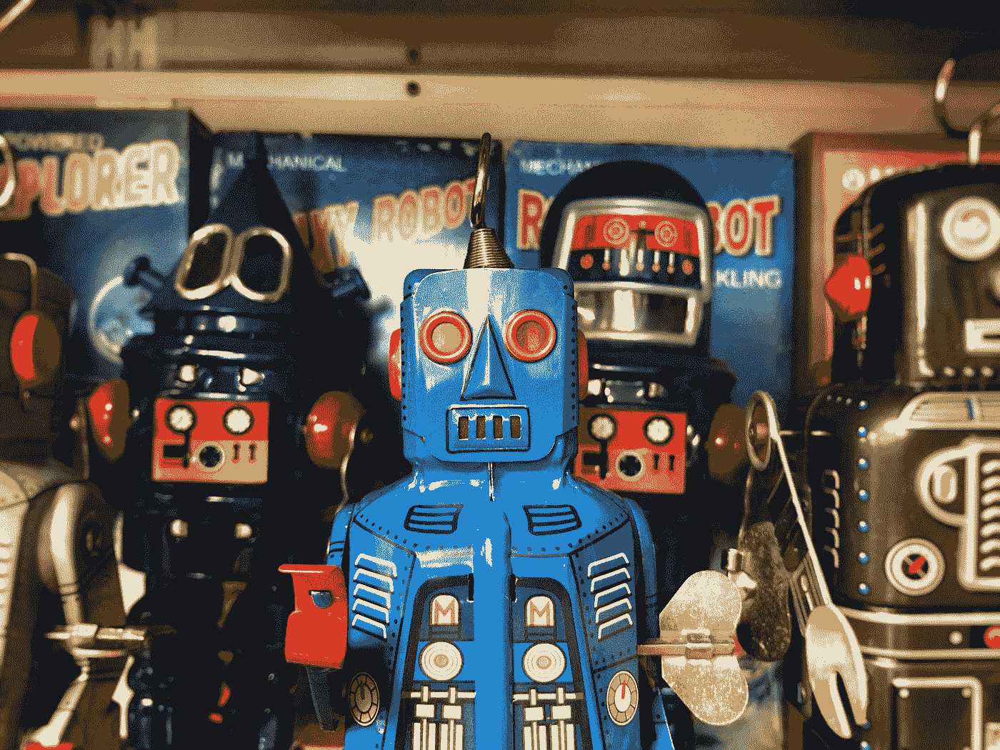

# 从工厂到好奇心——我们如何利用自动化革命？

> 原文：<https://medium.com/swlh/from-factory-to-curiosity-how-can-we-take-advantage-of-the-automation-revolution-8c0390e1665d>

“blue and black robot figurine” by [Craig Sybert](https://unsplash.com/@contrastband?utm_source=medium&utm_medium=referral) on [Unsplash](https://unsplash.com?utm_source=medium&utm_medium=referral)

在一个稳定的、缓慢变化的世界里，有着清晰的规则、参数和做事方式，维持流程&确保工厂生产线继续运行是至关重要的。我指的不是字面意义上的工厂，而是任何需要重复一项任务来实现最终目标的系统…所以几乎所有的专业工作都失败了…