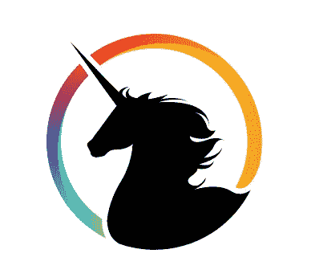
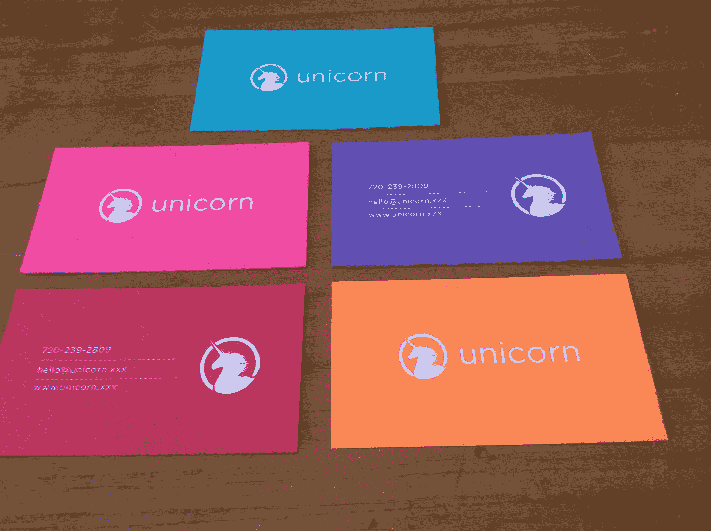
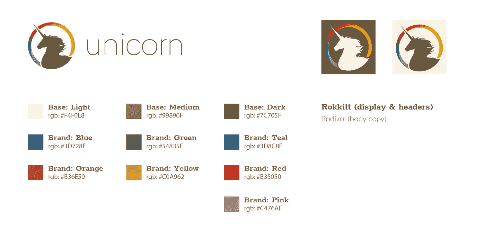
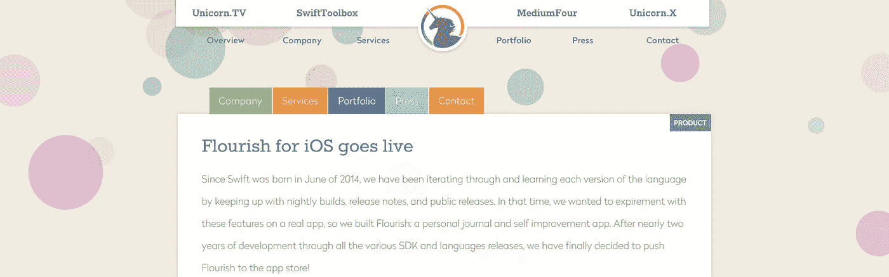
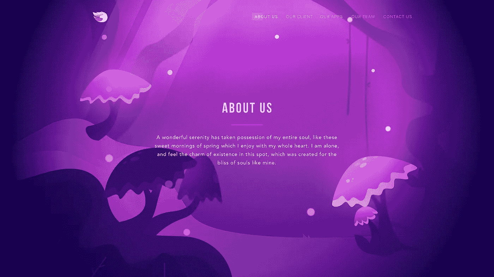
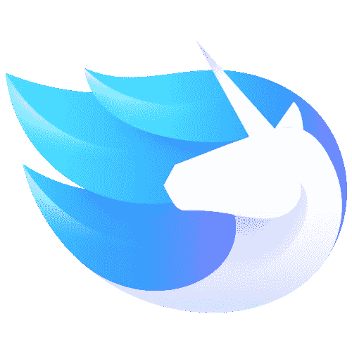

# 从爱好到代理:独角兽的进化

> 原文：<https://medium.com/swlh/from-hobby-to-agency-the-evolution-of-unicorn-90b8364dc412>

2015 年，我发现自己处于职业生涯的边缘。我刚刚辞去了在 P2BInvestor 的联合创始人兼首席技术官的职务。我决定休假 6 个月，研究自己的想法和产品。我和我的朋友们一起到处从事自由职业项目，并且经营着一个成功的博客。我需要一个法人实体来跟踪收入，所以当要建立它的时候，我停下来思考一下这个品牌。我花了很多时间反省:

*   是什么让我从成千上万的同龄人中脱颖而出？
*   哪个词描述了我的“百事通”技术方法？
*   如何让我古怪的个性在品牌中体现出来？

我利用了我在设计和品牌方面的教育。从关键词列表和概述我的人口统计开始，我知道我需要抓住几个关键点:

*   与“了解我”的客户一起工作
*   有趣好玩的东西
*   性别中立，不想当“编程哥”
*   一个不容易被忘记的名字
*   超越我的遗产

答案在我面前摆了很久，我才欣然接受。当时，“独角兽”这个词在科技界还不那么流行。有一个红宝石的名字，但用其他关键字搜索这个品牌似乎表明我偶然发现了一些东西，既有 ***uni*** que 又有 ***uni*** ting。 ***Uni*** 玉米。他妈的就这样了。忘记那些憎恨者，这就是我。我很娘娘腔但是很直。我才华横溢，独一无二。我是彩虹的所有颜色，我并不以此为耻。

Unicorn Logo v1

# 打造品牌

我和乔希·加里一起设计我们的标志和名片。结果是惊人的。这个品牌非常符合我当时想要的:大胆而多彩。彩虹到处飞舞。我对自己说:这是一个永远不会老化的标志，会扩展成我想要的任何角色，而且显然是完美的。我当时没有意识到的是，一个品牌 ***如果业务进化，就必须*** 进化。稍后会详细介绍。

Josh did an amazing job designing my business cards. With a letter pressed logo on triplexed heavy stock. These cards are were so sexy and thick!

# 让品牌适应业务

这个标志作为一个个人品牌运作了几年。这是我作为顾问的法律实体，我觉得这个品牌实际上只是自我的延伸。然而，当我开始与塞萨尔和 T2、亚当一起工作时，独角兽这个名字才真正成型。我们三个人一直在开发 SaaS 的产品(也就是“博客”)，SwiftCast。电视，在一起快两年了。SwiftCast 这个名字仅限于 Swift，我们希望教授各种其他科目。我们取了 Unicorn 这个名字，并根据 SwiftCast 的更名对这个品牌进行了调整。电视转向[独角兽。电视](https://unicorn.tv)！

Our original logo: distressed and made into a wallpaper for screencasts.

我们将标志的亮色与柔和的土色调并置，以达到两全其美的效果:一个大胆的、令人难忘的品牌，柔和的颜色和简洁的字体具有可读性。该品牌基本保持不变，但我们改进了我们的调色板和排版，以注重可读性。这很好，直到独角兽的服务开始要求我们更多。我们发现自己坚持的品牌最初是作为个人身份建立的，然后是博客，现在是咨询公司？！

Unicorn v1 Style Guide

# 将品牌推向极限

当我们开始咨询和从事更大的项目时。我们发现独角兽这个名字有预期的效果:令人难忘。一个我们没有预料到的副作用是来自客户的持续困惑。

> 客户:“你是博客，还是咨询？”美国:“是”

我们已经发展了一个忠实追随者的用户群，这个品牌在服务和产品上都引起了共鸣。为了满足日益增长的服务需求，我们开始将品牌转变为不仅仅是一个标志或博客。我们为咨询公司建立了一个专门的网站，并迅速推出了 Unicorn。XXX，使用相同的颜色、标志和排版以保持统一性。人们问我们: ***为什么 a .XXX 域*** ？因为我们是不同的(而且可以负担得起)。处理好它！我们后来会发现，这种心态只在商业领域有所发展。

Our website was now a collection of various products (Unicorn.TV and SwiftToolbox) and services (MediumFour and Unicorn.XXX). We were trying to make the service side of the company seem more colorful and vibrant while sticking to our original brand guidelines.

我想知道我们的道路与 37 个信号有多相似。作为他们博客[信号与噪音](https://m.signalvnoise.com/)的热心读者，我们似乎有许多相似之处。随着我们产品的增长，我们的咨询也在增长。我们跟上了服务需求的步伐:更新网站、名片、赠品和参加会议。尽管这不是我们最初的意图或重点，但我们现在正在建立一个强大的企业声誉。

# 品牌演变

几年后，我们的增长引发了严重的冲突。我们在代表产品和服务的独角兽之间左右为难。我们知道是时候把咨询和博客分开了，但是我们不知道如何在不牺牲凝聚力的情况下做到这一点。让决策变得更加困难:我们现在更像是一个提供全方位服务的机构，而不仅仅是技术顾问。我们还失去了 Cesar，他成为了我们一个客户的首席技术官和联合创始人。

亚当和我正全速前进。在一年的时间里，我们塑造了这个未来的机构。我们开始建立一个由我们知道的最好的开发者、设计师和成长黑客组成的团队。我们也在摸索着与我们的商业伙伴之一 AMG 进行合并，以增强这家公司的实力。一旦我们完成了合并的细节，是时候解决房间里的大象了:*这个品牌如何演变来代表这个新成立的机构*？

亚当和我集思广益，想出了一个解决方案:我们将重新命名和更名公司的服务部门。从那时起，我们认为缓释营销策略对过渡最有效。我们实际上需要品牌失去一些统一性，以摆脱随之而来的约束。因此，我们给我们的设计师们布置了一项挑战，那就是创建**独角兽公司**，作为一个更注重我们想要的声望和神秘感的品牌，并决定让这个老品牌独自一人，孤立于独角兽电视之外。

A sneak peek at the new Unicorn Agency website we’re currently developing

我们的设计师想出的东西太棒了。我们现在在这里:一个成长和繁荣的机构，开始回头率和赢得奖项。如果我们要成为一家代理公司，我们就要做到有品位、有风格。我们仍在揭示和发展这个品牌的过程中，但你可能已经注意到了一个新的标志和网站的一些启示。

Unicorn Logo v2

这个新品牌带来了新的承诺: ***立志成为世界上最有声誉的代理机构之一*** 。这是一个崇高的目标，但我们准备迎接挑战。我们已经帮助多个客户[筹集了数百万美元](http://bowery.unicornagency.co/)，并为[三星](http://unicornagency.co/portfolio/samsung)，谷歌和康卡斯特的项目工作。天空是无限的，除了我们的目标，我们什么都不会追求。[特斯拉汽车](https://medium.com/u/24413768aadb?source=post_page-----90b8364dc412--------------------------------)，[可口可乐哥斯达黎加](https://medium.com/u/cce4c0f6851?source=post_page-----90b8364dc412--------------------------------)，[懈怠](https://medium.com/u/26d90a99f605?source=post_page-----90b8364dc412--------------------------------)我们来了！让我们一起建造神奇的东西吧！

我们正在慢慢完成品牌改造。我们将在未来几周发布更多的网站预览，并谈论更多的品牌演变，所以请务必订阅。

# 未来看起来很光明

我们热爱我们所做的一切。我们的团队由我们能找到的最聪明、最努力的人组成。我知道，很多企业都这么说，但是这些企业有没有从数百名有才华的个人中筛选出精英呢？我们有。我们是工匠、工程师、动画师和梦想家。我们的品牌在发展，独角兽在成熟。手里拿着 Oculus Rift、Hololens、Vive 和无数其他工具..我们已经准备好迎接下一次科技革命:虚拟/增强现实。我们已经开发了一些最具创新性的应用程序，可以肯定我们已经准备好迎接挑战了。

# 与我们合作

这个故事对你有意义吗？你是一只独角兽吗，准备好创造神奇的东西了吗？

我们是一家提供全方位服务的机构，与数字世界中一些最优秀的人才合作。我们从创意中制造产品，并将我们的心和灵魂倾注到几乎所有我们建造的东西中。

联系我们，和一个真正的活独角兽(或人类)交谈，开始吧，我们离一起开始伟大的事情只有几个 1 和 0。

Follow me on [twitter](https://twitter.com/thinkclay) or [linkedin](https://www.linkedin.com/in/thinkclay/)

> [***克雷***](https://www.linkedin.com/in/thinkclay/) 是一个皮条客、设计师、工程师、创始独角兽。工作之外，他的兴趣包括自然、旅游、语言学和音乐。和这个威严的生物取得联系一起工作:[邮箱](mailto:clay@unicorn.love)，[网站](https://www.unicorn.love/)， [@UnicornHQ](http://www.twitter.com/unicornhq) 。

[我们如何帮助 Bowery 估值公司实现业务自动化，并使其估值超过 680 万美元](/@UnicornAgency/how-we-helped-bowery-valuation-automate-their-business-and-become-valued-at-more-than-6-8-million-eea7858abf2b)

[https://medium . com/@ unicorn agency/technical-Tuesday-slack-off-with-slack-bots-3048 a 87 f 41 e 1](/@UnicornAgency/technical-tuesday-slacking-off-with-slack-bots-3048a87f41e1)

## 这篇文章发表在 [The Startup](https://medium.com/swlh) 上，这是 Medium 最大的创业刊物，拥有 307，871+读者。

## 在这里订阅接收[我们的头条新闻](http://growthsupply.com/the-startup-newsletter/)。

