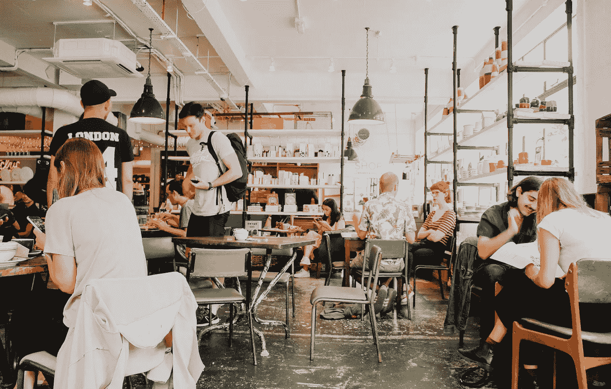

# 从游戏日期到会员资格交织在一起

> 原文：<https://medium.com/swlh/from-play-dates-to-membership-mingles-a70832596e4f>

## 为什么合作会一直存在

## (第 1 部分，共 3 部分)

我有一间小小的家庭办公室，在三扇小窗旁边有一张古董图书馆的桌子。我在二楼，我看到的是一个树冠层，那里总是有很多会唱歌的鸟。我用一把硬椅子强迫自己坐直。我的 Fitbit 会在整点 10 分时提醒我起床活动(有时我会这样做。)当我在打电话或需要集中注意力而不分心时，我会关上门。其余时间，我的门是开着的，这样我就能听到家里的动静。我喜欢在家工作。

话虽如此，对于在家创业的人来说，孤立是一个真正的问题。它可能会变得孤独，我们中的许多人在交谈和社区中茁壮成长。我通常努力每周出去两到三次，亲自会见客户或同事，或者参加研讨会或社交活动。这些旅行的重点是我的工作，但它们也是联系的机会。我非常了解自己，知道我两者都需要——联系和独处的时间来集中精力和工作。

当我羡慕地看着我的女儿选择她明年的大专课程和宿舍时，我也知道共同生活和学习的兴奋感会很快消退。老实说，我不确定在我忙着“生活”的大学第一年，到底有多少“学习”在发生。

我认为最初的合作趋势是大学校园生活的延伸，就像标志性的谷歌和脸书办公室一样，充满活力和创意(总是有可能爆发自发的乒乓球比赛)。)

使命陈述如下:

> *“创造一个人们为了生活而工作的世界，而不仅仅是为了谋生”(我们工作)*

和

> *“我们都是关于工作生活、社交生活和生活之间的和谐，”(莫蒂默之家)*

我们不是在谈论一张桌子，互联网和咖啡。我们已经超越了[《哈佛商业评论》对共同工作空间的](https://hbr.org/2015/05/why-people-thrive-in-coworking-spaces)定义:“会员制的工作空间，不同的自由职业者、远程工作者和其他独立专业人士在一个共享的公共环境中一起工作。”

目前，全球有超过 13，000 个[合作空间](https://www.statista.com/statistics/554273/number-of-coworking-spaces-worldwide/)，它们在关注点和提供的内容上有很大的不同(在本系列的第 2 部分中有所探讨)。)虽然宿舍风格的氛围(包括免费啤酒)在许多设施中很普遍，但更多的设施采用吸引其他人群的会员资格(基于性别、价值观、行业、小众兴趣等)。)

尽管研究显示所有年龄段的人都参与其中，但共同工作本质上是由千禧一代推动的。千禧一代在“社交”中长大。他们组织了游戏日期。小组工作和协作是学校的重点。公平和平等是最重要的，欺凌弱小是不能容忍的。父母和学校让它不可能失败。没有哪一代人像 y 代人那样受到儿童和青少年的认可。

## 他们长大了，并在成年后重新创造了那样的环境，这有什么奇怪的吗？

合作是我们所继承的共享经济的一种表现形式。这是一个大问题，并将随着千禧一代在公司中晋升到决策职位而继续增长。像由 1700 多人签名的[合作宣言](https://www.coworkingmanifesto.com/)这样的宣言清楚地表达了新经济引擎的愿景，它由“协作和社区”组成，而不是“筒仓和秘密”

虽然有些人试图低估合作和共享经济的未来，但千禧一代已经利用了人类对联系和认可的基本需求，这种需求引起了我们所有人的共鸣——有些人因为我们没有这种需求，有些人因为我们有。

合作是一个不断增长的行业，而且不会放缓。理解它如何适合我们个人和社区是利用其价值的必要步骤。这是我们要做的工作。

*在本系列的第二部分，我将探索这个行业本身及其发展方向。*

*在第三部分，我将解开它对全球农村地区的意义，并探索有意生活在农村的人们的机会。*

# 你是故意住在乡下吗？

## 这个故事发表在 [The Startup](https://medium.com/swlh) 上，这是 Medium 最大的企业家出版物，拥有 275，365+人。

## 在这里订阅接收[我们的头条新闻](http://growthsupply.com/the-startup-newsletter/)。

