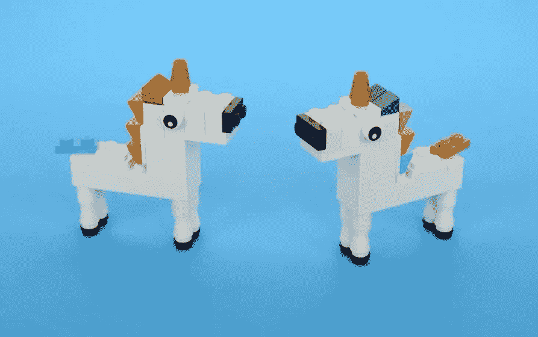
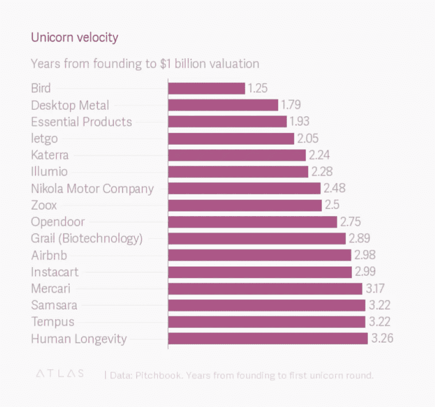

# 一瞬间从创业到独角兽

> 原文：<https://medium.com/swlh/from-startup-to-unicorn-in-a-flash-6e0e943917b1>

## 电动滑板车公司 Lime 和 Bird 只是在短时间内估值达到 10 亿美元的少数初创公司中的两家。

今年 6 月，初创公司 Bird 于 2017 年 9 月在加利福尼亚州圣莫尼卡推出了电动滑板车服务，并于 2017 年 4 月在几个月前成立，成为有史以来最快成为独角兽的初创公司。

同月，另一家移动创业公司 Lime 在一轮大规模投资后进入了独家独角兽俱乐部。该公司成立于 2017 年 1 月，拥有一支由无码头自行车、电动自行车和电动滑板车组成的车队。

之前最快独角兽的头衔是 Desktop Metal，这是一家 3D 金属打印公司，希望让制造商和工程师更容易获得金属打印。成立于 2015 年，用了 1 年零 9 个月成为独角兽。

其他快速独角兽包括:

*   癌症检测初创公司 Grail，获得了杰夫·贝索斯和比尔盖茨的投资；
*   智能手机制造商 Essential Products，由 Android 创始人安迪·鲁宾(Andy Rubin)创立；
*   二手商品在线市场 Letgo
*   自动驾驶汽车初创公司 Zoox
*   建筑供应公司 Katerra，由特斯拉前临时首席执行官迈克尔·马克斯(Michael Marks)创立；
*   Illumio，向企业提供基于云的数据安全服务；
*   杂货配送服务 Instacart
*   Opendoor，允许房主在其在线房地产市场上列出他们的房屋出售；
*   甚至还有 2008 年创立，不到 3 年就成为独角兽的 Airbnb。

(Image credits: [Quartz](https://medium.com/u/7f1a35bb87fb?source=post_page-----6e0e943917b1--------------------------------))

早在 4 月，Priceonomics [发表了一项研究](https://priceonomics.com/tech-unicorns-which-are-growing-which-are/),根据该研究,“在增长最快的前 20 家独角兽中，有 5 家是交通共享平台(汽车和自行车共享)，1 家(WeWork)是共享工作空间。其他名列前茅的行业包括交易平台(Robinhood 和比特币基地)、电子商务(Wish 和 Mercari)、医疗保健(iCarbonX 和 GRAIL)和云数据分析(Snowflake 和 Rubrik)。