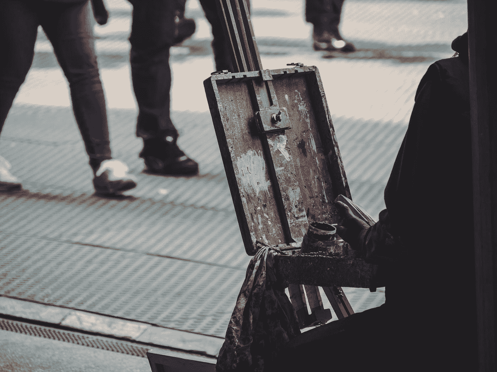

# 从饥饿的艺术家到精明的创意者

> 原文：<https://medium.com/swlh/from-starving-artist-to-savvy-creative-9b48491daf29>

Photo by [Daniel von Appen](https://unsplash.com/@daniel_von_appen?utm_source=medium&utm_medium=referral) on [Unsplash](https://unsplash.com?utm_source=medium&utm_medium=referral)

正如刻板印象所言，艺术家经常经历不稳定的就业，无休止的客户，他们重视工作，但仍然认为它应该便宜或免费，以及严重的自我怀疑。这种刻板印象的终结是，艺术家完全专注于他们的工作，或者无法将他们的技能转化为“现实世界”。或者，他们的困境是不可避免的或永久的。

迄今为止，在我职业生涯的大部分时间里，我一直是许多领域的专业创意人员，包括写作、摄影、平面设计和服装设计，最近我在自立方面迈出了新的步伐。在这个过程中，我发现了自己的许多误解，以及一些通常不会被提及的陷阱。

# 为曝光而工作

接受低薪或无薪工作，与潜在的合作者建立关系网或增加你的投资组合，与被利用之间有一条细微的界限。许多崭露头角的创意人员认为他们必须达成这样的协议才能开始他们的职业生涯；更多成熟的创意人员强烈嘲笑那些崭露头角的创意人员为曝光而工作，担心任何合格的免费提供服务的人都会损害他们的业务。

从某种意义上说，两者都是真的。一个人必须从某个地方开始；没有人能在没有作品集或人脉的情况下，从学校或自学中走出来，就为一个项目要求几千美元。然而，免费工作让客户产生了一种期望，认为他们可以免费获得服务。免费工作也欺骗了你。一旦你了解了知名创意人员的收入，你会为自己的零收入而自责，而那些有更多关系、有信心要求补偿的人会得到更多。

 [## 绿化不容易

### 做制片人是一种光鲜又诡异的生活。事实上，这是一个事实并不比…更奇怪的例子

medium.com](/@rachelwayne/its-not-easy-making-green-928175d5a4a8) 

## 解决方法

总是补偿并且总是要求某种补偿。如果你在为曝光而工作，确保你得到了它。要求将你的名字和社交媒体包含在客户的网站、传单等中。问问他们是否会报销你的汽油费。另一方面:例如，如果你需要摄影或平面设计，但请不起专业人士，不要虐待一个绝望的应届毕业生或快速进步的业余爱好者，他们可能会免费提供这些服务。给他们提供津贴，或者…

从事贸易工作。每个人都有一些有价值的技能。你的是按摩吗？会计？上门维修？物物交换系统可能已经过时了，但仍有很多人在使用它。[算出你的时薪应该是多少](https://www.nolo.com/legal-encyclopedia/business-services-charge-how-much-30158.html)，找到一个共同点。如果你的文案每小时收费 35 美元，而你做按摩的朋友每小时收费 70 美元，那么做一个安排应该很容易，你提供 2 小时的文案来换取 1 小时的按摩。

> 一个小趣闻:我曾经为一个大学生做过一部论文电影。交给我一堆帽子戴，包括布景师、化妆师、服装设计师、*和*更衣师。我免费做了这一切。它花了四周的前期制作工作，每周 5-10 小时，然后是为期四天的电影拍摄。这些人很难共事，我没有从中得到一分钱。我被许诺在演职员表中有一行。最终的电影获得了一个小奖项，但随后就消失在噪音中了。我从未收到过任何有用的联系或工作邀请。我得到的只是投资组合的提升，这不值得我花费几十个小时。

# 创建投资组合

说到这个，你不需要为别人工作来创建一个投资组合。虽然让一些富有成效的项目给你带来评价和工作参考是至关重要的，但你绝对可以用你的激情项目来促进你的工作。

> 我是一名 cosplayer，在过去的十年里，我一直穿着各种服装参加会议。我每年都会在所有这些会议上看到许多画家、木偶、工程师、平面设计师等等，建立联系。做个行走的广告很有帮助！

## 解决方法

腾出时间为自己创造。尝试不同的风格。想想你的市场可能喜欢看到什么。当你在使用技巧的时候，想想如何将你的工作货币化。涉足股票摄影。制作一些你认为会吸引广大观众的物品，并用它们来吸引追随者；正是从这一点出发，你会发现有人欣赏你更独特或杰出的作品。

**注册 Instagram、Ello 和/或 Patreon。我知道，社交媒体有时比它的价值更麻烦，但它也非常有助于专业创意人员不仅免费宣传他们的工作，还能让他们保持动力和正轨。**

 [## 创意人士的五大生产力秘诀

### #5 拥有专用的工作空间

medium.com](/@rachelwayne/top-five-productivity-hacks-for-creative-people-b96dcacbf8bc) 

# 与竞争对手打交道

在艺术领域，竞争者通常是试图抢占市场份额的其他人。他们不会试图在市场上胜过你，也不会使用可爱的 Mac vs. PC 广告，他们很可能会进行诽谤和中伤，试图把你赶出市场。

这是最难处理的事情，也是人们谈论不多的一件事。当有人试图破坏你的生意时，选择更高的道路是没有帮助的。这是现实世界，不是高中。

> 我曾是一名成功的表演艺术制作人，直到我培养的一名学员决定接管我的市场份额。她努力与我不认识的人建立关系网，一路上散布谣言和诽谤我。虽然她的所作所为很糟糕，但我自己应该多接触一些。永远不要停止联网！它可以缓冲这些攻击。

## 解决方法

尽可能多地培养人脉。即使你看不到迫切的需求，也记下你刚刚遇到的那个有趣的人的电话号码。创建一个个人档案，记录他们的信息，你在哪里遇见他们，他们以什么为生。你永远不知道会出现什么情况，你不得不求助于一个程序员，或者一个园林设计师，或者任何职业中的任何人！这就是工业的美妙之处。正如我上面所说的，对你有好印象的人越多，诽谤者损害你声誉的力量就越小。

 [## 当你在乎你的坏名声时

### 人类最大的统一主题之一是关心自己给人留下的印象。详细的行为准则…

medium.com](/@rachelwayne/when-you-give-a-damn-bout-your-bad-reputation-bbd7fa5f08b3) 

**什么也不说，但要诚实。**不要在社交媒体上诽谤任何人。即使是真的，也没用。如果你想发帖，发一些积极的肯定你工作的东西。信不信由你，社交媒体算法更喜欢正面的帖子，所以这样你会得到更多的曝光率！双赢！然而，如果你和某人谈话，他们问你关于诽谤你的人，你要诚实。不要粉饰太平。说，“那个人表现得不专业，虐待我，诽谤我的工作。”这可能会让你的谈话对象感到震惊，但诚实是最好的策略。避免直接评论他们的个性或工作(例如，称他们为“混蛋”或他们的工作是“冒牌货”，等等)，这样你就会脱颖而出。

# 最后一点

创意领域很难驾驭，但绝对有可持续就业和实现的潜力！不要放弃。记住，当你为自己工作时，你就是自己的老板。尊重你自己。善待自己。

*关注我，在* [*媒体*](/@rachelwayne) *和*[*LinkedIn*](https://www.linkedin.com/in/rachelwayne)*上获得更多关于成为创意企业家和职业艺术家的文章。*

## 这个故事发表在 [The Startup](https://medium.com/swlh) 上，这是 Medium 最大的创业刊物，拥有 333，253+人关注。

## 在这里订阅接收[我们的头条新闻](http://growthsupply.com/the-startup-newsletter/)。

