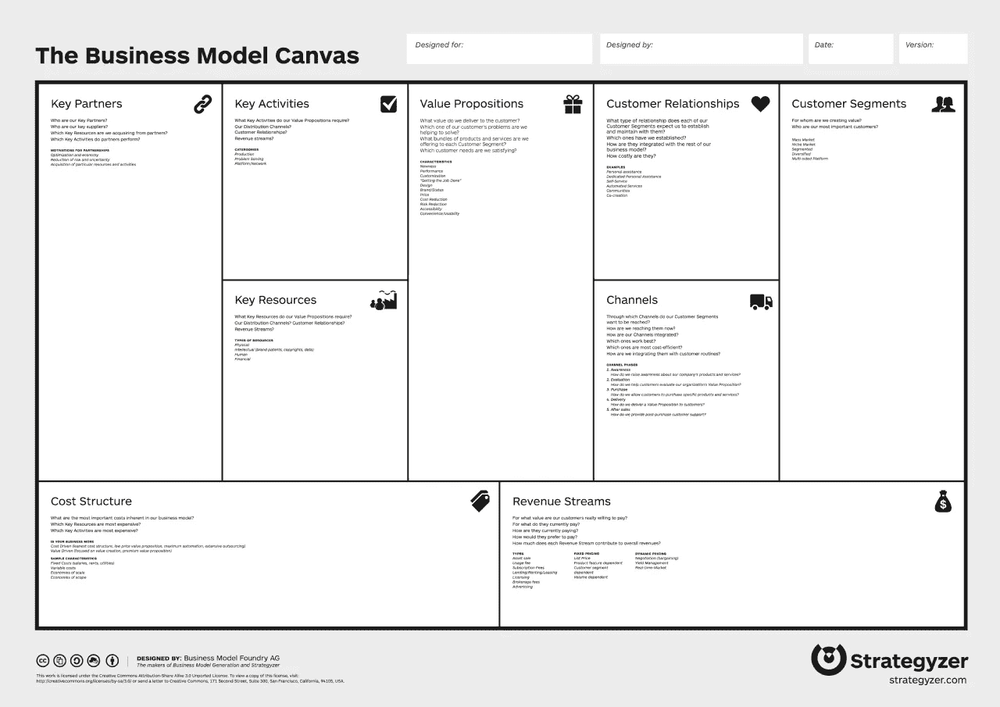

# 从零到一些

> 原文：<https://medium.com/swlh/from-zero-to-something-d0619a4eef28>

Photo by [rawpixel](https://unsplash.com/photos/VAd4-4B0RH8?utm_source=unsplash&utm_medium=referral&utm_content=creditCopyText) on [Unsplash](https://unsplash.com/?utm_source=unsplash&utm_medium=referral&utm_content=creditCopyText)

## 如何开始网上赚钱

> 你……吗？
> 
> ….想开始网上赚钱，却不知道从何下手？
> 
> …不断尝试不同的想法，但不知道如何实现？
> 
> …有一些项目正在进行，但似乎没有任何进展？

如果你对这些问题中的任何一个回答是肯定的，那么这篇文章就是为你准备的。它将帮助你建立一个可以执行的具体计划。一些能让你清晰聚焦，让你把精力投入到执行中的事情。

这并不意味着你会很快有一个有利可图的生意。没有人能预测达到这一点需要多长时间。但这确实意味着你正在朝着正确的方向努力。

那么，我们开始吧。

# 第一步:

## 有效商业模式的基础。

[The business model canvas by Strategyzer](https://strategyzer.com/canvas/business-model-canvas)

你可能已经听说过奥斯特瓦尔德公司的[商业模型画布](https://strategyzer.com/canvas/business-model-canvas)，它是商业模型生成中最常用的模型……的确如此。

在这个过程的最后，你有一个一页纸的计划，你可以贴在墙上执行。

但是…这一切都太复杂了。

暂时如此。

仅仅从这一页开始不会给你任何关于从哪里开始的具体想法。如果你只是坐在那里，试图填写这张画布，那么你所做的一切都是猜测。

**首先，回答这些问题:**

*   你的目标市场是什么？
*   你正在解决的问题是什么？
*   你提供的解决方案是什么？

如果你已经有了一个正在解决的问题，那么现在是时候弄清楚到底是谁面临这个问题了。尽可能详细地理解它们。

如果你不知道从哪里开始，那就从选择一个目标市场开始。例如，如果你是一个素食者，那么你可能会考虑为素食者创业。

以下是一些关于如何开始的有用想法:

*   **去网上论坛、脸书群等。:**找出潜在目标受众聚集的地方，然后简单地观察他们&倾听他们面临的问题
*   使用不同种类的调查:询问你的目标受众中的人他们正面临什么问题。你可以使用 SurveyMonkey 这样的工具，与他们面对面交谈，或者简单地让他们给你发一封电子邮件
*   **使用类似 Google AdWords/Google trends 的工具:**为了了解你的市场的潜在规模&他们在寻找什么，你可以使用这些工具。试着弄清楚这是否是许多人面临的一个真正的问题，以及已经存在的问题。

请记住，这三个因素(目标市场、问题和解决方案)是你的商业模式中最重要的三个方面。如果弄错了，你将一无所获。

在这个阶段花尽可能多的时间，以便让你确信你的解决方案有潜力达到产品/市场契合度。

# **第二步:**

## 你的商业模式可行吗？

Photo by [Landovan](https://unsplash.com/photos/GqPpVKsS8cw?utm_source=unsplash&utm_medium=referral&utm_content=creditCopyText) on [Unsplash](https://unsplash.com/search/photos/realistic?utm_source=unsplash&utm_medium=referral&utm_content=creditCopyText)

> 这是你在脑海中创建一个“**理论形象**”的时候，当它变成现实的时候，这个企业会是什么样子。这是一个真正的企业家的力量——设想一些以后会变成现实的事情。

在这里，业务模型画布会很有帮助。

你可以尝试尽可能多地填写它的各个方面——最重要的是成本结构、收入流、营销渠道和价值主张。

为什么这些如此重要？

因为它们将帮助你回答你的企业实际上有多可行的问题。

这是你在这个阶段需要回答的三个问题:

*   **我的商业模式可扩展吗？**(即目标市场有多大？我可以销售多少这类产品？)
*   我的商业模式可以自动化吗？(即当它成立时，我自己的参与在多大程度上是必要的？业务的哪些方面可以自动化，哪些方面不可以？我需要花多少时间来投资这项业务？时间投入是否值得潜在收益？)
*   **我的商业模式能盈利吗？**(即成本与收入的关系如何？从数量上来说，我需要卖出多少才能使这项业务盈利？我真的能达到这些数字吗？)

假设你坚持以素食为契机。

首先，你考虑在你自己的城市开设一家素食在线配送服务。但是当你研究这个机会时，你发现在你的城市中只有大约 1%的人是素食主义者和/或有兴趣在网上订购素食。

你会发现，要达到让你的企业盈利所需的数量，这是远远不够的。

所以，你重新考虑这个解决方案。

最后，你想到在 Udemy 上提供素食烹饪课程。你做了调查，发现还没有这样的课程。另外，你会发现一些素食 FB 团体，并发现那里有很大比例的成员愿意为这样的课程支付大约 20 美元。

经过一些研究，你发现(例如)全世界有 2 亿素食者。你估计其中大约有 2%的人愿意为这样的课程花费 20 美元。

此外，已经有许多现有的论坛，你可以以合理的低廉价格刊登广告。

嘣！

考虑到必要的时间投资，你只需要大约 1000 次销售，这个项目就值得了。

# 第三步:

## 测试你的假设。

Photo by [NESA by Makers](https://unsplash.com/photos/IgUR1iX0mqM?utm_source=unsplash&utm_medium=referral&utm_content=creditCopyText) on [Unsplash](https://unsplash.com/search/photos/coding?utm_source=unsplash&utm_medium=referral&utm_content=creditCopyText)

所以，你想出了这个好主意。在你想通了所有事情之后，你会得出结论，你的商业想法是可扩展的，它可以自动化并盈利。

太好了！

是时候开始产品开发了，对吧？！

**错了！**

你还没有证实你的想法。除非你的朋友和家人之外的人真的买了东西，否则你还没有完全验证你的想法。

*“但是如果我还没有一个产品，我该怎么做呢？!"* —你可能会问。嗯，这是一个很好的问题。

你必须发挥创意，想出一个小规模销售的方法，要么提供一个非常简单的原型，要么只使用一个登陆页面，在发布时以很高的折扣提供你的产品。

预售极其重要。

这不仅可以让你在投入大量时间之前验证你的想法，还可以让你拥有一批对你的产品感兴趣的人，他们会在你前进的时候帮助你。

**这些人将是:**的人

*   将首先测试您的早期产品，并为您提供有价值的反馈
*   一旦你的产品上市，他们发现它真的很棒，就会帮助你营销你的产品(从定义上来说，他们是早期的适应者，因此更有可能为你传播信息)
*   会对你最有耐心(如果他们没有迫切想要这个产品，他们甚至不会在它存在之前就买它)

你的产品首次发布时会有很多问题。

你最好确保你培养了一群宽容的人，他们在耐心等待这个产品上市。他们愿意在你前进的过程中为你提供反馈。

但最重要的是，你要更好地确认你的目标市场是真实的，他们愿意为你的产品支付足够的钱，以使它在经济上对你来说是值得的。

永远不要在产品开发上投入任何实质性的资源(时间/金钱),直到你达到这一步。

# 结论:

仔细完成这三个步骤，你将会到达你确切知道如何前进的点。你将有一个具体的计划，你现在可以执行。

在所有这些阶段，你也可以慢慢地填充商业模式画布的更多部分。

例如，当你在研究市场时，你可能会发现几个相关的论坛、脸书团体和博客，你的目标受众聚集在那里。

因此，你可以用这些信息来填充商业模式画布上的“营销渠道”部分。

为什么这很重要？

因为你的计划越具体&你对所有这些不同的方面越清楚，你以后执行起来就越容易。

这里的目标是拿出一个非常简单的计划，100%专注于执行。当你迷失方向的时候，你可以看看它，重新找到方向。

无论你做什么，都不要匆忙完成这个过程。

慢慢来，做好这件事。如果你需要花几个月甚至一整年的时间来完成这些步骤，并制定出一个清晰的计划，那就腾出时间，耐心等待。

你能做的最糟糕的事情就是匆忙完成这个过程，然后想出一个根本不可行的计划(例如，因为没有合适的产品/市场，市场太小，人们不愿意为你的产品买单等等)。

如果你这样做，那么你可能会在一个根本行不通的商业想法上浪费你生命中的很多年。

不要成为那样的人。

> 想出一个可行的商业模式，并测试你的假设。只有这样，你才能开始创业。

# 行动号召:

我整理了一份免费的逐步指南，教你如何围绕你的博客建立一个有利可图的生意。你可以通过[点击这里](https://mailchi.mp/b25ad9dbbbeb/blog-to-business)获得指南。

## 这篇文章发表在《T4》杂志《创业》(The Startup)上，这是 Medium 最大的创业刊物，有 353，974 人关注。

## 在这里订阅接收[我们的头条新闻](http://growthsupply.com/the-startup-newsletter/)。

