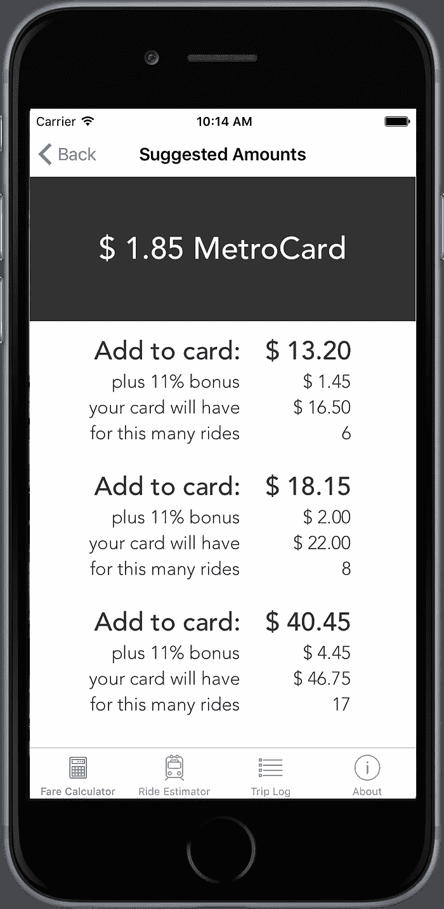

# 30 天从零到迅捷

> 原文：<https://medium.com/swlh/from-zero-to-swift-in-30-days-8ad97b630e00>

整整 30 天前，我开始学习 Swift。三天前，我的第一个应用程序通过了苹果的测试。与真实的东西相比，测试版的审查过程应该没什么大不了的，但对我来说，这是一个重大的成就。

我没有 CS 学位，也没有作为开发人员的专业经验，但是在过去的 5 年里，我作为产品经理在软件开发团队中工作过，并且制作了一些 Ruby on Rails 应用程序以供娱乐。我一直想感受到与我工作的事物更直接的联系，所以我决定开始编码。

## 为什么选择 iOS 和 Swift？

*   **移动是巨大的；手机是个人的。**我想开发人们实际使用的软件，我喜欢人们与手机之间的亲密感。我们的手机非常了解我们——当我们醒来和睡觉时，我们在哪里以及我们如何到达那里，我们的时间表，我们与朋友和家人的对话，等等。这是我感兴趣的未来，我是苹果的长期用户，所以从 iOS 开始感觉很自然。不久前，我试着使用 Objective-C，在我发现它令人生畏的地方，Swift 一直很受欢迎。
*   **约束良好**。在苹果平台的范围内，在一个适合你口袋的屏幕上开发应用程序提供了健康的约束。这些限制让我专注于学习什么(而不是永无止境的 web 开发的兔子洞),并围绕用户体验推动我的创造力。
*   **Swift 是一种快速发展的语言。**我喜欢从基层做起，观察事物的发展和演变，并成为一个小社区的一员——这就是我喜欢在创业公司工作的原因。用一种不太成熟的语言来解决问题，并成为一个试图一起解决问题的较小团队的一部分，这是一种授权。我也对个人为语言和社区做出贡献的可能性感到兴奋。

## 初学者的资源

当我在 7 月 1 日开始我的旅程时，我有了一个非常简单的第一个应用程序的想法。保持这种想法有助于激励我，也有助于我了解所学的东西。

我花了很长时间在互联网上搜索 Swift 上的最佳资源、教程和课程。对于初学者来说，有很多好的东西，但是大多数假设你从来没有看过一行代码，开始非常慢，也就是说，这是一个变量，参见变量跳转。另一方面是技术文章和参考资料(包括苹果的文档),如果你有丰富的经验或者正在从 Objective-C 向 Swift 迁移，这些资料似乎是难以理解的。

最终，我找到了适合我的初学者水平的最佳素材，以下是我认为最有用的:

1.  **保罗赫加蒂斯坦福课程** [**用 Swift**T5 开发 iOS8 应用。我从这里开始，在一周多一点的时间里完成了前五节课和第二次家庭作业。这门课程很快就变得富有挑战性，所以在我尝试之后，我暂停了我的进度，以便处理下面更实用的教程。但这是一门很好的课程，赫加蒂教授也很在行，所以我打算重新开始。如果你在一项作业中遇到困难(在 iTunesU 中你找不到解决方案)](https://itunes.apple.com/us/course/developing-ios-8-apps-swift/id961180099)[这个有用的网站](http://cs193p.m2m.at/)解释了每个问题集和解决方案。
2.  [**苹果公司的 Swift 编程语言。**](https://developer.apple.com/library/prerelease/ios/documentation/Swift/Conceptual/Swift_Programming_Language/index.html#//apple_ref/doc/uid/TP40014097-CH3-ID0) 相比于苹果的 iOS SDK 文档，这本关于 Swift 语言的书，如果你有任何之前的编程经验，都很容易读懂。它清晰、简明、扼要，这样当你以后处理问题时，你就知道在哪里可以引用一个概念。Big Nerd Ranch 为他们的 Swift bootcamp 安排了一个[阅读前作业](https://www.bignerdranch.com/documents/swift-prereading-assignment.pdf)，其中涵盖了类似的概念，但更适合初学者，提供了你可以实现的实际例子。
3.  [**www.raywenderlich.com**。这听起来像是某个纨绔子弟的个人网站，但不要被它骗了。这个网站是我见过的最好的资源。如果你从未创建过一个 iOS 应用程序，那么从这里开始，注册订阅时事通讯，获得“史诗般长度的教程”——这会让你感觉非常史诗，但如果你愿意，你肯定可以在一天内完成它。该教程是我第一次深入到 iOS 开发的古怪之处，揭开了许多容易让初学者气馁的事情的神秘面纱。我发现自己在创建自己的应用程序时参考了这个教程，并希望唤起我对 Xcode 中某些特性或功能的记忆。在你完成第一个教程后，网站上还有很多额外的免费教程，我从中挑选了一些来学习我的应用想法所需的概念。这里有如此多的精彩内容，我迫不及待地想回来看更多。](http://www.raywenderlich.com/category/swift)

## 我的(粗略)时间表

*   第一周:沉浸。我直接进入了斯坦福课程的讲座和作业，通读了大量 Swift 语言书籍，并完成了 raywenderlich.com 的“史诗般长度的教程”。在这一点上，我觉得准备好开始我的应用程序。
*   **第二到第三周:磨出来。**就在我开始编写应用程序的那一天，我也碰巧在缅因州的一艘帆船上开始了为期 12 天的生活。喝着咖啡，在安静的水面上，我每天早上都要在这个区域呆上几个小时。无法上网让我可以专注于 Xcode，而不用在 40 个浏览器标签之间来回切换。它迫使我停下来，思考我在努力做什么，为什么。这些天来，我发现自己在思考我的代码，想出新的方法，渴望在第二天早上尝试它们。
*   **第四周:我真的在做这件事。有一个陡峭的学习曲线，但当我开始在一天内比之前的一周更有效率时，感觉很神奇。我花了最后一天清理我的代码，并处理了一些奇怪的边缘案例，这令人惊讶地令人满意。作为一名产品经理，我会担心这些情况，并给工程师分配几十个小任务来解决它们。有能力自己搞定这些真是太棒了。最后，我在 Sketch 中创建了一个基本的应用程序图标，并按照所有步骤将构建上传到 iTunes Connect 并提交给苹果进行测试。审查用了不到 24 小时。**

7 月份(通过 [RescueTime](https://www.rescuetime.com) 记录)，我在 Xcode 上花了 **25 小时**，在 iOS 模拟器上花了 **2 小时 52 分钟**，在预览版(阅读教程)上花了 **4 小时 23 分钟**，在堆栈溢出上花了 **51 分钟**。我也在手机上看了很多资料。

## Swift 社区

以下是我为融入 Swift 社区所做的其他事情:

*   订阅[我们❤ Swift](https://www.weheartswift.com/) 时事通讯
*   订阅 Dave Verwer 的 [iOS 开发周刊](https://iosdevweekly.com/)
*   遵循介质上的[“Swift”标签](/tag/swift)
*   收听[raywenderlich.com 播客](https://itunes.apple.com/us/podcast/raywenderlich.com-podcast/id773910890?mt=2)
*   找一个当地的聚会(我加入了[布鲁克林 Swift 开发者](http://www.meetup.com/Brooklyn-Swift-Developers/) *和 [iOSoho](http://www.meetup.com/iOSoho/)
*   加入一个 Slack 群:(1) [helpMeCodeSwift](http://helpmecodeswift.com/join-slack-team) 是我偶然加入的一个小群体。现在只有几个活跃的人，但他们超级友好，似乎一点也不被 noob 问题所困扰。(2) [swift-lang slack](http://swift-lang.schwa.io/) 是一个较大的团体，它让我可以即时访问，但似乎没有太多初学者，我有点害怕加入对话。我也许应该问一下为初学者创建一个频道。

这些是我发现有帮助的事情。如果你有其他很棒的资源可以推荐，请添加评论，说明你喜欢什么以及为什么它很好。

**我参加的第一个聚会是戴夫·格兰迪内蒂的演讲，名为“快速学习欧拉方法”。Dave 做了一个工具，我很想试试，叫做*[*EulerKit*](https://github.com/dbgrandi/EulerKit)*，它包含了一些帮助方法来帮助你解决* [*项目欧拉问题*](https://projecteuler.net/) *。我已经做了前两个，但之后就很难了。*

## 最后，我的第一个应用——往返

我的应用程序的名字是 [**往返**](https://itunes.apple.com/us/app/roundtrip-mta/id1023476036?ls=1&mt=8) ，它是为纽约人优化他们的地铁卡票价。这是一个非常简单的实用程序。

RoundTrip — MTA App

1.  计算一下要给你的地铁卡增加多少钱，这样你就不会剩下没用的零钱了。MTA 为你超过 5.50 美元的任何金额提供 11%的奖励，并且只允许你以 5 美分的增量添加。这两个因素结合在一起，使得人类很难即时计算。
2.  估算一下你每月的乘车次数，看看你能否用 30 天无限卡省钱。你也可以记录你的行程，并查看你骑行的频率。

如果你想成为这个和未来应用的测试者，请在这里注册。

感谢您阅读我的旅程。感谢@ [cm](https://twitter.com/cm) 和@ [amrithap](https://twitter.com/amrithap) 审阅本文的草稿。

我想找一份 iOS 开发人员的工作或实习！如果你知道有机会，请联系 katie@katiesmillie.com。

我也在推特**@**[**katiesmillie**](https://twitter.com/katiesmillie)**和 at[**katiesmillie.com**](http://katiesmillie.com)。**

****

***发表于* **创业、旅游癖和生活黑客****

************

**-**

***如果你喜欢这篇文章，请阅读下面的内容:***

# **[我的快速旅程:第 30 天到第 60 天](/@katiesmillie/swift-days-30-to-60-2a3647d9c313)**