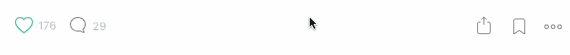

# 去你妈的，2016。我操，2017。

> 原文：<https://medium.com/swlh/fuck-you-2016-fuck-me-2017-a769ec15a929>

## 我挺过了 2016 年。2016 死了。我还活着。我赢了。

2016 年是地狱。在去年夏天(2015 年)被驱逐后，我大部分时间都无家可归，学习如何在曼哈顿的街道上生存:如何每天靠几美元过活(我靠西 4 街和第 6 大道上无数[美元的披萨片](https://randalllovesfood.files.wordpress.com/2012/01/2brospizza.jpg)和无数[美元的亚利桑那癌症果汁](https://i5.walmartimages.com/asr/0d5c1136-b7c9-42ef-8dfd-a5e51f72dfca_1.78975491b6cc9712d7e9012c2e15a381.jpeg)维生)，如何不闻气味(抗菌肥皂是除臭剂的绝佳替代品，但不是止汗剂)， 如何尽可能舒适地睡在感同身受的朋友和陌生人的沙发上、地毯上、裸露的地板上、公园长椅上、火车车厢角落的座位上，以及最终 31 街和第五大道的人行道上[如果你想知道，人行道吵得要命，带着宇宙所有的仇恨振动，因为你怎么敢免费睡觉，而不是支付一些臭虫宫殿唐人街酒店/小屋/招待所税前 49 美元和 50 美元或 100 美元的押金？ 有时你看到老鼠，有时你看到自己在水坑里，想知道你的生活在哪个时刻发生了错误的转变，如果你是我，你永远不会躺在上面睡着……你在几个不安的时刻或几个失眠小时后起床，在你的混凝土丛林中走来走去，直到你找到一个稍微好一点的地方睡觉，通常在 59 街左右，以及如何越过“定居”(LOL)并对一切大喊**去他妈的**。

this is what rock bottom looks like.

> 连续一周穿同样的衣服？去他妈的。饿吗？去他妈的。它会消失的。累吗？去他妈的。你死了也能睡个好觉。被室友踢出局，敲诈勒索，诽谤中伤，人格暗杀？去他妈的。“像无声的影子一样工作。你的成功将为你说话，并首次作为震耳欲聋的奇观。”(像那样？是 SF 阿里原创。)或者就像某个教练哥们说的“比分总是自己搞定的”。

我读了很多书。我写了很多。我推荐了很多。在这个过程中我打破了媒介。我被一些出版物邀请并接受为作家:[《创业》](https://medium.com/swlh)、[《咖啡客》](https://medium.com/the-coffeelicious)、 [Bullshitist](https://bullshit.ist/) 、 [Extra Newsfeed](https://extranewsfeed.com/) 、[黑客正午](https://hackernoon.com/)等。我在不止一部，而是几部[仇恨犯罪](/the-coffeelicious/so-two-muslims-walk-into-starbucks-or-my-hate-crime-experience-949d26363494)(复数)中扮演主角，虽然不情愿，但英俊得令人难以置信(我永远不会用“受害者”这个词，你也不应该用这个词！)尤其是 11 月 9 日之后的[。我见证了几段关系的结束，走出了亲密或不亲密的关系，在第十二个小时(字面上是 2016 年 12 月 1 日)签了一份租约，重新获得了有意义的自我就业，有了一个屋顶和住所，我正在写这篇文章，重新学习预算，强迫我亲爱的天使父亲退休，尽管他一直抗议并坚持驾驶他在过去 18 年里一直催促的同一辆出租车， 我第二次试图支持我的父母(也是自 2014 年因失业而被解雇以来的第一次)，经历了许多、许多、许多年轻和年老的亲人的损失，并重访了那个熟悉的地方，称为“谷底，2017 年最好更好”。](/@sfali789/trumps-america-day-1-2f4249965c71)

I wrote a lot. You liked it. A lot. Thank you. Thank you. Thank you. Thank you. Thank you. Thank you.

我把战胜死亡作为我一生中孜孜不倦的使命。可预防的死亡可以被征服:发展中国家的腹泻、疟疾和脊髓灰质炎病毒。每天有 16165 名五岁以下儿童死于可预防的原因。每五秒钟就有一人死亡。美国和国外的自杀。另一个任务是谈论我的心魔和那只困住我们许多人的疯狗:精神疾病。焦虑。抑郁症。精神分裂。躁郁症。创伤后应激障碍。强迫症。多动症。恐惧。自我厌恶。让我周围的人对我的生活经历感到尴尬和不舒服，也许是其他人的故事，通过笔的重量，或者更确切地说是上帝赐予我的闪烁、嘲弄、邀请的键盘光标。

> 我终究是相信上帝的。创造了你和我的上帝。我们都信仰同一个上帝。基督徒、犹太人、穆斯林、印度教徒、不可知论者，所有年龄、面孔、地点的人。无家可归向我展示了人类精神的不屈不挠的力量和大胆的奇迹，这是通过看到自己在失去一切(我指的是一切，除了我背包里的东西:我的笔记本电脑，我的文凭和年鉴，几件衣服，牙刷和处方药瓶，只要我有健康保险)的情况下生存，茁壮成长，甚至发光发亮，以及倾听，说话和向他人学习。

你永远不会怀疑一个人类同胞——你最亲爱的人或一个完全陌生的人——在他们肩上的经常被遗弃的、蜿蜒的生活荒原上寄居。世界需要听到它。那么多人线下联系我，附和我一直怀疑的。生活是艰难的。这不是饼干。如果有，那也是没人要的他妈的一坨屎。但是你出牌了。你掌握它们。你对宇宙说去你的，同一个宇宙真的，疯狂地，深深地，对你那高贵的，可怜的存在一点也不在乎。特朗普总统现在是、将来也会是证明。干我，对吧？

> 去他妈的。为干杯。为生活、爱和欢笑干杯。为生活干杯。大胆地。大胆地。热情地。就像这个星球是一个燃烧的，闷烧的集群他妈的 shitstorm (#climatechange)走向绝对和永恒的遗忘，唯一有价值的是这个，这个时刻，只有你和我在这艘稍纵即逝的船上。加入我吧。加入我们吧。让我们让它有价值。

我爱你。你们所有人。谢谢你的支持。说真的。我从一个读者人数为零的无名小卒，变成了 Medium 的常驻啦啦队长，拥有 6900 多名追随者，以及更多阅读、回应和分享我作品的善良灵魂。我的意思是没有任何陈词滥调，夸张或伪装:你必须相信我，当我说，言语可以，也永远不会，充分表达这一切对我有多重要。

> 尤其是当我无家可归的时候:我总是提醒自己，“至少我还有我的网上家庭。有一天，当我再次站起来的时候，这一切都是值得的。在那之前，我会继续阅读，继续写作，继续努力。

你猜怎么着？这是今年唯一让我熬过地狱的事情。再次感谢你们相信我，相信我崇高的理想，也相信你们自己。让今年成为你们的一年。你的思想既是你最好的朋友(自信)，也是最大的敌人(自我怀疑)。工作在等着我们。我们会努力的。

> 也许我们应该在那伟大的来世安息，那是我们逝去的先辈们一定会为我们欢呼的灵魂花园。如果说过去的一年向我们展示了什么的话，除了假新闻、回音室、fuckboys 和 Cinderalla runs(骑士队、小熊队和特朗普，哦，我的天！)2016 年证明了有很多逝去的先辈，他们中的大多数人会想到成名。撕成碎片。

让我们抓住每一天、每一年和我们的生命。让我们像快死了一样活着。因为我们是。因为这种陈词滥调的废话在午夜后溢出，在球掉了，五彩纸屑堵塞了空气，时钟不会为任何人停止，三周后将有一位新总统，今年每秒钟世界上净增加两个半人，我可以继续下去，但去他妈的，我相信你现在已经清楚明白了。我们已经到了。让我们享受一下生活吧。

愿你最好的今天成为你最坏的明天。愿你减掉脂肪，把信号从噪音中分离出来，把玩笑从你的甲板上去掉，让丰盛、健康和爱包围你自己，每时每刻都沐浴和淹没我们的精神。愿你实现梦想，实现梦想，实现梦想，再一次实现梦想。愿你深呼吸，开怀大笑，笑容充满感染力。愿你的希望、祈祷和目标被接受并实现。愿我们庆祝每一天，就像这是新的一年，新的开始，新的我们。干杯。新年快乐，中等家庭。保持祝福，和平与爱，祝大家晚安。

new selfie, same SF Ali

# 行动呼吁

> 1.推荐这个故事。它帮助其他人看到这个故事，让我知道我的作品值得写作、阅读和推荐，让我感到被认可和模糊，因为老实说，谁的冰冷、死亡的心没有被令人眼花缭乱的通知多巴胺立即解冻和复活？喜欢，分享，转发，起泡沫，冲洗，重复。此外，医生说如果我感觉不到模糊，我就会死，因为每当我的 Klout 得分低于 70 时，就会触发一种罕见的社交货币缺乏。现在是 67。不好看。你想让我死吗？！没想到会这样。
> 
> 2.分享这个故事:脸书，推特，LinkedIn，电子邮件等。
> 
> 3.跟我连线:[媒体](/@sfali789)、[脸书](https://www.facebook.com/sfali789)、[推特](http://twitter.com/sfali789)、 [LinkedIn](https://www.linkedin.com/in/sfali789) 、 [Instagram](http://instagram.com/sfali789) 、 [Snapchat](https://www.snapchat.com/add/sfali789) 、[产品搜索](https://www.producthunt.com/@sfali789)、 [AngelList](https://angel.co/sfali789) 、 [Quora](https://www.quora.com/profile/SF-Ali) 和 [Quibb](http://quibb.com/farooqzafar) 。(我想就这些吧！也通过电子邮件给我写信！想打电话或发短信都行。(917) 982–3849.我总是乐于结交新朋友，倾听、支持并尽我所能提供帮助。这就是为什么我是灵媒的常驻啦啦队长。:)
> 
> 4.[看我写的](/@sfali789)。加入我的邮件列表。通过考虑对我智力劳动的补偿来支持未来的工作。

